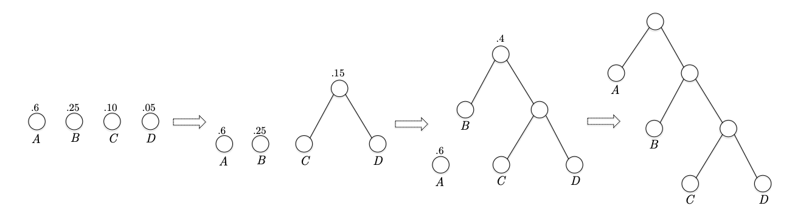
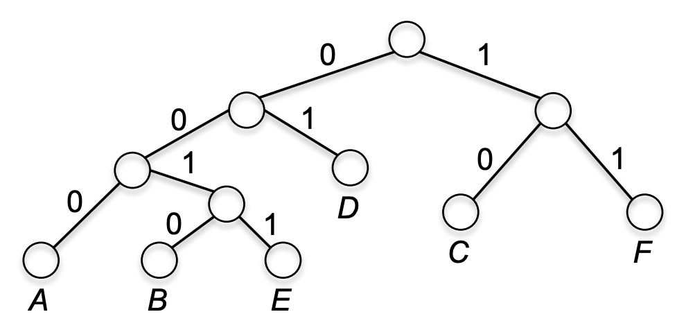

这里介绍三种常见的算法设计范式：分治法、贪心算法和动态规划。

## 分治法
分治法（`Divide and Conquer`）是一种通用的解决问题的方法，是一种算法设计范式，广泛用于各种不同的领域。

基本思想是将问题分解成更小的子问题，递归求解这些子问题，然后将子问题的解合并，最终解决原始问题。

分治法的例子有：

* [倒置个数问题](./Sort.md#倒置个数)
* [归并排序](./Sort.md#merge-sort)
* [快速排序](./Sort.md#quick-sort)
* [Karatsuba 乘法](./Arithmetic.md#karatsuba-乘法)
* [Strassen 矩阵乘法](./Arithmetic.md#strassen-矩阵乘法)
* [Closest Pair](./Geometry.md#closest-pair)

## 贪心算法
贪心算法（`Greedy Algorithm`）是一种算法设计范式，适用于某些优化问题。它的基本思想是，在每一步选择中都采取在当前状态下最好或最优的选择，从而希望导致结果是全局最优的。在解决问题的时候，使用贪心范式很容易得到一个或多个贪心算法，也很容易分析其算法复杂度，但是证明其正确性是比较困难得，因为有时会得到局部最优解而无法得到全局最优解，也就是说算法是不正确的，即便是正确的，证明也不总是很容易。

除了下面的调度、Huffman 编码之外，贪心算法的例子还有：

* [最小生成树](./Graph.md#最小生成树)
* [最短路径：Dijkstra 算法](./Graph.md#最短路径dijkstra-算法)

### 调度
假定有若干个任务（`job`），每个任务 $j$ 的长度是 $l_j$，其权重是 $w_j$，我们希望找到一个调度方案，使得加权完成时间 $\sum w_j C_j(\sigma)$ 最小，其中 $C_j(\sigma)$ 是任务 $j$ 在调度方案 $\sigma$ 中的完成时间，其定义是等待时间加上自身的长度，即 $C_j(\sigma) = \sum_{i: \sigma(i) < \sigma(j)} l_i + l_j$。如果有 $n$ 个任务，那么有 $n!$ 种调度方案，暴力搜索的时间复杂度是 $O(n!)$，仅对小规模的数可行，因此需要一个更高效的算法。

下面使用贪心算法来解决这个问题。整个分析的过程比算法本身更值得学习，因为这是一种通用的、使用贪心算法的模式。

首先考虑两种极端情况。第一种是如果所有任务的长度都相同，假定长度是 1，那么它们的完成时间是 $\{1, 2, \ldots, n\}$，很明显，权重大的有限处理，总时间更短。第二种是如果所有任务的权重都相同，第一个任务完成所需的时间会对所有任务的完成时间都产生影响，因此应该先处理长度短的任务。由此我们可以得到一个启发：应该先处理权重大的任务，或者先处理长度短的任务。

下面讨论更一般的情况。任务有两个属性：长度和权重，我们可以将它们综合起来考虑，给一个得分（`score`），例如 $w_j - l_j$，或者 $w_j / l_j$，我们使用贪心策略每次选择得分最高的以得到一个调度方案。我们期望这个两个调度方案中有一个是最优的。我们称使用前者的调度方案为 `GreedyDiff`，使用后者的调度方案为 `GreedyRatio`。

我们构建一个简单的例子，使得两个算法的得分顺序恰好相反。假定有两个任务，长度分别是 $l_1=5,l_2=2$，权重分别是 $w_1=3,w_2=1$。`GreedyDiff` 的得分分别是 $-2$ 和 $-1$，因此它会先处理任务 2，完成时间分别是 $C_1=7,C_2=2$，加权完成时间是 $3 \cdot 7 + 1 \cdot 2 = 23$；`GreedyRatio` 的得分分别是 $0.6$ 和 $0.5$，因此它会先处理任务 1，完成时间分别是 $C_1=5,C_2=7$，加权完成时间是 $3 \cdot 5 + 1 \cdot 7 = 22$。从这个例子可以得出 `GreedyDiff` 的调度方案不是最优的，不过不能说明 `GreedyRatio` 的调度方案是最优的。

下面证明 `GreedyRatio` 的调度方案是最优的。分治法天然的带有递归的性质，可以使用递归法来证明。而贪心算法没有这个性质。这里使用交换论证（`exchange argument`）来证明，这种方法的核心思想是任何可行的解可以通过一系列变换使其更像贪心算法而变得更好。

不妨假设 $\frac{w_1}{l_1} \ge \frac{w_2}{l_2} \ge \cdots \ge \frac{w_n}{l_n}$，即任务按照权重与长度的比值从大到小排序。先证明一个带有严格限制的命题：假定 $\frac{w_i}{l_i} > \frac{w_{i+1}}{l_{i+1}}$，即所有比值都不相等。稍后再证明更一般的情况。

这里使用反证法，假定 `GreedyRatio` 的调度方案 $\sigma$ 不是最优的，存在一个最优的调度方案 $\sigma^*$，其加权完成时间最小。核心思想是利用 $\sigma$ 和 $\sigma^*$ 的差异来构造一个新的调度方案 $\sigma'$，使得 $\sigma'$ 的加权完成时间更小，比最优方案 $\sigma^*$ 更好，从而得到矛盾。

根据之前的假设，算法 `GreedyRatio` 的调度方案 $\sigma$ 就是依次执行任务 $1, 2, \ldots, n$。最佳方案 $\sigma^*$，至少有一个相邻逆序对（`consecutive inversion`），即存在 $i>j$ 但是 $i$ 在 $j$ 之前被调度。如果 $\sigma^*$ 中没有相邻逆序对，那么每一个任务的索引至少要比前一个大 1，总共有 $n$ 个任务，最大索引是 $n$，因此相邻任务不能可能存在 2 或者更大的跳跃。这就会导致 $\sigma^*$ 和 $\sigma$ 是一样的，但是我们假定这是两个不同的调度方案，因此 $\sigma^*$ 至少有一个相邻逆序对。

不妨令 $i$ 是 $\sigma^*$ 中第一个相邻逆序对的较大索引，$j$ 是较小索引，即 $i>j$ 但是 $i$ 在 $j$ 之前被调度。我们构造一个新的调度方案 $\sigma'$，它和 $\sigma^*$ 的区别仅在于将 $i$ 和 $j$ 的位置交换。对于不是 $i,j$ 的任务 $k$，它在 $\sigma^*$ 和 $\sigma'$ 中的完成时间是一样的；对于任务 $i$，它需要额外等待 $j$ 完成，因此完成时间增加了 $l_j$；对于任务 $j$，它不需要等待 $i$ 完成，因此完成时间减少了 $l_i$，因此带权重的影响是 $w_i l_j - w_j l_i$。根据之前的假设，$\frac{w_i}{l_i} < \frac{w_j}{l_j}$，因此 $w_i l_j - w_j l_i < 0$，因此 $\sigma'$ 的加权完成时间更小，比 $\sigma^*$ 更好，得到矛盾。因此 `GreedyRatio` 的调度方案 $\sigma$ 是最优的。

现在把之前去掉的限制加回来，即允许 $\frac{w_i}{l_i} = \frac{w_{i+1}}{l_{i+1}}$，也就是说存在一些任务的权重与长度的比值相同。按照上面的过程，$\frac{w_i}{l_i}\leq\frac{w_j}{l_j}$，因此 $w_i l_j - w_j l_i \leq 0$，也就是说我们交换得到的调度方案 $\sigma'$ 的加权完成时间可能会变小，也可能保持不变。每一次交换会使得逆序对的个数减少一个，因为除了 $i,j$ 这个逆序对消除之外，其他元素的相对关系不变。从任意 $\sigma^*$ 开始，经过有限次交换，直到消除所有的逆序对，得到 `GreedyRatio` 的调度方案 $\sigma$。

这个算法的时间复杂度是 $O(n \log n)$，因为需要对 $n$ 个任务的得分进行排序。

### Huffman 编码
首先介绍概念前缀码（`prefix-free code`）：任意两个符号的编码都不互为前缀。定长编码，比如 ASCII 编码，通常是前缀码。再比如对于 $\Sigma=\{A, B, C, D\}$，如果我们使用定长编码，那么每个符号的编码长度都是 2，例如 $A=00, B=01, C=10, D=11$，是前缀码。如果我们使用变长编码，例如 $A=0, B=10, C=110, D=111$，也是前缀码，任意两个编码都不互为前缀。前缀码的好处是编码是没有歧义的，解码简单明了。如果各个符号出现的频次不同，那么变长前缀码比固定长度的编码要更高效。

编码只能是 0 或者 1，那么从左向右可以看作是一棵二叉树的路径，左子树对应 0，右子树对应 1，那么每个符号对应二叉树的一个节点，路径就是编码本身，编码长度就是路径长度（当前叶子的深度）。因此前缀码对应二叉树的叶子节点，编码长度就是叶子节点的深度，而非前缀码有的字符可能对应二叉树的内部节点，是其他子节点的前缀。

这里我们要解决的问题是：给定一个元素个数 $n\geq 2$ 的集合 $\Sigma$，每个字符 $a$ 的频率是 $p_a$，找到一个前缀码编码方式使得平均编码长度
$$L = \sum_{a\in\Sigma} p_a l_a$$
最小，其中 $l_a$ 是字符 $a$ 的编码长度。

$\Sigma$ 的字符应用某种前缀码，那么就构成了一棵二叉树 $T$，平均编码长度就是二叉树的平均深度。我们希望找到一棵二叉树，使得平均深度最小。这里用 $L(T,p_a)$ 表示带权重的平均深度。
$$L(T,p_a) = \sum_{a \in \Sigma} p_a \cdot \text{depth}_T(a)$$
其中 $\text{depth}_T(a)$ 是字符 $a$ 在二叉树 $T$ 中的深度。

Huffman 编码就是利用贪心算法的思想，自底向上，通过连续合并节点来构造出一棵加权平均深度最小的二叉树来实现前缀码编码方式。初始时是 $n$ 个节点，每个节点对应一个字符，权重是字符的频率。Huffman 编码维护一个森林，包含若干个树。每一次迭代，选择权重最小的两个树，将它们合并成一棵树，新的树的权重是两棵树权重之和。重复这个过程，直到森林中只剩下一棵树，这棵树就是我们要找的二叉树。

下面看一个简单的例子，有 `A,B,C,D` 四个字符，出现的频率分别是 $0.60,0.25,0.10,0.05$。初始时有四棵树，权重分别是 $0.60,0.25,0.10,0.05$，选择权重最小的两个树，即 `C` 和 `D`，将它们合并成一棵树，新的树的权重是 $0.15$，森林中剩下三棵树，权重分别是 $0.60,0.25,0.15$，选择权重最小的两个树，即 `B` 和 `CD`，将它们合并成一棵树，新的树的权重是 $0.40$，森林中剩下两棵树，权重分别是 $0.60,0.40$，选择权重最小的两个树，即 `A` 和 `BCD`，将它们合并成一棵树，新的树的权重是 $1.00$，森林中剩下一棵树，这就是我们要找的二叉树。



一个复杂的例子是有 `A,B,C,D,E,F` 六个字符，出现的次数分别是 $3,2,6,8,2,6$，使用次数计算权重即可。这里忽略过程，最后生成的二叉树如下所示。



算法的伪代码如下：
```
foreach a in Sigma:
    T_a = new Tree(a, p_a)

F = {T_a | a in Sigma}
while |F| > 1:
    T1, T2 = the two trees in F with the smallest weight
    T = new Tree(T1, T2)
    F = F - {T1, T2} + {T}

return F[0]
```

如果按照上面的过程来实现，时间复杂度是 $O(n^2)$，因为每次迭代都需要扫描森林中的树来找到权重最小的两棵树。我们可以使用优先队列（`priority queue`）来优化这个过程，使得每次迭代找到权重最小的两棵树的时间复杂度是 $O(\log n)$，因此整个算法的时间复杂度是 $O(n \log n)$。

一种更快的方式是先对权重排序，然后利用两个队列，使得除了排序之外的操作时间复杂度是 $O(n)$，因此整个算法的时间复杂度也是 $O(n \log n)$。如果权重可以用基数排序来排序，那么整个算法的时间复杂度可以降到 $O(n)$。具体的做法是将排序的结果放在一个队列中（比如说 `Q1`），另一个队列（比如说 `Q2`）用来存储合并后的树。每次迭代，比较两个队列头部的树的权重，选择权重较小的两棵树进行合并，然后将新的树放入 `Q2` 中。重复这个过程，直到两个队列中只剩下一棵树，这就是我们要找的二叉树。权重最小的两棵树可以来自同一个队列，由于合并后的节点权重是单调递增的，因此 `Q2` 也是有序的。

[Huffman Tree](https://github.com/shenlei149/algorithms-data-structures/blob/main/src/tree/Huffman.h) 代码使用最后一种方法实现。

下面利用之前的想法——递归和交换参数——来证明 Huffman 树是加权平均深度最小的二叉树。假定 $a,b$ 是权重最小的两个字符，根据 Huffman 编码的构造方法，$a,b$ 是在同一层的叶子节点，下面首先要证明以 $a,b$ 为兄弟节点的二叉树是加权平均深度最小的二叉树。但是这还不足够，万一所有的最优的树中 $a,b$ 不是兄弟节点呢？因此还需要证明存在一个最优的树，其中 $a,b$ 是兄弟节点。

这里的基础情形是 $P(2)$，即只有两个字符的情况，使用 0 表示其中一个字符，使用 1 表示另一个字符，那么平均编码长度就是 $p_a + p_b$，这是最小的，因此 $P(2)$ 成立。

假定所有小于 $k$ 的情况都成立。使用 $T_{ab}$ 表示以 $a,b$ 为兄弟节点的二叉树。假定 $T$ 是包含 $T_{ab}$ 的树，字符集是 $\Sigma$，$T'$ 和 $T$ 几乎一样，除了将 $T_{ab}$ 替换成一个新的节点 $ab$，这个节点的权重是 $p_a + p_b$，字符集是 $\Sigma'$。很显然，$T,T'$ 可以相互转换。对于输入 $\Sigma$ 和相应的概率 $\boldsymbol{p}$，Huffman 编码的输出是 $T$，其中 $T$ 可以从输入是 $\Sigma'$ 和相应的概率 $\boldsymbol{p'}$ 的 Huffman 编码的输出 $T'$ 得到，即通过将 $ab$ 替换成 $T_{ab}$ 来得到 $T$。

$T$ 的非 $a,b$ 的叶子节点和 $T'$ 的非 $ab$ 的叶子节点是一样的，因此它们的权重也是一样的。$T$ 中 $a,b$ 的深度分别是 $d_{T'}(ab) + 1$，权重之和与 $T'$ 中 $ab$ 的权重是一样的，因此对于加权深度额外贡献了 $p_a + p_b$，因此
$$L(T,\boldsymbol{p}) = L(T',\boldsymbol{p'}) + (p_a + p_b)$$
可以看出来，最后括号的项与树的深度无关。

也就是说，最优的 $T'$ 对应着最优的 $T$，次优的 $T'$ 对应着次优的 $T$，最差的 $T'$ 对应着最差的 $T$。如果我们最小化了 $L(T',\boldsymbol{p'})$，就最小化了 $L(T,\boldsymbol{p})$。根据归纳假设，$T'$ 的字符数小于 $k$，因此 $T'$ 是加权平均深度最小的二叉树，因此 $T$ 也是加权平均深度最小的二叉树，其中 $a,b$ 是兄弟节点。

下面证明存在一个最优的树，其中 $a,b$ 是兄弟节点。不适一般性，假定 $T$ 是最优的树，树中的节点要么是叶子节点，要么是内部节点（有两个子节点）。假定 $x,y$ 是最深的有公共父节点的两个叶子节点，分别是左右子树。交换 $a,x$ 和 $b,y$，得到新的树 $T*$，$T*$ 中 $a,b$ 是兄弟节点。对于 $T$ 和 $T*$ 中的非 $a,b,x,y$ 的叶子节点，它们的深度和权重都是一样的，那么
$$\begin{aligned}
L(T)-L(T*)&=(p_x-p_a)(d_T(x)-d_T(a))+(p_y-p_b)(d_T(y)-d_T(b))\\
&\geq 0
\end{aligned}$$
上式中括号中所有的项都是大于等于零的。因此 $L(T) \geq L(T*)$，也就是说 $T*$ 的加权平均深度不大于 $T$ 的加权平均深度，因此 $T*$ 也是最优的树，其中 $a,b$ 是兄弟节点。
