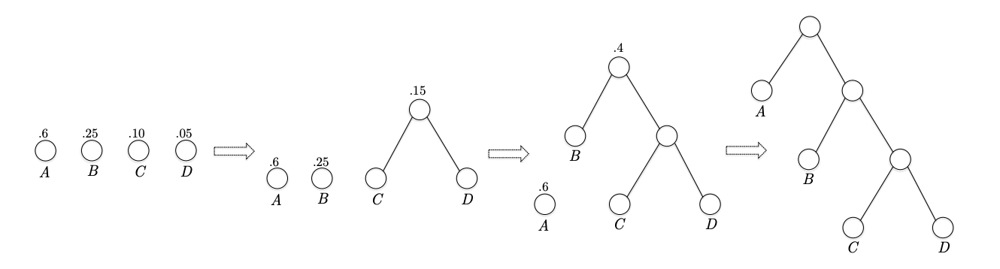
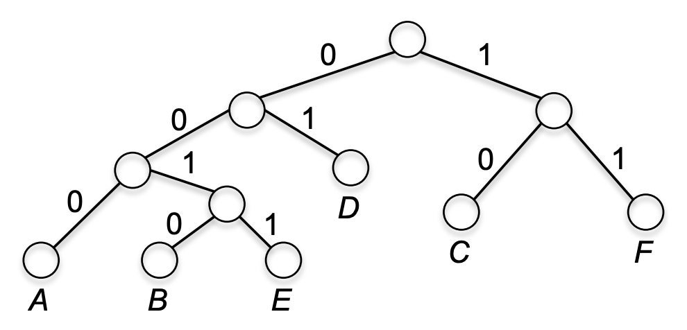

这里介绍三种常见的算法设计范式：分治法、贪心算法和动态规划。

## 分治法
分治法（`Divide and Conquer`）是一种通用的解决问题的方法，是一种算法设计范式，广泛用于各种不同的领域。

基本思想是将问题分解成更小的子问题，递归求解这些子问题，然后将子问题的解合并，最终解决原始问题。

分治法的例子有：

* [倒置个数问题](./Sort.md#倒置个数)
* [归并排序](./Sort.md#merge-sort)
* [快速排序](./Sort.md#quick-sort)
* [Karatsuba 乘法](./Arithmetic.md#karatsuba-乘法)
* [Strassen 矩阵乘法](./Arithmetic.md#strassen-矩阵乘法)
* [Closest Pair](./Geometry.md#closest-pair)

## 贪心算法
贪心算法（`greedy algorithm`）是一种算法设计范式，适用于某些优化问题。它的基本思想是，在每一步选择中都采取当前状态下最好或最优的选择，从而希望得到全局最优解。解决问题时，使用贪心范式很容易得到一个或多个贪心算法，也容易分析其时间复杂度；但证明其正确性比较困难，因为它有时只能得到局部最优解，无法得到全局最优解。即便算法正确，证明也不总是容易的。

除了下面的调度、Huffman 编码之外，贪心算法的例子还有：

* [最小生成树](./Graph.md#最小生成树)
* [最短路径：Dijkstra 算法](./Graph.md#最短路径dijkstra-算法)

### 调度
假定有若干个任务（`job`），每个任务 $j$ 的长度是 $l_j$，其权重是 $w_j$，我们希望找到一个调度方案，使得加权完成时间 $\sum w_j C_j(\sigma)$ 最小，其中 $C_j(\sigma)$ 是任务 $j$ 在调度方案 $\sigma$ 中的完成时间，其定义是等待时间加上自身的长度，即 $C_j(\sigma) = \sum_{i: \sigma(i) < \sigma(j)} l_i + l_j$。如果有 $n$ 个任务，那么有 $n!$ 种调度方案，暴力搜索的时间复杂度是 $O(n!)$，仅对小规模的数据可行，因此需要一个更高效的算法。

下面使用贪心算法来解决这个问题。整个分析的过程比算法本身更值得学习，因为这是一种通用的、使用贪心算法的模式。

首先考虑两种极端情况。第一种是所有任务的长度都相同，假定长度是 1，那么它们的完成时间是 $\{1, 2, \ldots, n\}$，很明显，应优先处理权重大的任务，以使加权完成时间更小。第二种是所有任务的权重都相同，第一个任务完成所需的时间会对所有任务的完成时间产生影响，因此应该先处理长度短的任务。由此可以得到一个启发：应该先处理权重大的任务，或者先处理长度短的任务。

下面讨论更一般的情况。任务有两个属性：长度和权重，我们可以将它们综合起来考虑，给出一个得分（`score`），例如 $w_j - l_j$ 或 $w_j / l_j$，我们使用贪心策略，每次选择得分最高的任务，从而得到一个调度方案。我们期望这两个调度方案中有一个是最优的。我们称使用前者的调度方案为 `GreedyDiff`，使用后者的调度方案为 `GreedyRatio`。
我们构建一个简单的例子，使得两个算法的得分顺序恰好相反。假定有两个任务，长度分别是 $l_1=5,l_2=2$，权重分别是 $w_1=3,w_2=1$。`GreedyDiff` 的得分分别是 $-2$ 和 $-1$，因此它会先处理任务 2，完成时间分别是 $C_1=7,C_2=2$，加权完成时间是 $3 \cdot 7 + 1 \cdot 2 = 23$；`GreedyRatio` 的得分分别是 $0.6$ 和 $0.5$，因此它会先处理任务 1，完成时间分别是 $C_1=5,C_2=7$，加权完成时间是 $3 \cdot 5 + 1 \cdot 7 = 22$。从这个例子可以得出 `GreedyDiff` 的调度方案不是最优的，不过不能说明 `GreedyRatio` 的调度方案是最优的。

下面证明 `GreedyRatio` 的调度方案是最优的。分治法天然地带有递归的性质，可以使用归纳法来证明，而贪心算法没有这个性质。这里使用交换论证（`exchange argument`）来证明，这种方法的核心思想是任何可行解都可以通过一系列变换，变得更接近贪心算法给出的解，并且不会变差。

不妨假设 $\frac{w_1}{l_1} \ge \frac{w_2}{l_2} \ge \cdots \ge \frac{w_n}{l_n}$，即任务按照权重与长度的比值从大到小排序。先证明一个带有严格限制的命题：假定 $\frac{w_i}{l_i} > \frac{w_{i+1}}{l_{i+1}}$，即所有比值都不相等。稍后再证明更一般的情况。

这里使用反证法，假定 `GreedyRatio` 的调度方案 $\sigma$ 不是最优的，存在一个最优的调度方案 $\sigma^*$，其加权完成时间最小。核心思想是利用 $\sigma$ 和 $\sigma^*$ 的差异来构造一个新的调度方案 $\sigma'$，使得 $\sigma'$ 的加权完成时间更小，比最优方案 $\sigma^*$ 更好，从而得到矛盾。

根据之前的假设，算法 `GreedyRatio` 的调度方案 $\sigma$ 就是依次执行任务 $1, 2, \ldots, n$。最优方案 $\sigma^*$ 至少有一个相邻逆序对（`consecutive inversion`），即存在 $i>j$，但任务 $i$ 在任务 $j$ 之前被调度。如果 $\sigma^*$ 中没有相邻逆序对，那么任务索引必然严格递增。总共有 $n$ 个任务，且最大索引为 $n$，因此相邻任务之间不可能存在 2 或更大的跳跃。这就会导致 $\sigma^*$ 与 $\sigma$ 相同，但我们假定这是两个不同的调度方案，因此 $\sigma^*$ 至少有一个相邻逆序对。

不妨令 $i$ 是 $\sigma^*$ 中第一个相邻逆序对的较大索引，$j$ 是较小索引，即 $i>j$ 但是 $i$ 在 $j$ 之前被调度。我们构造一个新的调度方案 $\sigma'$，它和 $\sigma^*$ 的区别仅在于将 $i$ 和 $j$ 的位置交换。对于不是 $i,j$ 的任务 $k$，它在 $\sigma^*$ 和 $\sigma'$ 中的完成时间是一样的；对于任务 $i$，它需要额外等待 $j$ 完成，因此完成时间增加了 $l_j$；对于任务 $j$，它不需要等待 $i$ 完成，因此完成时间减少了 $l_i$，因此带权重的影响是 $w_i l_j - w_j l_i$。根据之前的假设，$\frac{w_i}{l_i} < \frac{w_j}{l_j}$，因此 $w_i l_j - w_j l_i < 0$，因此 $\sigma'$ 的加权完成时间更小，比 $\sigma^*$ 更好，得到矛盾。因此 `GreedyRatio` 的调度方案 $\sigma$ 是最优的。

现在把之前去掉的限制加回来，即允许 $\frac{w_i}{l_i} = \frac{w_{i+1}}{l_{i+1}}$，也就是说存在一些任务的权重与长度的比值相同。按照上面的过程，$\frac{w_i}{l_i}\leq\frac{w_j}{l_j}$，因此 $w_i l_j - w_j l_i \leq 0$，也就是说我们交换得到的调度方案 $\sigma'$ 的加权完成时间可能会变小，也可能保持不变。每一次交换会使得逆序对的个数减少一个，因为除了 $i,j$ 这个逆序对消除之外，其他元素的相对关系不变。从任意 $\sigma^*$ 开始，经过有限次交换，直到消除所有的逆序对，得到 `GreedyRatio` 的调度方案 $\sigma$。

这个算法的时间复杂度是 $O(n \log n)$，因为需要对 $n$ 个任务的得分进行排序。

### Huffman 编码
首先介绍前缀码（`prefix-free code`）：任意两个符号的编码都不互为前缀。定长编码，比如 ASCII 编码，通常是前缀码。再比如对于 $\Sigma=\{A, B, C, D\}$，如果我们使用定长编码，那么每个符号的编码长度都是 2，例如 $A=00, B=01, C=10, D=11$，这是前缀码。如果我们使用变长编码，例如 $A=0, B=10, C=110, D=111$，也是前缀码，任意两个编码都不互为前缀。前缀码的好处是编码没有歧义，解码简单明了。如果各个符号出现的频次不同，变长前缀码可以比固定长度编码更高效。

编码只能是 0 或者 1，从左向右可以看作二叉树中的一条路径：左分支对应 0，右分支对应 1。每个符号对应二叉树的一个节点，路径就是编码本身，编码长度就是该叶子节点的深度。因此，前缀码对应二叉树的叶子节点；对于非前缀码，某些字符可能对应二叉树的内部节点，从而成为其他字符编码的前缀。

这里我们要解决的问题是：给定一个元素个数 $n\geq 2$ 的集合 $\Sigma$，每个字符 $a$ 的出现概率是 $p_a$，找到一种前缀码，使得平均编码长度
$$L = \sum_{a\in\Sigma} p_a l_a$$
最小，其中 $l_a$ 是字符 $a$ 的编码长度。

$\Sigma$ 的字符使用某种前缀码时，会构成一棵二叉树 $T$，平均编码长度就是二叉树叶子节点深度的加权平均值。我们希望找到一棵二叉树，使该值最小。这里用 $L(T,p_a)$ 表示加权平均深度。
$$L(T,p_a) = \sum_{a \in \Sigma} p_a \cdot \text{depth}_T(a)$$
其中 $\text{depth}_T(a)$ 是字符 $a$ 在二叉树 $T$ 中的深度。

Huffman 编码利用贪心算法的思想，自底向上连续合并节点，构造一棵加权平均深度最小的二叉树，从而得到前缀码。初始时有 $n$ 个节点，每个节点对应一个字符，权重为该字符的出现概率。Huffman 编码维护一个由若干棵树组成的森林。每次迭代选择权重最小的两棵树，将它们合并为一棵树，新树的权重为两棵树权重之和。重复这个过程，直到森林中只剩下一棵树。这棵树就是我们要找的二叉树。

下面看一个简单的例子，有 `A,B,C,D` 四个字符，出现概率分别是 $0.60,0.25,0.10,0.05$。初始时有四棵树，权重分别是 $0.60,0.25,0.10,0.05$，选择权重最小的两棵树，即 `C` 和 `D`，将它们合并成一棵树，新树的权重是 $0.15$。森林中剩下三棵树，权重分别是 $0.60,0.25,0.15$，选择权重最小的两棵树，即 `B` 和 `CD`，将它们合并成一棵树，新树的权重是 $0.40$。森林中剩下两棵树，权重分别是 $0.60,0.40$，选择权重最小的两棵树，即 `A` 和 `BCD`，将它们合并成一棵树，新树的权重是 $1.00$。森林中剩下一棵树，这就是我们要找的二叉树。



一个复杂的例子是有 `A,B,C,D,E,F` 六个字符，出现次数分别是 $3,2,6,8,2,6$。可直接使用出现次数作为权重；这与将其归一化为概率得到相同的 Huffman 树。这里忽略过程，最后生成的二叉树如下所示。



算法的伪代码如下：
```
foreach a in Sigma:
    T_a = new Tree(a, p_a)

F = {T_a | a in Sigma}
while |F| > 1:
    T1, T2 = the two trees in F with the smallest weight
    T = new Tree(T1, T2)
    F = F - {T1, T2} + {T}

return F[0]
```

如果按照上面的过程来实现，时间复杂度是 $O(n^2)$，因为每次迭代都需要扫描森林中的树来找到权重最小的两棵树。我们可以使用优先队列（`priority queue`）来优化这个过程，使得每次迭代找到权重最小的两棵树的时间复杂度是 $O(\log n)$，因此整个算法的时间复杂度是 $O(n \log n)$。

一种更快的方式是先对权重排序，然后利用两个队列，使得除了排序之外的操作时间复杂度是 $O(n)$，因此整个算法的时间复杂度也是 $O(n \log n)$。如果权重可以用基数排序来排序，那么整个算法的时间复杂度可以降到 $O(n)$。具体的做法是将排序的结果放在一个队列中（比如说 `Q1`），另一个队列（比如说 `Q2`）用来存储合并后的树。每次迭代，比较两个队列头部的树的权重，选择权重较小的两棵树进行合并，然后将新的树放入 `Q2` 中。重复这个过程，直到两个队列中只剩下一棵树，这就是我们要找的二叉树。权重最小的两棵树可以来自同一个队列，由于合并后的节点权重是单调递增的，因此 `Q2` 也是有序的。

[Huffman Tree](https://github.com/shenlei149/algorithms-data-structures/blob/main/src/tree/Huffman.h) 代码使用最后一种方法实现。

下面利用递归和交换论证来证明 Huffman 树是加权平均深度最小的二叉树。假定 $a,b$ 是权重最小的两个字符。Huffman 编码会首先合并它们，因此构造出的树中 $a,b$ 是兄弟叶子节点。下面首先证明：在 $a,b$ 为兄弟节点的所有二叉树中，Huffman 树的加权平均深度最小。但这还不够，因为最优树未必包含这样的兄弟节点。因此还需要证明存在一棵最优树，其中 $a,b$ 是兄弟节点。

这里的基础情形是 $P(2)$，即只有两个字符的情况，使用 0 表示其中一个字符，使用 1 表示另一个字符，那么平均编码长度就是 $p_a + p_b$，这是最小的，因此 $P(2)$ 成立。

假定所有小于 $k$ 的情况都成立。使用 $T_{ab}$ 表示以 $a,b$ 为兄弟叶子节点的子树。假定 $T$ 是包含 $T_{ab}$ 的树，其字符集为 $\Sigma$。$T'$ 与 $T$ 几乎相同，区别仅在于将 $T_{ab}$ 替换为一个新叶子节点 $ab$；该节点的权重为 $p_a + p_b$，$T'$ 的字符集为 $\Sigma'$。显然，$T$ 与 $T'$ 可以相互转换。对于输入 $\Sigma$ 和相应概率 $\boldsymbol{p}$，Huffman 编码的输出 $T$ 可由输入 $\Sigma'$ 和相应概率 $\boldsymbol{p'}$ 的 Huffman 编码输出 $T'$ 得到：将叶子节点 $ab$ 替换为 $T_{ab}$ 即可。

$T$ 的非 $a,b$ 的叶子节点和 $T'$ 的非 $ab$ 的叶子节点是一样的，因此它们的权重也是一样的。$T$ 中 $a,b$ 的深度分别是 $d_{T'}(ab) + 1$，权重之和与 $T'$ 中 $ab$ 的权重是一样的，因此对于加权深度额外贡献了 $p_a + p_b$，因此
$$L(T,\boldsymbol{p}) = L(T',\boldsymbol{p'}) + (p_a + p_b)$$
可以看出来，最后括号的项与树的深度无关。

也就是说，在 $a,b$ 为兄弟节点的树中，最小化 $L(T',\boldsymbol{p'})$ 等价于最小化 $L(T,\boldsymbol{p})$。根据归纳假设，$T'$ 的字符数小于 $k$，因此 $T'$ 是加权平均深度最小的二叉树，进而 $T$ 也是加权平均深度最小的二叉树，其中 $a,b$ 是兄弟节点。

下面证明存在一棵最优树，其中 $a, b$ 是兄弟节点。不失一般性，假定 $T$ 是一棵最优树，树中的节点要么是叶子节点，要么是内部节点（有两个子节点）。假定 $x,y$ 是具有公共父节点的最深的两个叶子节点，分别位于左右子树。交换 $a,x$ 和 $b,y$，得到新的树 $T^*$，其中 $a,b$ 是兄弟节点。对于 $T$ 和 $T^*$ 中除 $a,b,x,y$ 外的叶子节点，它们的深度和权重都相同，那么
$$\begin{aligned}
L(T)-L(T^*)&=(p_x-p_a)(d_T(x)-d_T(a))+(p_y-p_b)(d_T(y)-d_T(b))\\
&\geq 0
\end{aligned}$$
上式中每个括号内的项都大于等于零。因此 $L(T) \geq L(T^*)$，也就是说 $T^*$ 的加权平均深度不大于 $T$ 的加权平均深度。由于 $T$ 是最优树，$T^*$ 也是最优树，且其中 $a,b$ 是兄弟节点。

## 动态规划
动态规划（`dynamic programming`）的思想是：最优解可以通过更小规模的子问题的最优解，按照既定方式构造出来，进而将候选解的搜索范围收缩到可以处理的规模。简单地说，有以下三个步骤：

1. 将问题识别为一系列更小的子问题。
2. 给定更小的子问题的解，分析如何快速、正确的解决更大的问题。
3. 从所有子问题的解中构造出最终的解。

动态规划的核心在于构建合适的子问题集合。假定每个子问题至少需要常量级别的计算量，那么子问题的数量就是算法运行时间的下界。因此我们期望子问题的数量应尽可能少。类似地，在已知更小的子问题的解的前提下，解决单个子问题的时间以及推导最终解所需的时间，都会计入算法的总运行时间。

假定从小到大最多有 $f(n)$ 个不同的子问题，每个子问题最多需要 $g(n)$ 的时间来解决，构造最终的解需要 $h(n)$ 的时间，那么动态规划算法的时间复杂度是 $O(f(n)g(n)+h(n))$。比如下面最大权重独立集问题中，$f(n)=O(n),g(n)=O(1),h(n)=O(1)$，因此时间复杂度是 $O(n)$。

现在的问题是如何构思出这一组巧妙的子问题集合呢？一旦有了这组集合，其他问题就都迎刃而解了。构造合适的子问题集合需要练习、思考。下面几个使用动态规划的例子，会详细给出思考和构造子问题集合的过程。思维过程是共通的，构造过程是可复现的。整个过程的核心是剖析最优解的结构特征，厘清小规模子问题的最优解拼接出最终最优解的可能路径。这样的思想帮助我们定位子问题，还能帮助我们建立递归关系。在此基础之上，通过填表自底向上、由小及大地推进并求解问题。

最后，简单介绍一下动态规划这个词的来历。动态规划（`dynamic programming`）这个词由 Richard Bellman 在 20 世纪 50 年代提出。当时他在兰德公司工作，受雇于美国空军；据他回忆，时任国防部长威尔逊讨厌“研究”（`research`）这个词，更不用说与数学（`mathematical`）相关的研究了。Bellman 需要一个名称来掩盖自己实际从事的数学研究。他当时在研究规划（`planning`）和决策问题，但觉得 `planning` 这个词不够好听，于是使用了 `programming`。`dynamic` 有一个有趣的特性：它无法在贬义语境中使用。Bellman 觉得 `dynamic programming` 是个好名字，于是乎这个名称沿用至今。

### 最大权重独立集
首先，我们给出独立集的概念。给定一个无向图 $G=(V,E)$，若顶点子集 $S\subseteq V$ 中任意两个顶点 $v,w$ 都满足 $(v,w)\notin E$，则称 $S$ 是 $G$ 的一个独立集（`independent set`）。也就是说，独立集不包含 $G$ 中任意一条边的两个端点。举两个例子说明独立集的概念。第一个图是有五个顶点的完全图，一共有 10 条边，任意两个顶点之间都有一条边，因此它的独立集只有单个顶点或空集，共有 6 个独立集。第二个图是有五个顶点的环图，空集和任意单个顶点都是独立集，任意两个不相邻的顶点可以组成一个两个顶点的独立集，因此共有 11 个独立集。

如果无向图 $G=(V,E)$ 的每个顶点 $v\in V$ 都有一个非负权重 $w_v$，则最大权重独立集（`maximum weight independent set`）问题是寻找一个独立集 $S$，使得 $\sum_{v\in S} w_v$ 最大。我们这里考虑最简单的图：路径图（`path graph`），它是一个顶点序列 $v_1, v_2, \ldots, v_n$，每个顶点 $v_i$ 只与其前后相邻的顶点相连，即 $(v_i, v_{i+1})\in E$。路径图的最大权重独立集问题可以使用动态规划来解决。

当顶点数 $n<2$ 时，最大权重独立集问题很容易解决。假定 $n\geq 2$ 时的最优解是 $S\subseteq V$，权重是 $W$。我们分下面两种情况讨论。第一种情况是 $v_n\in S$，那么 $v_{n-1}\notin S$。$S-\{v_n\}$ 是 $G_{n-2}$ 的一个独立集，权重是 $W-w_n$。这里 $G_i$ 是由前 $i$ 个顶点构成的图，有 $i-1$ 条边。假定 $S^*$ 是 $G_{n-2}$ 的最大权重独立集，权重是 $W^*$，且 $W^*>W-w_n$，那么 $S^*\cup\{v_n\}$ 是 $G_n$ 的一个独立集，权重是 $W^*+w_n>W$，这与假定的最优解矛盾。因此 $S-\{v_n\}$ 是 $G_{n-2}$ 的最大权重独立集，权重是 $W-w_n$。第二种情况是 $v_n\notin S$，那么 $S$ 是 $G_{n-1}$ 的一个独立集，权重是 $W$。假定 $S^*$ 是 $G_{n-1}$ 的最大权重独立集，权重是 $W^*>W$，这与假定的最优解矛盾。因此 $S$ 是 $G_{n-1}$ 的最大权重独立集，权重是 $W$。

结合上述两种情况，我们可以得到如下的递推关系：
$$W_n = \max\{W_{n-1}, W_{n-2} + w_n\}$$
更一般的，对于 $i=2,3,\cdots,n$，有
$$W_i = \max\{W_{i-1}, W_{i-2} + w_i\}$$

因此可以得到一种直观的、递归式的解法
```
if n == 0:
    return empty set
if n == 1:
    return {v_1}

S_1 = MWIS(G_{n-1})
S_2 = MWIS(G_{n-2})

return the set with greater total weight between S_1 and S_2 + {v_n}
```
这种方法的时间复杂度是指数级的，因为它会重复计算很多子问题，可以使用缓存（`memoization`）来优化。

总共只有 $n+1$ 个不同的子问题，因此可以使用自底向上的方法来解决。我们使用一个数组 $W$ 来存储每个子问题的最优解，$W[i]$ 表示 $G_i$ 的最大权重独立集的权重。初始时，$W[0]=0$，$W[1]=w_1$。然后按照递推关系计算 $W[i]$，直到计算出 $W[n]$。这种方法的时间复杂度是 $O(n)$，空间复杂度也是 $O(n)$。
```
W = W[0..n]
W[0] = 0
W[1] = w_1
for i = 2 to n:
    W[i] = max(W[i-1], W[i-2] + w_i)
return W[n]
```

上述代码只计算了权重，但是没有给出最大权重独立集的具体顶点集合。一个简单优雅的方式是通过权重数组 $W$ 回溯，找到最大权重独立集的顶点集合。根据之前的推导逻辑，如果 $W[n] = W[n-1]$，那么顶点 $v_n$ 不在最大权重独立集中；否则，顶点 $v_n$ 在最大权重独立集中。因此从 $n$ 开始向前回溯，直到找到所有在最大权重独立集中的顶点。
```
S = empty set
i = n
while i >= 1:
    if W[i] == W[i-1]:
        i = i - 1
    else:
        S = S union {v_i}
        i = i - 2
return S
```

参考实现 [Max Weight Independent Set](https://github.com/shenlei149/algorithms-data-structures/blob/main/src/dp/MWIS.cc)。

### 背包问题
给定一组值 $v_1,v_2,\ldots,v_n$ 和一组大小 $s_1,s_2,\ldots,s_n$，以及一个容量为 $C$ 的背包，背包问题（`knapsack problem`）是寻找一个子集 $S\subseteq\{1,2,\ldots,n\}$，使得 $\sum_{i\in S}s_i\leq C$，并且使得 $\sum_{i\in S}v_i$ 最大。背包问题有很多变种，这里介绍最基本的 0-1 背包问题（`0-1 knapsack problem`），即每个物品最多只能选择一次。

背包问题是一类基础且通用的决策模型。凡是涉及如何在有限资源约束下实现效益最大化的场景，本质上都是背包问题。

为了使用动态规划，我们需要找到子问题集合。我们现在推导最优解的结构特征，厘清由更小规模子问题的最优解拼接出最终最优解的可能路径，进而确定子问题集合。在这个过程中，还能够推导出相应的递推关系式，以便利用更小子问题的解快速得到当前子问题的解。

假定我们已经有一个最优解 $S$，对应的总价值为 $V=\sum_{i\in S}v_i$。我们考虑物品 $n$，有两种情况。第一种情况是 $n\notin S$，那么 $S$ 是前 $n-1$ 个物品中容量为 $C$ 的最优解，总价值为 $V$。如果前 $n-1$ 个物品中容量为 $C$ 的最优解是 $S^*$，总价值为 $V^*>V$，那么 $S^*$ 是前 $n$ 个物品中容量为 $C$ 的更优解，总价值为 $V^*>V$，这与假定的最优解矛盾。因此 $S$ 是前 $n-1$ 个物品中容量为 $C$ 的最优解，总价值为 $V$。第二种情况是 $n\in S$，那么 $S-\{n\}$ 是前 $n-1$ 个物品中容量为 $C-s_n$ 的最优解，总价值为 $V-v_n$。如果前 $n-1$ 个物品中容量为 $C-s_n$ 的最优解是 $S^*$，总价值为 $V^*>V-v_n$，那么 $S^*\cup\{n\}$ 是前 $n$ 个物品中容量为 $C$ 的更优解，总价值为 $V^*+v_n>V$，这与假定的最优解矛盾。因此 $S-\{n\}$ 是前 $n-1$ 个物品中容量为 $C-s_n$ 的最优解，总价值为 $V-v_n$。

令 $V_{i,c}$ 表示前 $i$ 个物品中容量为 $c$ 时可取得的最大总价值。根据之前的分析，有如下递推关系：
$$V_{i,c}=\begin{cases}V_{i-1,c}, & \text{如果 } s_i>c\\
\max\{V_{i-1,c}, V_{i-1,c-s_i}+v_i\}, & \text{如果 } s_i\leq c\end{cases}$$

通过上面这个递推关系，子问题有两个变化的状态：候选物品前缀的长度 $i$ 和当前背包容量 $c$。枚举两个状态的所有合法取值，即可确定子问题集合。假定有 $n$ 个物品，背包容量为 $C$，子问题就是计算 $V_{i,c},i=0,1,2,\ldots,n, c=0,1,2,\ldots,C$，那么子问题集合的大小是 $O(nC)$。$i=n,c=C$ 时的解就是最终的最优解，是我们要求解的问题。每个子问题的解可以通过更小规模的子问题的解快速得到，因此时间复杂度是 $O(nC)$，空间复杂度也是 $O(nC)$。下面给出伪代码：
```
V = V[0..n, 0..C]
for c = 0 to C:
    V[0, c] = 0
for i = 1 to n:
    for c = 0 to C:
        if s_i > c:
            V[i, c] = V[i-1, c]
        else:
            V[i, c] = max(V[i-1, c], V[i-1, c-s_i] + v_i)
return V[n, C]
```
上述代码只能得到最大的总价值，但是没有给出具体的物品集合。一个简单优雅的方式是通过价值数组 $V$ 回溯，找到最大价值对应的物品集合。根据之前的推导逻辑，如果 $V[i, c] = V[i-1, c]$，那么物品 $i$ 不在最优解中；否则，物品 $i$ 在最优解中。回溯的时间复杂度是 $O(n)$。
```
S = empty set
c = C
for i = n down to 1:
    if V[i, c] != V[i-1, c]:
        S = S union {i}
        c = c - s_i
return S
```

参考实现 [0-1 Knapsack](https://github.com/shenlei149/algorithms-data-structures/blob/main/src/dp/Knapsack.cc)。
