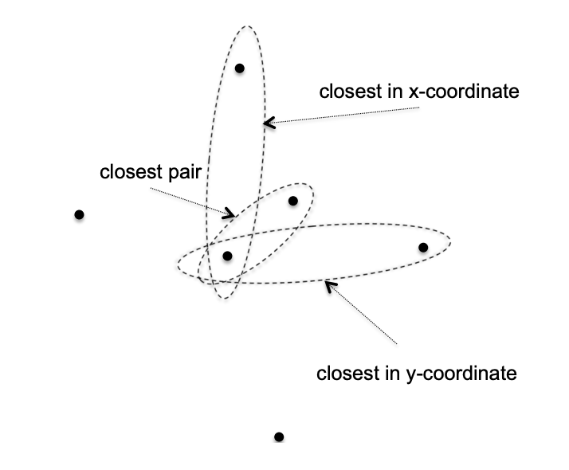
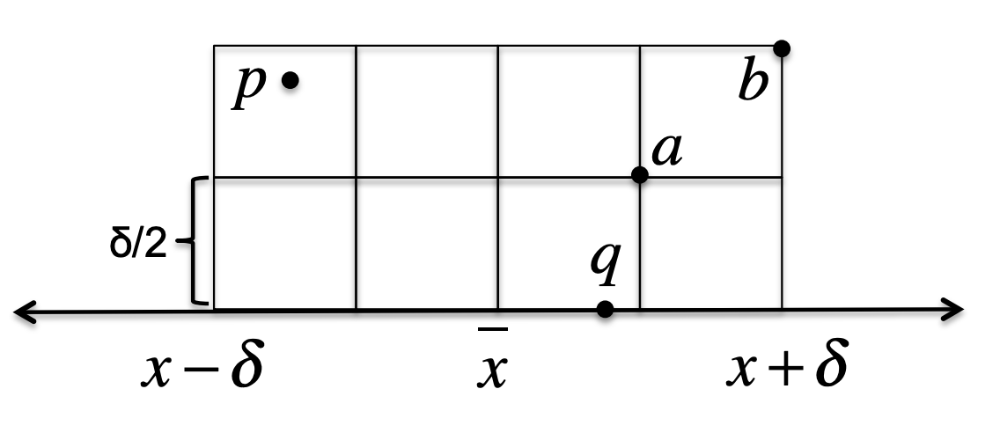

## Closest Pair
$xy$ 平面上两个点 $p_1(x_1,y_1),p_2(x_2,y_2)$，其欧几里得距离是
$$d(p_1,p_2)=\sqrt{(x_1-x_2)^2+(y_1-y_2)^2}$$
Closest Pair 问题是给定 $n$ 个点 $p_1(x_1,y_1),p_2(x_2,y_2),\cdots,p_n(x_n,y_n)$，找到一对点 $(p_i,p_j)$ 其欧几里得距离 $d(p_i,p_j)$ 最小。

暴力法就是遍历每一对点 $(p_i,p_j)$，时间复杂度是 $O(n^2)$。有更好的算法吗？

首先考虑一维的情况，那么 $(p_i,p_j)$ 的欧氏距离就是 $|x_i-x_j|$。我们可以先排序，时间复杂度为 $O(n\log n)$，然后线性扫描排序的点，找到距离最小的，第二步时间复杂为 $O(n)$，因此算法时间复杂度是 $O(n\log n)$。

现在回到二维情况。类似之前的数据预处理，我们准备两份数据集，分别按照 $x$ 和 $y$ 轴排序，得到 $P_x,P_y$。数据预处理的复杂度是 $O(n\log n)$。但是和之前不同的是，最小距离的一对点可能不是 $P_x,P_y$ 中连续的两个点。如下图所示。



下面尝试分治法。将 $P_x$ 平分成两个部分。对左右两个部分分别递归调用。然后调用一个函数处理两个点分别在两边的情形。下面是伪码
```
if nPoints <= 3:
    brute-force search

Lx = first half of Px, sorted by x-coordinate
Ly = first half of Px, sorted by y-coordinate
Rx = second half of Px, sorted by x-coordinate
Ry = second half of Px, sorted by y-coordinate

(l1, l2) := ClosestPair(Lx, Ly) // best left pair
(r1, r2) := ClosestPair(Rx, Ry) // best right pair
(s1, s2) := ClosestSplitPair(Px, Py) // best split pair

return best of (l1, l2), (r1, r2), (s1, s2)
```
`Lx` `Rx` $O(1)$ 时间复杂度。`Ly` `Ry` 可以扫描 $P_y$，根据 $x$ 坐标分到其中一个集合中，$O(n)$ 的时间复杂度。

如果 `ClosestSplitPair` 能在 $O(n)$ 时间复杂度完成，每次递归规模减少一半，那么整个算法的时间复杂度就是 $O(n\log n)$。

稍微调整一下上面的算法，在知道左右两边最小距离后，将这个值传给 `ClosestSplitPair`，那么这个函数仅需要处理比这个最小值还小的点对即可。

下面是 `ClosestSplitPair` 的伪码，其中 `delta` 是左右两边的最小距离。
```
x_mid = largest x-coordinate in left half // median x-coordinate
Sy := q1, q2,...,q_l with x-coordinate between x_mid + delta and x_mid - delta, sorted by y-coordinate
best = delta
bestPair = NULL
for i = 1 to (l - 1):
    for j = 1 to min(7, l - i):
        if d(q_i, q_j) < best:
            best = d(q_i, q_j)
            bestPair = (q_i, q_j)

return bestPair
```
`Sy` 可以通过扫描 $P_y$，过滤掉 $x$ 轴坐标不满足 `x - delta` 到 `x + delta` 区间的值。这一步的时间复杂度是 $O(n)$。

后面两个 `for` 循环，但是第二层最多执行 7 次，因此时间复杂也是 $O(n)$。

因此算法的时间复杂度是 $O(n\log n)$，比暴力法 $O(n^2)$ 要快很多。下面讨论算法的正确性。

如果距离最小的对出现在左边或者右边，递归调用返回的，没问题。如果这对点分裂到了两边，如何证明正确性呢？

假定距离最小的点对是 $p(x_1,y_1),q(x_2,y_2)$，并且 $x_1<\bar{x}<x_2$，其中 $\bar{x}$ 是上面代码中的 `x_mid`。`Sy` 包含的点对，如果一个在左边，一个在右边，那么包含了所有距离小于等于 $\delta$（即代码中的 `delta`）的点对。而 $d(p,q)<\delta$，因此 $p,q$ 在备选集合 `Sy` 中。

更关键的问题是，我们从 $i$ 开始最多只找 7 个点就得到了答案。这意味着 $y$ 轴坐标介于 $y_1,y_2$ 的点最多只能有六个，否则我们就会找不到正确答案。

我们画一个矩形，宽 $2\delta$ 高 $\delta$，然后等分成八个格子，如下图所示。不妨设 $q$ 的 $y$ 坐标更小，那么位于格子的底部。每个格子中最多只能有一个点。如果两个点在一个格子内，那么它们的距离小于 $\sqrt{2}\delta/2<\delta$，那么这一对点就是最短距离的点对了。包含 $p,q$ 在内最多只需要计算八个点的距离，从 $q$ 开始，最多找 7 个点就能找到最距离最短的点对。


