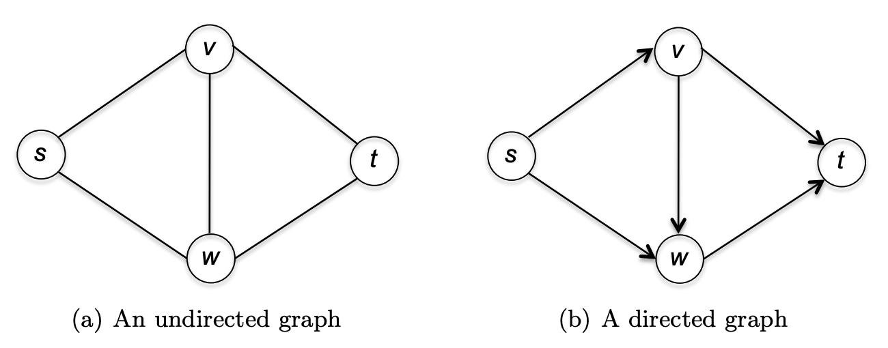
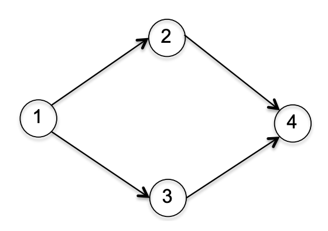
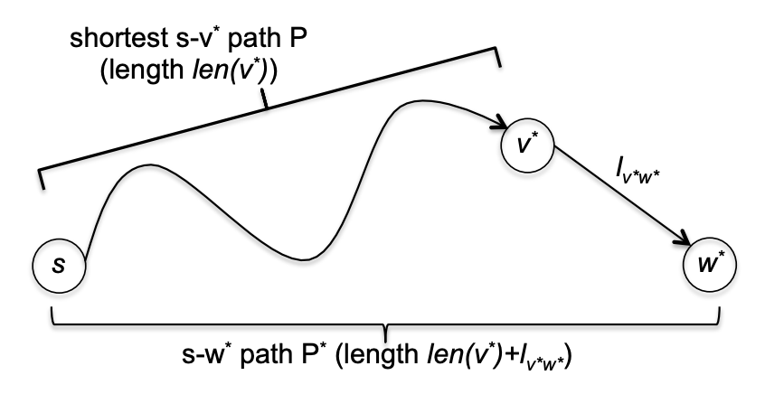

## 基础知识
图（`graph`）由点（`vertex`）和边（`edge`）组成，点一般表示某个对象，边表示两个对象之间的关系。通常使用 $V,E$ 表示，图用 $G=(V,E)$ 表示。

从边的类型分析，图可以分成两类：无向图（`undirected`）和有向图（`directed`）。无向图的边是无序对 $\{v, w\}$，称为端点（`endpoint`），边 $(v,w)$ 和 $(w,v)$ 没有区别。有向图的边是有序对 $(v,w)$，边从 $v$ （尾部（`tail`））到 $w$（头部（`head`））。如下图所示。



对于一个图 $G=(V,E)$ 做计算，输入规模用点的个数和边的个数表示。一般表示为 $n=|V|,m=|E|$。

如果一个图是连通的、无平行边的无向图，有 $n$ 个顶点，那么最少有 $n-1$ 个边，比如线性图、星状图、树状图等等，最多有 $n(n-1)/2$ 个边，也就是任意两个顶点之间都有一条边，这样的图称为完全图（`complete graph`）。

如果 $G=(V,E)$ 是一个无向图，顶点 $v\in V$ 的度（`degree`）是指 $E$ 中与 $v$ 关联的边的数量，也就是以 $v$ 为端点的边的数量。

根据边的多少，可以分为稀疏图（`sparse`）和稠密图（`dense`）。不同的数据结构和算法可能会更适合某种类型的图。边最少的时候 $m=O(n)$，边最多的时候 $m=O(n^2)$。一般接近线性称为稀疏图，比如 $O(n\log n)$，接近平方称为稠密图，比如 $O(n^2/\log n)$。$n^{3/2}$ 条边可以认定为部分稠密，具体要结合应用场景，可以被视为稀疏图，也可以被视为稠密图。

### 图的表示
通常最常用的图的表示有两种：邻接链表（`adjacency list`）和邻接矩阵（`adjacency matrix`）两种。

邻接链表的组成要素有

- 一个包含图中所有顶点的数组。
- 一个包含图中所有边的数组。
- 对于每一条边，指向其两个端点的指针。
- 对于每一个顶点，指向其每一条关联边的指针。

每个图由两个数组，两个数组之间相互引用。对于有向图，每个顶点 $v$ 包含两个指针数组，一个是出边（$v$ 是尾部），一个是入边（$v$ 是头部）。

如果有 $n$ 个顶点，$m$ 条边，那么这四个要素的空间占用分别是 $O(n),O(m),O(m),O(m)$，因此邻接链表表示图的空间复杂度是 $O(n+m)$。

邻接矩阵使用一个 $n\times n$ 的矩阵表示，其中
$$A_{ij}=\begin{cases}
1&& edge(i, j) \in E\\
0&&\text{otherwise}
\end{cases}$$
因此，邻接矩阵的空间复杂度是 $O(n^2)$。

通过修改 $A_{ij}$ 可以表示不同的图。比如有平行边的情况下，$A_{ij}$ 表示点 $i,j$ 之间边的个数。权重图可以令 $$A_{ij}$=w_{ij}$。

对于无向图而言，邻接矩阵是对称矩阵。

使用哪种表示取决于场景。邻接矩阵适合表示稠密图，对于稀疏图就会浪费空间。另外，还需要考虑想要支持的操作。通常情况下，邻接链表表示更合适一些。

## 广度优先搜索
广度优先搜索（`Breadth-First Search`, `BFS`）算法相当直接、简洁。

从图 $G$ 的某点 $s$ 开始遍历，假定它是第 0 层。首先遍历它的边，如果另一个端点没有被访问过，那么是第 1 层。然后遍历第 1 层的点，遍历它们的边，如果另一个端点没有被访问，那么是第 2 层。以此类推。伪代码如下所示。
```
marked[s] = true; // other false
queue = {s};
while !queue.IsEmpty()
    v = queue.pop()
    for Edge(v, w) in v.AdjacencyEdge()
        if !marked[w]
            marked[w] = true
            queue.push(w)
```
如果点 $v$ 被标记了，那么从 $s$ 到 $v$ 有一条通路，反之亦然。

BFS 算法的时间复杂度是 $O(m+n)$，其中 $m=|E|,n=|V|$。除了初始化 `marked` 之外，其他部分的时间复杂度是 $O(m_s+n_s)$，角标 $s$ 的含义是与 $s$ 连通的边和点的数量。每个点进入 `queue` 一次，因此 `while` `pop` `push` `marked[w] = true` 这几句的复杂度是 $O(n_s)$，每条边最多会遍历两次，一次是 `v` 被标记的时候，一次是 `w` 被标记的时候，因此复杂度是 $O(m_s)$，因此总的时间复杂度是 $O(m_s+n_s)$。

实现参考 [BFS](https://github.com/shenlei149/algorithms-data-structures/blob/9b872c837a4bf7c65d2c0b3d3959c6581281324b/src/graph/Traversals.h#L11)

## 深度优先搜索
深度优先搜索（`Depth-First Search`, `DFS`）和 BFS 有相似之处，都是遍历图的一种方式、一种策略，不过这种策略略微不同。

从 $s$ 点开始，遍历所有的边，遇到第一个没有访问过的顶点 $a$，访问点 $a$，然后遍历 $a$ 的所有的边，遇到第一个访问过的顶点 $b$，访问点 $b$，然后遍历 $b$ 的所有的边，以此类推。直到遇到一个顶点，其所有邻接边的另一个顶点都访问过了，然后返回上一层。

直接将上述过程翻译成代码，和 BFS 的先入先出不同，这里是后入先出，需要使用数据结构 `stack` 来保存中间的顶点。和 BFS 另一个区别是标记访问的时机略微有差异。下面是伪代码。
```
marked[0..V] = false;
stack = {s}
while !stack.IsEmpty()
    v = queue.pop()
    if !marked[v]
        marked[v] = true
        for Edge(v, w) in v.AdjacencyEdge()
            queue.push(w)
```

使用了栈，那么一个更优雅的实现是递归。
```
marked[s] = true;
for Edge(s, w) in s.AdjacencyEdge()
    if !marked[w]
        DFS (G, w)
```

和 BFS 类似，点 $v$ 被标记了等价于从 $s$ 到 $v$ 有一条通路。

时间复杂度也和 BFS 一样，$O(m+n)$。每个边最多访问两次，初始化复杂度和点的个数成正比。

实现参考 [DFS](https://github.com/shenlei149/algorithms-data-structures/blob/9b872c837a4bf7c65d2c0b3d3959c6581281324b/src/graph/Traversals.h#L70)

## 寻找路径
利用 BFS 可以找到一条从 $s$ 出发到 $v$ 的路径（`path`），如果不是权重图，那么 BFS 找到的路径是最短路径。时间复杂度和 BFS 一致 $O(m_i+n_i)$，其中 $m_i,n_i$ 是 $s$ 能达到的边和顶点的个数。

实现参考 [Path](https://github.com/shenlei149/algorithms-data-structures/blob/main/src/graph/Path.h)

这个问题也可以用 DFS 解决，不过此时只能找到一条通路，并不是最短路径。

## 连通分量
一个无向图 $G=(V,E)$，连通分量（`connected component`）是最大的子集 $S\subseteq V$，其中 $S$ 内的任意两个顶点是连通的。

利用 BFS 可以找到图的各个连通分量。只需要最外面遍历所有的点，如果该点没有被访问过，那么从该点出发，应用 BFS 遍历所有能达到的点，这些点属于同一个连通分量。

如果给每一个连通分量一个 `id`，那么 `id` 相同的点属于同一个连通分量，反之，同一个连通分量中的点，`id` 相同。

顶点 $i$ 开始的 BFS 的时间复杂度是 $O(m_i+n_i)$，其中 $m_i,n_i$ 表示第这个连通分量中边和点的个数。每一个连通分量只会调用一次 BFS，也就是说，$G$ 中的每一个顶点和每条边都只属于一个连通分量，将这些 BFS 的运行时间相加，恰好就是 $O(m+n)$。一些初始化工作复杂度是 $O(n)$。因此最终时间复杂度是 $O(m+n)$。

实现参考 [ConnectedComponent](https://github.com/shenlei149/algorithms-data-structures/blob/main/src/graph/ConnectedComponent.h)

这个问题也可以用 DFS 解决。

## 拓扑排序
一些任务，存在优先级约束（`precedence constraint`），在某个任务完成之前，无法开始另一个任务。比如大学中的课程有前置课程。拓扑排序就是来解决这类问题的。

拓扑序（`topological ordering`）的定义是对于给定一个有向图 $G=(V,E)$，将每个顶点 $v$ 给定一个值 $f(v)$，使得对于每一条边 $(v,w)$ 都有 $f(v)<f(w)$。

每一个图都有拓扑序吗？答案显然是否定的，如果一个有向图包含环，那么无法拓扑排序。如果一个有向图不包含图，那么称为有向无环图（`directed acyclic graph`, `DAG`）。

每个有向无环图至少有一个源顶点（`source vertex`），该点没有入边。从任一点开始，沿着入边逆向，总会找到源顶点，否则的话，会找到一个环，而这与有向无环图定义矛盾。

每一个有向无环图至少有一个拓扑序。令 $G$ 是有一个 $n$ 个顶点的图，拓扑排序就是要将 $1,2,\cdots,n$ 分配各个点。假定 $v_1$ 是 $G$ 的源顶点，那么给它分配为 1，即 $f(v_1)=1$。如果有多个源顶点，任选一个就好。将 $G$ 中 $v_1$ 和所有 $v_1$ 开始的边都删除得到 $G'$，由于 $G$ 是有向无环图，那么 $G'$ 也是。因此也存在一个源顶点，那么将剩余的数 $2,\cdots,n$ 中的 2 分配给源顶点。递归直到所有点都分配了一个数。在 $G$ 中而不在 $G'$ 的边只有 $v_1$ 的出边，而 $f(v_1)=1$，那么和其他点相比，满足拓扑排序的要求。

利用 DFS 可以高效的实现拓扑排序。在 DFS 之外，遍历所有顶点，如果没有被访问过，那么调用 DFS 从改顶点开始遍历边、点。在准备退出 DFS 遍历时，给顶点分配一个值。这个值刚开始的时候 $label = |V|$，每分配一次，执行 `label--`。

实现参考 [Topology](https://github.com/shenlei149/algorithms-data-structures/blob/main/src/graph/Topology.h)

拓扑排序每个顶点只会访问一次，每个边也只会访问一次，因此算法的时间复杂度是 $O(m+n)$。

对于每一个顶点 $v\in V$，只访问了一次，在结束访问的时候分配一个值，然后对 `label` 自减，因此分配的每个值都不一样。

对于边 $(v,w)$，要保证 $f(v)<f(w)$。这里有两种情况需要讨论。第一种情况是先访问 $v$，然后递归 DFS 访问 $w$。由于是先进后出，那么先结束对 $w$ 的访问再结束对 $v$ 的访问，因此先给 $w$ 分配再给 $v$ 分配。由于 `label` 是递减的，因此 $f(v)<f(w)$。第二种情况是先访问 $w$，对于有向无环图，那么没有通路从 $w$ 到 $v$，否则会形成一个环。在这次 DFS 递归结束前不会访问 $v$ 也就不会给 $v$ 分配一个值，但是在结束前会给 $w$ 分配值，因此 $f(w)>f(v)$。

## 强连通分量
一个有向图 $G=(V,E)$，强连通分量（`strongly connected component`）是最大的子集 $S\subseteq V$，其中 $S$ 内的任意一个顶点都有一条通路能到任意其他顶点。虽然定义和无向图的连通分量类似，但是实际含义完全不同。比如下面的图，看似是连通的，但并不是强连通分量，因为除了 1 之外其他点不能到任意点。



下图有四个强连通分量，每个连通分量都有环。


如果将第二个图中的强连通分量都看做一个顶点，那么和第一个图一样是一个有向无环图。准确的描述如下。

令 $G=(V,E)$ 是一个有向图，那么可以定义一个元图（`meta-graph`）$H(X,F)$，元顶点（`meta-vertex`）$x\in X$ 对应 $G$ 的一个强连通分量，$G$ 中如果有一条从 $x$ 对应的强连通分量中的某个顶点到 $y$ 对应的强连通分量的某个地点，那么就会有一条元边（`meta-vertex`）$(x,y)\in F$。$H$ 是有向无环图。假定 $H$ 有 $k\geq 2$ 个顶点组成了一个有向图，那么这个环会使得 $G$ 中的强连通分量 $S_1,\cdots,S_k$ 变成一个强连通分量，因为可以从 $S_i$ 中的一点沿着环到其他强连通分量。

上述论证使得我们可以将有向图分成两层：图是由强连通分量组成的有向无环图；每一个强连通分量是一个更细力度的结构。

上图如果从顶点 6 开始遍历，不管是 DFS 还是 BFS，我们都会找到一个强连通分量，如图中所示的 `SCC#4`。但是如果从 1 开始遍历，就无法得到强连通分量了。如果我们能从一个合适的地方开始，那么就能得到强连通分量。如果一个强连通分量是一个汇入（`sink`）节点，没有出边，从这个强连通分量的任一点开始遍历，都能得到强连通分量，然后去掉这个节点向后寻找连通分量。如果是看对应的元图，那么汇入节点（没有出边）就是拓扑排序的最后一个顶点，向后寻找就是按照拓扑排序的逆序进行。现在问题就是如何找到这个汇入节点，从任一点开始遍历找到第一个连通分类，以此类推。

令 $G$ 是有向图，对于顶点 $v\in V$，$f(v)$ 是拓扑排序值。令 $S_1,S_2$ 是两个强连通分量，并且 $G$ 有一条边 $(v,w),v\in S_1,w\in S_2$，那么
$$\min_{x\in S_1}f(x)<\min_{y\in S_2}f(y)$$
证明过程和拓扑排序类似。考虑两种情况。第一种情况是 BFS 先访问 $S_1$ 中的点 $s$，那么有一条通路 $s->v->w->y$，这里 $y\in S_2$。拓扑排序分配值是降序，外加 DFS 先入后出，因此 $f(v)$ 小于 $S_2$ 的每一个点。第二种情况是先访问 $S_2$ 中的点 $s$，因为 $G$ 的元图是有向无环图，那么 $s$ 没有到 $S_1$ 的通路，因此 $s$ 结束访问的时候仍旧不会访问 $S_1$ 的任意一点。这种情况下，$S_1$ 的每一个点的拓扑排序分配的值小于 $S_2$ 的每一个点的值。

拓扑排序的第一个点所在强连通分量是源节点（`source`），只有出边没有入边，和汇入节点相反。

如果我们将整个图转置，边的方向取反，会发生什么呢？两个图的强连通分量一致，并且源节点变成了汇入节点，汇入节点变成了源节点。如果对图的转置进行拓扑排序，第一个顶点所在的强连通分量就是原图的汇入节点。

通过上述的讨论，我们推导了 `Kosaraju` 算法最核心的思想。算法的伪代码如下。
```
G_rev = G.Reverse()
marked_rev[1..n] = false
t = Topology(G_rev)
marked[1..n] = false
numSCC = 0
for v in t.order()
    if !marked[v]
        numSCC++;
        DFS(G, v)

DFS(Graph, s)
    marked[s] = true
    scc[s] = numSCC
    for (s, v) in s.AdjacencyEdge()
        if !marked[v]
            DFS(Graph, v)
```

上述实现使用了两次 DFS，每个顶点和每条边都会访问两次，额外有一些常量开销或者和顶点数成比例的开销，因此算法的时间复杂度是 $O(m+n)$。

根据上述讨论，每次调用 DFS 会发现一个新的强连通分量，这个强连通分量是图中未访问顶点组成的图的汇入节点。因此如果 $v,w$ 属于同一个强连通分量，那么 $scc[v]=scc[w]$。

实现参考 [ConnectedComponent](https://github.com/shenlei149/algorithms-data-structures/blob/main/src/graph/ConnectedComponent.h)

## Dijkstra 算法
Dijkstra 算法主要用于解决最短路径问题（`shortest path problem`）。给定一个有向图 $G=(V,E)$，从一个顶点 $s\in V$ 开始，每条边 $e\in E$ 的长度是非负的，算法的输出是对任一点 $v\in V$ 的 $dist(s, v)$。如果两个点 $s,v$ 之间没有通路，那么 $dist(s, v)$ 是无穷大。

这里有两个假设，第一个是有向图，第二个是边的长度是非负的。

Dijkstra 算法的伪码如下。
```
X = {s}
len[s] = 0; len[v] = MAX
while exists(v, w), v in X, w not in X
    (v_min, w_min) = minimizing len[v] + len(v, w)
    X.add(w_min)
    len[w_min] = len[v_min] + len(v_min, w_min)
```
集合 `X` 初始时仅包含 `s` 这一个点。`s` 到 `s` 的距离为零，距离其他点距离初始化为最大值，这些保存在 `len` 这个数组中。每一次迭代向集合 `X` 中添加一个顶点。迭代要考察所有从 `X` 到 `V-X` 的边。这里定义 Dijkstra 得分 `len[v] + len(v, w)`，即 `s` 到 `v` 的距离加上 $(v, w)$ 的距离。假定边 `v_min, w_min` 使得分最小，那么将 `w_min` 加到 `X` 中，然后更新 `len[w_min]`。

直观的看，整个算法将点分成已经计算出最小距离的点和等待计算的点。每一次找一个局部最优的点，更新其最小距离，然后加到已经处理的集合中。

前面假定距离必须是非负数，是否可以通过把所有边都加上绝对值最大的负数的绝对值，这样所有的边都是非负数，然后再用 Dijkstra 算法解决呢？答案是否定的。本质原因在于这样不同长度的路径加上了不同的值，长的路径惩罚更大，导致规约后的问题与原始问题不等价。

如果直接解决距离包含非负数的问题呢？下图是一个简单的情况。第一次迭代，明显 -2 小于 1，那么会标记到点 $t$ 的最小距离是 -2，但是很明显最短距离应该是 -4。


这里使用 $dist(s,v)$ 来表示 $s$ 到 $v$ 的最短距离，那么需要证明对所有的 $v\in V$ 都有 $dist(s,v)=len[v]$，后者是 Dijkstra 算法给出的最短距离。

使用数学归纳法证明。$P(k)$ 表示 Dijkstra 算法正确的计算了 $s$ 到第 $k$ 个加到了集合 $X$ 中的顶点的最短距离。当 $k=1$ 时，$s$ 到 $s$ 的距离是 0，`len[s]` 初始化为零，显然成立。

假设 $P(1),\cdots,P(k-1),k>1$ 都成立。令 $w^*$ 表示第 $k$ 个加到 $X$ 的顶点，令 $(v^*,w^*)$ 是选中的边，根据算法 $v^*$ 已经在 $X$ 中了。算法得到的 $len[w^*]=len[v^*]+l_{v^*w^*}$，为了证明这个值等于 $dist(s,w^*)$，下面分两种情况讨论。

首先证明 $dist(s,w^*)\leq len[w^*]$。根据假设，$v^*$ 已经在 $X$ 中了，并且 $len[v^*]=dist(s,v^*)$。假定有一条从 $s$ 到 $v^*$ 的路径 $P$，距离是 $len[v^*]$，算法计算的路径长度是 $len[w^*]=len[v^*]+l_{v^*w^*}$，如下图所示，我们称这条路径为 $P^*$。显然，真实的最短路径 $s-w^*$ 不能比 $P^*$ 更长，因此 $dist(s,w^*)$ 最多和 $len[w^*]$ 一样。



接着证明 $dist(s,w^*)\geq len[w^*]$，也就是要证明上图中 $s-w^*$ 的距离至少是 $len[w^*]$。假定 $s-w^*$ 是 $P'$。我们对 $P'$ 知之甚少，不过知道 $s$ 属于 $X$ 而 $w*$ 不属于 $X$，那么一定有一条跨越边界的边，不妨令第一条这样的边是 $(y,z)$。如下图所示。那么 $P'$ 可以分成三段，第一段是 $s$ 到 $y$，根据归纳法假设，这段最短距离是 $dist(s,y)$；第二段是 $y$ 到 $z$，距离是 $len_{yz}$；第三段是 $z$ 到 $w^*$，这一段的距离是非负的。因此
$$len_{P'}\geq dist(s,y)+len_{yz}+0$$
由于 $y\in X$，那么
$$len_{P'}\geq len[y]+len_{yz}$$
而右边恰好是 Dijkstra 算法最小化的距离，也就是说选择的 $(v^*,w^*)$ 是的 $len[v^*]+l_{v^*w^*}\leq len[y]+l_{yz}$，那么
$$len_{P'}\geq len[v^*]+l_{v^*w^*}=len[w^*]$$
因此路径 $P'$ 至少和 $len[w^*]$ 一样大。

结合两个部分，完成了证明。还有一种情况，就是 $v$ 永远不会加到 $X$ 里面，即 $s$ 到 $v$ 没有通路，那么保持 $len[v]=\infty$。

上述算法并没有描述如何找到最小的边 $(v^*,w^*)$。一个直观的方式是使用一个 `bool` 表示点是否属于 $X$。然后每次迭代，都要遍历所有的边，首先判断其是否属于边界，即一个点在 $X$ 中，另一个点不在 $X$ 中。如果属于边界，计算 Dijkstra 得分 `len[v] + len(v, w)`，选择最小的边，然后把另一个顶点 `w` 加到 $X$ 中。需要迭代 $|V|=n$ 次，每次迭代需要遍历所有的边 $|E|=m$，因此时间复杂度是 $O(mn)$。

这个复杂度有点高，当边和点数很多时就会力不从心。我们需要借助[堆](./Basic.md#堆)来提升得到最小值的速度。

下面首先介绍使用堆最核心的思想，然后介绍一些可能的工程实现。

堆里面放的是待处理的顶点和当前到该点最短距离，即
$$key(w)=\min_{(w,w)\in E,v\in X}len(v)+l_{vw}$$
当将 $w^*$ 从 $V-X$ 移动到 $X$ 的时候，需要更新与 $w^*$ 邻接的点 $y$ 对应的距离。

下面是伪代码。
```
key[s] = 0, key[v] = MAX
H = Heapify(key)
while !H.empty()
    w_min = H.Top()
    H.Pop()
    len[w_min] = key[w_min]
    // update key
    for Edge(v, w_min) in w_min.AdjacencyEdge()
        key[v] = min(key[v], len[w_min]+len(v, w_min))
        H.Update(v, key[v])
```
和之前的伪代码相比，这里由 `H` 跟踪点而不是 `X`，目的都是区别一个点是否处理了。

`H` 的大小和顶点个数 $n=|V|$ 一致，因此 `w_min = H.Top()` 和 `H.Update(v, key[v])` 的时间复杂度是 $O(\log n)$，前者外层的 `while` 循环次数是点的个数 $O(n)$，后者外面两层循环，但是万变不离其宗，做多遍历了边两次，那么循环次数是 $O(m)$，因此优化版本的时间复杂度是 $O((m+n)\log n)$，比上述最朴素的版本 $O(mn)$ 快相当多，特别是点和边的数量很大的情况。

堆里面放的是待处理的数据这一点是确定的，但是如何放是可以选择的，一种常见方法就是将所有顶点都放到堆里面，起点的距离是 0，其余点的距离是最大值，即上面的伪代码阐述的方式。另一种方式是堆里面只放已经被发现但是还没有被处理的顶点。初始的时候只放起点，然后再处理邻接点的时候（发现）再放进堆。

如果使用普通的堆来实现，有两个问题。第一个问题是需要将顶点和距离封装成一个结构体或者 `std::pair`，自定义比较运算符。第二个问题是不能删除指定的节点，也不能更新指定的节点，那么算法中的更新操作就是再添加一个节点进去，重复入堆。如果弹出来的顶点已经处理过了，即已经在 $X$ 里面，无需再次处理，这个过程也称为懒删除。重复入堆的本质是遍历边，那么堆的操作时间复杂度从 $\log n$ 变成了 $\log m$，如果边比点多很多，时间复杂度增大。

也可以使用带有 Index 的堆来实现，这种数据结构一般称为 `IndexPriorityQueue`。对于普通堆的第一个问题，顶点的 `id` 就是天然的 `Index`，那么堆里面放最小距离即可。第二个问题就不存在了，因为其支持更新操作。

代码示例中，选择了 `IndexPriorityQueue` 和动态添加待处理的点。参考 [Dijkstra](https://github.com/shenlei149/algorithms-data-structures/blob/6c7d25937f9df1a43e921da8a33834625f351d2f/src/graph/ShortestPath.h#L55)
