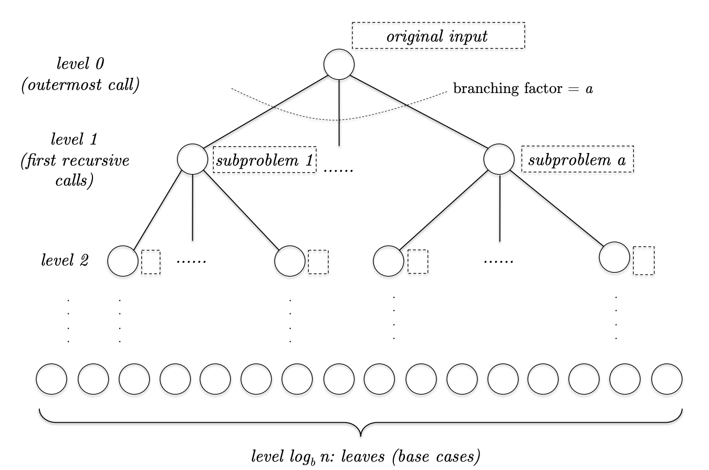

主方法（`master method`）用于分析递归算法的时间复杂度。

主方法也是一个标准的递归式子。当 $n\leq n_0$ 时，$T(n)\leq c$，其中 $c,n_0$ 是常量。也就是说，当 $n$ 很小的时候，时间复杂度是 $O(1)$。当 $n$ 很大时，递归式子是
$$T(n)\leq aT(\frac{n}{b})+O(n^d),a\geq 1,b>1,d\geq 0$$
其中 $a,b,d$ 是常量。一般而言，$a$ 是任意正整数；$b$ 是大于 1 的实数，如果 $b\leq 1$，递归时算法的规模没有减少，那么整个算法无法收敛；$d$ 是非负实数，如果 $d=0$，那么递归之外只需要 $O(1)$ 就能完成工作。

如果 $T(n)$ 定义如上，那么
$$T(n)=\begin{cases}
O(n^d\log n)&&a=b^d\\
O(n^d)&&a<b^d\\
O(n^{\log_b a})&&a>b^d
\end{cases}$$

从上面式子中，可以看出来 $a$ 和 $b^d$ 的大小关系非常重要。

另外，第一种情况对数没有写底数，因为这不重要，底数是不同常量的话，差一个常量系数罢了，一般用 2 作为底数。但是第三种情况要写明底数，因为差的这个系数在指数的位置，那么时间复杂度就差 $n^k$ 这么多了，比如 $O(n^3)$ 和 $O(n^2)$ 差距是很大的。

在证明上面的等式之前先给两个简单的例子。

归并排序中，两次递归调用，因此 $a=2$，每次规模缩小一倍，因此 $b=2$，对两个已排序数据进行合并，$O(n)$ 的时间复杂度，因此 $d=1$，那么 $a=2=2^1=b^d$，那么时间复杂度是 $O(n\log n)$。

二分查找，只有一次递归调用，$a=1$，每次规模缩小一倍，因此 $b=2$，除了递归之外，进需要比较 key 和中间值，$O(1)$，因此 $d=0$，因此 $a=1=2^0=b^d$，那么时间复杂度是 $O(\log n)$。

下面给出主方法的证明。证明过程很重要，并不是因为关心其形式，而是证明过程能够解释主方法的本质，比如为什么有三种不同的类型。因此值得记住理解的不是证明过程中的代数运算，而是主方法三种情况的含义。

稍微简化一下要证明的式子，这并不影响证明的思路和正确性。首先令 $n_0=1$，即基本情况是 $T(1)\leq c$。当 $n>1$ 时
$$T(n)\leq aT(\frac{n}{b})+cn^d$$
这里使用了同一个常量 $c$，如果实际中两者不同，取更大的即可。这里假定 $n$ 是 $b$ 的若干次幂，这样可以简化证明。

下面是递归调用的过程。

第 $j$ 层有 $a^j$ 个子任务，每个任务的输入规模是 $\frac{n}{b^j}$。那么不计算递归调用的时间复杂度是
$$a^j\cdot c\bigg(\frac{n}{b^j}\bigg)^d$$
稍微改写一下
$$cn^d\bigg(\frac{a}{b^d}\bigg)^j$$
这就出现了结论中很重要的一个比值：$a/b^d$。

一共有 $\log_b n$ 层，那么总的复杂度是
$$cn^d\sum_{j=0}^{\log_b n}\bigg(\frac{a}{b^d}\bigg)^j$$

第一种情况，$a=b^d$，那么
$$cn^d\sum_{j=0}^{\log_b n}\bigg(\frac{a}{b^d}\bigg)^j=cn^d(1+\log_b n)=O(n^d\log n)$$
最后一个步骤忽略了常量 $c,1/log b$。

直观的看，$a=b^d$，子问题增加的 $a$ 与工作减少的比率 $b^d$ 一样多，那么每层的工作量是相同，共有 $\log_b n$ 层，层数乘以 $n^d$ 就是总工作量。

第二种情况，$a<b^d$ 时
$$cn^d\sum_{j=0}^{\log_b n}\bigg(\frac{a}{b^d}\bigg)^j=cn^d\sum_{j=0}^{\log_b n}r^j=cn^d\frac{1-r^{\log_b n+1}}{1-r}\leq cn^d\frac{1}{1-r}=O(n^d)$$
其中 $r=a/b^d<1$。

直观的看，$a<b^d$ 时，子问题增加的速率要比工作量减少的比率要小很多，也就是根节点工作量最大，也就是 $n^d$ 权重更大。这个第三种情况恰好相反，叶子节点权重最大，而叶子节点是第 $\log_b n$ 层，那么时间复杂度为 1 的叶子节点个数是 $a^{\log_b n}$，这也就是总的复杂度。

第三种情况，$a>b^d$ 时
$$cn^d\sum_{j=0}^{\log_b n}\bigg(\frac{a}{b^d}\bigg)^j=cn^d\sum_{j=0}^{\log_b n}r^j=cn^d\frac{r^{1+\log_b n}-1}{r-1}$$
其中 $r=a/b^d>1$。
几何级数求和可以缩放为
$$\frac{r^{1+\log_b n}-1}{r-1}\leq\frac{r^{1+\log_b n}}{r-1}=r^{\log_b n}\frac{r}{r-1}=O(r^{\log_b n})$$
那么
$$cn^d\sum_{j=0}^{\log_b n}\bigg(\frac{a}{b^d}\bigg)^j=O(n^d(\frac{a}{b^d})^{\log_b n})$$
$$\frac{1}{b^d}^{\log_b n}=b^{-d\log_b n}=(b^{\log_b n})^{-d}=n^{-d}$$
那么时间复杂度是
$$O(a^{\log_b n})$$
和
$$O(n^{\log_b a})$$
还差一步：
$$\log_b a^{\log_b n}=\log_b n\log_b a=\log_b a \log_b n=\log_b n^{\log_b a}$$
由于 $b>1$，$\log_b x$ 是单调递增函数，因为 $a^{\log_b n}=n^{\log_b a}$。
