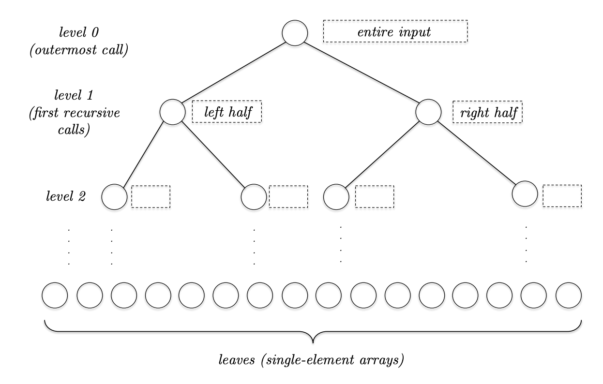

## 倒置个数
倒置指的是在数组中出现了逆序。给定一组下标 $(i,j)$，$i<j$ 但是 $A[i]>A[j]$。如何统计倒置的个数呢？

最简单的方法是两层 `for` 循环，遍历每一组可能的 $(i,j),i<j$，判断是否有 $A[i]>A[j]$，时间复杂度是 $O(n^2)$。

下面分析一种更高效的算法，使用分治法的思想，整体过程类似于归并排序，准确地说，就是一个归并排序，顺带计算了导致个数。

将数组分成两半，那么倒置有三种可能：

1. 两个值都在前半段
2. 两个值都在后半段
3. 两个值分别位于前半段和后半段

前面两种情况容易处理，递归调用即可。如何计算第三种情况的倒置个数呢？下面分析归并两个有序数组和倒置的关系。

假定两个有序数组 $A,B$，长度均为 $n$，归并的时候，$A$ 的第 $i$ 个值和 $B$ 的第 $j$ 个比较，如果 $A$ 的第 $i$ 个值比较小，放到结果数组，这里没有倒置；如果 $A$ 的第 $i$ 个值比较大，那么包含这个值在内的 $A$ 中剩下的值都比 $B$ 的第 $j$ 个值要大，那么有 $n-i+1$ 个倒置，即 $A$ 中未排序的元素个数。

整个算法的时间复杂度与[归并排序](./Sort.md#merge-sort)一致，$O(n\log n)$。

实现代码参考 [CountInversion](https://github.com/shenlei149/algorithms-data-structures/blob/1473ef87683d9330cc552627b75e8f39dad93e91/src/sort/InternalSort.h#L80)。

## Merge Sort
归并排序是一种古老的算法，但仍旧非常实用。

整个算法的基本思想是分治法，使用递归比较容易实现。

如果待排序包含零个和一个元素，已经有序了，直接返回，这是整个递归实现的基本情况。

然后将整个数组分成两半，分别对这两边递归调用归并排序使其有序。

最后，将两半有序的数组合并成一个。合并的逻辑也很简单，每个数组有一个迭代器，比较其大小，较小的复制到有序数组，然后迭代器向后移动一位，直到两个迭代器其中一个结束。如果剩余一个迭代器还有值，直接拷贝到有序数组的尾部即可。

实现代码参考 [MergeSort](https://github.com/shenlei149/algorithms-data-structures/blob/633d6d96bec0e81baee4b72460340ac03046669d/src/sort/InternalSort.h#L112)。

整个过程上图所示。对于归并函数而言，假定两个数组的长度都是 $l$，那么开销是 $O(l)$。假定第 $i$ 层有 $2^i$ 个子数组，每个数组长度是 $n/2^i$，其中 $n$ 是原始数组的大小，那么每层合并的开销是 $O(n)$。整棵树的高度是 $n\log_2 n+1$，因此归并排序的时间复杂度是 $O(n\log_2 n)$。

## Quick Sort
快速排序是一个很经典的排序算法。主要分成两步，第一步是选择一个枢轴元素（`pivot element`），第二步将数据元素划分到枢轴元素两边，左边的都比其小，右边的都比其大。

两步之后，枢轴元素所在的位置就是其最终的位置。划分将数组分成了两个部分，减小了问题的规模。划分的时间复杂度是 $O(n)$。

相比归并排序的归并步骤不得不拷贝元素到一个新的数组中，快速排序的划分步骤可以就地完成。

假定枢轴元素是在数组的首位，如果不是，比如选择了其他方式选择枢轴元素 `p`，$O(1)$ 复杂度就可以把 `p` 放到首位。两个游标 `i` `j` 从左往右移动。起始时指向 `p` 的下一个元素。两个游标移动的过程中，要保持不变性：`i` 左边的都要比 `p` 小，`i` 和 `j` 之间的比 `p` 大，`j` （含）之外的都是未划分的元素。移动结束时 `j` 移动到数组末尾。最后将 `p` 与 `i - 1` 位置上的元素（小于 `p`）交换。这就是整个划分的过程。

选择枢轴元素很重要。这里举两个极端的例子。假定我们每次选择第一个元素作为枢轴元素。

第一个例子是数组已经排序好了，对于第 `i` 层递归调用而言，每次枢轴元素都是最小的元素，那么其左边的数组大小为零，右边的数组大小是 `i - 1`，因此每次问题的规模仅仅缩小了一个，那么时间复杂度是
$$n+(n-1)+\cdots+2+1=O(n^2)$$
第二个例子是每次枢轴元素都比待排序的数组中一半的元素小，比另一半的元素大，很明显这是最好的情况，每次问题的规模都缩小一倍，那么时间复杂度的递归公式是
$$T(n)=2T(\frac{n}{2})+O(n)$$
根据[主方法](./MasterMethod.md)其时间复杂度是 $O(n\log n)$。

为了不落入最长的情况，可以引入随机性，即从数组中等概率的选择一个元素作为枢轴元素。这样平均复杂度是 $O(n\log n)$。不过一般情况下，使用第一个元素作为枢轴元素也没有问题，因为大部分的时候，输入数据可以看作是随机的。除此之外，还有一个常用方法是取中法，比较第一个、中间的和最后一个元素的大小，选择中间元素作为枢轴元素。

这里的 [Quick Sort](https://github.com/shenlei149/algorithms-data-structures/blob/0f610be137eac4e504fa8d05fef5f223590dd770/src/sort/InternalSort.h#L240) 实现使用了最简单的第一个元素作为枢轴元素。

最后，证明引入随机性后，平均时间复杂度是 $O(n\log n)$。首先假定输入的数组是任意的，要分析的样本空间是所有随机选择枢轴元素的集合，这里使用随机变量 $\omega$ 表示所有可能的选择。这里使用 $RT(\omega)$ 表示快排的操作数，根据之前的分析，$RT(\omega)$ 的范围从 $\Theta(n\log n)$ 到 $\Theta(n^2)$。随机变量 $C$ 表示给定一系列划分后任意两个元素比较的次数。

对于每次划分，枢轴元素都要和当前递归的子数组中的每一个元素都进行一次比较。在划分之外，操作次数是常量。最多会递归调用 $n$ 次，即每一个元素都作为枢轴元素。因此划分函数之外，时间复杂度是 $O(n)$。那么 $RT(\omega)$ 表示的总次数是 $C(\omega)$ 表示的比较次数加上 $O(n)$ 次复杂度，而 $C(\omega)$ 至少是 $O(n)$ 的，因此 $RT(\omega)\leq aC(\omega)$，其中 $a$ 是常量。

如果能证明 $C(\omega)$ 的复杂度是 $O(n\log n)$，那么 $RT(\omega)$ 的复杂度也是 $O(n\log n)$。

令 $z_i$ 表示数组中第 $i$ 大的元素，与位置无关。下标 $i,j\in\{1,2,3,\cdots, n\}$，并且 $i<j$。随机变量 $X_{ij}(\omega)$ 表示对每一个给定的划分 $\omega$，$z_i,z_j$ 比较的次数。那么
$$C(\omega)=\sum_{i=1}^{n-1}\sum_{j=i+1}^nX_{ij}(\omega)$$
如果选择的枢轴元素在 $z_i,z_j$ 之间，那么 $z_i,z_j$ 会被分到两个子数组，不会被比较了。如果选择其一作为枢轴元素，那么他们会比较一次。如果枢轴元素比 $z_i$ 还小或者比 $z_j$ 还大，递归到上述两种场景。因此 $X_{ij}$ 要么为 0 要么为 1。那么 $C$ 的期望值是
$$E[C]=\sum_{i=1}^{n-1}\sum_{j=i+1}^nE[X_{ij}]=\sum_{i=1}^{n-1}\sum_{j=i+1}^n P[X_{ij}=1]$$
那么问题就是要求解 $P[X_{ij}]$，即 $z_i,z_j$ 比较的概率，然后求和。

根据之前的分析，如果 $z_i,z_j$ 其中一个在 $z_{i+1},\cdots,z_{j-1}$ 之前被选中当做枢轴元素，那么会进行一次比较，否则会被分到两个子分区中，那么这两个元素不会被比较。因此
$$P[X_{ij}=1]=\frac{2}{j-i+1}$$
进行一下缩放，上式 $i$ 从 1 开始，那么最大值是 $\frac{2}{j}$，同时将内层求值的范围也扩大，因此得到
$$\sum_{i=1}^{n-1}\sum_{j=i+1}^n\frac{2}{j-i+1}\leq\sum_{i=1}^{n-1}\sum_{j=2}^n\frac{2}{j}=2(n-1)\sum_{j=2}^n\frac{1}{j}$$
利用些许微积分知识
$$\sum_{j=2}^n\frac{1}{j}\leq\int_1^n\frac{1}{x}dx=\ln x\bigg|_1^n=\ln n$$
综上有
$$E[C]\leq 2(n-1)\ln n$$
因此快排的平均时间复杂度是 $O(n\log n)$。

## 基于比较的排序下限 $\Omega(n\log n)$
对于长度为 $n,n\geq 1$ 的数组，如果是基于比较的排序算法，即直接比较元素对，那么存在一个常数 $c$，排序算法执行的操作次数最低是 $cn\log_2 n$。

这是因为对于任意输入，输出是数组的全排列 $n!$ 种可能性中的一个。每一次比较操作，仅依赖于前面的比较操作的结果，而每一次操作，会产生两种结果。因此排序算法如果执行 $k$ 次比较，那么最多能产生 $2^k$ 种不同的结果。因此
$$2^k\geq n!\geq (\frac{n}{2})^{\frac{n}{2}}$$
后面的不等式只取阶乘的前一半。两边取对数得到
$$k\geq\log_2(\frac{n}{2})^{\frac{n}{2}}=\frac{n}{2}\log_2\frac{n}{2}=\Omega(n\log n)$$
因此，最好的基于比较的排序时间复杂度是 $O(n\log n)$。

不过，不基于比较的排序可以突破这个下限，比如基数排序、计数排序等等。

## Selection
选择问题是说给定一个数组有 $n$ 个元素，任意排序，输出第 $i$ 大的元素。

如果 $i=1$ 或者 $i=n$，这个问题很容易解决，如果 $i=n/2$ 或者 $i=n/3$ 呢？

可以借助排序，然后选择第 $i$ 大的元素，但是时间复杂度是 $O(n\log n)$。下面介绍两种算法，在线性时间内完成。

### 随机化划分
这里借鉴快排的思想。随机选择一个元素作为枢轴元素，划分，假定最后枢轴元素的位置 $j$。如果 $i==j$，那么找到了要找的元素，如果 $i<j$，那么要找的元素在左边，递归。如果 $i>j$，那么要找的元素在右边，递归，不过此时需要找子数组中第 $i-j$ 的元素，因为前面已经有 $j$ 个元素比第 $i$ 大的元素小了。

代码可以参考 [Selection By Partition]()。

如果划分很均匀，那么每次问题规模就小了一半，时间复杂度的递归关系是
$$T(n)\leq T(\frac{n}{2})+O(n)$$
根据[主方法](./MasterMethod.md)，递归次数 $a=1$，问题规模是之前的一半，那么 $b=2$，额外工作线性，$d=1$，那么 $1=a<b^d=2$，因此 $T(n)=O(n)$。

如果划分非常不幸运，每次都是最小元素或者最大元素作为枢轴元素，那么时间复杂度是 $O(n^2)$。
