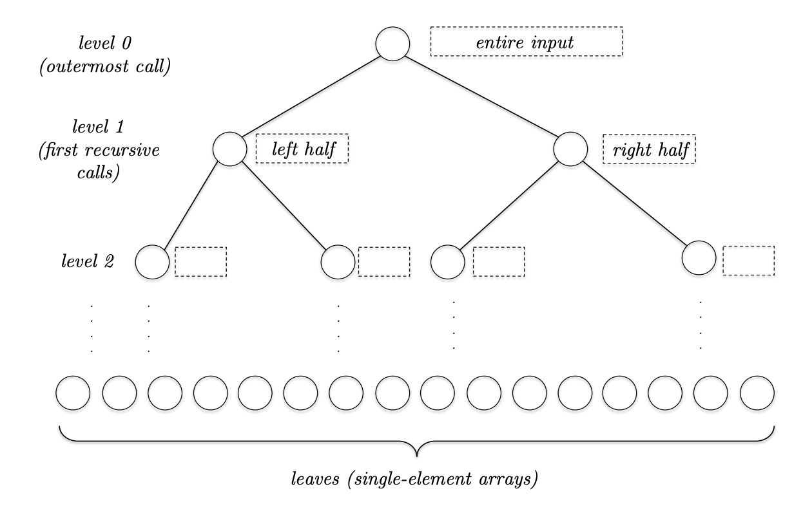

## Merge Sort
归并排序是一种古老的算法，但仍旧非常实用。

整个算法的基本思想是分治法，使用递归比较容易实现。

如果待排序包含零个和一个元素，已经有序了，直接返回，这是整个递归实现的基本情况。

然后将整个数组分成两半，分别对这两边递归调用归并排序使其有序。

最后，将两半有序的数组合并成一个。合并的逻辑也很简单，每个数组有一个迭代器，比较其大小，较小的复制到有序数组，然后迭代器向后移动一位，直到两个迭代器其中一个结束。如果剩余一个迭代器还有值，直接拷贝到有序数组的尾部即可。

实现代码参考[MergeSort](https://github.com/shenlei149/algorithms-data-structures/blob/633d6d96bec0e81baee4b72460340ac03046669d/src/sort/InternalSort.h#L112)。

整个过程上图所示。对于归并函数而言，假定两个数组的长度都是 $l$，那么开销是 $O(l)$。假定第 $i$ 层有 $2^i$ 个子数组，每个数组长度是 $n/2^i$，其中 $n$ 是原始数组的大小，那么每层合并的开销是 $O(n)$。整棵树的高度是 $n\log_2 n+1$，因此归并排序的时间复杂度是 $O(n\log_2 n)$。

## Quick Sort
