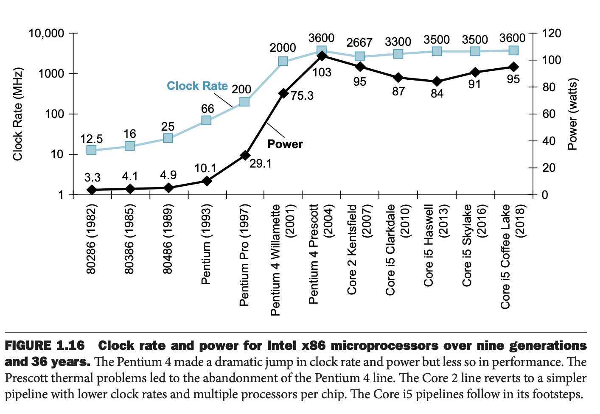

过去几十年，时钟频率和功率一直是正相关的，如下图所示。

每次状态改变的能量是
$$\text{Energy} \propto 1/2 \times \text{Capacitive load}\times \text{Voltage}^2$$
耗能是
$$\text{Power} \propto 1/2 \times \text{Capacitive load}\times \text{Voltage}^2\times\text{Frequency switched}$$
不过图中的时钟频率提高了近三个数量级，但是耗能只有三十倍，原因是电压的下降。不过电压下降带来的问题是漏电，服务器大约 40% 的能量泄露了。
