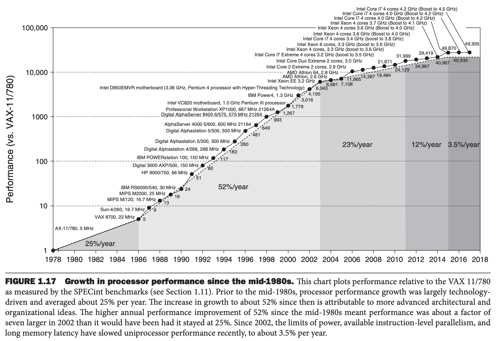

由于功率的限制，处理器的设计发生了很大的变化。下图说明在 2002 年左右，处理器速度每年增长速度从 50% 逐渐下降到现在的 3%。

因此，设计厂商的思路从堆主频转向了堆多核。

单处理器时代，程序员什么也不做，程序性能就能逐年提高。但是现在不行了，必须让程序适应新的多核架构。

并行（`parallelism`）对性能来说至关重要。第四章讲解的流水线（`pipelining`）是一种指令级别的并行。

指望程序员意识到硬件并行能力并显式地写并行的程序来提升性能，这条路走不通。

一个原因是写起来比顺序程序困难。

第二个原因是需要将任务拆分成差不多的块交给不同的处理器，这需要调度和协作（同步信息），这个开销一定要小于并行所带来的性能提升。

为了反应这种巨大的变化，后续章节会有详细阐述，这里就不再赘述了。
