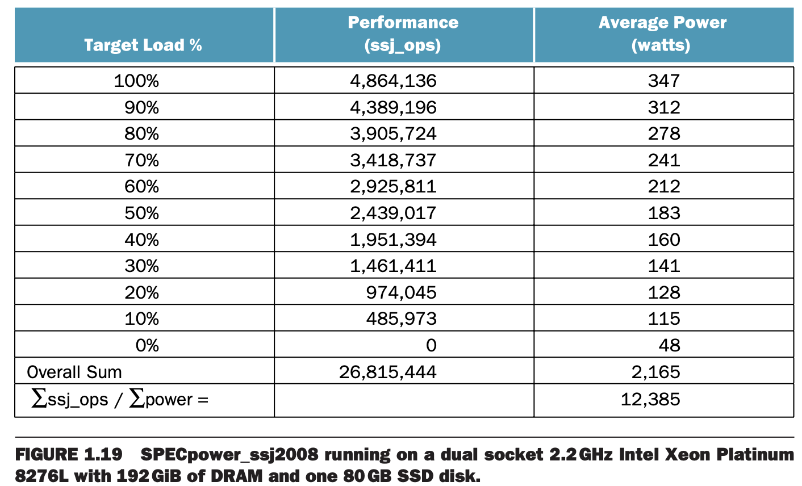

每一章都会有 "Real Stuf" 小节，将当前章的知识与真实世界链接起来。这一章介绍如何评估性能和功耗。

### SPEC CPU Benchmark
常用的程序的集合称为工作负荷（`workload`）。通常会使用一组专门选择用于测量性能的基准（`benchmarks`）——程序来评估计算机性能。

SPEC（`System Performance Evaluation Cooperative`）是一个创建基准测试的组织。 SPEC CPU2017 包含 10 个整数基准测试和 13 个浮点数基准测试。

### SPEC Power Benchmark
由于功耗愈发重要，SPEC 增加了测试功耗的基准测试。

按照下表给出的数据，当负载很低的时候，比如 10% 时，其功耗大约是 100% 时功耗的三分之一。

