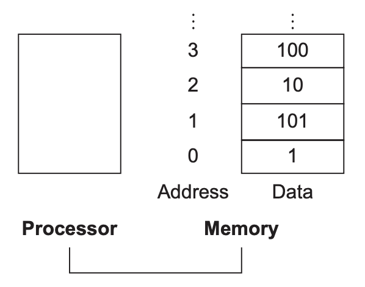
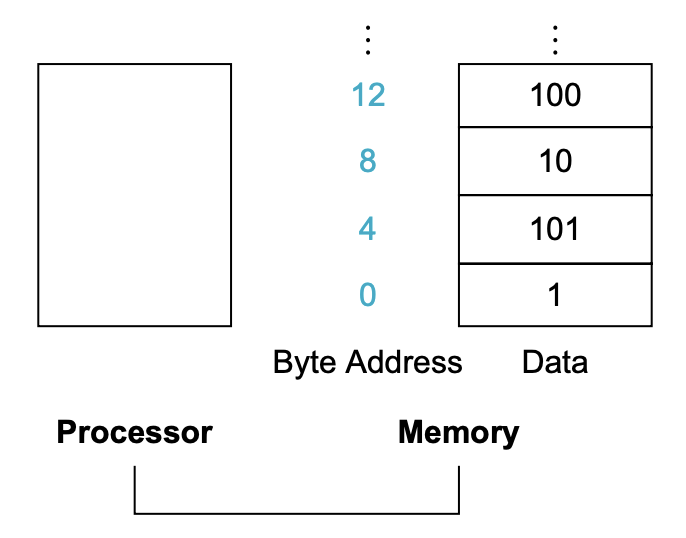

不像高级语言，算术指令的操作数必须存在有限个数的寄存器（`register`）中。RISC-V 架构的寄存器是 32 bits，称为一个字（`word`），另一个常见的长度是 64 bits，双字（`doubleword`）。本书寄存器长度是 32，不过 RISC-V 有其他变种。这里使用的变种就是 RV32，RV64 版本的寄存器长度是 64，更符合现代处理器的设计。

RISC-V 中有 32 个寄存器。算术指令的操作数必须是这些寄存器中的几个。

限制 32 个寄存器引出了硬件设计的第二个原则：

*Design Principle 2*: Smaller is faster.

*设计原则 2*：更小往往更快。

更多的寄存器可能会导致时钟周期变长。

更少往往更快并不是绝对的。31 个寄存器或许不必 32 个寄存器更快。这里深层次的原因是设计者在程序期望更多的寄存器和时钟周期越短越好之间的平衡。另一个不使用超过 32 个的原因是其在指令格式中占用的位数，2.5 节会给出描述。

第四章会介绍寄存器在硬件构建上处于中心位置，同时，高效地使用寄存器会影响程序的性能。

下面给出一个例子。
```c
f = (g + h) - (i + j);

// 假定这些变量对应的寄存器分别是 x19, x20, x21, x22, x23，那么对应的指令如下
add x5, x20, x21    // register x5 contains g + h
add x6, x22, x23    // register x6 contains i + j
sub x19, x5, x6     // f gets x5 - x6, which is (g + h) - (i + j)
```

### Memory Operands
上面的例子中，总是使用简单的类型，实际中可能会使用复杂的数据结构（比如结构体和数组）。这些数据量可能超过了所有寄存器的容量，那怎么办呢？

计算机一个重要组成部件是内存，这些数据都放在内存中。

如前所述，RISC-V 算术指令只能操作在寄存器中的数，所以 RISC-V 必须包含在寄存器和内存之间转移数据的指令，称为数据传送指令（`data transfer instructions`）。要访问内存中的字，必须知道其地址。可以将内存看做是一个很大的连续的一维数组，如下所示，第 3 个元素地址是 2，内存中的值是 10。



从内存加载数据到寄存器的指令称为 `load`。该命令的第一个参数是寄存器，指要加载数据的寄存器，第二个是寄存器，表示内存基地址，第三个是常数，表示基地址的偏移量。RISC-V 的 `load` 指令名是 `lw`，代表 `load word`。

```c
// g 和 h 变量对应的寄存器是 x20, x21，A 是 100 个 words 的数组，基地址存放在 x22 中，那么编译如下代码
g = h + A[8];
// 需要利用 lw 指令将 A[8] 加载到某个寄存器中，比如 x9
lw x9, 8(x22)   // Temporary reg x9 gets A[8]
// 最后做加法
add x20, x21, x9 // g = h + A[8]
```

由于 8 bits 的字节非常有用，并且大多数架构都能寻址到某个字节。一个字的地址包含四个字节的地址，如下图所示。



字拆成字节之后，有了一个分类：大端和小端。前者将最左边的字节作为字的地址，后者使用最右边的字节地址。RISC-V 是小端。只有同时使用字和字节两种访问方式访问同一个字和四个字节的时候，才需要注意大小端的问题。

按字节寻址会影响数组的索引。为了选到 `A[8]` 而不是 `A[8/4]`，上述例子中，`lw` 指令的常数应该是 32。

与 `load` 相对的指令是 `store`，将寄存器的数据存储到内存中。第一个参数是要存储数据的寄存器，第二个参数是寄存器，其内存表示要存储数据的内存的基地址，第三个参数是常数，是基地址的偏移量。

在许多架构中，字的地址必须对齐到字的长度上，比如这里字开始的地址必须能整除 4。这就是对齐限制（`alignment restriction`）。第四章会解释为什么对齐会使得程序更快。RISC-V 和 Intel 不要求强制对齐，而 MIPS 要求这一点。

由于地址使用二进制表示的，所以内存大小往往使用二进制而不是十进制表示容量。

```c
// 假设 h 在 x21 中存储，A 的基地址存在 x22 中，那么编译如下代码
A[12] = h + A[8];
// 和上一个例子一样，需要一个额外的寄存器加载 A[8]
lw x9, 32(x22)      // Temporary reg x9 gets A[8]
add x9, x21, x9     // Temporary reg x9 gets h + A[8]
// 最后把结果存储到内存
sw x9, 48(x22)      // Stores h + A[8] back into A[12]
```

很多程序的变量比寄存器数量多。编译器试图将常用的变量放到寄存器中，其他的放在内存，需要的时候再加载。这称为寄存器溢出（`spilling registers`）。

RISC-V 只能操作寄存器的数，对于内存的数据，只能 `load` 或者 `store` 而不能进行其他操作。

寄存器的读写速度比内存快很多倍，所需要的能量也少几个数量级。

### Constant or Immediate Operands
很多时候，操作数是常数，比如移动索引到数组的下一个元素。

如果只使用目前介绍的指令（常数需要在程序启动时放到内存），我们想将 `x22` 中的数据加 4，需要执行两个指令
```c
// x3 + AddrConstant4 表示常数 4 所在的地址
lw x9, AddrConstant4(x3)    // x9 = constant 4
add x22, x22, x9            // x22 = x22 + x9 (where x9 == 4)
```
一个更好的解决方案是增加一个指令 `add immediate` 能够直接操作常数。
```c
addi x22, x22, 4        // x22 = x22 + 4
```
速度快非常多，且耗能少很多。

常量 0 非常有用，比如零减去一个数可以得到其相反数。RISC-V 使用寄存器 `x0` 存放常量 0。

操作常量，是一个优化最常见情况的例子。
