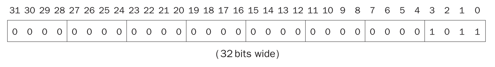
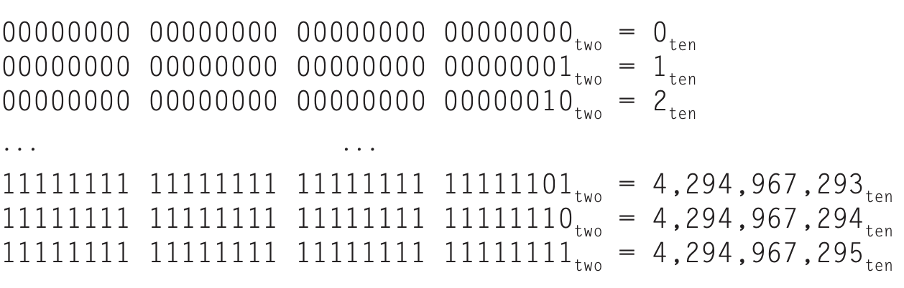
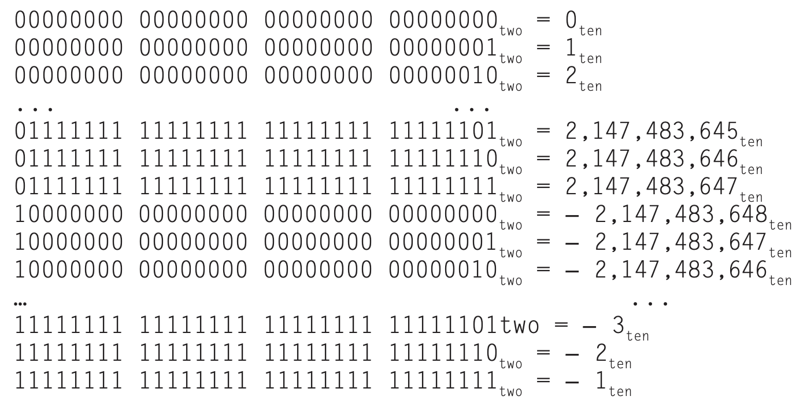

人有十个手指，所以计数时采用十进制（`decimal`）。计算机使用高低电信号表示数，所以很自然地采用了二进制（`binary`）。

一个二进制数的一位成为二进制数字（`binary digit`），或者比特（`bit`）。

一般地，数字用任意底表示，第 $i$ 位的数字 $d$ 的大小是
$$d\times\text{Base}^i$$
其中 $i$ 是从 0 开始且从右往左数。利用这个特性，可以实现不同底之间的数字互转
$$\begin{aligned}
(1011)_2&=(1\times 2^3)+(0\times 2^2)+(1\times 2^1)+(1\times 2^0)\\
&=8+0+2+1\\
&=11_{10}
\end{aligned}$$
我们从右往左依次标记 $i$，那么 RISC-V 中 $11_{10}$ 的二进制表示如下图。

由于每个比特表示的数大小不同，所以我们将最右边的位称为最低位（`least significant bit`），最左边的位称为最高位（`most significant bit`）。

RISC-V 的字有 32 比特，那么可以表示 $2^{32}$ 个不同的数，从 0 到 $2^{31} (4,294,967,295)$。

32 比特的数表示的十进制是
$$(x_{31}\times 2^{31})+(x_{30}\times 2^{30})+(x_{29}\times 2^{29})+\cdots+(x_{1}\times 2^{1})+(x_{0}\times 2^{0})+$$

这些正数称为无符号数。

由于二进制对人而言不如十进制自然，所以早期的计算机使用十进制表示，不过高低电平只能表示两种状态，所以使用若干比特表示一个十进制数字。但是这种表示方式非常不高效，所以后续计算机采用二进制表示，只有在输入输出这些必要的地方才做转换。

如果一个数很小，那么硬件的高位都是 0。第三章会将二进制的加减乘除，不过这里需要提一下溢出（`overflow`），即结果无法用硬件有限的比特数表示。溢出发生时的行为依赖于编程语言、操作系统和程序期待的行为。

计算机需要计算正数，也需要计算负数，所以需要某种方式表示负数。一个直观的方式是分离符号位和数值位。

这种表示方式有以下缺点。用哪一位表示符号呢？早期计算机常识最左边和最右边两种方式。由于提前不能知道符号是正还是负，所以加法需要一个额外的步骤设置符号位。对于粗心的程序员，这种方式可能会导致一些问题。因为这些缺点，符号和数值分离的方式被淘汰了。

一个很小的无符号数减去一个更大的无符号数，得到的结果前面有一串 1，这启发研究人员发明了二的补码（`two's complement`）表示，后面称为二进制补码。开头（最高位，最右边）是零表示整数，一表示负数。

这个名字的来历是 $n$ 比特数和其负数的无符号和是 $2^n$，即 $x$ 的补或者其负数是 $2^n-x$。

正数的范围从 $0$ 到 $2,147,483,647(2^{31}-1)$，负数范围从 $-2,147,483,648(-2^{31})$ 到 $-1$。范围不平衡，负数表示范围多了一个数，这会给粗心的程序员带来困扰。不过符号和数值分离的方式不仅会给程序员带来困扰，也会给硬件设计者带来困扰。

一个替代符号和数值分离的表示方法是一的补码。一个数的负数是把所有比特翻转，零变成一，一变成零，这样 $x$ 的补是 $2^n-x-1$。这样表示的好处是由于存在两个零（全零是正零，全一是负零），正数和负数范围恰好对称。不过由于一的补码的加法需要一个额外步骤——减一，所以也被淘汰了。

如果需要知道一个数是整数还是负数，只需要检测最高位即可，因此这一位也称为符号位（`sign bit`），但是和符号和数值分离表示法中的符号位意义不太一样。

32 比特有符号数的二进制表示的十进制是
$$-(x_{31}\times 2^{31})+(x_{30}\times 2^{30})+(x_{29}\times 2^{29})+\cdots+(x_{1}\times 2^{1})+(x_{0}\times 2^{0})+$$

和无符号数一样，有符号数的计算也会溢出。此时，最高位（符号位）与预期相反：正确结果为负但是符号位是零，反之亦然。

对于 `load` 指令来说，符号拓展（`sign extension`）是十分必要的，目的是把数正确地加载到寄存器中。无符号数前面补零，有符号数补符号位。32 位的寄存器，加载 32 位整数，那么有符号数和无符号数是一样的。不过对于更短的类型，比如字节，`lbu` 和 `lb` 的行为就不一样了。

编程语言要能够区分无符号数和有符号数。C 语言的有符号整数是 `int`，而无符号数是 `unsigned int`，有时前者写作 `signed int` 以保持一致。

下面分析两个处理二进制补码的便捷方法。

第一个是求一个二进制数的相反数。方法是所有位取反，然后最后结果加一。原理是一个数与所有位取反之后的数相加的二进制全都是一，即 -1，这里用 $\bar{x}$ 表示将 $x$ 所有位取反的数，那么 $x+\bar{x}=-1$，稍作调整 $x+\bar{x}+1=0$ 所有 $x$ 的相反数是 $\bar{x}+1$。

第二个是符号拓展，可以将 $n$ 位二进制数拓展成比 $n$ 位多的二进制数。方法如前所述，无符号前面补零，有符号补符号位。
