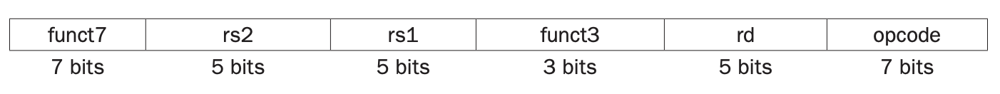
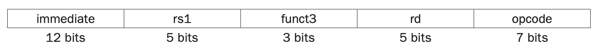
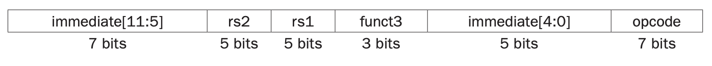

指令在计算机中的表示和数字一样，程序也存储在内存中，和数据一样，可以读写，这也是存储程序（`stored-program`）这个术语的由来。

RISC-V 的指令长度也是 32 位，其布局称为指令格式（`instruction format`）。与汇编有所区别，这些指令称为机器语言（`machine language`），一系列指令称为机器码（`machine code`）。

### RISC-V Fields

* **opcode** 指令的基本操作，这个缩写是传统名。
* *rd* 操作的目标寄存器，从中获取操作的结果。
* *funct3* opcode 的附加信息。
* *rs1* 源操作数的第一个寄存器。
* *rs2* 源操作数的第二个寄存器。
* *funct7* opcide 的附加信息。

这里有一个问题。对于 `load` 指令而言，源操作数的第二个值是常数，如何只有 5 位，最多只能是 31，这对于数组或者结构体的偏移量而言太小了。

这和统一的指令格式冲突，故而引出了第三个设计原则：

*Design Principle 3*: Good design demands good compromises.

*设计原则 3*：好的设计需要好的折中。

RISC-V 这里选择所有的指令长度一样，但是对于不同的指令有不同的格式。比如上面的格式称为 R 类型（`R-type (for register)`），下面的格式称为 I 类型（`I-type`），通常用于需要一个常量的指令，比如 `addi`。

12 位的立即数，表示的范围是 $[-2^{11},2^11)$，对于 `load` 指令而言最大支持 2048 个字节，即 256 个字。如果寄存器个数多于 32 个，那么 rd 和 rs1 就需要更多 bit，那么立即数的范围就会小很多。

对于 `store`，我们也需要一个新的格式，因为其有两个源操作寄存器和一个常量。S 类型（`S-type`）指令个数如下。

这里立即数被分层了两个部分。这么做的目的是使得 rs1 和 rs2 两个位置和其他指令保持一致。第四章会阐述这个划分简化了硬件设计。使指令格式尽可能相似能够简化硬件设计。这里 opcode 和 funct3 的位置始终不变，长度也不变。

每个指令的 opcode 是唯一的，所以硬件能够知道指令的类型，进而处理各个部分。

保持所有指令拥有相同的大小和希望尽可能多的寄存器矛盾。更多的寄存器意味着使用更多的指令位。基于这些限制和越小越快的原则，大分部指令都有 16 或 32 个通用寄存器。

