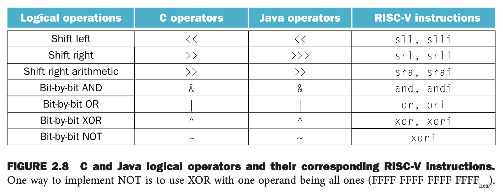
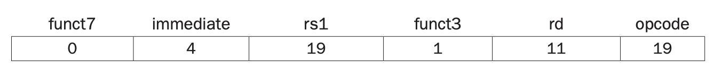

操作一个字中的字节或者某个 bit 是非常有用的操作，所以很多编程语言和指令集，包括 RISC-V 都提供了逻辑操作（`logical operations`）直接操作位，如下图所示。



第一类操作是移位（`shifts`），移动整体 bits 往左或往右若干位，对空出来的 bits 补零。

举个例子，`x19` 的数值
$$00000000 00000000 00000000 00001001_2=9_{10}$$
向左移动 4 位，得到
$$00000000 00000000 00000000 10010000_2 = 144_{10}$$
右移和左移对称。RISC-V 提供了两个指令 shift left logical immediate (`slli`) 和 shift right logical immediate
(`srli`)。上述例子写成汇编如下（假设结果放到 `x11` 中）
```c
slli x11, x19, 4    // reg x11 = reg x19 << 4 bits
```
对应指令是 I 类型的，如下图所示。



左移相当于乘以 $2^i$。

RISC-V 还提供了 shift right arithmetic immediate (`srai`) 指令，和 `srli` 类似，不过右移的时候不是补零而是补符号位。

类似的，RISC-V 还提供类似的移动操作，不过参数不是立即数而是一个寄存器，这些指令分别是 `sll`, `srl`, `sra`。

其余四个语义明确。AND 是两个 bit 都是 1 的时候结果才是 1；OR 与 AND 相反，有一个 1 结果就是 1；NOT 是位取反，1 变成 0,0 变成 1；XOR 是互斥异或，两个位都是 1 或者都是 0，结果是 0，否则结果是 1。
