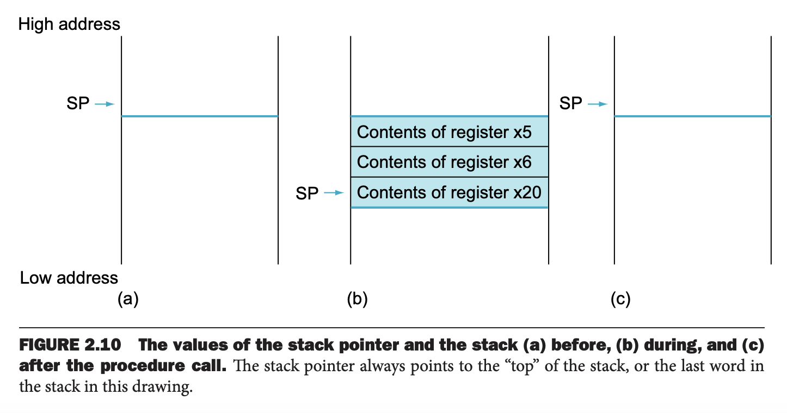
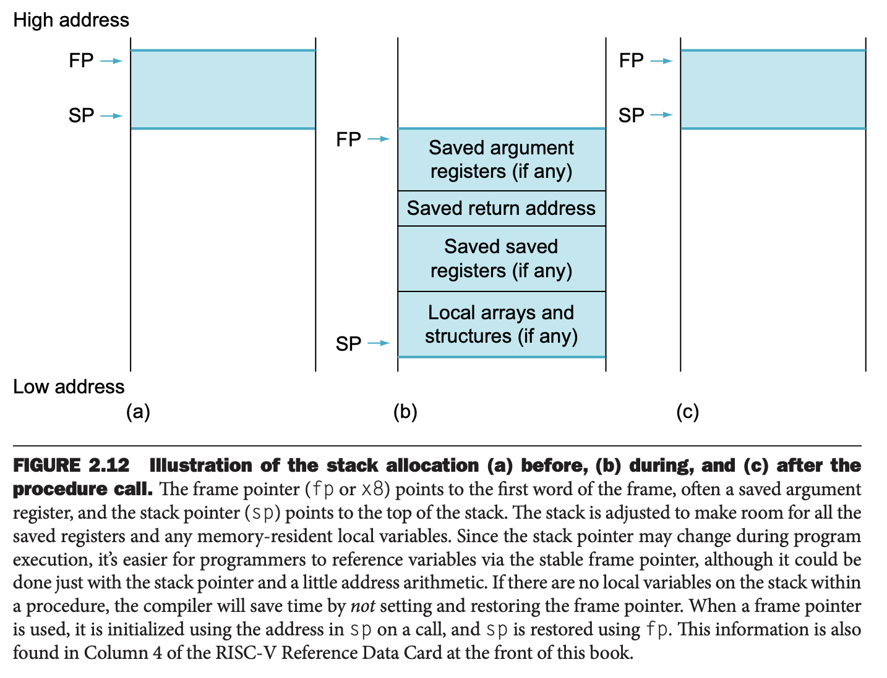
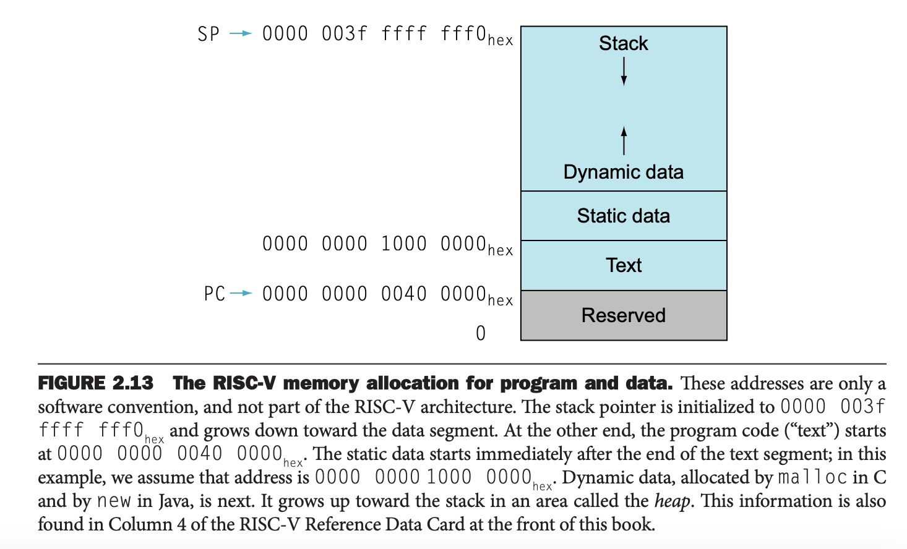
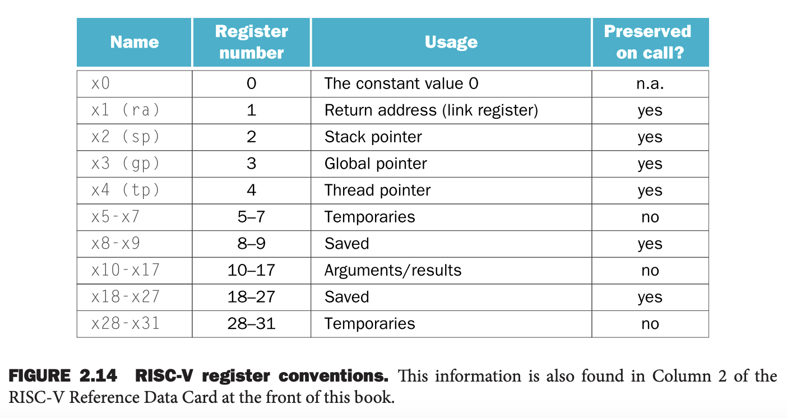

过程（`procedure`）或函数（`function`）是结构化程序的重要工具，使得程序更容易理解且能复用代码。过程是软件领域实现抽象的方式之一。

执行一个过程大致有如下六个步骤：
1. 将参数放到某个地方使得过程能够访问到。
2. 转移控制权给过程。
3. 获取必要的存储资源。
4. 执行。
5. 将结果放到某个地方使得程序能够访问到。
6. 返回控制权到原始调用过程的地方。

寄存器是访问最快的地方，所以要尽可能的使用它们。RISC-V 关于寄存器的使用有以下约定：
* `x10` - `x17` 用于传递参数和结果
* `x1` 用于保存返回到原点的地址

除此之外，RISC-V 提供 `jal` 指令（`jump-and-link instruction`）来实现调用过程。该指令跳转到一个地址，并且将紧接着这条指令的下一条指令的地址保存到指定寄存器中。
```c
jal x1, ProcedureAddress    // jump to ProcedureAddress and write return address to x1
```

指令名中 `link` 的含义是一个地址，使得过程能够返回到合适的地址继续执行程序。这个 `link`，或者说存在 `x1` 中的值，称为返回地址（`return address`）。需要返回地址的原因是同一个过程可能会在程序的不同地方被调用。

为了实现返回的功能，RISC-V 提供下面这个和 `jal` 类似的指令
```c
jalr x0, 0(x1)
```
`jalr`（`jump-and-link register instruction`）跳转到存放在 `x1` 寄存器的地址。调用者（`caller`）把参数放到 `x10` - `x17`，然后调用 `jal x1 X` 跳转到位于 X 地址的函数，这个函数是被调用函数（`callee`）。被调用函数执行运算，把结果放到放参数的寄存器，然后调用 `jalr x0, 0(x1)` 把控制权交回给调用者。

存储程序需要寄存器指向当前执行的指令的地址。历史原因，我们称这个寄存器为程序计数器（`program counter`），简写为 `PC`。更好的名字是指令地址寄存器（`instruction address register`）。`jal` 通常将 PC + 4 存到 `x1` 寄存器。

另外，`jal` 可以做无条件跳转。`x0` 通常放的是零，也就是只跳转到 Label 但是不返回。
```c
jal x0, Label   // unconditionally branch to Label
```

### Using More Registers
假设一个函数的参数个数多于八个，那么编译器需要更多寄存器。由于调用完成之后需要恢复调用之前的现场，任意寄存器的值需要恢复到执行函数之前。对于这个场景，我们需要把寄存器的内容 spill 到内存。

一个理想的数据结构是栈（`stack`）。栈需要一个指针指向最近的分配的地址，以指示下一个存放数据的地址。一般地，这样指针的称为堆栈指针（`stack pointer`），缩写为 `sp`，RISC-V 使用寄存器 `x2` 保存 `sp`。栈存储数据或者恢复数据，都需要调整堆栈指针，一次一个字。栈非常通用，数据操作有专有名词：入栈 `push` 和出栈 `pop`。

历史原因，栈从高地址向低地址增长，所以通过减堆栈指针来入栈，增加堆栈指针实现出栈。

#### Compiling a C Procedure That Doesn't Call Another Procedure
现在分析下面 C 代码编译成什么样的汇编代码。这个 C 代码来自 2.2 节。
```c
int leaf_example (int g, int h, int i, int j)
{
    int f;

    f = (g + h) - (i + j);
    return f;
}
```

变量 `g, h, i, j` 对应寄存器 `x10, x11, x12, x13`，变量 `f` 对应寄存器 `x20`。编译函数首先要写一个标签：
```
leaf_example:
```

下一步需要保存这个函数要用的寄存器。类似于 2.2 节，这个函数还需要两个额外的临时寄存器 `x5, x6`。加上 `f` 对应的 `x20`，我们需要保存三个寄存器的值到栈上。
```c
addi sp, sp, -12    // adjust stack to make room for 3 items
sw x5, 8(sp)        // save register x5 for use afterwards
sw x6, 4(sp)        // save register x6 for use afterwards
sw x20, 0(sp)       // save register x20 for use afterwards
```

下面是这个过程对应的栈变化。



下面执行运算。
```c
add x5, x10, x11    // register x5 contains g + h
add x6, x12, x13    // register x6 contains i + j
sub x20, x5, x6     // f = x5 - x6, which is (g + h) - (i + j)
```

为了返回结果 `f` 的值，拷贝到参数寄存器
```c
addi x10, x20, 0    // returns f (x10 = x20 + 0)
```

返回之前，出栈以恢复现场
```c
lw x20, 0(sp)       // restore register x20 for caller
lw x6, 4(sp)        // restore register x6 for caller
lw x5, 8(sp)        // restore register x5 for caller
addi sp, sp, 12     // adjust stack to delete 3 items
```

最后跳转到返回地址
```c
jalr x0, 0(x1)      // branch back to calling routine
```

这个例子中，我们总是将要用到的临时寄存器的值保存起来再恢复出来。对于临时寄存器而言，我们不需要这么做，RISC-V 将寄存器中的 19 个分成了两组：
* `x5-x7, x28-x31` - 被调用者不必维护这些寄存器的值，可以随意使用。
* `x8-x9, x18-x27` - 被调用者需要维护这些寄存器的值，如果用到的话，那么就要存储和恢复里面的值。

根据这个约定，上面的例子可以不处理 `x5,x6`，减少 spill 寄存器的数量。不过还是需要处理 `x20` 的。

### Nested Procedures
不调用其他过程的过程称为叶子过程。如果只有叶子过程，一切都会非常简单。但是现实不是这样的。

比如主函数调用过程 A，参数 3 放到了 `x10` 中，并调用 `jal x1 A`，接着 A 调用 B，把参数 7 放到了 `x10` 中，并调用 `jal x1 B`。由于 A 还没有结束，所以这里有两个冲突，`x10` 中的数据变了，`x1` 中的返回地址也变了。

一个方案和之前类似，把这些值保存在栈上。调用者负责将参数寄存器 `x10–x17` 和自己用的临时寄存器 `x5-x7, x28-x31` 的值放到栈上，调用完成之后恢复。被调用者负责将返回地址寄存器 `x1` 和自己可能要用的非临时寄存器 `x8-x9, x18-x27` 的值保存起来。`sp` 维护根据入栈的寄存器数量调整指针，恢复栈的数据到寄存器之后，调整指针位置进行出栈操作。

#### Compiling a Recursive C Procedure, Showing Nested Procedure Linking
让我们看一个递归调用的例子。
```c
int fact(int n)
{
    if (n < 1)
        return (1);
    else
        return (n * fact(n - 1));
}
```

参数 `n` 放在了寄存器 `x10` 中，所以栈保存两个地址，存放 `n` 和返回地址。对于过程来说，汇编以过程名的标签开始：
```c
fact:
addi sp, sp, -8     // adjust stack for 2 items
sw x1, 4(sp)        // save the return address
sw x10, 0(sp)       // save the argument n
```

当 `fact` 第一次被调用，`sw` 保存的是调用 `fact` 的函数地址。下面两条指令检查 `n < 1`，是的话顺序执行下去，否则跳转到 `L1`。
```c
addi x5, x10, -1    // x5 = n - 1
bge x5, x0, L1      // if (n - 1) >= 0, go to L1
```

加下来就是 `n < 1` 的分支，返回 1：通过 0 和 1 相加得到。调整栈然后返回调用函数。
```c
addi x10, x0, 1     // return 1
addi sp, sp, 8      // pop 2 items off stack
jalr x0, 0(x1)      // return to caller
```

由于我们没有修改 `x1` 和 `x10` 的值，所以不必在退栈之前恢复它们的值。

下一个分支是 `n >= 1`，需要将 `n` 减一然后调用 `fact`。
```c
L1: addi x10, x10, -1       // n >= 1: argument gets (n - 1)
jal x1, fact                // call fact with (n - 1)
```

接着是这次调用 `fact` 返回了。我们把结果 `x10` 复制到 `x6`，然后从恢复 `x10`（参数 `n`）和 `x1`（调用这次 `fact` 的返回地址）。
```c
addi x6, x10, 0     // return from jal: move result of fact(n - 1) to x6:
lw x10, 0(sp)       // restore argument n
lw x1, 4(sp)        // restore the return address
addi sp, sp, 8      // adjust stack pointer to pop 2 item
```

将 `n` 和 `fact(n-1)` 相乘，然后返回调用者。
```c
mul x10, x10, x6    // return n * fact (n - 1)
jalr x0, 0(x1)      // return to the caller
```

C 语言中数据存放的位置取决于其类型（`type`）和存储分类（`storage class`）。后者分为自动变量（`automatic`）和静态变量（`static`）。函数外部的变量，和函数内部但是显式地 `static` 声明的都是静态变量，其余是自动变量。一些 RISC-V 编译器为了寻找静态变量方便，使用 `x3` 作为全局指针（`global pointer`），指向静态变量。

### Allocating Space for New Data on the Stack
还有一个复杂的问题是栈上有一些局部变量，无法放到寄存器中，比如数组和结构体。栈中保存寄存器内容和局部变量的部分称为过程帧（`procedure frame`）或者活动记录（`activation record`）。



一些编译器使用帧指针（`frame pointer`），即 `x8`，来指向过程帧的第一个字。随着调用函数，栈指针会变化，那么对同一个变量的位置可能随着处于过程的不同位置而不同，这使得过程更加难以理解。另一个方案是帧指针为本地存储提供稳定的基地址寄存器。不管是否有显式地帧指针，活动记录都会出现在栈上。本书通过避免在过程内部调整栈（只有进入函数或者退出的时候才会调整栈）来避免使用帧指针。

### Allocating Space for New Data on the Heap
除了自动变量之外，动态数据结构和静态数据也需要内存来存放。下图是运行 Linux 时 RISC-V 分配内存的方式。



栈从用户空间的高地址向低地址方向增长或减少。最底下是保留地址。然后是存放 RISC-V 机器码的代码段（`text segment`），然后是静态数据段，数组是固定长度的，放在静态数据段，而链表这样动态分配内存的数据放在动态数据段，通常称为堆（`heap`）。栈和堆相向而行，随着程序的运行此消彼长。

C 语言中使用 `malloc()` 和 `free()` 显式地分配和释放内存。很多问题都是由于内存管理引起的。忘记释放内存会导致内存泄露，提前释放内存会导致悬垂指针，可能会访问到非预期的数据。

下面是寄存器使用惯例。这里是优化通常情况的示例。对于大部分过程而言，八个参数寄存器，十二个保留寄存器和七个临时寄存器都够用了，而无需使用内存。



### 尾递归
一些递归函数可以用迭代来实现。比如如下函数
```c
int sum(int n, int acc)
{
    if (n > 0)
        return sum(n - 1, acc + n);
    else
        return acc;
}
```
与前面的例子不同的是，这里的递归语句只调用函数自身，没有其他运算了。如果调用 `sum(3,0)`，会依次调用 `sum(2,3), sum(1,5), sum(0,6)`，最后直接返回结果 6。这个函数key使用循环实现，假定 `x10, x11` 存放 `n, acc`，结果放在 `x12` 中。
```c
sum:
ble x10, x0, sum_exit       // go to sum_exit if n <= 0
add x11, x11, x10           // add n to acc
addi x10, x10, -1           // subtract 1 from n
jal x0, sum                 // jump to sum

sum_exit:
addi x12, x11, 0            // return value acc
jalr x0, 0(x1)              // return to caller
```
