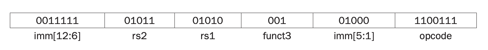
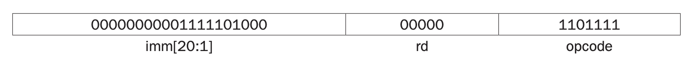
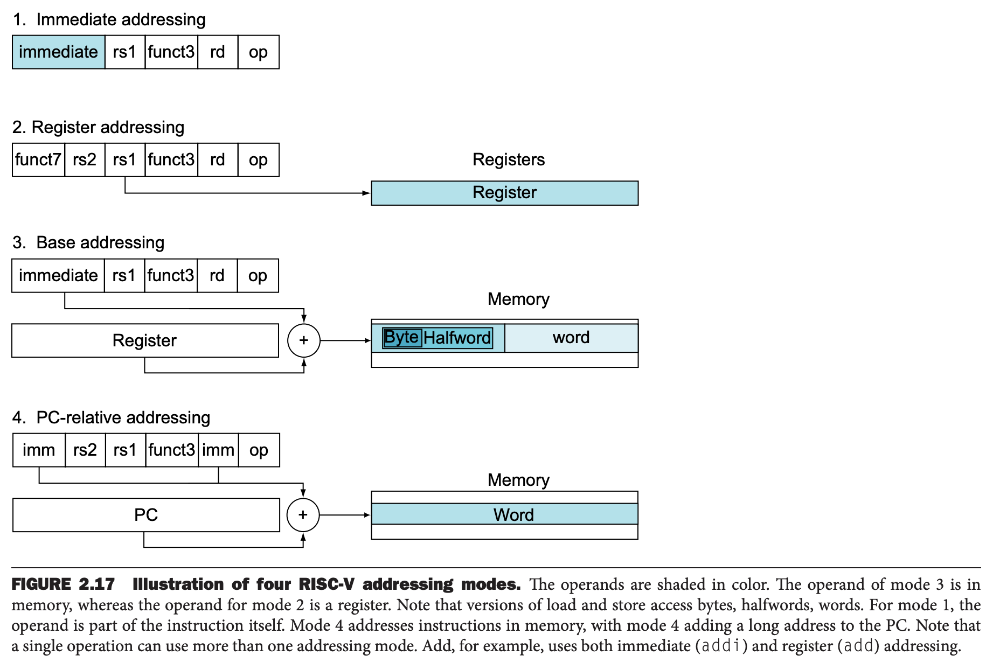

### Wide Immediate Operands
尽管常数很多时候少于 12 比特，但是也有更长的时候。

`lui`（`load upper immediate`）可以将 20 比特常数加载到寄存器的 12 到 31 位。最右边的 12 个比特位置为零。因此 32 比特的常数可以通过两个指令表示出来。`lui` 是 U 型指令，相比其他类型指令，能够处理更大的常数。

#### Loading a 32-Bit Constant
如何将如下 32 位常数加载到寄存器 `x19` 中？
```
00000000 00111101 00000101 00000000
```
首先利用 `lui` 加载 12 到 31 比特。
```
lui x19, 976  // 976_decimal = 0000 0000 0011 1101 0000
```
此时 `x19` 寄存器的值是
```
00000000 00111101 00000000 00000000
```
然后再加上低 12 比特的值。
```
addi x19, x19, 1280  // 1280_decimal = 00000101 00000000
```

可以想见，立即数的大小还会限制加载或存储内存的地址的范围。RISC-V 的汇编语言并没有这个限制，但是汇编器的作者不得不考虑这个问题。

### Addressing in Branches
跳转指令只有 12 比特大小的立即数，那么只能表示 4K 大小，后面会解释一种特殊的编码，使得跳转范围可以是 $\pm 4K$。`bne` 是 SB 类型的指令，7 位操作码，3 位函数码，两个 5 比特长度表示寄存器信息，只有 12 比特表示立即数了。
```
bne x10, x11, 2000  // if x10 != x11, go to location 2000_{10} = 0111 1101 0000
```



`jal` 类似，只是立即数有 20 比特大小。
```
jal x0, 2000  // go to location 2000_{10} = 0111 1101 0000
```



如果跳转范围只有 20 比特的地址，那么程序必须很小，不合理。不过，这个值可以表示基于某个寄存器的偏移量，这样的话就能跳转到任意位置。

现在的问题是：以哪个寄存器为准？大部分（SPEC 基准测试有一半分值跳转）`if, while` 跳转的地址在当前地址的 16 个指令以内，所以基于 PC 寄存器，可以分支跳转到偏移量在 $\pm 2^{10}$ 以内的字（`word`)处或者跳转到 $\pm 2^{18}$ 字处。这足够大部分场景使用了，所以 PC 是一个不错的选择。这种方法称为相对 PC 寻址（`PC-relative addressing`）。

但是不得不考虑超过这个范围的情况。RISC-V 提供了两条指令来完成这个事情，`lui` 加载 12 到 31 比特信息到某个寄存器，`jalr` 有 12 位的立即数，跳转到寄存器加上 12 位立即数的地方。

RISC-V 指令四字节长，不过设计时希望支持二字节长的指令，所以跳转指令的偏移量表示从寄存器的基准地址偏移半字的长度，所以支持的跳转范围比 $2^n$ 字节大一倍。`jal` 是 $\pm 2^{19}$ 半字，即 $\pm 1MiB$ 的范围，12 比特的分支跳转范围也是半字，范围是 13 个比特能够表示的范围。

#### Showing Branch Offset in Machine Language
之前有一段简单的 C 代码
```c
while (save[i] == k)
    i += 1;
```
对应的汇编代码是
```
Loop:   slli x10, x22, 2   // Temp reg x10 = i * 4
        add x10, x10, x25  // x10 = address of save[i]
        lw x9, 0(x10)      // Temp reg x9 = save[i]
        bne x9, x24, Exit  // go to Exit if save[i] != k
        addi x22, x22, 1   // i = i + 1
        beq x0, x0, Loop   // go to Loop
Exit:
```
假定循环开始的指令位置是 8000，那么汇编代码对应的机器代码是

| Address | Instruction | Instruction | Instruction | Instruction | Instruction | Instruction |
|--|--|--|--|--|--|--|
| 80000 | 0000000 | 00010 | 10110 | 001 | 01010 | 0010011 |
| 80004 | 0000000 | 11001 | 01010 | 000 | 01010 | 0110011 |
| 80008 | 0000000 | 00000 | 01010 | 011 | 01001 | 0000011 |
| 80012 | 0000000 | 11000 | 01001 | 001 | 01100 | 1100011 |
| 80016 | 0000000 | 00001 | 10110 | 000 | 10110 | 0010011 |
| 80020 | 1111111 | 00000 | 00000 | 000 | 01101 | 1100011 |

第一个 `bne` 是从当前位置 80012 向后跳转到 80020 的后面，所以偏移量是 12，第二个 `bne` 回到循环头部，偏移量是 -20。这里感觉原书有一个印刷错误，最后一行倒数第二个值应该是 01100，和前面的 1111111 是 -20 的补码。

偶尔需要跳转到 12 比特地址之外的地方，那么一个可行的方式是反转条件跳转的判断条件，后面跟着一个无条件跳转。比如下面的例子。

#### Branching Far Away
下面的汇编是根据 `x10` 是否等于零跳转到 `L1`
```
beq x10, x0, L1
```
替换为下面一对指令，能跳转到更远的地方
```
    bne x10, x0, L2
    jal x0, L1
L2:
```

### RISC-V Addressing Mode Summary
多种寻址方式称为寻址模式（`addressing modes`）。下图展示了 RISC-V 支持的几种寻址模式。
* 立即寻址（`immediate addressing`）：操作数是常量，包含在指令里
* 寄存器寻址（`register addressing`）：操作数是寄存器。
* 基地址寻址（` Base or displacement addressing`）：操作数是内存的某个地址，地址寄存器的值与指令的立即数之和。
* 相对 PC 寻址（`PC-relative addressing`）：跳转地址是 PC 地址和偏移量之和。


