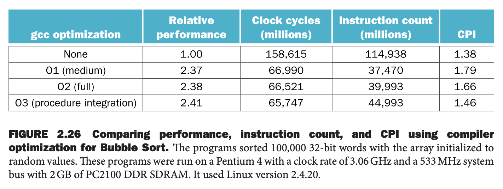
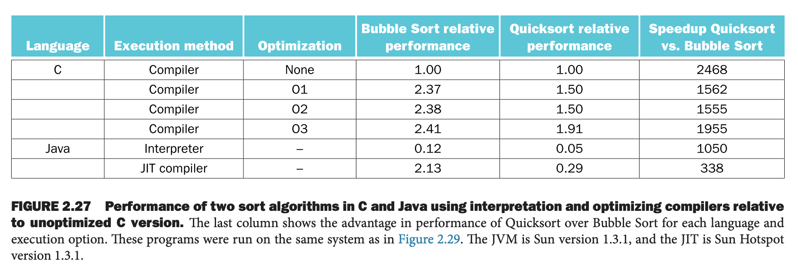

下面通过 `swap` 和 `sort` 两个例子将上述知识结合在一起。

### The Procedure `swap`
C 代码如下
```c
void swap(int v[], size_t k)
{
    int temp;
    tmmp = v[k];
    v[k] = v[k+1];
    v[k+1] = temp;
}
```

将 C 程序翻译成汇编代码分成下面三个步骤：
1. 为程序变量分配寄存器
2. 将函数体翻译成汇编代码
3. 维护保留寄存器的值

#### Register Allocation for `swap`
RISC-V 使用 `x10` 到 `x17` 传递参数，所以 `v, k` 分别在 `x10, x11` 中。程序只有一个临时变量 `temp`，由于是叶子函数，我们可以分配 `x5`。

#### Code for the Body of the Procedure `swap`
现在我们来处理函数体。

我们需要谨记，RISC-V 以字节为单位寻址，字占用 4 字节，所以需要把索引 `k` 乘以 4 来寻址。这也是写汇编常犯的错误之一。

通过将 `k` 左移两位得到乘以 4 的结果，然后计算出 `v[k]` 的地址。
```
slli x6, x11, 2     // reg x6 = k * 4
add x6, x10, x6     // reg x6 = v + (k * 4)
```
使用 `x6` 可以 `load` `v[k]`，将 `x6` 加四可以 `load` `v[k+1]`。
```
lw x5, 0(x6)    // reg x5 (temp) = v[k]
lw x7, 4(x6)    // reg x7 = v[k + 1]
                // refers to next element of v
```
接着交换地址。
```
sw x7, 0(x6)    // v[k] = reg x7
sw x5, 4(x6)    // v[k+1] = reg x5 (temp)
```
由于是叶子节点，且没有使用需要维护的寄存器，这里不需要恢复寄存器的值。

#### The Full `swap` Procedure
下面是完整的代码。添加了 `swap` 标签和返回语句。
```
swap:
  slli x6, x11, 2   // reg x6 = k * 4
  add x6, x10, x6   // reg x6 = v + (k * 4)
  lw x5, 0(x6)      // reg x5 (temp) = v[k]
  lw x7, 4(x6)      // reg x7 = v[k + 1]
  sw x7, 0(x6)      // v[k] = reg x7
  sw x5, 4(x6)      // v[k+1] = reg x5 (temp)
  jalr x0, 0(x1)    // return to calling routine
```

### The Procedure `sort`
这个一个更复杂的例子，并且调用了上面的 `swap` 过程。这里使用冒泡排序，不高效，但是是最简单的排序算法。C 代码如下
```c
void sort(int v[], size_t n)
{
    size_t i, j;
    for (i = 0; i < n; i+=1) {
        for (j = i - 1; j >=0 && v[j] > v[j+1]; j-=1) {
            swap(v, j);
        }
    }
}
```

#### Register Allocation for `sort`
`sort` 的两个参数 `v, n` 位于 `x10, x11`。需要两个临时变量 `i, j`，我们分配寄存器 `x19, x20`。

#### Code for the Body of the Procedure `sort`
程序包含两层 `for` 循环，并且调用 `swap`。

我们首先层外层 `for` 循环
```c
for (i = 0; i < n; i += 1) {
```

`for` 语句内第一个语句是初始化变量 `i`
```
addi x19, x0, 0
```
最后一个语句是自增 `i`
```
addi x19, x19, 1 // i += 1
```
当 `i < n` 不满足时循环退出，也可以说是 `i>=n` 时循环退出
```
for1tst:
  bge x19, x11, exit1 // go to exit1 if x19 >= x1 (i>=n)
```
循环体的最后是跳回循环开始和退出标签
```
  jal, x0 for1tst // branch to test of outer loop
exit1:
```

所以第一个 `for` 循环的框架代码如下
```
  addi x19, x0, 0       // i = 0
for1tst:
  bge x19, x11, exit1   // go to exit1 if x19 >= x1 (i>=n)
  (body of first for loop)
  addi x19, x19, 1      // i += 1
  jal, x0 for1tst       // branch to test of outer loop
exit1:
```

下面处理第二个 `for` 循环。
```c
for (j = i – 1; j >= 0 && v[j] > v[j + 1]; j -= 1) {
```
首先，是初始化语句和自增语句
```
addi x20, x19, -1 // j = i – 1

addi x20, x20, -1 // j -= 1
```
`for` 的判断失败，则跳出循环。第一个条件时 `j<0` 时跳出
```
for2tst:
  blt x20, x0, exit2 // go to exit2 if x20 < 0 (j < 0)
```
如果这个检测失败，忽略第二个 `bool` 条件直接跳出。如果没有跳转，那么检查第二个条件 `v[j] > v[j + 1]`，如果是 `false` 则跳出循环。这里和之前一样，`j` 乘以四之后加上基地址得到 `v[j]` 的地址。
```
slli x5, x20, 2 // reg x5 = j * 4
add x5, x10, x5 // reg x5 = v + (j * 4)
```
加载 `v[j]`
```
lw x6, 0(x5) // reg x6 = v[j]
```
我们还需要加载紧跟着的 `v[j+1]`
```
lw x7, 4(x5) // reg x7 = v[j + 1]
```
如果 `v[j] <= v[j+1]` 的话，跳出循环
```
ble x6, x7, exit2 // go to exit2 if x6 ≤ x7
```
循环最后也要有一句跳转回循环开始的语句
```
jal, x0 for2tst // branch to test of inner loop
```
将这些片段组织在一起，我们得到了第二个 `for` 的框架代码
```
  addi x20, x19, -1   // j = i - 1
for2tst:
  blt x20, x0, exit2  // go to exit2 if x20 < 0 (j < 0)
  slli x5, x20, 2     // reg x5 = j * 4
  add x5, x10, x5     // reg x5 = v + (j * 4)
  lw x6, 0(x5)        // reg x6 = v[j]
  lw x7, 4(x5)        // reg x7 = v[j + 1]
  ble x6, x7, exit2   // go to exit2 if x6 ≤ x7
  (body of second for loop)
  addi x20, x20, -1   // j -= 1
  jal, x0 for2tst     // branch to test of inner loop
exit2:
```

### The Procedure Call in `sort`
下面处理最内层的语句
```c
swap(v,j);
```
非常简单
```
jal x1, swap
```

#### Passing Parameters in `sort`
传递给 `sort` 的参数存放在 `x10, x11`，而内部调用的 `swap` 也期望参数在这两个寄存器。一个解决办法是在将 `x10, x11` 的内存放到其他寄存器，调用 `swap` 之前，将 `swap` 需要的参数拷贝到 `x10, x11`。这比把这些值拷贝到栈上速度要快。

在 `sort` 开始时，我们把 `v, n` 放到其他寄存器，后续使用这两个变量的时候访问新的寄存器即可。
```
addi x21, x10, 0 // copy parameter x10 into x21
addi x22, x11, 0 // copy parameter x11 into x22
```

在调用 `swap` 之前，拷贝正确的参数。
```
addi x10, x21, 0 // first swap parameter is v
addi x11, x20, 0 // second swap parameter is j
```

#### Preserving Registers in `sort`
我们还需要保存和恢复寄存器的值。除了变量会用到的寄存器 `x19, x20` 和上面描述的保存参数的寄存器 `x21, x22` 之外，我们还需要保存返回地址 `x1` 的信息，因为 `sort` 里面会调用函数 `swap`。所以在函数开始时需要保存这些寄存器的值。
```c
addi sp, sp, -20  // make room on stack for 5 regs
sw x1, 16(sp)     // save x1 on stack
sw x22, 12(sp)    // save x22 on stack
sw x21, 8(sp)     // save x21 on stack
sw x20, 4(sp)     // save x20 on stack
sw x19, 0(sp)     // save x19 on stack
```
在函数尾部逆序回恢复寄存器的值，同时使用 `jalr` 返回。

#### The Full Procedure `sort`
```
  /*
   * Saving registers
   */
sort:
  addi sp, sp, -20 // make room on stack for 5 registers
  sw x1, 16(sp)    // save return address on stack
  sw x22, 12(sp)   // save x22 on stack
  sw x21, 8(sp)    // save x21 on stack
  sw x20, 4(sp)    // save x20 on stack
  sw x19, 0(sp)    // save x19 on stack

  /* 
   *Procedure body
   */
  // Move parameters
  addi x21, x10, 0 // copy parameter x10 into x21
  addi x22, x11, 0 // copy parameter x11 into x22

  // Outer loop
  addi x19,x0, 0        // i = 0
for1tst:
  bge x19, x22, exit1   // go to exit1 if i >= n 

  //Inner loop
  addi x20, x19, -1     // j = i - 1
for2tst:
  blt x20, x0, exit2    // go to exit2 if j < 0
  slli x5, x20, 2       // x5 = j * 4
  add x5, x21, x5       // x5 = v + (j * 4)
  lw x6, 0(x5)          // x6 = v[j]
  lw x7, 4(x5)          // x7 = v[j + 1]
  ble x6, x7, exit2     // go to exit2 if x6 < x7

  //Pass parameters and call
  addi x10, x21, 0      // first swap parameter is v
  addi x11, x20, 0      // second swap parameter is j
  jal x1, swap          // call swap

  // Inner loop
  addi x20, x20, -1     // j -= 1
  jal, x0 for2tst       // go to for2tst

  // Outer loop
exit2:
  addi x19, x19, 1      // i += 1
  jal, x0 for1tst       // go to for1tst

  /*
   * Restoring registers
   */
exit1:
  lw x19, 0(sp)     // restore x19 from stack
  lw x20, 4(sp)     // restore x20 from stack
  lw x21, 8(sp)     // restore x21 from stack
  lw x22, 12(sp)    // restore x22 from stack
  lw x1, 16(sp)     // restore return address from stack
  addi sp, sp, 20   // restore stack pointer

  /*
   * Procedure return
   */
  jalr x0, 0(x1)    // return to calling routine 
```

使用内联（`inline`）可以优化上述代码，也就是把 `swap` 的代码直接写到调用的地方，而不是 `jal` 调用函数。这个例子中可以节省几条指令，速度能够更快。缺点是如果调用的地方非常多，那么代码会变多。如果这种膨胀导致缓存未命中增多，那么性能反而会下降。

下面这个图展示了编译器的优化会影响 `sort` 的性能、编译时间、指令数等等指标。注意，未优化的代码有最好的 CPI，O1 优化的指令数最少，但是 O3 优化的最快。这再次提醒我们，使用耗时来评估性能，其他单一指标都不足以表示性能。



下表对比了不同语言、编译器和解释器之间的差距。Java 解释器的性能比无优化的 C 程序性能还慢八倍多。不过有了 JIT 的优化，非常接近最高优化级别的 C 程序了，耗时是 1.13 倍。不过对于快排，JIT 的优化能力就不足够了，大约是无优化 C 程序的三倍速度。最后一列展示了算法的威力，排序 100,000 个数，有三个数量级的提升。快排中最慢的 Java 解释器性能也比最好的冒泡排序的 C 程序还快 123 倍！


