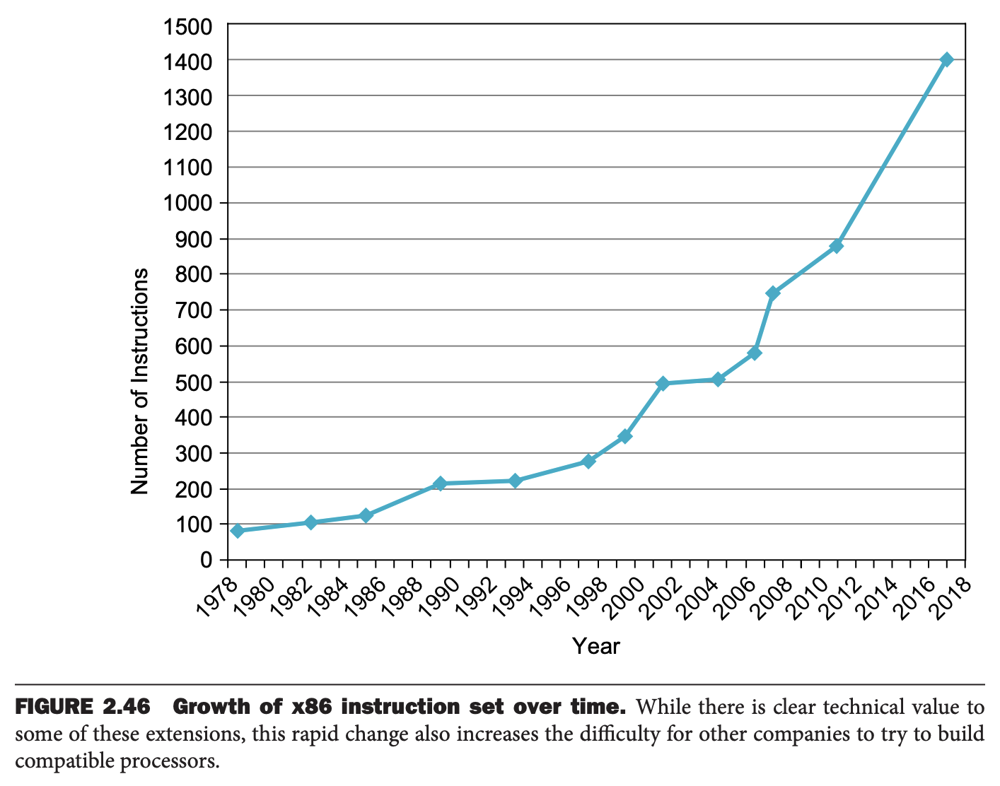

*Fallacy: More powerful instructions mean higher performance.*

*谬论：更强的指令意味着更好的性能。*

Intel x86 的部分功能是可以修改接下来的指令的执行的前缀。一个前缀可以重复后续指令，直到计数器减至 0。因此，要在内存中移动数据，自然的指令序列似乎是使用带有重复前缀的 move 来执行 32 位内存到内存的移动。

另一种方法事使用所有计算机中都有的标准指令，即将数据加载到寄存器中，然后将寄存器存回内存。第二个版本是通过复制代码来减少循环开销，复制速度大约是原来的 1.5 倍。 第三个版本使用更大的浮点寄存器而不是 x86 的整数寄存器，复制速度约为复杂移动指令的 2.0 倍。

*Fallacy: Write in assembly language to obtain the highest performance.*

*谬论：直接写汇编能获得最好的性能。*

曾经，编程语言的编译器生成简单的指令序列，但是编译器的日益复杂，这意味着编译代码和手写的汇编代码之间的差距正在快速缩小。事实上，为了与当前的编译器竞争，汇编语言程序员需要彻底理解第 4 章和第 5 章中的概念（处理器流水线和内存层次结构）。

编译器已经慢慢战胜了人们直接编写汇编语言例如，C 程序员可以向编译器提示哪些变量应保留在寄存器中，哪些变量应溢出到内存中。当编译器不擅长寄存器分配时，此类提示对于性能至关重要。事实上，一些旧的 C 教科书花了相当多的时间给出有效使用寄存器提示的示例。但是，今天的 C 编译器通常会忽略这些提示，因为编译器在分配方面比程序员做得更好。

即使手写汇编更快，那么编写和 debug 所需要的时间也要长很多，而且可移植性和可维护性变差。还有一个问题是，代码写好之后，可能会变得很流行，这样的话，生存周期可能要比想象的长很多。那么就需要不停的维护以适应更新的操作系统和硬件。写高级语言，这样编译器可以使之运行在更新的硬件上，更容易维护，使之更容易运行在更多指令集硬件上。

*Fallacy: The importance of commercial binary compatibility means successful instruction sets don't change.*

*谬论：商业软件兼容性意味着成功的指令集不会变化。*

向后兼容很重要，但是下图展示了 x86 指令集在过去四十年中增加了很多指令，平均一个月增加一个多指令呢！

*Pitfall: Forgetting that sequential word addresses in machines with byte addressing do not differ by one.*

*陷阱：忘记了在具有字节寻址的机器中顺序字地址差距不是一。*

很多汇编程序员写寻找下一个字的地址是将寄存器中的值加一，而不是字的长度，这是常见错误！

*Pitfall: Using a pointer to an automatic variable outside its defining procedure.*

*陷阱：在函数之外使用指向自动变量的指针。*

一个常见的错误是函数返回指向本地数组，一个自动变量，的指针。当函数返回之后，随着后续代码的执行，指针指向的位置很快会被复用，这样会读到不可预期的数据，或者修改到其他变量的内存。
