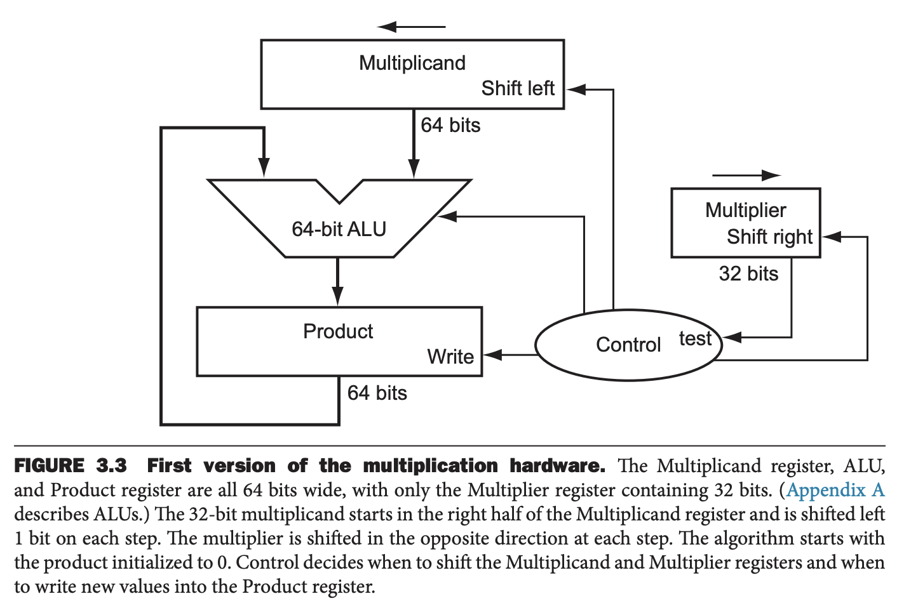
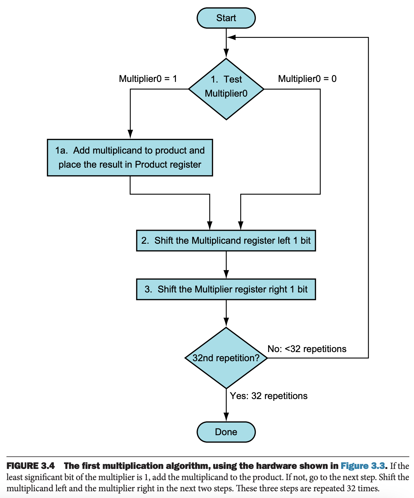
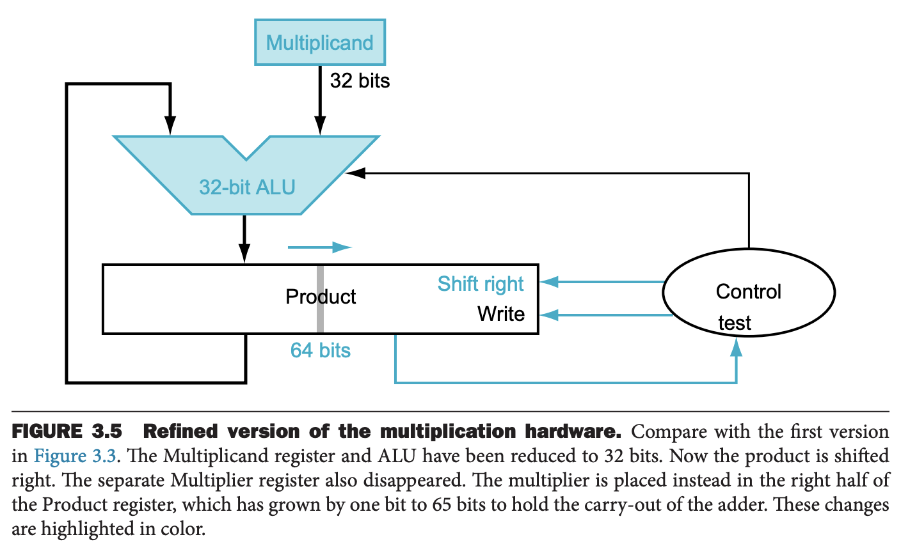
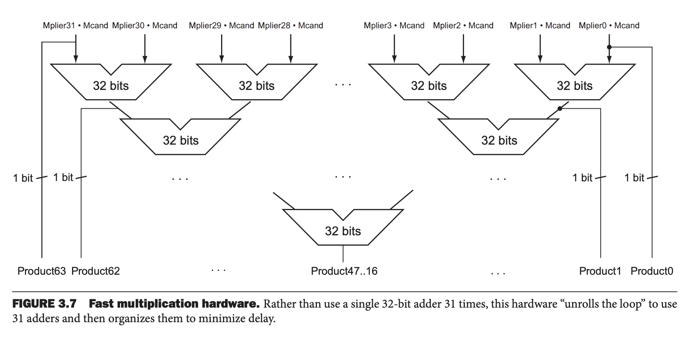

首先，我们来看一下手算乘法。
```
        1000
        1001
        ----
        1000
       0000
      0000
     1000
     -------
     1001000
```
第一个操作数称为被乘数（`multiplicand`），第二个操作数称为乘数（`multiplier`），最后结果是乘积（`product`）。

乘积可能比被乘数和乘数都要打。不考虑符号位的情况下，如果被乘数有 $n$ 比特，乘数有 $m$ 比特，那么总共需要 $n+m$ 来存储乘积。由于通常情况下，我们使用 32 比特来存储两个 32 比特数的乘积，因此类似于加法，需要考虑溢出的情况。

下面会打破传统的算法，阐述乘法算法和硬件的演进。

### Sequential Version of the Multiplication Algorithm and Hardware
模拟手算，我们可以设计出如下硬件。



乘数是 32 比特寄存器，乘积是 64 寄存器，初始值是零。被乘数需要左移然后和乘积相加，一个 32 比特数左移 32 次，所以使用 64 比特寄存器存放被乘数，右 32 比特初始化成被乘数，左 32 比特初始化成零。每次左移一位，和手算一样，这样才和要加的乘积对齐。

下图展示了对于每个比特来说最主要的三个步骤。



第一步是判断乘数最低位，确定是否要把被乘数加到乘积上。第二步就是左右被乘数，和手算算法一致。第三步右移乘数，使得下一次迭代检查下一个比特。这三个步骤需要循环 32 次。如果每一步花费一个时钟周期，计算 32 比特乘法大致需要 200 个时钟周期。根据程序不同，乘法的重要性是不同的，不过一般而言加减法是乘法的 5 倍到 100 倍。所以乘法多花费一点时间对于程序的性能影响不大。根据 Amdahl 定理，低频的慢的操作也可能会限制程序的性能。

一个优化是当乘积加被乘数的时候，被乘数和乘数同时移位。此时硬件只需要保证测试的乘数的比特是移位之前的即可。新的设计如下图所示。被乘数和加法器的比特数都缩小了一倍。乘积使用 64 比特，低 32 比特是乘数，高 32 比特初始值是零，被加数。移动乘积等价于同时移动了被乘数和乘数。



由于移位比乘法快很多，所以编译器会优化一个数乘以一个常数，如果其是 2 的幂次，可以优化成一次移位操作，如果是很小的数，也可以优化成几个移位操作和加法操作。

### Signed Multiplication
如果是有符号数如何处理呢？一个直接的方式是先处理 31 比特，然后根据乘法规则，如果两个操作数符号不同，修改成符号位。

其实上述算法可以处理有符号数，因为正在处理的可以有无数个数字，而这里仅仅使用 32 比特表示罢了。当移动乘积的时候，填充符号位即可，当乘法结束的时候，低 32 比特就是结果。

### Faster Multiplication
摩尔定律使得我们可以有更多的资源可以用，那么可以构建更快的乘法硬件。乘数的 32 比特就确定了被乘数是否要被加到乘积上。对于每一个比特都提供一个 32 比特加法器：一个操作数是被乘数与上乘数对应比特位，另一个操作数是先前的加法器的结果。

一个直观的方式是右边的加法器的输出连接到左边加法器的输入，得到一叠 64 位加法器。或者如下图所示放这些加法器，并行的执行，这样只需要 $\log_2 32=5$ 次加法的时间就能完成。



流水线思想可以是乘法同时执行，那么速递比六倍加法速度更快。

### Multiply in RISC-V
为了得到合适的 64 比特无符号数或者有符号数，RISC-V 提供了四种乘法指令：乘法 `mul`（multiply），有符号乘法高位 `mulh`（multiply high），无符号乘法高位 `mulhu`（multiply high unsigned），一个数有符号一个无符号乘法高位 `mulhsu`（multiply high signed-unsigned）。

获取高位可以检查 32 比特乘法是否溢出。对于无符号乘法，高 32 比特，即 `mulhu` 的结果为零表示没有溢出；对于有符号乘法，`mulh` 的比特都是 `mul` 的符号位，那么没有溢出。
