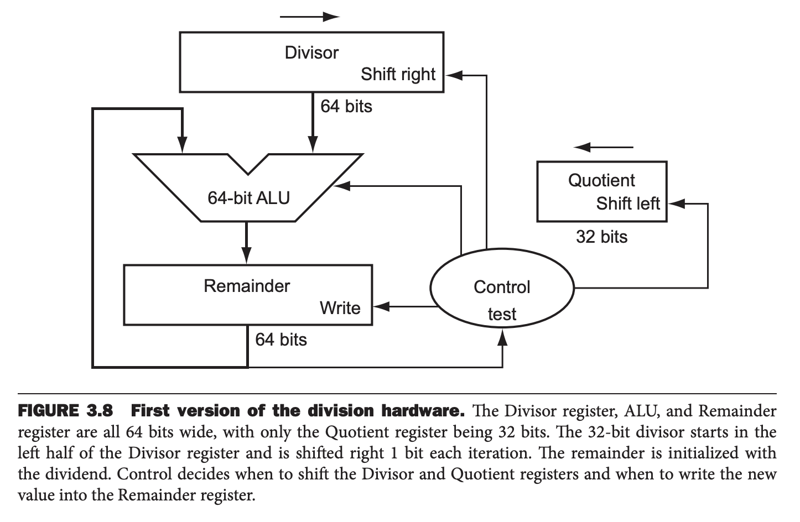
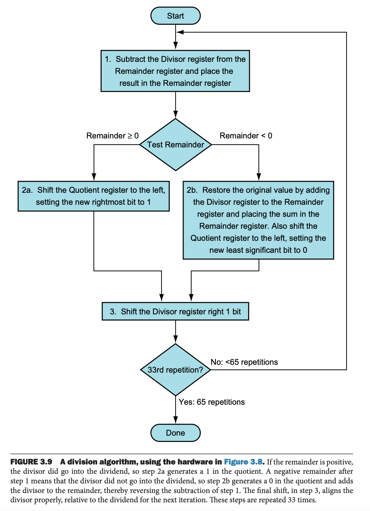
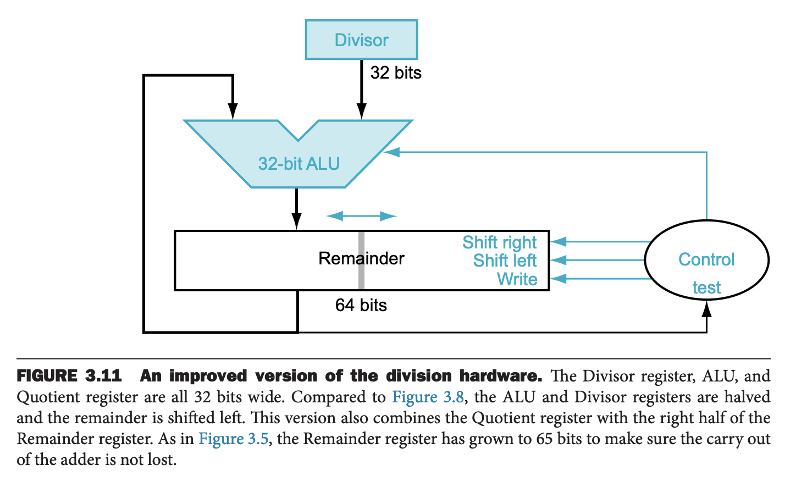

除法是乘法的逆运算，使用频率更低，同时有一个限制：不能除以零。

和之前小节一样，我们先模拟手算。
```
          1001
     ---------
1000 | 1001010
      -1000
      --------
          10
          101
          1010
         -1000
         -----
            10
```

除法的两个操作数称为被除数（`dividend`）和除数（`divisor`），结果称为商（`quotient`），伴随存在第二个结果称为余数（`remainder`），其小于除数。有时，程序使用除法指令获得余数而忽略商。

下面分析操作数都是 32 比特且都是整数的情况。

### A Division Algorithm and Hardware
下图模拟了上述的手算的算法。存放商的 32 比特初始化成零。每一次迭代，需要将除数向右移动一位，为了和被除数对齐，放到 64 比特寄存器的高 32 比特。余数寄存器初始化为被除数



计算机无法像人类一样直接看出来两个数哪个更大。所以第一步需要从余数中减去除数，如果结果是整数，除数小于等于余数，那么商 1，否则，把除数加回去，然后商 0。接着除数右移一位，开始下一次迭代。整个流程如下图所示。



和乘法类似，做减法的同时，移动除数和商，这样可以加速除法运算。这个修改使得除数寄存器和加法器的位数缩短了一倍。



### Signed Division
和乘法类似，最简单处理有符号数的方法就是当做正数处理，然后根据被除数和除数的符号，决定商是否需要修改符号位。

关于有符号数的除法，这里还有一个问题就是商是向零靠近还是向下靠近和余数的符号问题。为了让商能够直接添加符号位，这里采取余数和被除数使用同号的方式处理。比如
$$\begin{aligned}
7\div 2&=3,&&r=1\\
-7\div 2&=-3,&&r=-1\\
7\div -2&=-3,&&r=1\\
-7\div -2&=3,&&r=-1
\end{aligned}$$

### Faster Division
和乘法类似，摩尔定律也适用于除法，希望可以利用硬件加速除法。这里和乘法有一个不同，只有知道差值是正还是负，才能进行下一步操作。

这就需要一种技术，能够一步产生多个比特的商。SRT 除法每步预测若干比特的商，利用被除数和余数的高位进行表查询，同时依赖于后续步骤来纠正错误。这个典型值是 4。技术关键在于预测要减去的值，对于二进制除法，只有一种可能性。可以利用余数的 6 比特和除数的 4 比特建立索引表，确定每一步的猜测值。

这种快速方法的准确性取决于查找表中是否有正确的值。3.8 节中的谬误说明了如果表不正确会发生什么。

### Divide in RISC-V
乘法的硬件和除法的硬件基本一样，区别在于 64 比特的寄存器是左移还是右移，ALU 做加法还是减法。

RISC-V 为无符号数和有符号数提供了四个指令。`div`（`divide`，除）`divu`（`divide unsigned`，无符号除）`rem`（`remainder`，余数）`remu`（`remainder unsigned`，无符号余数）。

RISC-V 除法指令会忽略溢出，所以软件需要确定商是否太大了。除了溢出，除零也会有得到不正确的结果。一些计算机区分这两种异常情况。RISC-V 也需要软件自己判断是否除零了。
