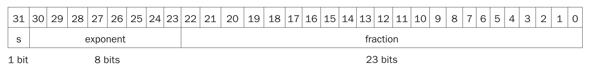
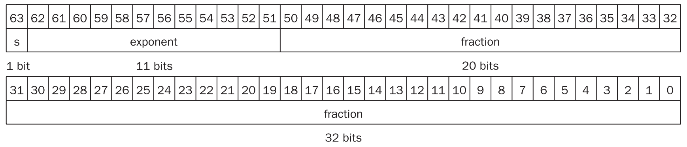
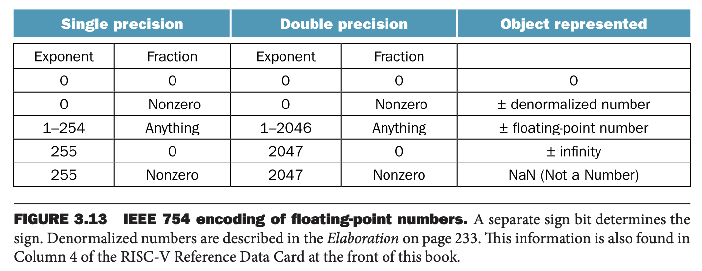
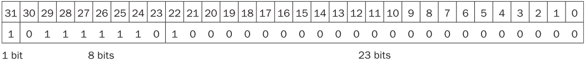
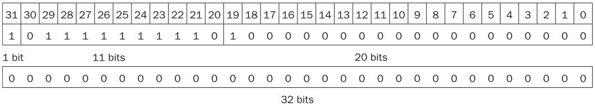
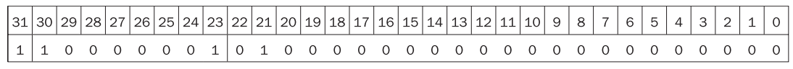
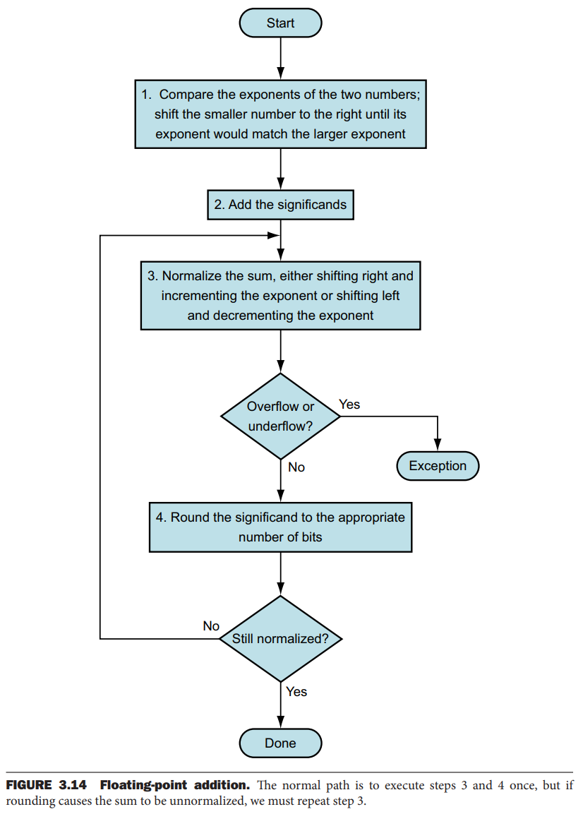
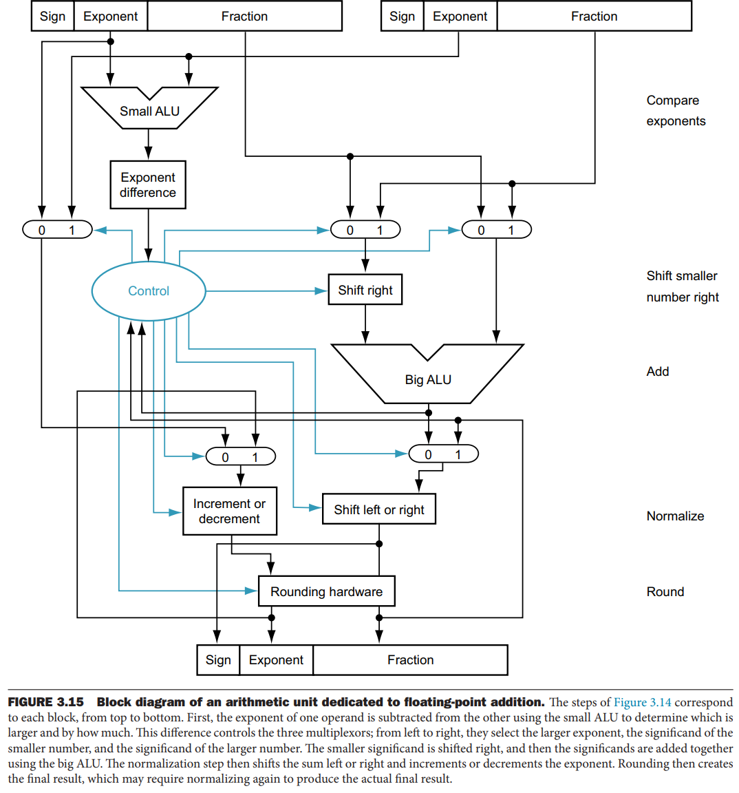
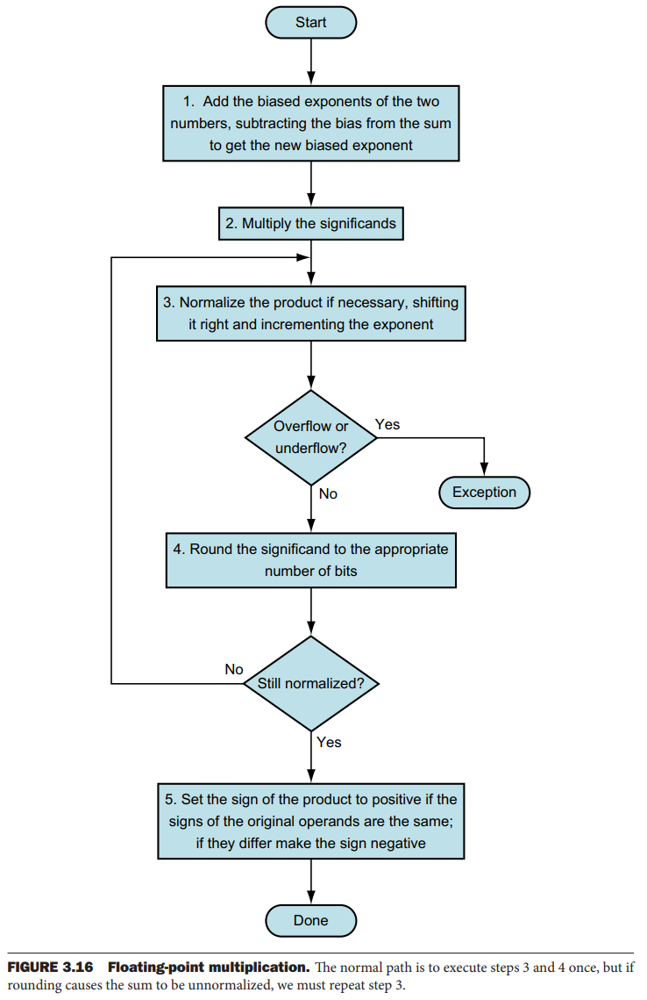

除了整数，编程语言还需要能够处理小数，数学中所说的实数。比如
$$\begin{aligned}
&3.14159265\ldots(\pi)\\
&2.71828\ldots(e)\\
&0.000000001, 1.0\times 10^{09}\\
&3,155,760,000,3.15576\times 10^9
\end{aligned}$$
第三个数表示一纳秒有多少秒，第四个数表示一个世纪有多少秒。最后一个数字不是小数，但是超过了 32 位比特能够表示的范围。

最后两个数字的第二种表示方法是科学计数法（`scientific notation`），小数点左表只有一个数字。使用科学计数法且不以零开头的数字称为标准形式（`normalized`），这种表示方式也很有用。$1.0\times 10^{-9}$ 是标准形式而 $0.1\times 10^{-8}$ 或 $10\times 10^{-10}$ 就不是标准形式。

二进制类似，以二为基底。

计算机中称为浮点数（`floating point`），因为当表示整数时小数点不固定。浮点数的二进制表示如下
$$1.xxxxxxxxx\times 2^{yyyy}$$
标准形式的好处有三：一个简化了涉及浮点数的数据交换，二是简化了浮点计算的算法，因为格式统一、一致，三是增加了能够表示的精度，因为不需要前面的无效的零。

### Floating-Point Representation
浮点数表示的设计者需要平衡小数（`fraction`）部分和指数（`exponent`）部分的大小，因为总长度是固定的。结果就是需要在精度（`precision`）和范围（`range`）之间取得平衡：增加小数部分的大小就是增加精度，相反增加指数部分的大小就是增加范围。

浮点数通常是字的若干倍。RISC-V 的浮点数表示如下所示。`s` 是符号位，1 表示负数，`exponent` 是指数部分，8 比特，`fraction` 是小数部分，23 比特。这种表示是符号和大小分离。



通常，浮点数的形式是
$$(-1)^S\times F\times 2^E$$
稍后会给出更精妙的设计和详细的解释。

这个选择使得浮点数能够表示的范围是相当大的，小到 $2.0\times 10^{-38}$，大到 $2.0\times 10^{38}$。表示的数字终究还是有范围的，因此，浮点数的运算和整数运算一样，会有溢出（`overflow`）的问题。

浮点数还一个特有的问题，就是一个非常非常小的非零小数，浮点数无法表示，这种情况称为下溢（`underflow`）。这种情况下，负指数绝对值太大而无法表示。

解决这些问题的一种方式是提供一种范围更大的浮点数表示。C 语言等很多语言都提供了两个字长度的浮点数，称为双精度（`double precision`），之前提到的浮点数格式称为单精度（`single precision`）。

RISC-V 提供双精度浮点数，格式如下图所示。指数部分有 11 比特，小数部分有 52 比特。



能够表示的范围就更大了，小到 $2.0\times 10^{-308}$ 大到 $2.0\times 10^{308}$。双精度不仅提高了范围，还提高了精度。

### Exceptions and Interrupts
当溢出或下溢发生的时候，如何让用户知道这个事情呢？有的计算机通过抛出异常（`exception`）给出信号，有时也称为中断（`interrupt`）。异常或者中断本质上是一个非计划中的过程调用（`procedure call`）。溢出指令的地址保存在寄存器中，计算机跳转到预先指定的地址调用合适的例程（`routine`）。中断地址也会被保存，这样某些情况下程序能够继续执行。4.9 节会给出异常的更多细节，第五章会描述更多发生异常的场景。RISC-V 在溢出或者下溢发生的时候抛出异常，软件需要读取浮点数状态寄存器（`floating-point control and status register`, `fcsr`）检查相关信息。

### IEEE 754 Floating-Point Standard
在上世纪 80 年代，浮点数标准（`IEEE 754 Floating-Point Standard`）被提出，这几乎和计算机同时诞生。这个标准提高了浮点数程序的可移植性和计算质量。

IEEE 754 标准将小数位前的 1 设计为隐式包含，所以单精度有效位数（`significand`）是 24 比特，双精度是 53 比特，比格式中小数部分的比特位多 1。

由于 0 没有前置的 1，所以使用指数和小数部分全零表示零。其他形式所表示的实数是
$$(-1)^S\times(1+F)\times 2^E$$
小数部分 $F$ 表示的值在 0 和 1 之间。

下图展示了 IEEE 754 标准编码的浮点数。一些特殊的符号表示特殊的事件。比如除零，得到的结果是 $\infty,-\infty$，此时指数最大。当打印的时候，会输出无穷（不是数学中的无穷概念）。



还有一些表示无效操作的结果，比如零除零或者无穷减无穷。符号是 NaN，Not a Number。这使得程序可以稍后对结果做测试并决定其行为。

IEEE 754 的一个设计目标是能够像整数比较一样很容易的比较两个浮点数。这就是为什么第一位是符号位，可以方便的和 0 进行比较。

指数放到小数部分的前面也是这个目的，如果符号位一样，那么指数大的数比指数小的数要大。

负指数的出现是一个挑战。如果使用补码或者其他最高位是 1 的编码表示负指数，那么看起来是一个很大的数。比如 $1.0\times 2^{-1}$ 的二进制表示是 `0 11111111 00000000000000000000000`。而 $1.0\times 2^1$ 的二进制表示是 `0 00000001 00000000000000000000000`。

因此，想要使用指数作比较，那么最小的负数应该用全零表示，最大的整数应该用全一表示。这称为移码（`biased notation`），从无符号数中减去偏移才是实际值。

IEEE 754 单精度数使用 127 作为移码的偏移，所以 -1 表示为 -1+127=126，二进制是 `0111 1110`，+1 表示为 1+127=128，二进制是 `1000 0000`。双精度使用 1023 作为移码的偏移。那么，IEEE 754 格式表示的实数是
$$(-1)^S\times(1+F)\times 2^{B}$$
因此单精度表示的范围是小到
$$\pm 1.00000000000000000000000\times 2^{-126}$$
大到
$$\pm 1.11111111111111111111111\times 2^{127}$$

后续的例子没有显示地标明进制，只有二进制和十进制，根据上下文判断即可。

#### Converting Decimal Floating Point to Binary
先看一个将十进制小数转成 IEEE 754 标准的浮点数的示例。

-0.75 可以写成是
$$-3/4=-3/(2^2)$$
分子二进制表示是
$$-11/2^2$$
使用科学计数法表示
$$-0.11/2^0$$
标准化表示为
$$-1.1/2^{-1}$$
单精度浮点数的格式是
$$(-1)^S\times(1+F)\times 2^{E-127}$$
所以
$$F=0.100\cdots,E=126$$
二进制是



双精度浮点数的格式是
$$(-1)^S\times(1+F)\times 2^{E-1023}$$
所以
$$F=0.10000\cdots,E=1022$$
二进制是



#### Converting Binary to Decimal Floating Point
现在看一个相反的例子。下图的单精度浮点数表示多少？



符号位是 1，指数是 129，减去偏移码 127 是 2，小数部分是 0.01，十进制的 1/4，所以这个浮点数表示的十进制数是
$$-1\times (1.25)\times 2^2=-5.0$$

下面会阐述浮点数的加法和乘法，对于有效数字部分而言，使用整数操作，额外处理指数部分并且标准化。

二十多年后，标准委员会提出了 IEEE 754-2008 标准，与 IEEE 754-1985 相比，增加了 16 比特和 128 比特的浮点数。前者指数是 5 比特，偏移码 是 15，10 比特小数部分。后者指数是 15 比特，偏移码是 262143，112 比特小数部分。

### Floating-Point Addition
浮点数的加法如下图所示。我们通过一个示例来讲解各个步骤。



使用二进制的加法对十进制小数 0.5 和 -0.4375 做加法。

首先，我们转成二进制的标准格式。假定我们只有四位精度。

$$0.5=1/2=0.1=0.1\times 2^0=1.000\times 2^{-1}$$
$$-0.4375=-7/16=-7/2^4=-0.0111\times 2^0=-1.110\times 2^{-2}$$

第一步，指数更小的向大的看齐，所以
$$-1.110\times 2^{-2}=-0.111\times 2^{-1}$$

第二步，有效位数相加
$$1.000+(-0.111)=0.001$$

第三步，标准化和
$$0.001\times 2^{-1}=1.000\times 2^{-4}$$

-4 介于 -126 和 127 之间，即 -4+127=123 在 1 到 254 之间，没有上溢或者下溢。

注意，指数全零或者全一有特殊含义。

第四步，四舍五入，精度是四位，这一步不需要。

将答案转化回十进制
$$1.000\times 2^{-4}=1/16=0.0625$$
是 0.5 和 -0.4375 之和。

硬件如下所示。



### Floating-Point Multiplication
浮点数的乘法算法如下图所示。



依旧使用上面的两个十进制数做乘法作为示例。

$$0.5=1/2=0.1=0.1\times 2^0=1.000\times 2^{-1}$$
$$-0.4375=-7/16=-7/2^4=-0.0111\times 2^0=-1.110\times 2^{-2}$$

第一步，指数相加。
$$-1+(-2)=-3$$
或者是使用偏移码表示
$$(-1+127)+(-3+127)-127=124$$

第二步，有效数字相乘。
```
        1.000
    x   1.110
    ---------
         0000
        1000
       1000
      1000
    ---------
      1110000
```
结果是 1.110000，乘以指数部分是 $1.110000\times 2^{-3}$，保留四位精度，结果是 $1.110\times 2^{-3}$。

第三步，标准化，这个乘法的结果恰好不需要处理。然后检查上溢和下溢，-3 介于 -126 和 127 之间，没有问题。

第四步，四舍不入。结果不变。

第五步，考虑符号位，两个乘数的符号不同，所以结果是负数。因此，最终结果是
$$-1.110\times 2^{-3}$$

转成十进制
$$-1.110\times 2^{-3}=111\times 2^{-5}=-7/32=-0.21875=0.5\times -0.4375$$

### Floating-Point Instructions in RISC-V
RISC-V 支持 IEEE 754 的单精度和双精度操作。指令以 `f` 开头，单精度后缀 `.s`，双精度后缀 `.d`。支持加 `add` 减 `sub` 乘 `mul` 除 `div`，还有开平方 `sqrt`，同时支持三种比较：等于 `eq` 小于 `lt` 小于等于 `le`。比如双精度乘法指令是 `fmul.d`，单精度等于指令是 `feq.s`。

`feq` `flt` `fle` 会把结果写到整数寄存器中，`false` 写 0，`true` 写 1。然后使用 `beq` 或 `bne` 进行跳转。

RISC-V 的设计者使用分离的浮点数寄存器，从 `f0` 到 `f31`。因此，需要专门的指令加载或存储浮点数。`fld` `fsd` 是双精度指令，`flw` `fsw` 是单精度指令。基地址偏移的寄存器仍旧使用整数寄存器。下面的指令是加载两个单精度浮点数，相加，然后写回内存。
```
flw f0, 0(x10)      // Load 32-bit F.P. number into f0
flw f1, 4(x10)      // Load 32-bit F.P. number into f1
fadd.s f2, f0, f1   // f2 = f0 + f1, single precision
fsw f2, 8(x10)      // Store 32-bit F.P. number from f2
```

单精度寄存器只是用双精度浮点寄存器的低一半比特。与整数寄存器 `x0` 不同，浮点寄存器的 `f0` 并不始终是常数 0。

浮点数的指令格式与整数指令格式一样，加载是 I 类型，存储是 S 类型，算数指令是 R 类型。

支持浮点算数的话，有一个需要考量的点：是否使用单独的寄存器。因为程序在不同的数据上进行整数和浮点数计算，所以寄存器分开会略微增加程序的指令数。主要影响是有不同的指令集在寄存器和内存之间传输数据。

好处是指令中无需增加寻址比特就能多一倍的寄存器可用，两倍带宽，并且能对浮点数做定制化。

#### Compiling a Floating-Point C Program into RISC-V Assembly Code
下面的代码将华氏度转化成摄氏度
```c
float f2c(float fahr)
{
    return ((5.0f / 9.0f) * (fahr - 32.0f));
}
```
假定参数 `fahr` 保存在寄存器 `f10` 中，最后结果也通过 `f10` 返回。

假定常量位于 `x3` 能够快速索引的内存中。首先，将常量 5.0 和 9.0 加载到寄存器中。
```
f2c:
  flw f0, const5(x3) // f0 = 5.0f
  flw f1, const9(x3) // f1 = 9.0f
```
接着做除法
```
fdiv.s f0, f0, f1 // f0 = 5.0f / 9.0f
```
很多编译器会在编译时处理常量的计算。下一步就是从 `fahr` 即 `f10` 寄存器中减去常量 32
```
flw f1, const32(x3) // f1 = 32.0f
fsub.s f10, f10, f1 // f10 = fahr - 32.0f
```
最后，两者相乘返回结果。
```
fmul.s f10, f0, f10   // f10 = (5.0f / 9.0f)*(fahr - 32.0f)
jalr x0, 0(x1)        // return
```

#### Compiling Floating-Point C Procedure with Two-Dimensional Matrices into RISC-V
下面是矩阵乘法的例子，假定 A B C 三个矩阵都是 32 乘 32 的矩阵。
```c
void mm(double c[][], double a[][], double b[][])
{
    size_t i, j, k;
    for (i = 0; i < 32; i = i + 1)
        for (j = 0; j < 32; j = j + 1)
            for (k = 0; k < 32; k = k + 1)
                c[i][j] = c[i][j] + a[i][k] * b[k][j];
}
```
假定三个数组参数的地址存在 `x10,x11,x12` 三个寄存器中，`i,j,k` 三个临时变量存在 `x5,x6,x7` 三个寄存器中。

注意到 `c[i][j]` 在最内层循环中使用，但是并不依赖于 `k`，那么没有必要每次都加载和存储 `c[i][j]`，而是在循环外加载到寄存器中，在寄存器中累加 `a[i][k], b[k][j]` 的乘积，在内层循环结束的时候写回内存即可。

函数体开始的时候将常量 32 写入到寄存器，并且初始化三个临时变量。
```
mm:
  addi x28, x0, 32    // x28 = 32 (row size/loop end)
  addi x5, x0, 0      // i = 0; initialize 1st for loop
  L1: addi x6, x0, 0  // j = 0; initialize 2nd for loop
  L2: addi x7, x0, 0  // k = 0; initialize 3rd for loop
```
为了计算 `c[i][j]` 的地址，需要知道 32 乘 32 的二维数组是如何存储的。二维数组可以看作是包含了 32 个一维数组，每个一维数组又有 32 个元素。那么现在访问的是第 `i` 个一维数组，即第 `i` 行。由于 32 是 2 的 5 次幂，所以可以使用移位获取地址。
```
slli x30, x5, 5 // x30 = i * 25(size of row of c)
```
再加上 `j`，访问第 `j` 个元素。
```
add x30, x30, x6 // x30 = i * size(row) + j
```
注意，这个只是偏移元素的个数，双精度每个元素占 8 个字节，那么偏移量还需要移动 3 位转化成字节偏移量
```
slli x30, x30, 3 // x30 = byte offset of [i][j]
```
有了偏移量，加上基地址位置，就得到了 `c[i][j]` 的地址，加载到 `f0` 中。
```
add x30, x10, x30   // x30 = byte address of c[i][j]
fld f0, 0(x30)      // f0 = 8 bytes of c[i][j]
```
下面是内层循环，将 `b[k][j]` 和 `a[i][k]` 加载到 `f1, f2` 中。
```
L3:
  slli x29, x7, 5     // x29 = k * 25 (size of row of b)
  add x29, x29, x6    // x29 = k * size(row) + j
  slli x29, x29, 3    // x29 = byte offset of [k][j]
  add x29, x12, x29   // x29 = byte address of b[k][j]
  fld f1, 0(x29)      // f1 = 8 bytes of b[k][j]

  slli x29, x5, 5     // x29 = i * 25(size of row of a)
  add x29, x29, x7    // x29 = i * size(row) + k
  slli x29, x29, 3    // x29 = byte offset of [i][k]
  add x29, x11, x29   // x29 = byte address of a[i][k]
  fld f2, 0(x29)      // f2 = a[i][k]
```
数据加载完毕。现在将 `f1, f2` 中的数据相乘，然后与 `f0` 中的数据相加。
```
fmul.d f1, f2, f1 // f1 = a[i][k] * b[k][j]
fadd.d f0, f0, f1 // f0 = c[i][j] + a[i][k] * b[k][j]
```
最后，自增 `k`，如果等于 32 了，那么退出循环，并将 `f0` 中的值写回 `c[i][j]`。
```
addi x7, x7, 1      // k = k + 1
bltu x7, x28, L3    // if (k < 32) go to L3
fsd f0, 0(x30)      // c[i][j] = f0
```
最后，自增 `j` 和 `i`，如果等于 32 了，退出对应的循环。
```
addi x6, x6, 1    // j = j + 1
bltu x6, x28, L2  // if (j < 32) go to L2
addi x5, x5, 1    // i = i + 1
bltu x5, x28, L1  // if (i < 32) go to L1
```

### Accurate Arithmetic
浮点数在任意区间，比如 1 和 2 之间有无穷多个，但是双精度浮点数只能精确表示其中的 $2^{53}$ 个，其余的数字只能近似表示。

四舍五入很简单，但是在计算过程中精确地四舍五入需要额外的硬件支持。在之前的例子中，中间结果被四舍五入了，那么最后就没有机会对结果进行精确地四舍五入了。IEEE 754 标准引入额外两个比特，`guard` 和 `round`，在计算过程中存储更多的信息。

#### Rounding with Guard Digits
计算 $2.56\times 10^0$ 和 $2.34\times 10^2$ 之和。假定我们有三位有效精度。下面使用 `guard` 计算结果，并与不使用 `guard` 时的结果进行比较。

首先，较小幂次的数的幂次向另一个数对齐，$2.56\times 10^0=0.0256\times 10^2$。那么 `guard` 比特可以存储 5，`round` 存储 6。
```
    2.3400
  + 0.0256
----------
    2.3656
```
和是 $2.3656\times 10^2$ 保持三位精度，那四舍五入结果是 $2.37\times 10^2$。

IEEE 754 规定了四种取整的方式：始终向上取整，始终向下取整，截断，和凑偶（四舍六入五凑偶）。

如果不使用 `guard` 比特的话，右移之后是 $0.02\times 10^2$，所以结果如下
```
    2.34
  + 0.03
--------
    2.37
```
和之前的结果相比，最低位差了 1。

`sticky` 比特使得计算结果看起来像是无限精度，它的作用是区别 $0.50\cdots 0$ 和 $0.50\cdots 1$ 两者，原理是这个比特记录被四舍五入的部分是否为零。

包括 RISC-V 在内的 CPU 都提供了一个涉及三个寄存器的指令：$a=a+(b\times c)$。很明显，一个指令比之前的两个指令更快。同时，只需要一次四舍五入，精度更高。这个指令称为 `fused multiply add`。
