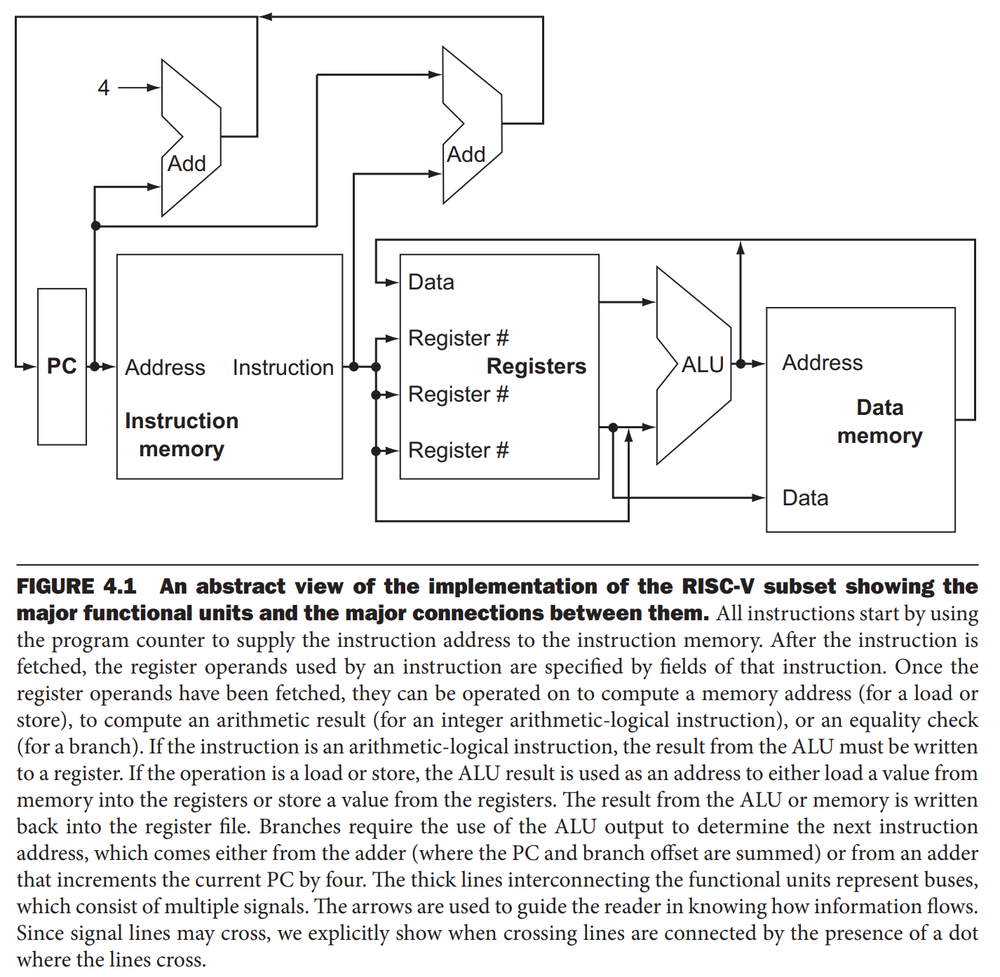
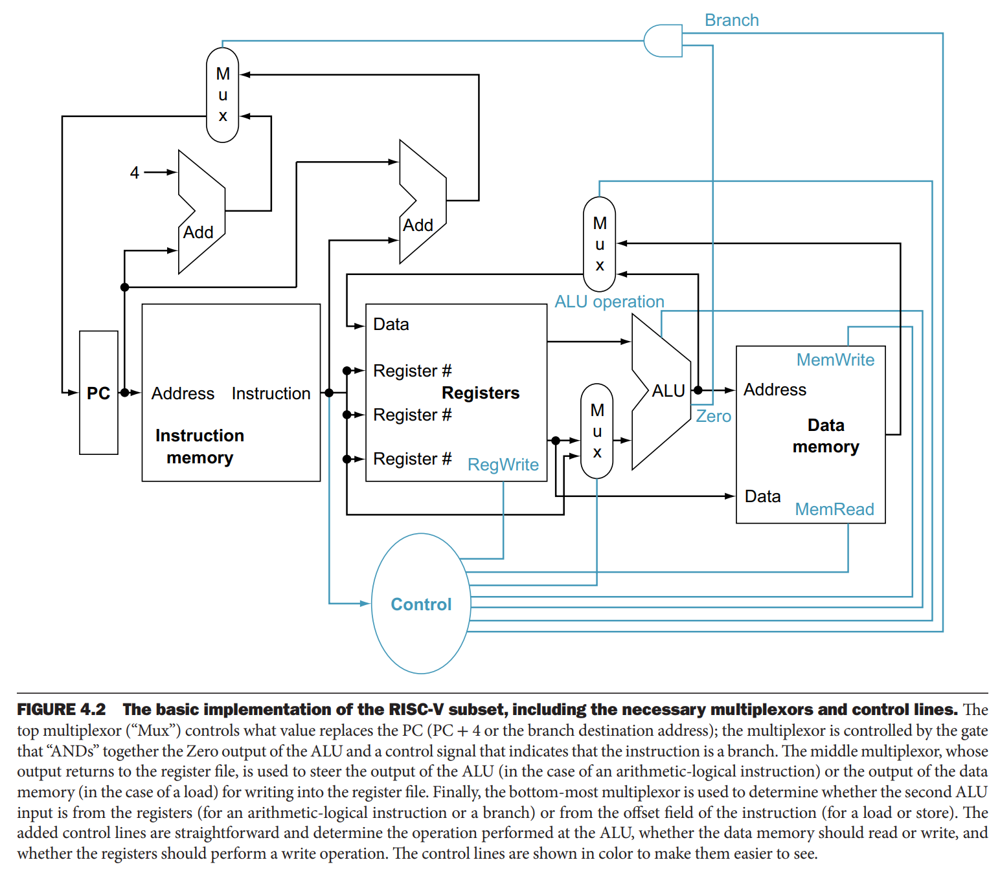

性能由指令数、时钟周期和每条指令周期数决定，而处理器的实现决定了后两者。这一章，我们为 RISC-V 指令集的两种实现构造数据通路（`datapath`）和控制单元（`control unit`）。

本章会阐述实现处理器的原则和技术，本节高度抽象并简化地概述整体。本章的大部分内容阐述更现实的流水线 RISC-V 实现。

### A Basic RISC-V Implementation
我们将会分析核心的几个 RISC-V 指令：
* 内存引用指令 `lw` 和 `sw`
* 算术逻辑指令 `add` `sub` `and` `or`
* 分支跳转指令 `beq`

这个子集没有包含所有的整数运算，也没有包含浮点数指令。但是可以用于解释构建数据通路和控制单元最核心的原则。

我们也有机会看到指令集决定了实现的很多方面，各种不同实现的选择会影响时钟周期和 CPI 每条指令周期数。还可以解释之前介绍的一些原则，比如简单有利于规律性。这一章描述的大部分原则适用于构造各种不同的处理器，比如高性能服务器、通用型处理器、嵌入式处理器等等。

### An Overview of the Implementation
实现这个指令的大部分工作都是一样的，和具体的指令无关。对于每条指令，前两步都是一样的：
1. 发送 PC 到包含代码的存储器中并从中读取指令；
2. 使用指令字段选择寄存器并读取，对于 `lw` 只需要读取一个寄存器，多数指令都需要读取两个寄存器内容。

之后的行为取决于指令类别，不过它们大差不差，都是类似的。RISC-V 指令集的简单性和规律性使得许多指令类的执行变得相似从而简化了实现。

比如，所有指令读取之后都需要使用 ALU。内存引用指令使用 ALU 计算地址，算术逻辑指令使用 ALU 做计算，跳转指令使用 ALU 做等值比较。之后，操作又各有不同。内存引用指令需要读或者写数据。算术逻辑指令和加载指令从 ALU 或者内存写某个数据到寄存器，跳转指令根据比较结果改写 PC 到下一个执行的指令地址或者自增四字节到下一行指令。

下图是一个概述，聚焦在各种功能单元和数据的流动。缺少两个方面。

第一个问题是不同的很多单元有不同的数据来源。比如 PC 中的数据可以来自于两个加法器中的一个，写入寄存器的数据可以来自 ALU 或者内存，ALU 的第二个操作数可以来自寄存器，也可以来自指令的立即域。实践中，这些线不能直接相交，需要选择一个来源。实现这个功能的组件称为多路复用器（`multiplexor`），可能更好称呼为数据选择器（`data selector`）。多路复用器基于控制线的设置选择一个来源，而控制线主要基于当前执行的指令来设置。

第二个忽略的点是很多单元依赖于指令类型来控制的。比如数据内存是读还是写依赖于指令是 load 还是 store。load 指令或者算术逻辑运算指令，寄存器必须被写。ALU 需要执行之前描述的几种运算中的一个。和多路复用器一样，控制器依赖于指令类型进行设置。

下面的图相比上面的图，添加了必要的三个多路复用器和以及也要控制主要功能单元的控制线。控制单元（`control unit`）的输入是指令，决定如何设置控制线，这会控制主要功能单元和两个多路复用器。顶部的多路复用器的输入是 ALU 对 `bnq` 指令的输出，以此确定是将 PC+4 还是分支跳转的地址写入 PC。RISC-V 的简单性和规律性使得解码的过程中就可以确定如何设置控制线。

