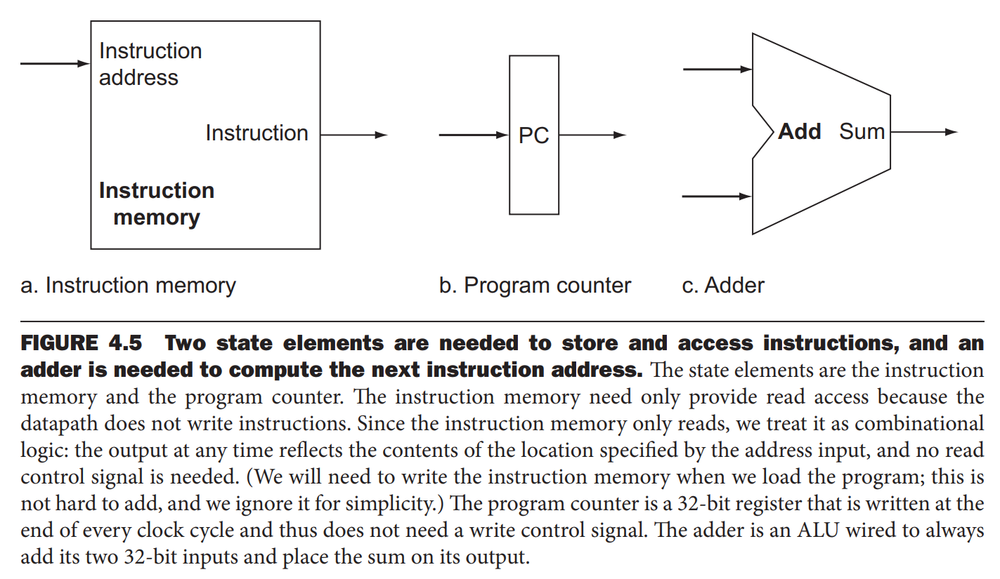
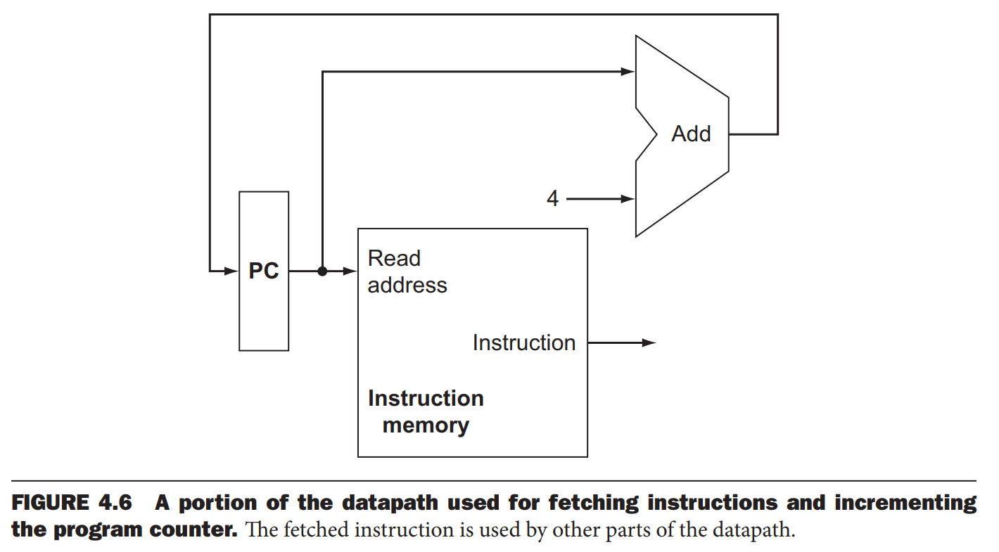
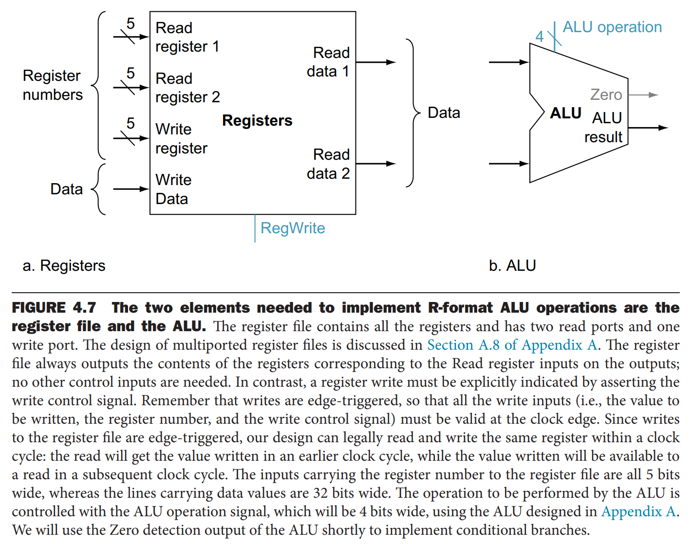
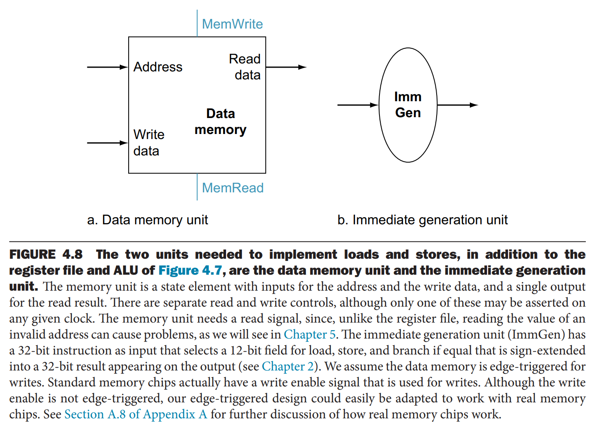
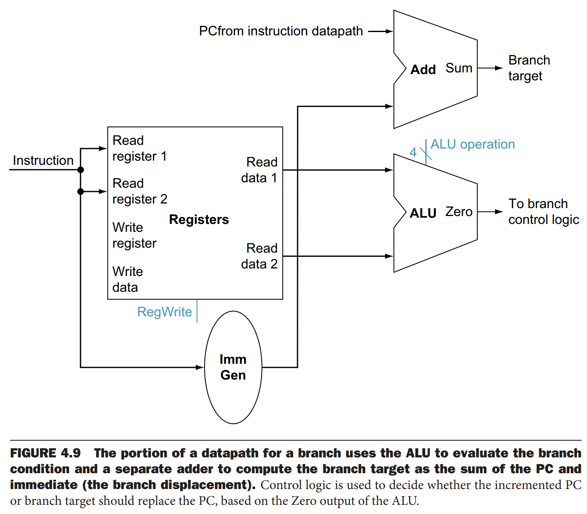
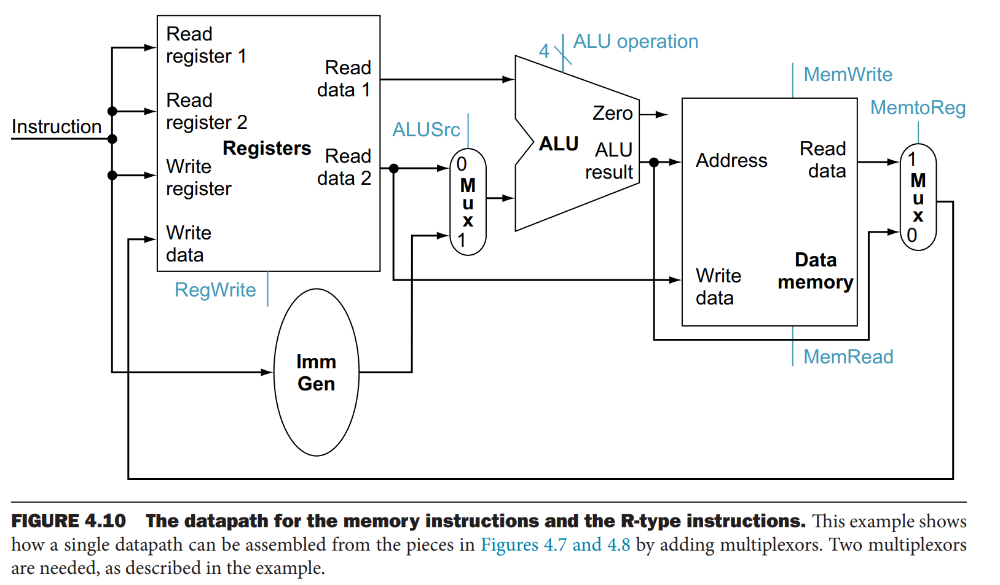
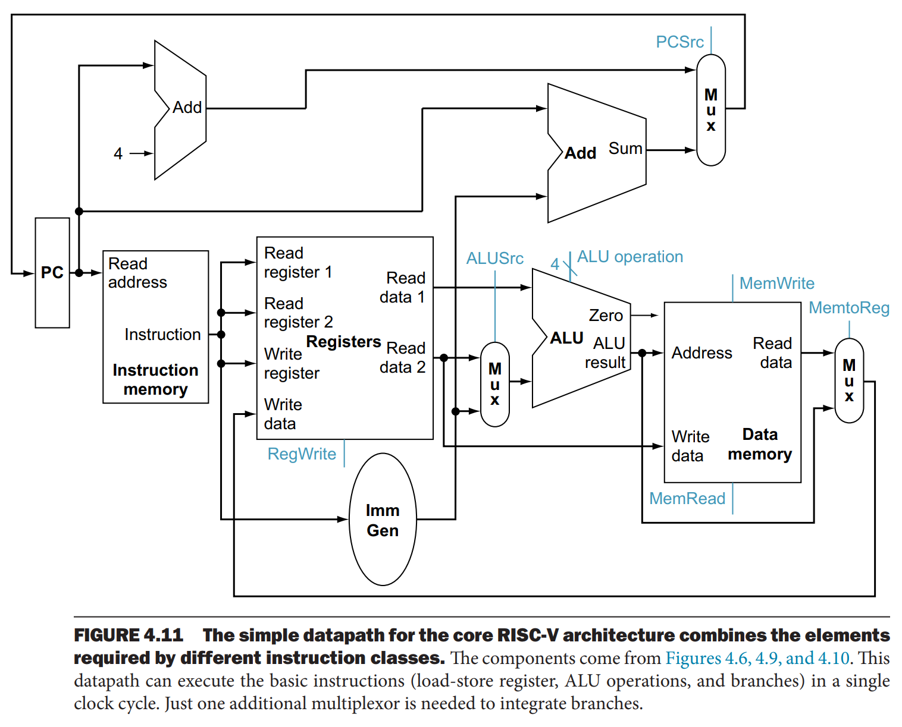

我们从各类 RISC-V 指令需要哪些元件着手设计数据通路。这里采用自顶向下设计方式。不仅会展示数据通路，还会展示相关的控制信号。

下图（a）是第一个需要的元件：一个内存单元，存放指令，给定一个地址能够返回对应指令。（b）是 PC（`program counter`），是存放当前要执行指令的地址。（c）是加法器，自增 PC 的地址到下一条指令的地址。加法器，是一个组合（`combinational`）元件。组合元件的输出只有输入决定，自身是无状态的。它本质上是一个 ALU，由控制线决定执行加法操作。打上 Add 的标签，表示这个 ALU 只能处理加法，不能处理其他运算了。

为了执行当前指令，必须从内存中取出该指令。为了能够执行下一条指令，需要对 PC 自增 4，到下一条指令地址。下图使用上图的元件组成了数据通路，执行上述操作。

下面考虑 R 类型指令。从两个寄存器中读取数据，ALU 执行某种操作，结果写到一个寄存器中。也称为算术逻辑指令（`R-type instructions` `arithmetic-logical instructions`）。这种指令包括 `add` `sub` `and` `or`。比如 `add x1 x2 x3` 是读取 `x2, x3` 中的数据，将和写入 `x1`。

处理器包含 32 个通用寄存器，这些寄存器的集合称为寄存器堆（`register file`）。我们可以从指定的寄存器中读取或写入数据。寄存器是状态元件。

R 类型指令涉及三个寄存器。对于读操作，输入是寄存器号（`register number`），表示从哪个寄存器中读数据，输出是寄存器中的数据。对于写操作，有两个输入，一个是寄存器号，另一个是要写入的数据本身，输出也还是数据自身。也就是说，寄存器堆总是输出指定的寄存器中的数据。写操作由写信号控制，只能发生在时钟信号边缘。下图（a）展示了这个过程。四个输入，两个指定读的寄存器号，一个写的寄存器号，还有数据本身。两个输出，是读取的内容。寄存器号的输入是 5 比特（$2%5=32$），其余的是 32 比特宽。

上图（b）是 ALU，输入和输出都是 32 比特宽，额外有一个 1 比特的信号，表示结果是否为零。额外有 4 比特控制信号。

下面考虑加载和存储指令。一般格式是 `lw x1 offset(x2)` `sw x1 offset(x2)`。这些指令通过计算 `x2` 中的基地址与指令中 12 比特的有符号 `offset` 之和得到内存地址。如果是存储指令，需要从寄存器堆中读取 `x1` 的数据。如果是加载指令，从内存中读取数据，写到寄存器堆的指定寄存器 `x1` 中。所以这些指令需要寄存器堆和 ALU。

此外，需要一个元件对 12 比特的 `offset` 做符号扩展（`sign-extend`），得到一个 32 比特有符号数，还需要一个数据内存元件。由于需要支持读写操作，该元件有读写控制信号，和两个输入：地址，要写入的数据。这两个元件如下图所示。

`beq` 有三个操作数，两个用于比较的寄存器，和 12 比特的 `offset`，用于计算相对于分支指令地址的分支目标地址（`branch target address`）。形式是 `beq x1 x2 offset`。为了实现这个指令，我们需要将 PC 存储的地址与 `offset` 符号扩展之后的数相加，得到分支目标地址。有两个细节需要注意：
* 基地址就是分支指令的地址。
* `offset` 需要左移一位，后面补零即可。然后与 PC 值相加。

我们还需要知道下一条指令是分支目标地址还是当前指令的下一条。如果两个寄存器内容相等，那么分支目标地址就是新的 PC 值；否则自增 PC 即可。

所以分支数据通路需要两个操作：计算分支目标地址和检测寄存器中的内容。下图是实现。

为了抽取指令中的 12 比特并符号扩展到 32 比特，需要一个立即数生成元件，还需要一个加法器计算分支目标地址。一个寄存器堆，从中读取两个寄存器的值比较大小。还需要一个 ALU 作比较。ALU 会输出一个信号，表示结果是否为零，那么控制设置成减法操作。如果信号是零，那么两个寄存器的值相等。这里，零信号仅用于测试条件分支。

#### Building a Datapath
R 类型指令（算术逻辑指令）和内存引用指令非常相似。主要差异是
* 算术逻辑指令中 ALU 的输入是两个寄存器，内存指令使用 ALU 计算地址，第二个输入是指令中的 12 比特。
* 算术逻辑指令中的目标寄存器的数据来自 ALU 的输出，加载指令中目标寄存器的数据来自内存。

那么使用一个寄存器堆、ALU 和几个多路复用器就能实现这两种指令了。如下图所示。

由于 ALU 的第二个操作数的来源不同，所以第二个输入之前需要一个多路复用器。写入目标寄存器的数据来源不同，所以写入数据之前也需要一个多路复用器。

### Creating a Single Datapath
现在，我们把上述实现都放到一个数据通路中，再加上一些控制器就好。最简单的数据通路需要在一个时钟周期执行完任意一条指令，所以使用一次以上的元件必须复制一份。比如放指令的内存和放数据的内存就需要分开，即两个。有一些元件重复了，但有些元件对不同指令而言是共享的。

对于共享的元件，或许需要接入多个输入，那么就需要添加多路复用器和控制信号。

下图将上述不同指令的数据通路实现组合到了一起。

分支指令使用主的 ALU 比较两个寄存器内容是否相等，那么就需要一个额外的加法器计算分支目标地址。相比之前的实现，添加了一个多路复用器，确定是将 PC + 4 还是分支目标地址写入 PC。
