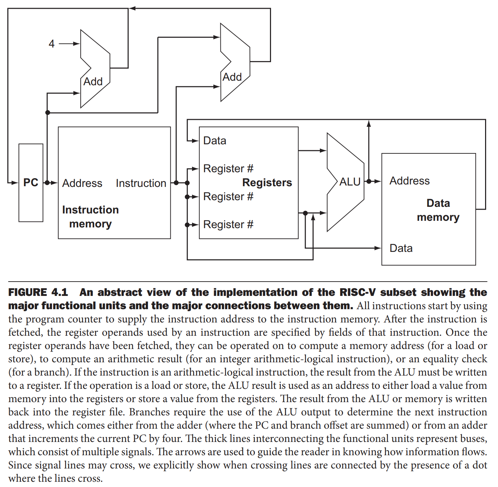
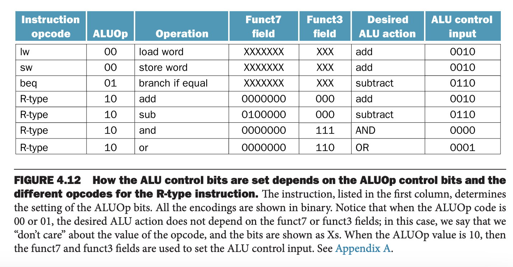
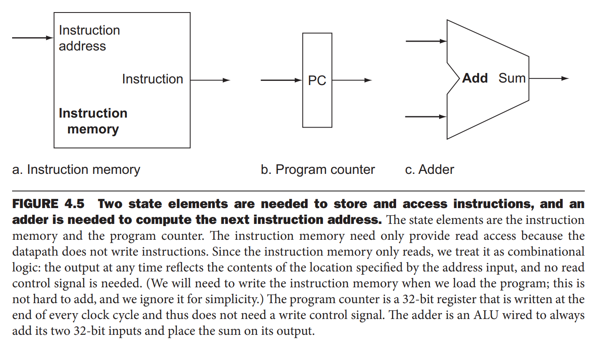
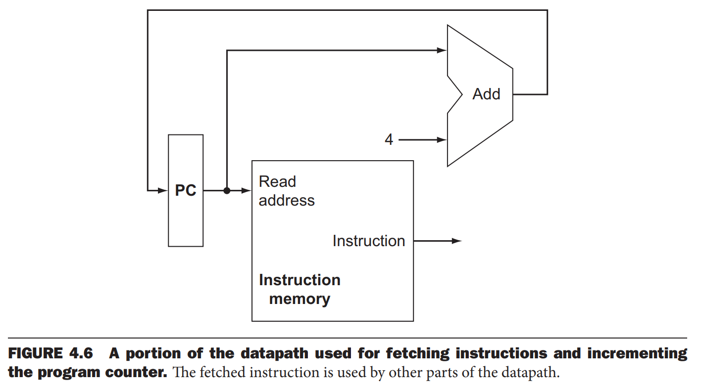
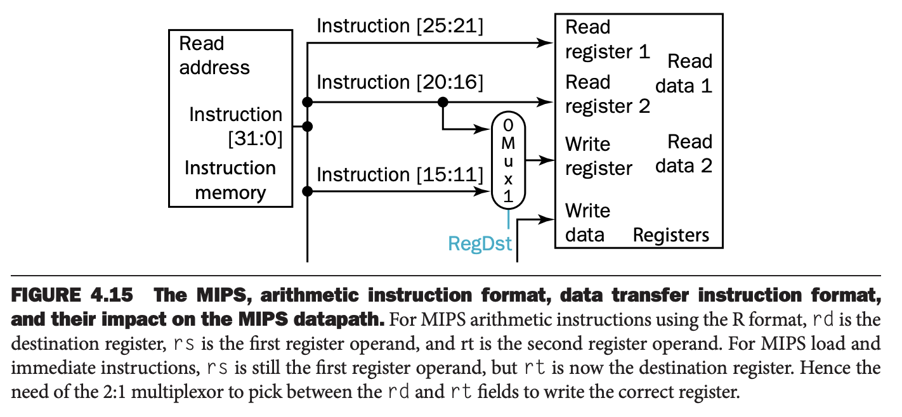
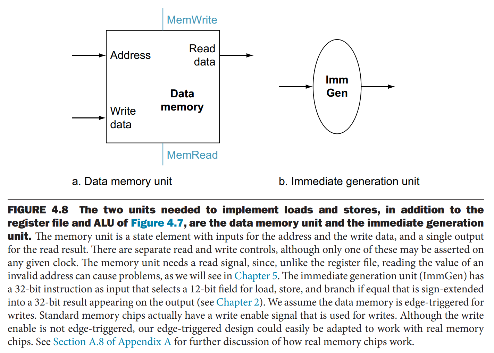
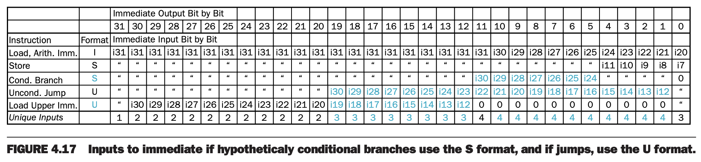
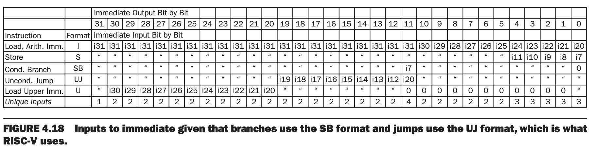
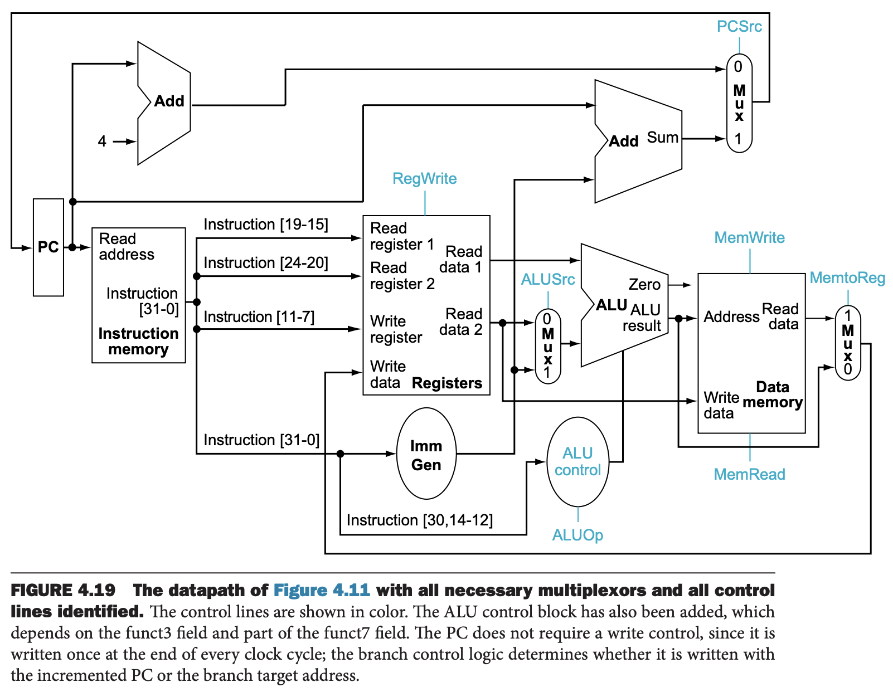
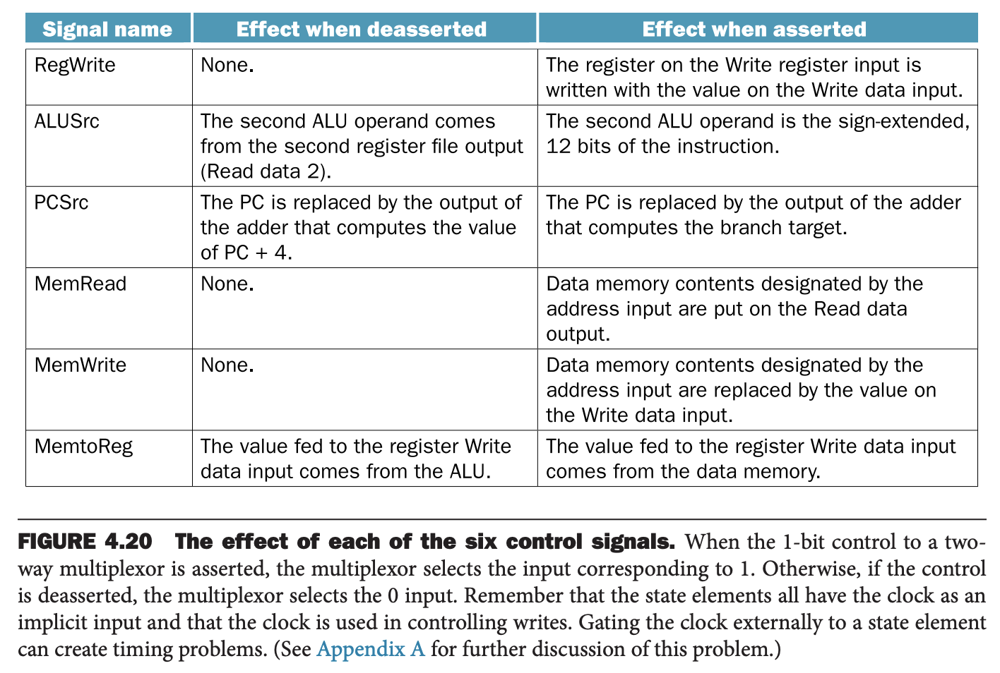

这一节我们会使用上一节的数据通路并添加一些简单的控制元件构建简单实现，这种简单实现将会覆盖 `lw` `sw` `beq` `add` `sub` `and` `or`。

### The ALU Control
RISC-V 的 ALU 有如下四种控制输入。根据指令分类，ALU 会执行四种功能中的一种。对于加载和存储指令，ALU 通过加法计算内存地址。对于 R 指令，ALU 会根据 7 bits funct7 字段（ bits 31:25）和 3 bits funct3 字段（bits 14:12）执行四种功能的一种。对于有条件的分支跳转，ALU 执行减法然后判断结果是否为零。

| ALU control lines | Function |
|--|--|
| 0000 | AND |
| 0001 | OR |
| 0010 | add |
| 0110 | subtract |

我们使用一个小型控制单元来生成 4 bits ALU 的输入，该控制单元的输入是 funct7、funct3 字段以及一个 2 bits 控制字段，这 2 bits 称之为 ALUOp。ALUOp 表示对于加载和存储指令要执行加法（00），对于 `beq` 做减法并判断是否为零（01），根据 funct7 和 funct3 字段决定操作（10）。ALU 的控制单元输出 4 bits 信号，如下面的表所示来控制 ALU。

下图展示了 ALUOp、funct7、funct3 是如何控制 ALU 的。

这种多级解码是一种常见实现技术，主控制单元生成 ALUOp，结合其他字段生成 ALU 控制信号，最终控制 ALU。多级设计可以减少主控制单元的大小，使用若干更小的控制单元可以减少控制单元的延迟。这种优化非常必要，因为控制单元的延迟往往决定了时钟周期。

有好几种方式实现 ALUOp 和 funct 字段到 4 bits ALU 控制比特的映射。因为只有当 ALUOp 是 10 时我们才需要关注 funct 字段，可以使用很少的逻辑就能识别可能得子集并生成适当的 ALU 控制信号。

作为设计逻辑的一步，一个有用的方式就是列一个真值表（`truth table`），将我们感兴趣的 ALUOp 和 funct 字段列出来。完整的真值表很大，但是幸好我们仅仅需要列出其中很小的一部分，将不感兴趣的部分都忽略掉。

不关心或者说不会影响真值表的项称为不关心项（`don't-care terms`），在下表中，使用 X 表示，表示最终结果不依赖于当前列。比如当 ALUOp 是 00 时，ALU 控制 bits 结果是 0010，与 fucnt 字段无关，那么后者就是不关心项。

一旦列出了真值表，那么就可以优化并设计门电路了。这些过程非常机械。

### Designing the Main Control Unit
现在，已经有了一个使用 funct 字段和 2 bits 控制信号作为输入的 ALU，接着看一下其他部分的设计。开始之前，我们先确定指令字段和上一节中图 4.11 数据通路所需要的控制线。要理解如何将指令的字段关联到数据通路，我们先回顾一下四种指令类别：算术、加载、存储、条件分支。如下图所示。

观察这些指令，我们可以得到如下结论：

1. opcode 字段，始终是 bits 6:0，对于不同的 opcode，funct3 和 funct7 字段是 opcode 的拓展。
2. 第一个操作数寄存器总是位于 bits 19:15，即 rs1。对于加载和存储指令，这个字段指定了基地址寄存器。
3. 第二个操作数寄存器总是位于 bits 14:20，即 rs2。对于存储指令，表示要被拷贝数据的寄存器。
4. 对于加载、存储、分支指令，其他操作数是 12 bits 的偏移量。
5. 目标寄存器总是 bits  11:7，即 rd。

第二章介绍的设计原则——简单有利于规律性——在这里也试用。

插播一段信息。与 MIPS 相比，RISC-V 指令格式看起来要复杂，但是实际上却简化了硬件。这能帮助提高一些 RISC-V 实现的时钟周期，特别是 4.6 节介绍的流水线版本。

下图是 MIPS 算术指令和数据转移指令的格式。

MIPS 需要一个 2:1 的多路复用器来指定哪些 bits 表示写数据的寄存器。这并不必要。多路复用起可能会使得时钟周期变长。

RISC-V 的寄存器地址始终不变，虽然格式有点奇怪，因为与 MIPS 相比立即数 bits 不连续，但是汇编器隐藏了这种复杂性，而使得硬件受益。

下一个例子就更奇怪了。下图是两种指令格式，SB 和 S，UJ 和 U，各个字段大小一样，但是立即数是两种不同的格式，bits 旋转了一下。

这样设计简化了硬件，但是汇编器需要做更多的事情。下图显示了不同指定下立即数的 bits。如果 SB 和 S 格式一样，UJ 和 U 格式一样，那么最后一行表示每个输出 bit 对应的唯一输入个数，而后者决定了多路复用器的端口数。

相应的，如果分开设计，那么能够减少多路复用器的端口数，对于 bits 19:12，从 3:1 减少到 2:1，bits 10:1 从 4:1 减少到 2:1。虽然看起来很奇怪，但是简化了 18 个多路复用器。对于高端处理器而言，这个节省没有差别，但是对于低端处理器而言却意义重大，不过重担转移给了汇编器。

接着继续数据通路。下图展示了如何添加 ALU 控制块、状态元件的写入信号、数据存储的读信号、多路复用器的控制信号。多路复用器有两个输入，每一个都需要一条控制线。

与 4.11 相比，这张图的主要修改在于中间底部的 ALU 控制单元，多路复用器对应的 0/1 输入信号，以及标识出了指令的 bits 范围。多路复用器的六个信号由淡蓝色字标识。下图描述了这六种控制线的功能。

