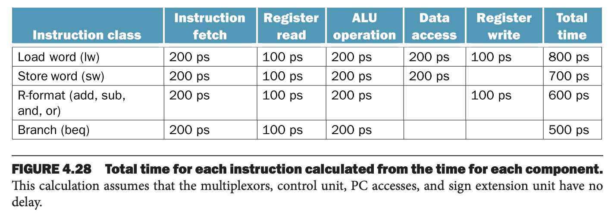

流水线（`pipelining`）是让多个指令重叠执行的技术。现在流水线技术相当普遍了。

首先看一个洗衣服的例子。假定整个过程分成下面四步：

1. 脏衣服放进洗衣机。
2. 洗好之后，湿衣服放进烘干机。
3. 烘干之后，叠衣服。
4. 叠好之后，通知室友取衣服。

非流水线模式是完成上面四步之后再从头开始。

流水线模式将会节省大量的时间。如下图所示。


一旦上一步骤完成之后，开始下一个步骤，同时继续做上一步的事情。比如烘干机烘干了衣物，取出衣物，叠衣服之前将洗衣机的湿衣服放入烘干机，下一批脏衣服放进洗衣机开始洗，同时还可以叠衣服。在这里，每一个步骤称为一个阶段（`stage`），可以并行执行。只要我们有分离的资源处理每一个阶段，那么就可以使用流水线。

流水线矛盾是说对于第一批脏衣物，从开始洗到最后取走，时间并没有变短。流水线更快的原因是每一件事并行工作了，所以每个小时可以完成更多的工作。流水线提高的是吞吐量（`throughput`）。流水线不能减少完成一批工作的时间，但是如果有很多批次的工作需要处理，那么提高吞吐量就会减少总的工作时间。

如果所有的阶段耗时一样，且有充分多的工作要处理，那么加速比等于流水线中的阶段数。这里有四个步骤，因此加速比是四倍。不过上图的加速比只有 2.3 倍，因为只有四个批次的工作。上图中，在开始和结束阶段，流水线不满；当任务数并没有比流水线阶段太大多的时候，开始和结束阶段会影响性能。如果充分大，那么流水线大部分时候都是满的，那么吞吐量的增加就会接近四倍。

类似的，可以让指令的执行水流线化。RISC-V 指令可以分成五个步骤：

1. 内存中取指令
2. 读寄存器并对指令解码
3. 执行操作或者计算地址
4. 访问数据内存（如果需要）
5. 将结果写会寄存器（如果需要）

因此，RISC-V 流水线有五个阶段。下面阐述流水线是如何加速指令执行的。

#### Single-Cycle versus Pipelined Performance
和之前讨论类似，我们仅关心下面七个指令：`lw` `sw` `beq` `add` `sub` `and` `or`。

假定操作时间如下：访问内存 200ps，ALU 执行 200 ps，读写寄存器 100ps。单周期模型下，所有指令耗时都是一个周期，所以周期必须能容纳最慢的指令。

下面是各个指令的耗时。



可见 `lw` 耗时最长，800ps。与之前洗衣示例图类似，下图展示了非流水线和流水线执行 3 个指令的耗时。第一个指令与第四个指令间隔是 2400ps。


流水线的每个阶段也必须是单一周期的，需要能够容纳最慢的操作。所以与单一周期指令类似，虽然最快的仅需要 500ps，但是时钟周期是 800ps，流水线中的周期必须是 200ps，虽然最短操作是 100ps。即使这样，3 条指令也有四倍性能提升，第一个指令与第四个指令间隔仅 600ps。

如果阶段非常平衡，理想状况下，加速比公式是
$$\text{Time between instructions}_{\text{pipelined}}=\frac{\text{Time between instructions}_{\text{non-pipelined}}}{\text{\# pipe stages}}$$

理想状态下并且有大量指令的情况下，加速比近似等于流水线阶段的个数，五个阶段的流水线能加速五倍。

根据上述公式，800ps 的指令能够提高到 160ps。不过这个例子中阶段不是平衡的。而且，流水线引入了一些额外开销。因此，流水线执行指令的时间比最小可能值要大一些，加速比小于流水线的阶段数。

不过，在这个例子中，应该有四倍的提升，但是上面的例子执行时间比是 1400ps 和 2400ps。这是因为指令数不足够大。假定我们再额外运行一百万个指令。对于流水线版本，每个指令额外需要 200ps，因此总时间是 200,001,400ps，而非流水线版本一个指令就要耗时 800ps，那么总时间是 800,002,400ps。那么时间比约等于 4.00。

流水线是通过增加指令的吞吐量而不是减少每个指令执行的时间，对于真实程序而言，执行数以亿计的指令，吞吐量是很重要的指标。

### Designing Instruction Sets for Pipelining
即使只简单解释流水线，也能使得我们深入了解 RISC-V 这种专门为流水线设计的指令集。

首先，指令长度一样。这种限制使得流水线第一阶段的取指令和第二阶段的解码都更容易。x86 系统指令长度从 1B 到 15B，流水线设计就更困难。现代实现是将 x86 指令翻译成类似 RISC-V 的简单操作，然后再对这些操作做流水线处理，而不是直接流水线处理原始指令。

第二，指令格式很少，源和目标寄存器使用在指令中相同的位置。

第三，RISC-V 中对内存操作只有加载和存储两种操作。这种限制使得我们能够在执行阶段计算内存地址然后再后续步骤访问内存。如果和 x86 一样能够操作内存中的值，那么阶段 3 和 4 就必须拆成地址、内存、执行三个阶段。后续将会解释长流水线的缺点。

### Pipeline Hazards
如果下一个时钟周期不能执行下一条指令，称之为冒险（`hazard`），这里采用了维基百科的术语。有三种冒险。

#### Structural Hazard
第一个是结构危险（`structural hazard`）。它的意思是在同一时钟周期内不能执行某种指令组合。在最早洗衣房的例子中，如果我们使用洗烘一体机，就无法将洗衣和烘衣服两个步骤分开，或者室友很忙无法取衣服。我们精心设计的流水线计划就会被打断。

如前所述，RISC-V 指令集被设计用于流水线，那么很容易避免结构危险。不过，我们只有一个内存，因为也还是有这种可能性的。比如图 4.29 中，如果有第四条指令，需要从内存中取指令，而第一条指令需要访问数据。没有两个内存，因此流水线就会遇到结构危险。

#### Data Hazards
如果一个步骤必须等待另一个步骤完成，那么称为数据冒险（`data hazard`）。

如果一条指令依赖于流水线中更早的一条指令，就会发生这种情况。比如一条减法指令需要使用之前的加法指令的结果。
```
add x19, x0, x1
sub x2, x19, x3
```
如果不干涉，就会遇到数据冒险。加法指令在第五阶段才写入数据，减法指令才能访问，因此浪费了三个时钟周期。

尽管我们可以依赖编译期消除这些冒险，但是结果总不能令人满意。这些依赖关系太常见了，延迟也太长，不能指望编译期能将我们从这种困境中解救出来。

主要的解决方法基于我们无需等待指令完成就可以尝试解决数据冒险。比如上面的例子，当 ALU 计算完加法结果之后，我们就可以将其作为减法的输入。添加额外硬件更早的获取缺失的数据，这种技术称为转发（`forwarding`）或旁路（`bypassing`）。

##### Forwarding with Two Instructions
下面阐述针对上面的两条命令，如何添加旁路使得两个指令能够更好的利用流水线。下图展示了第一条指令。


下图添加了旁路，当 `add` 指令的执行阶段完成之后，将 `x1` 的值转发作为 `sub` 指令的执行阶段的输入。


从上图可以看出来，旁路技术是有时序要求的。大部分时候能解决问题，但是不能解决所有问题。比如，假定上面的例子中，第一条指令是从 `x1` 加载数据的指令，那么直到第四个阶段从内存读完数之后，才能作为第二条指令的输入，但是此时已经无法将数据转发给 `sub` 指令的执行阶段了。想要使用转发，我们需要为加载数据冒险（`load-use data hazard`）停滞一个周期。这称为流水线停滞（` pipeline stall`），或者是流水线冒泡（`bubble`）。如下图所示。


##### Reordering Code to Avoid Pipeline Stalls
有如下 C 代码
```c
a = b + e;
c = b + f;
```
假定变量均在内存中，且从 `x31` 指向的地址开始偏移，那么生成的 RISC-V 代码是
```
lw x1, 0(x31)   // Load b
lw x2, 8(x31)   // Load e
add x3, x1, x2  // b + e
sw x3, 24(x31)  // Store a
ld x4, 16(x31)  // Load f
add x5, x1, x4  // b + f
sw x5, 32(x31)  // Store c
```
每一个 `add` 指令都依赖于之前的 `lw` 的指令。旁路技术可以消除第一个 `add` 与第一个 `lw` 之间的数据冒险，也能消除 `sw` 的数据冒险。但是无法消除 `add` 与紧接着的 `lw` 的数据冒险。如果如下调整代码顺序那么额外两个数据冒险也能消除了。
```
    lw x1, 0(x31)
    lw x2, 4(x31)
+   lw x4, 8(x31)
    add x3, x1, x2
    sw x3, 12(x31)
-
    add x5, x1, x4
    sw x5, 16(x31)
```
在一个有旁路技术的处理器上，调整代码顺序还能再减少两个时钟。

旁路技术还提供了一个观察 RISC-V 的视角。RISC-V 指令只有一个写操作，并且在最后一个阶段执行。如果每条指令都有不止一个结果需要转发，或者需要在指令执行的早期就写结果，那么转发会更加困难。

#### Control Hazards
第三种冒险称为控制冒险（`control hazard`），要根据某条指令的结果来做出决定继续执行什么指令。

条件跳转指令就会遇到这个问题。在跳转指令的后一个执行的指令的第一步是取指令，但是此时无法知道要取那一条指令，因为分支跳转指令刚加载完还没有执行。一个直接的方案是流水线停滞，等分支跳转指令计算完下一条指令地址之后再执行取指令。

假定我们有充分的硬件可以在流水线的第二阶段完成测试寄存器值、计算跳转地址、更新 PC 的值。即便如此，执行条件跳转指令也会停滞一个 200ps 的时钟周期。如下图所示。


##### Performance of "Stall on Branch"
预估分支跳转停滞对 CPI（指令平均时钟周期）的影响。假定其他指令的的 CPI 是 1。

从第三章图 3.22 可知 SPECint2006 中分支跳转指令占比是 10%。其余的指令 CPI 是 1，分支跳转指令多停滞一个时钟周期，因此，CPI 是 1.1。

如果我们无法在第二阶段解决问题（更长的流水线更常见）的话，当在跳转指令上停滞，那么延迟更大。对于大部分计算机而言，这个成本太大了，因此我们需要第二种解法：预测。

计算机就是使用预测来处理分支跳转指令。一种简单的方法是时钟不采用条件分支。如果正确了，那么流水线就会全速。只有当选择了条件分支，那么才会有流水线停滞。如下图所示。


一个更为精巧的设计是有的时候选择条件分支，有时不选择。比如循环底部的分支跳转，是调回循环的开头。因此跳转是更可能的选择，因此选择跳转回更前面的指令。

这种僵化的分支预测是一种传统刻板的行为，并没有考虑每个分支的情况。与之相比，动态分支预测硬件能够根据每一个分支的行为进行预测，并在程序的生命周期的根据历史改变预测结果。

一个流行的方法是保存每个分支选择路径的历史，然后使用较近的历史记录来预测下一次选择。保留历史的数列和类型越来越多，结果就是动态分支预测可以达到 90% 的准确率。如果猜测错误，必须保证错误的分支后面的执行不会有影响，那么必须从正确的路上重启流水线。

和其他解决控制冒险的方法一样，流水线越长，也会增加预测错误的开销。

### Pipeline Overview Summary
流水线增加了同时执行的指令数量，也就增加了启动和完成指令的速率，但是并不能缩短单条指令的执行时间，延迟。比如五阶段的流水线，执行一条指令需要五个时钟周期。所以流水线技术提高的是指令吞吐量而不是单条指令的执行时间。

指令集会影响流水线设计者的工作难度，因为需要考虑结构冒险、数据冒险和控制冒险。分支预测能够有效提升计算速度，同时不影响正确性。
