下图展示了一个标记了流水线各个阶段的数据通路。整个流水线五个阶段，那么最多同时有五条指令在执行。数据通路也分成了五个部分，每个部分用执行指令的阶段来命名。

1. IF: Instruction fetch
2. ID: Instruction decode and register file read
3. EX: Execution or address calculation
4. MEM: Data memory access
5. WB: Write back

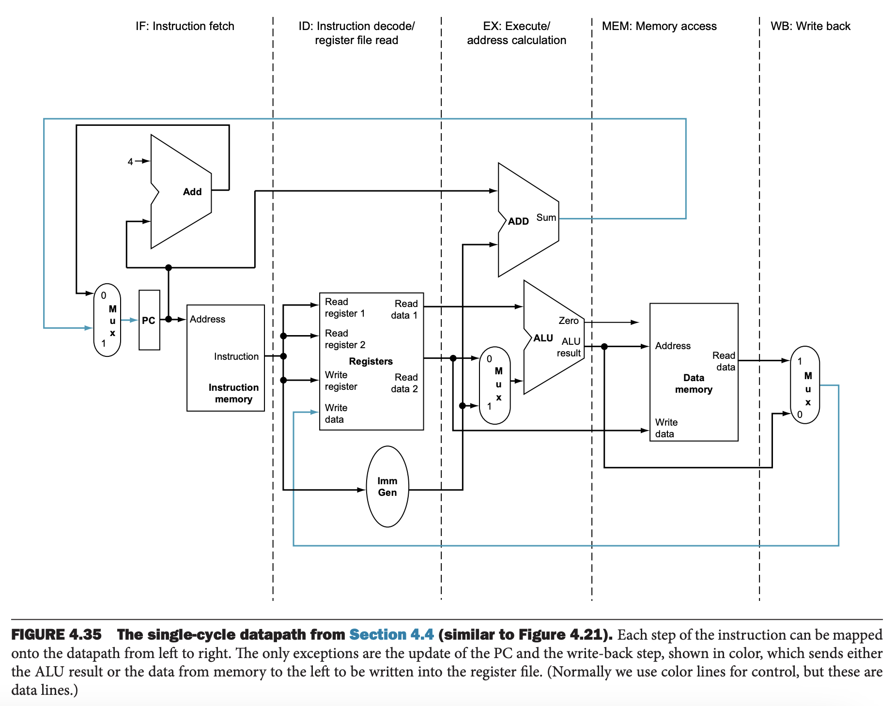

随着指令的执行，指令和数据基本上是从左往右通过五个阶段。不过有两个例外：

1. WB 回写阶段，结果会写到数据通路中部的寄存器堆。
2. PC 的下一个值的选择，有可能来自计算出来的跳转地址。

这些反向流动不会影响当前指令的执行，但是会影响后续的指令。上述第一个导致了数据冒险，第二个导致控制冒险。

一种表示流水线执行的方式是假装每一条指令在一个单独的数据通路中，然后把每个数据通路根据时间线组合到一起。如下图所示。这里使用非写实的方式展示数据通路，简化了一下。

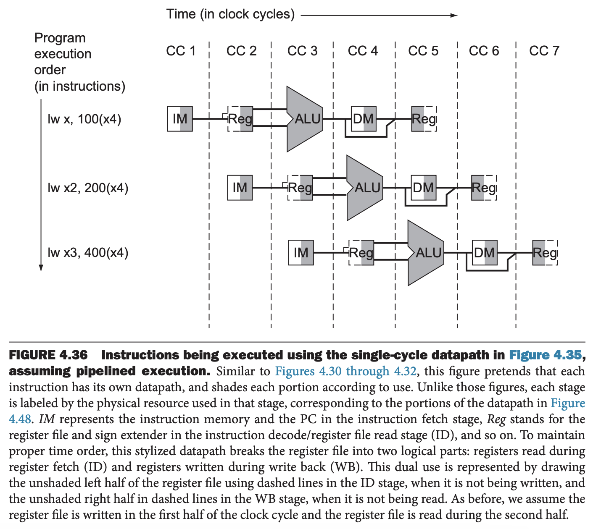

上图给人的感觉是三条指令需要三个数据通路。实际不然，只要添加一些寄存器来保存数据，那么各个指令能共享同一个数据通路。

比如指令内存，只在第一个阶段使用，那么第一条指令执行其他四个阶段时，可以共享使用。为了为其他四个阶段保存这个值，那么从内存中读取的数据必须放到寄存器中。其他几个阶段也是类似的。因此，在图 4.35 的分割线中都需要放一个寄存器保存数值。类比到洗衣房的例子，每个步骤之间需要一个盆放衣服。

如下图所示就是这么一种结构。每个时钟周期内，从一个流水线寄存器到下一个流水线寄存器。寄存器的名字使用其连接的两个阶段的名字命名，比如 IF/ID 是连接 IF 和 ID 两个阶段的寄存器。

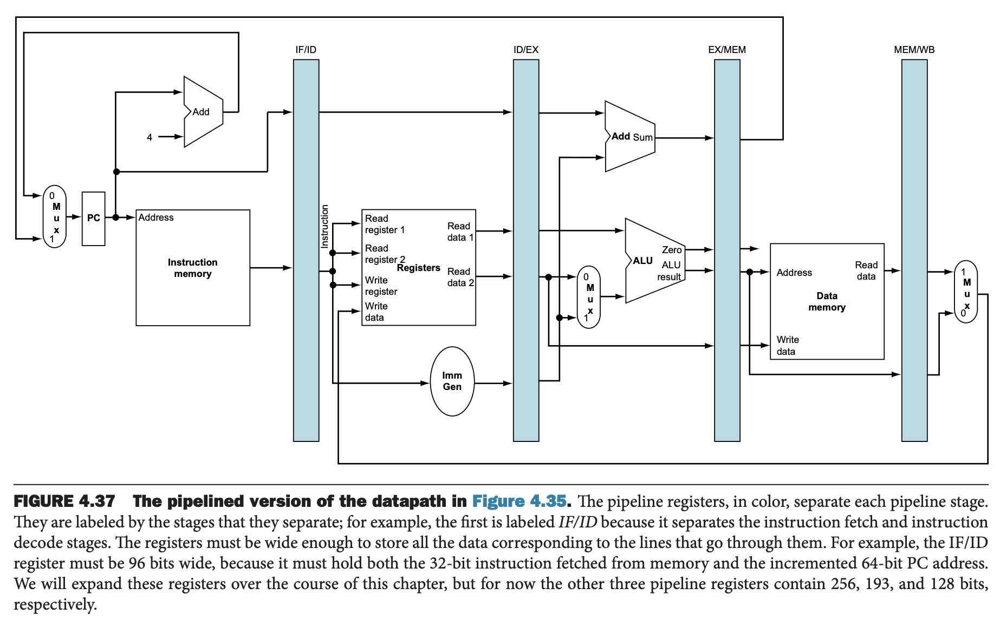

注意，在最后回写阶段是没有额外的寄存器的，因为所有指令都需要更新处理器的某个状态——寄存器、内存和 PC 值，所以无需额外寄存器再保存这个状态了。比如加载指令会把读取的数据写入寄存器，那么后续需要使用这个值的指令到对应寄存器中读即可。

每个指令都会更新 PC，自增或者是跳转的地址。它可以看做是流水线的一个寄存器，为 IF 阶段提供数据。不过与上图阴影部分的流水线寄存器不同，PC 是架构中可见的状态，如果发生异常，其值必须保存，而阴影部分的寄存器值可以丢弃。

本章后续使用一系列随时间变化的图来解释流水线是如何工作的。我们可以通过对比两个图来理解在某个时钟周期到底发生了什么。这里我们先忽略数据冒险。

下面展示加载 `lw` 指令对应的五个阶段是如何执行的。和之前图 4.30 一样，当从寄存器或者内存读取数据的时候，高亮右半边，当将数据写入寄存器或者内存的时候，高亮左半边。

1. 取指令：如下图上半部分所示。使用 PC 地址在指令内存中找到指令，然后读取到 IF/ID 流水线寄存器中。PC 自增 4 之后写回 PC，为下一条指令做准备。PC 值也需要放到 IF/ID 流水线寄存器中，因为有点指令后续会用到，比如 `beq`。计算机无法知道下一次指令是何种指令，所以不得不为所有指令做准备，将必要的信息传递给流水线。
2. 指令解码并读取寄存器堆：如下图下半部分所示。IF/ID 流水线寄存器包含指令部分，它提供立即数字段（符号扩展为 64 位）以及要读取的两个寄存器的寄存器号。这三个值与 PC 地址一起存储在 ID/EX 流水线寄存器中。和之前一样，这里需要保存所有后续可能需要的数据。

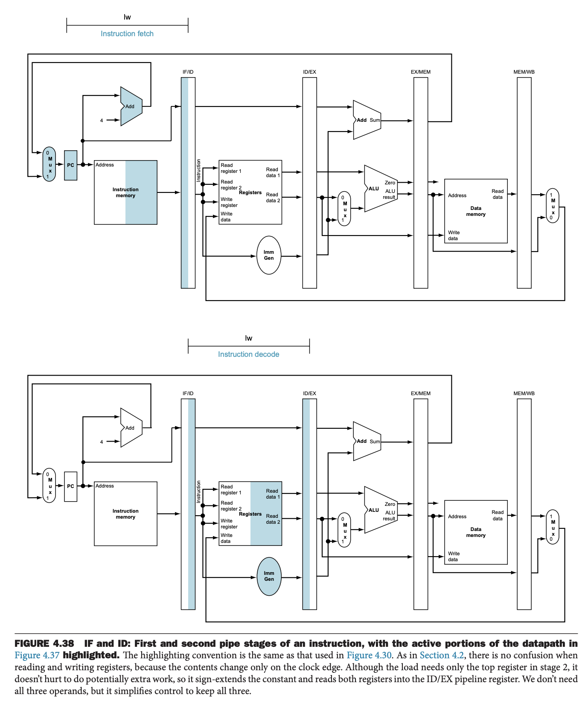

3. 执行或地址计算：如下如所示。从 ID/EX 中取出符号扩展的立即数和加载指令读取的寄存器的内容，使用 ALU 做加法。结果放到 EX/MEM 流水线寄存器。

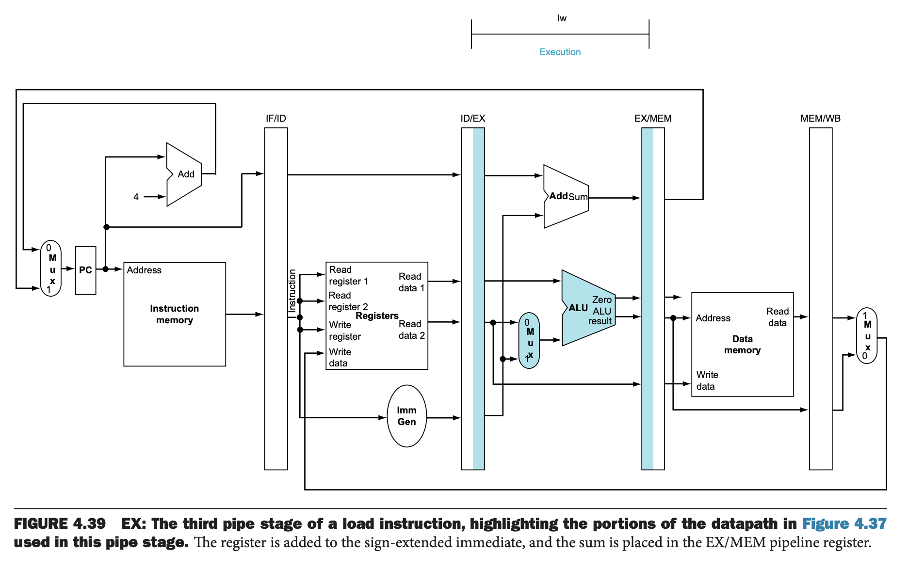

4. 内存访问：如下如上半部分所示。读取 EX/MEM 流水线寄存器中保存的地址指向的内存数据，然后将读取的数据写入 MEM/WB 流水线寄存器。
5. 回写：如下图下半部分所示。从 MEM/WB 流水线寄存器中读取数据，然后写回数据通路中部的寄存器堆。

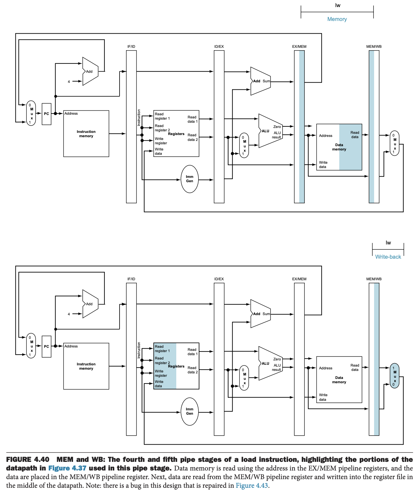

从上述分析的加载指令可以看出，任意流水线后续阶段需要的信息都需要通过流水线寄存器传递。存储指令 `sw` 也是类似的。下面是五个阶段的分析。

1. 取指令：这个阶段发生在识别执行之前，所以和之前的描述完全一样。
2. 指令解码并读取寄存器堆：这个和取指令一样，不区别指令。不过也有些许不同，`sw` 指令使用 rs2 这个字段来读第二个寄存器。图 4.38 并没有画出这个区别。
3. 执行或地址计算：如下如所示。有效地址在 EX/MEM 流水线寄存器。

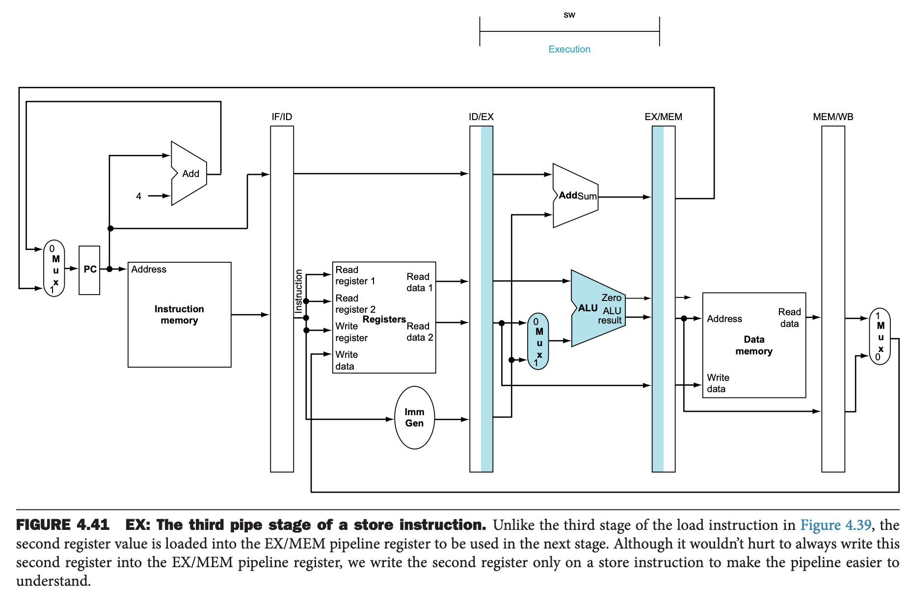

4. 内存访问：如下如上半部分所示，展示了写入数据。包含要写入数据的寄存器内容在之前已经被读出来了并放到 ID/EX 流水线寄存器中了。想要在 MEM 阶段能够访问这个数据，就必须类似有效地址，将这个数据也放到 EX/MEM 流水线寄存器。
5. 回写：如下图下半部分所示。对于 `sw` 指令，这个阶段什么也不用做。不过存储之后的指令已经开始执行了，我们没有方式加速这个指令了。因此，一个指令在没有阶段什么也不做，也需要通过一下流水线。

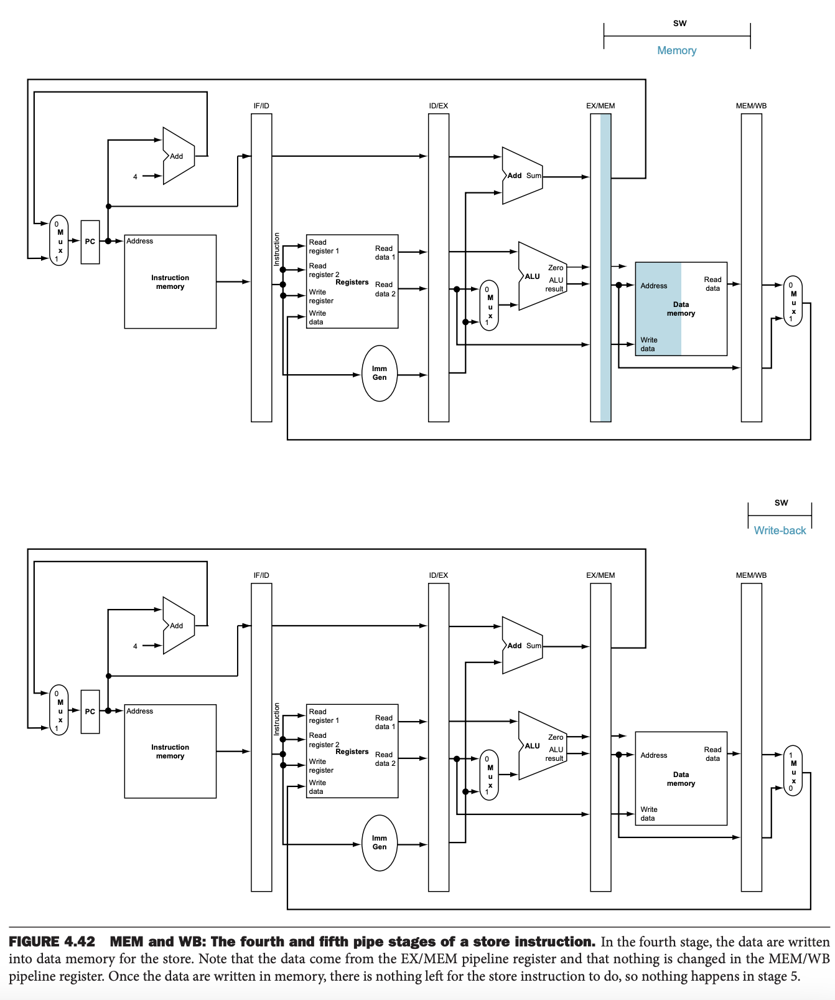

存储命令再一次解释了如果阶段可能用到某个信息，那么就必须通过流水线寄存器传递到后续阶段。对于存储指令而言，需要将 ID 阶段要读的寄存器信息通过 ID/EX 和 EX/MEM 传递到 MEM 阶段使用。

加载和存储还阐述了另一个事实：数据通路的每一个组件——指令内存、寄存器堆、ALU、数据内存、数据回写——只能用于流水线的一个指令。否则会出现结构冒险。因此这些组件和其控制只能关联到一个流水线阶段。

下面解释上面的加载指令的实现有一个 bug。IF/ID 流水线寄存器提供了要写入的寄存器号，但是在 `lw` 指令执行过来，这个流水线寄存器被后续指令再次使用！

解决方法就是使用 ID/EX EX/MEM MEM/WB 一路将目标寄存器号传入到 WB 阶段使用。另一个思考寄存器号传递的方法是，为了共享流水线数据通路，我们需要保留在 IF 阶段读取的指令，因此每个流水线寄存器都需要包含该阶段和后续阶段所需的指令中的部分信息。

下图是正确的实现，蓝色高亮表示丢失信息的传递，最终 WB 将数据写回到指定寄存器。

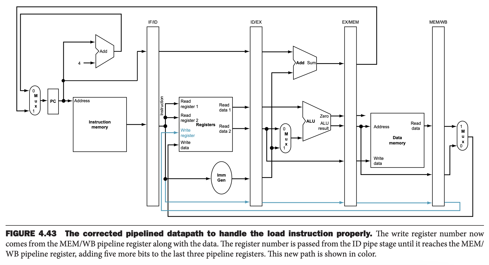

下图是完整的 `lw` 指令的示例图，高亮了加载指令所用到的所有组件。

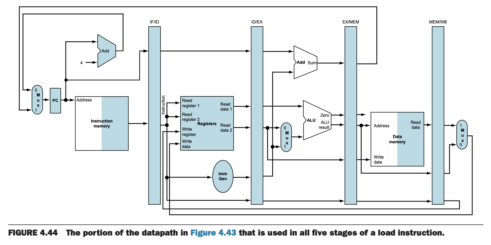

### Graphically Representing Pipelines
由于每个时钟周期有多个指令在同一个数据通路中执行，因此难以掌握流水线。有两种图解释流水线。一种是 4.36 那样的多时钟周期流水线图（`multiple-clock-cycle pipeline diagrams`），第二种是 4.38 这样的单时钟周期流水线图（`single-clock-cycle pipeline diagrams`）。多时钟周期流水线图简单，但是没有包含很多细节。比如下面五个指令
```
lw x10, 40(x1)
sub x11, x2, x3
add x12, x3, x4
lw x13, 48(x1)
add x14, x5, x6
```
如下如所示，使用多时钟周期流水线图展示了上面的五条指令。时间从左往右，指令自上而下。指令的各个阶段分开放置，放在适当的时钟周期内。这种数据通路的表示方式说明我们流水线有五个阶段。

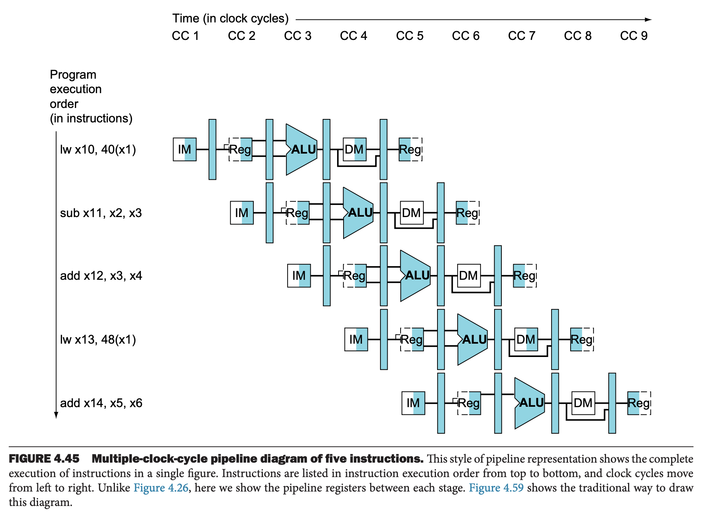

使用有名的矩形来表示五个阶段也是一样的。上图表示的物理资源，而下图表示的是各个阶段的名字。

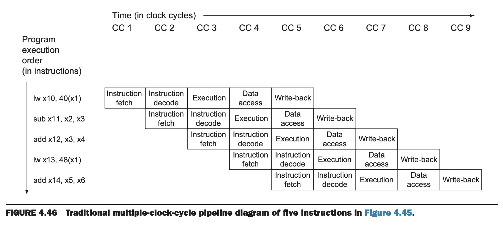

单时钟周期流水线图表示的是一个时钟周期整个数据通路的状态。通常，流水线有五条指令，在图上方标识指令及其阶段。这种图可以展示某个时钟周期时整个数据通路的细节。这种图往往以组的形式出现，展示一系列时钟周期内流水线的操作。而使用多时钟周期流水线图往往展示的是概览。单时钟周期流水线图展示的是多时钟周期流水线图中的一个垂直切片，展示的是指定时钟周期每条指令对数据通路的使用情况。比如下图是上图中时钟 5 相应的单时钟周期流水线图。很明显，单时钟周期流水线图能够展示更多的细节，但是需要更多的图来表示相同的时钟周期内的情况。

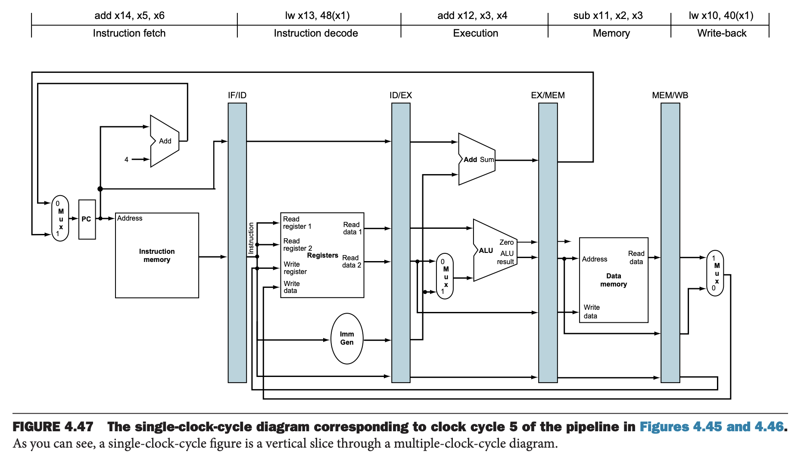

### Pipelined Control
现在需要将控制信号添加到流水线数据通路中。从乐观的角度出发考虑一种简单的设计。

首先，标记现有的控制线，如下图所示。我们尽可能从之前 4.4 小节图 4.21 中尽可能的借鉴控制线。

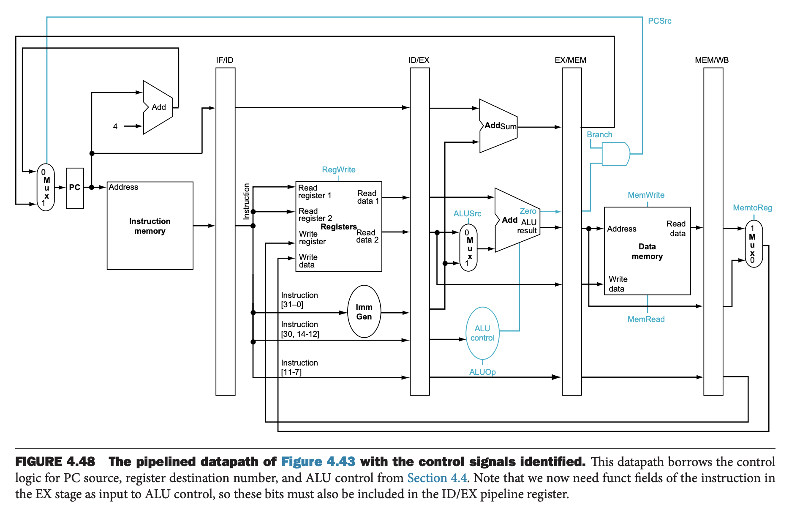

这里，我们使用相同的 ALU 控制逻辑，分支逻辑和和控制线。为了方便讨论，这里再贴一次这些定义。

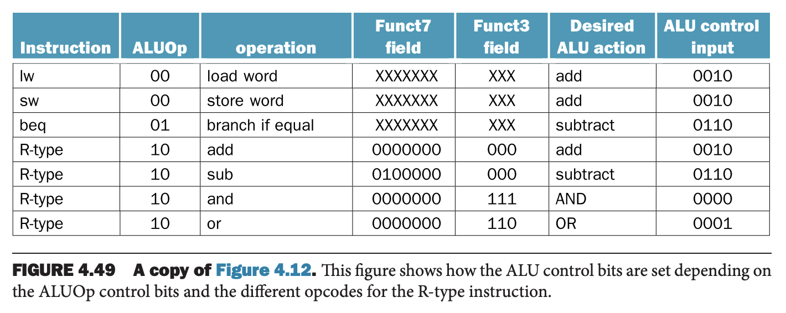

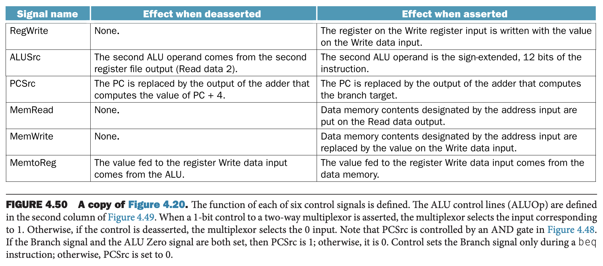

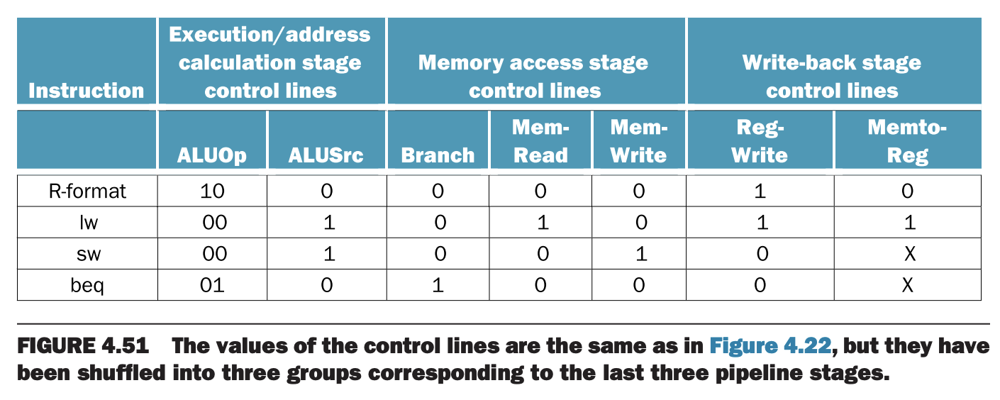

与单周期实现一样，我们假定每个周期都要写值到 PC，所以对于 PC 而言不需要控制线。同样的理由，每个周期都要写流水线寄存器，因此也无需为这些寄存器添加控制线。

为了控制流水线，我们仅需在每个阶段设置控制线即可。因为每条控制线只与流水线中单个阶段关联，因此我们可以将流水线控制分成五个部分。

1. 取指令：取指令和写 PC 每个周期都需要执行，无需控制线。
2. 指令解码并读取寄存器堆：源寄存器（读寄存器）始终位于指令中相同的位置，所以也无需控制线。
3. 执行或地址计算：需要设置 ALUOp 和 ALUSrc，具体定义见上图。用于选择 ALU 的操作和使用 Read data 2 还是扩展的立即数作为 ALU 的输入。
4. 内存访问：这个阶段，需要被设置有 Branch、MemRead 和 MemWrite。当比较数相同时的分支指令、加载指令和存储指令会分别设置这些信号。除非是分支跳转指令且 ALU 结果为零，否则 PCSrc 会选择顺序的下一条指令。
5. 回写：两个控制线，MemtoReg 控制是将 ALU 的结果还是内存的值传输到寄存器堆，RegWrite 控制值写入哪里。

由于流水线并没有改变控制线的含义，因为我们可以使用相同的控制值。如上图所示，不过我们对这些控制线进行了分组（流水线分阶段）。

实现控制线，就是在指令的各个阶段根据指令来设置这七个控制线。

由于 EX 阶段才需要控制，因此可以在解码阶段生成需要的控制信息。最简单的方式就是将这些控制信息通过流水线寄存器传递到后续各个阶段。下图的上半部分展示了这些信息随着流水线移动到后续的阶段，被流水线各个阶段使用。

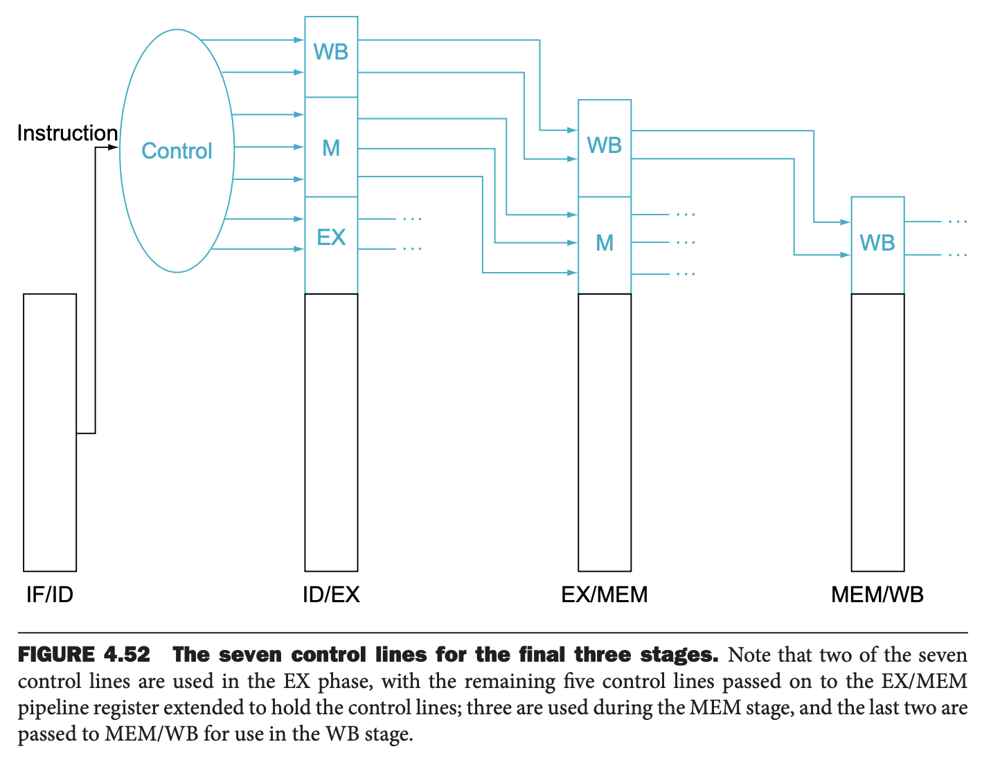

下图展示了完整的数据通路，包括流水线寄存器和与各个阶段关联的控制线。

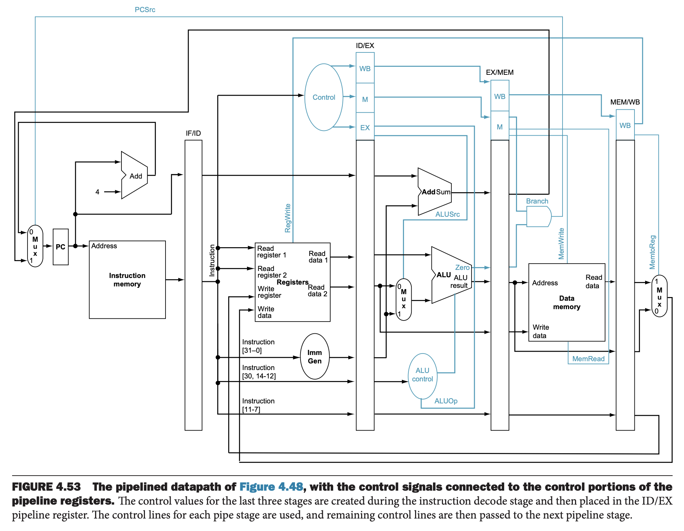
