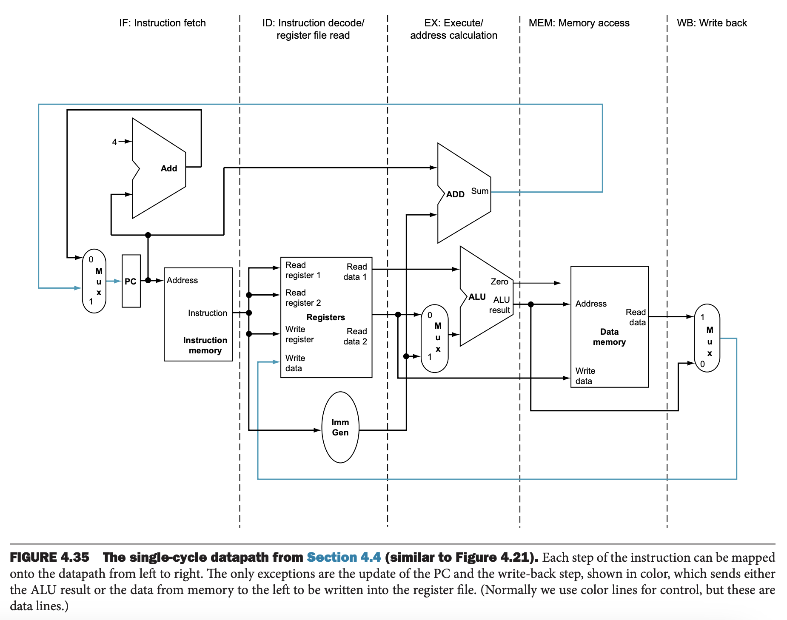
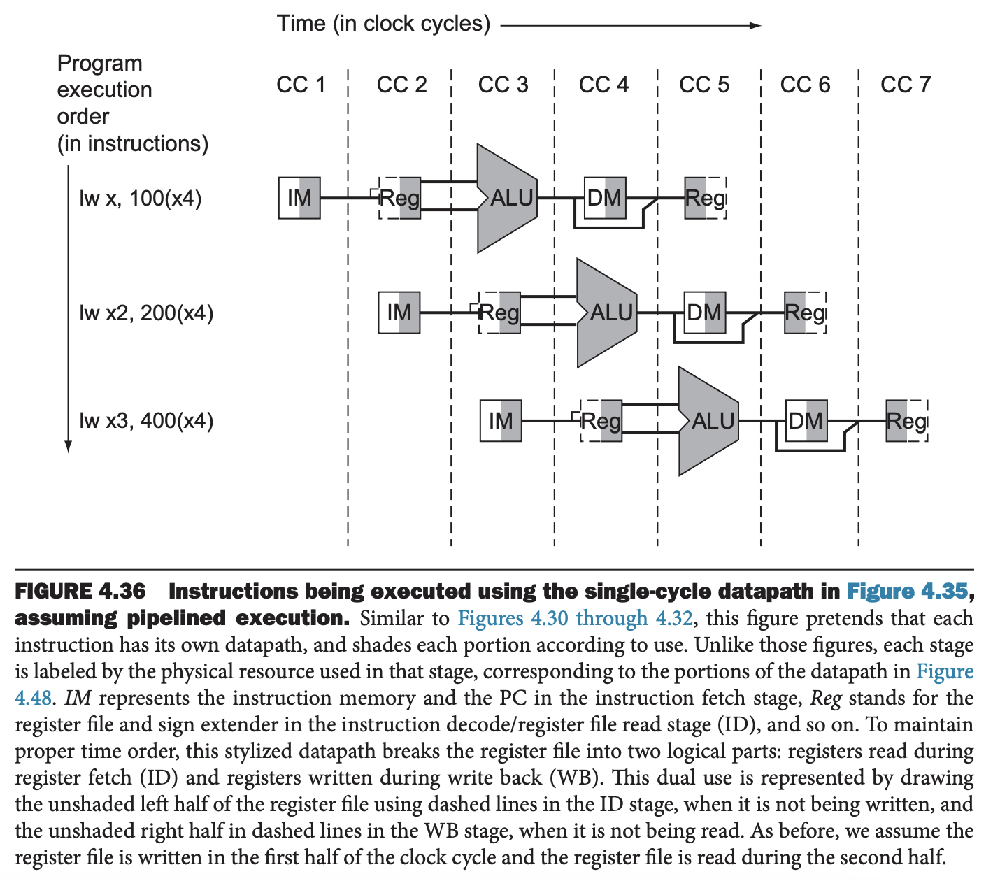
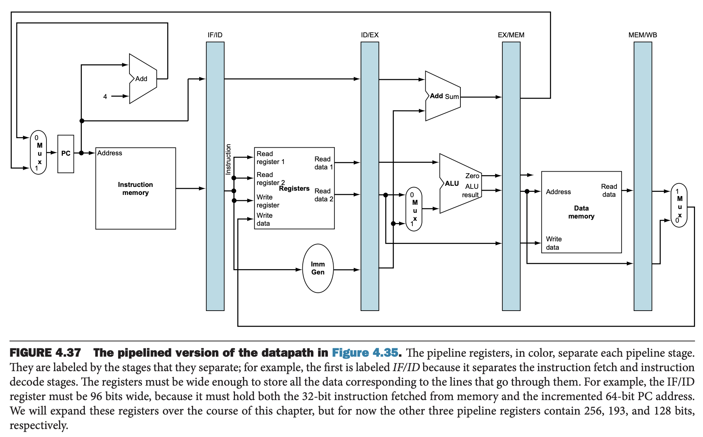
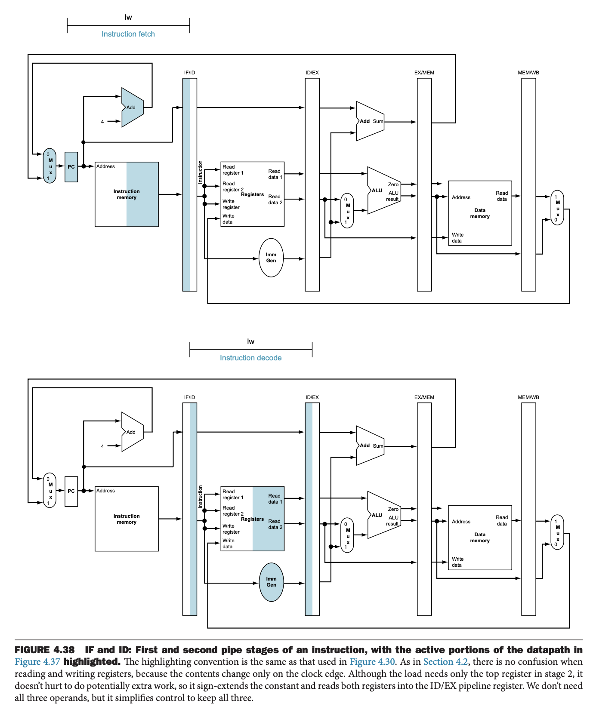
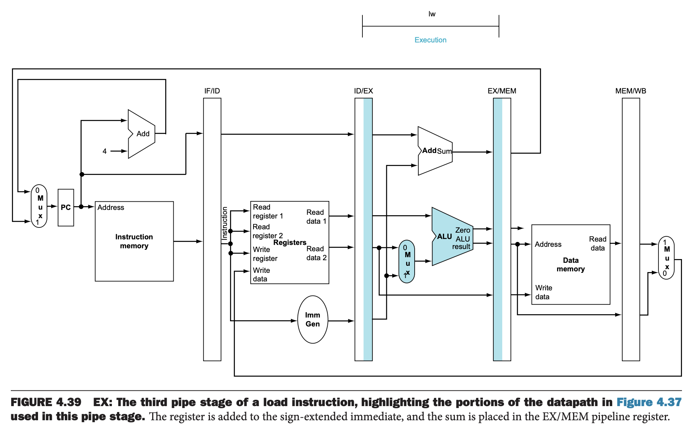
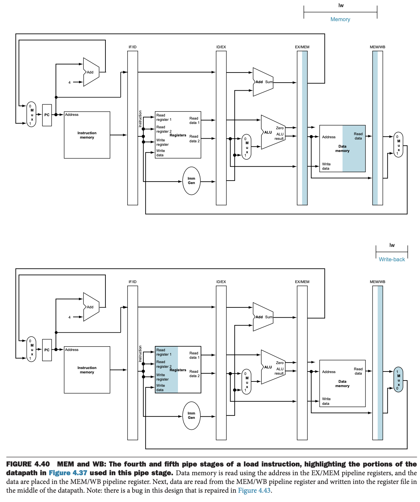

下图展示了一个标记了流水线各个阶段的数据通路。整个流水线五个阶段，那么最多同时有五条指令在执行。数据通路也分成了五个部分，每个部分用执行指令的阶段来命名。

1. IF: Instruction fetch
2. ID: Instruction decode and register file read
3. EX: Execution or address calculation
4. MEM: Data memory access
5. WB: Write back

随着指令的执行，指令和数据基本上是从左往右通过五个阶段。不过有两个例外：

1. WB 回写阶段，结果会写到数据通路中部的寄存器堆。
2. PC 的下一个值的选择，有可能来自计算出来的跳转地址。

这些反向流动不会影响当前指令的执行，但是会影响后续的指令。上述第一个导致了数据冒险，第二个导致控制冒险。

一种表示流水线执行的方式是假装每一条指令在一个单独的数据通路中，然后把每个数据通路根据时间线组合到一起。如下图所示。这里使用非写实的方式展示数据通路，简化了一下。

上图给人的感觉是三条指令需要三个数据通路。实际不然，只要添加一些寄存器来保存数据，那么各个指令能共享同一个数据通路。

比如指令内存，只在第一个阶段使用，那么第一条指令执行其他四个阶段时，可以共享使用。为了为其他四个阶段保存这个值，那么从内存中读取的数据必须放到寄存器中。其他几个阶段也是类似的。因此，在图 4.35 的分割线中都需要放一个寄存器保存数值。类比到洗衣房的例子，每个步骤之间需要一个盆放衣服。

如下图所示就是这么一种结构。每个时钟周期内，从一个流水线寄存器到下一个流水线寄存器。寄存器的名字使用其连接的两个阶段的名字命名，比如 IF/ID 是连接 IF 和 ID 两个阶段的寄存器。

注意，在最后回写阶段是没有额外的寄存器的，因为所有指令都需要更新处理器的某个状态——寄存器、内存和 PC 值，所以无需额外寄存器再保存这个状态了。比如加载指令会把读取的数据写入寄存器，那么后续需要使用这个值的指令到对应寄存器中读即可。

每个指令都会更新 PC，自增或者是跳转的地址。它可以看做是流水线的一个寄存器，为 IF 阶段提供数据。不过与上图阴影部分的流水线寄存器不同，PC 是架构中可见的状态，如果发生异常，其值必须保存，而阴影部分的寄存器值可以丢弃。

本章后续使用一系列随时间变化的图来解释流水线是如何工作的。我们可以通过对比两个图来理解在某个时钟周期到底发生了什么。这里我们先忽略数据冒险。

下面展示加载 `lw` 指令对应的五个阶段是如何执行的。和之前图 4.30 一样，当从寄存器或者内存读取数据的时候，高亮右半边，当将数据写入寄存器或者内存的时候，高亮左半边。

1. 取指令：如下图上半部分所示。使用 PC 地址在指令内存中找到指令，然后读取到 IF/ID 流水线寄存器中。PC 自增 4 之后写回 PC，为下一条指令做准备。PC 值也需要放到 IF/ID 流水线寄存器中，因为有点指令后续会用到，比如 `beq`。计算机无法知道下一次指令是何种指令，所以不得不为所有指令做准备，将必要的信息传递给流水线。
2. 指令解码并读取寄存器堆：如下图下半部分所示。IF/ID 流水线寄存器包含指令部分，它提供立即数字段（符号扩展为 64 位）以及要读取的两个寄存器的寄存器号。这三个值与 PC 地址一起存储在 ID/EX 流水线寄存器中。和之前一样，这里需要保存所有后续可能需要的数据。

3. 执行或地址计算：如下如所示。从 ID/EX 中取出符号扩展的立即数和加载指令读取的寄存器的内容，使用 ALU 做加法。结果放到 EX/MEM 流水线寄存器。

4. 内存访问：如下如上半部分所示。读取 EX/MEM 流水线寄存器中保存的地址指向的内存数据，然后将读取的数据写入 MEM/WB 流水线寄存器。
5. 回写：如下图下半部分所示。从 MEM/WB 流水线寄存器中读取数据，然后写回数据通路中部的寄存器堆。

从上述分析的加载指令可以看出，任意流水线后续阶段需要的信息都需要通过流水线寄存器传递。存储指令 `sw` 也是类似的。下面是五个阶段的分析。

1. 取指令：这个阶段发生在识别执行之前，所以和之前的描述完全一样。
2. 指令解码并读取寄存器堆：这个和取指令一样，不区别指令。不过也有些许不同，`sw` 指令使用 rs2 这个字段来读第二个寄存器。图 4.38 并没有画出这个区别。
