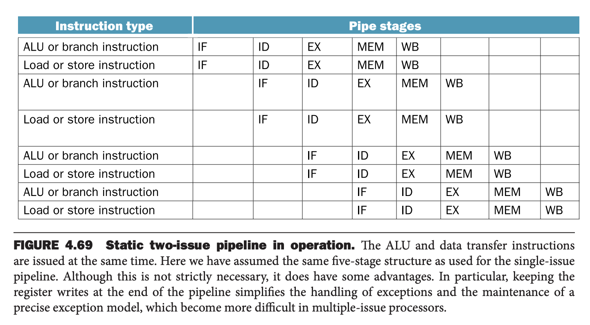
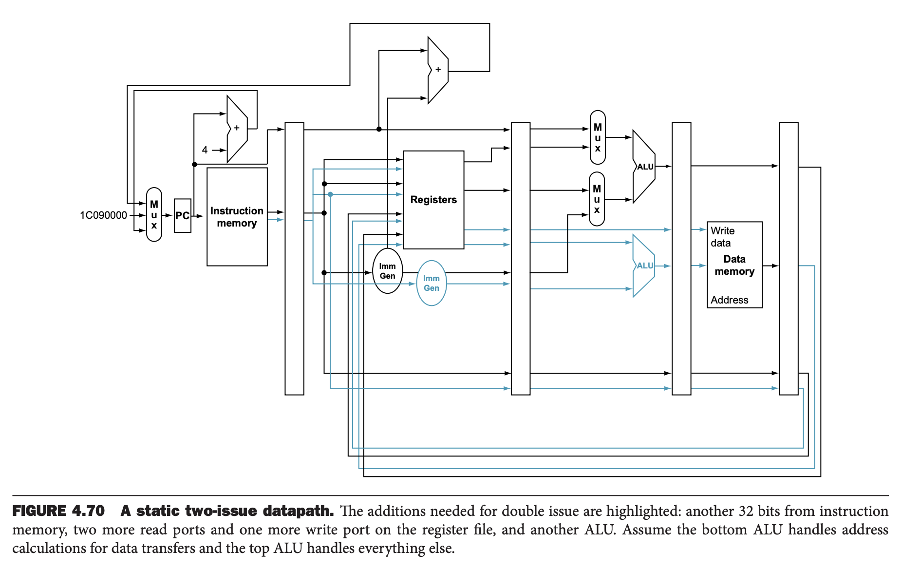
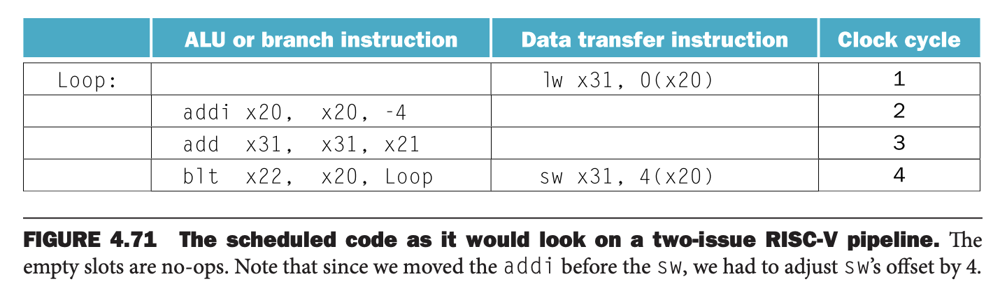
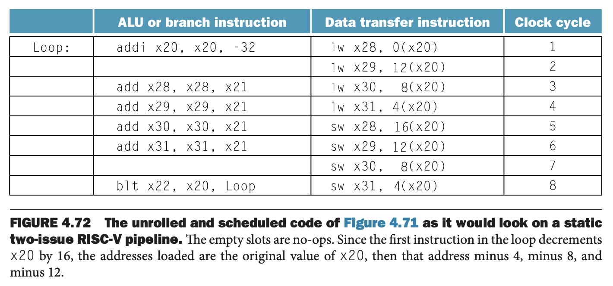
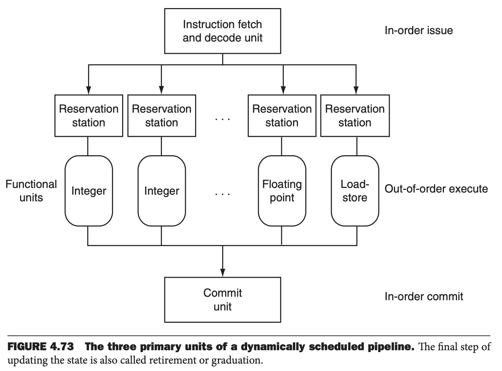
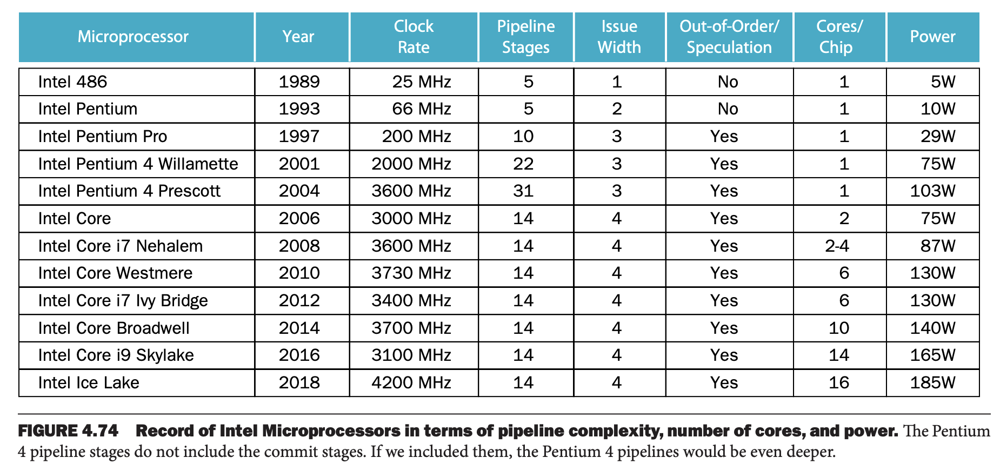

流水线使得指令并行成为可能，自然称之为指令级并行（`instruction-level parallelism`, `ILP`）。有两个方法增加指令级并行的指令数量。第一个个增加流水线的长度使得更多指令能够重叠执行，那么并行数量也就越高。时钟周期能够更短，性能也就能够得到进一步的提升。

第二个方法是复制一份计算机内部各个组件，在每个阶段都能有更多的指令在执行。这种技术成为多发射（`multiple issue`）。

每个阶段执行多个指令使得指令执行的速率可以超过时钟速率，或者说 CPI 可以小于 1。有时，也使用其倒数每周期指令（`instructions per clock cycle`, `IPC`）表示。一个 3GHz 4 路多发射的 CPU 最高峰值可以每秒执行 12 B（120 亿）条指令，CPI 0.25，IPC 是 4。假定流水线是五个阶段，那么每个时钟周期最多能完成 20 条指令。当前，高端 CPU 试图每个时钟周期发生 3 到 6 条指令。最适度的涉及也会尝试使得 IPC 为 2。当然，也有一些限制，比如同时能够执行的指令类型，比如依赖产生时会发生什么。

实现多发射有两种方法，主要区别在于编译器与硬件之间的分工。分工决定了决策是静态的（在编译时）还是动态的（在执行时），因此这两种方法也被称为静态多发射（`static multiple issue`）和动态多发射（`dynamic multiple issue`）。稍后会看到，这两种方法都有更常用的名字，不过更不精确或者有些许限制。

在多发射流水线中，有两个主要且独特的职责：

1. 将指令打包到发射槽中：在一个时钟周期内，处理器需要决定有多少指令、哪些指令能被发射。在大多数静态发射处理器中，至少部分工作由编译器处理；在动态发射处理器中，由处理器运行时决定，尽管编译器已经尝试重排指令顺序以提高发射率。
2. 处理数据冒险和控制冒险：在静态发射处理器中，编译器处理部分或者全部数据冒险和控制冒险问题；相对而言，动态发射处理器在运行时通过硬件技术尝试缓解某些冒险问题。

虽然这里描述为不同的方法，但是实际上一个技术往往会借鉴另一个方法的思想。

### The Concept of Speculation
充分利用 ILP 的一个方法是推测（`speculation`）。推测允许编译器或者处理器猜测指令的属性，能够开始执行依赖于猜测指令的其他指令。比如我们猜测分支跳转的结果使得分支后的指令能够更早的执行。另一个例子是推测一个在加载指令之前的存储指令不依赖于同一个地址，可以让加载提前执行。推测的一个难点在于猜测可能是错误的，所以任何推测机制需要一个方法能够检查推测是否正确并且能够回滚推测失败的指令的影响。回滚增加了实现的复杂性。

编译器或者处理器都可以实现推测。编译器可以使用推测机制重排指令，比如让一个指令越过分支指令或者加载指令提前到存储指令之前。处理器运行时可以做相同的事情，本节稍后会阐述。

对于不正确的推测，恢复机制相当困难。对于软件而言，编译器通常插入一些附加指令来检查推测的正确性以及在推测失败时修复结果。对于硬件来说，处理器通常缓存推测结果直到确认推测的正确性。如果推测正确，那么把缓存结果写到寄存器或内存。如果推测不正确，硬件就冲掉缓存重新执行新正确的指令。错误的推测需要重置流水线，或至少要停滞一下，这会使得性能下降。

推测引入了另一个问题：对某些指令进行推测可能会导致以前不存在的异常。比如，一个加载指令被提前了，如果预测失败了，地址很可能不在要读取的范围内，这就会导致异常，而这个异常本来不会发生。如果加载指令不是推测的，那么异常会一定发生，这就进一步加剧了复杂性。编译器推测，会添加特殊的推测支持以避免这种事情发生，允许忽略异常，直到说异常真的要发生。硬件推测，异常会缓存起来，直到知道真实的情况，如果异常需要抛出则抛出异常，然后正常执行处理异常的流程。

推测成功性能会提升，反之会使性能下降，因此需要付出大量努力来决定何时进行推测。

### Static Multiple Issue
静态多发射处理器都使用编译器来协助打包指令和处理冒险。在静态发射处理器中，可以将给定时钟周期发射的一组指令视为具有多个操作的一条大指令，这些指令称为发射包（`issue packet`）。这种观点不仅仅是一个类比。静态多发射处理器往往会限制在给定时钟周期内能够执行的指令的组合，因此将其看做是很多操作的单个指令很有用。这也引出了这个方法的原始名字：超长指令字（`Very Long Instruction Word`, `VLIW`）。

大部分静态多发射处理器也需要编译器来处理数据冒险和控制冒险。编译器职责可能包含静态分支预测和代码调度，减少或者防止所有冒险。

在描述在更激进的处理器中如何使用这些技术之前，先看一下 RISC-V 简单的静态发射版本。

#### An Example: Static Multiple Issue with the RISC-V ISA
为了展示静态多发射的特点，我们考虑一个简单的双发射 RISC-V 处理器，其中一条指令是 ALU 操作或者分支跳转，另外一条是加载或者存储指令。嵌入式系统往往使用这种设计。发射两条指令需要取两条 64 bits 指令并解码。在许多静态多发射处理器中，特别是 VLIW 处理器，要限制同时发射的指令的布局，以简化解码和发射指令。因此，我们需要指令成对出现并且是 64 bits 对齐的，同时 ALU 操作或分支跳转指令在前。如果一条指令不可用，需要填充 `nop`。下图展示了指令成对出现在流水线的样子。



静态多发射处理器处理数据冒险和控制冒险的方式不尽相同。在一些设计中，编译器的职责是去除所有冒险，重排代码，添加 `nop`，执行时硬件无需检测冒险也无需停滞。其他设计下，硬件需要检测数据冒险并在两个发射包之间停滞，编译器职责是避免指令包内部的依赖关系。即便如此，冒险也会使得包含依赖指令的发射包停滞下来。不管软件处理所有冒险还是减少发射包之间冒险的比例，包含多个操作的大的指令包都增强了这一点（使得问题更容易出现且更难处理）。在当前例子中，我们假定是第二种设计。

为了能够同时发射 ALU 指令和数据传输指令，需要一些额外的硬件。通常的冒险检测与停滞硬件自不必多说。寄存器堆需要更多接口。在同一个时钟周期内，ALU 需要读两个寄存器，存储指令也需要两个。ALU 需要一个写接口保存结果，加载指令也需要一个。由于 ALU 要用于 ALU 操作，那么需要一个额外的 ALU 来计算数据传输指令需要的地址。没有这些额外硬件，双发射流水线会被结构冒险阻碍。



很显然，双发射处理器会使得性能提升一倍。执行过程中会重叠两倍的指令，会使得数据冒险和控制冒险导致的性能损失也放大。在简单的五阶段流水线中，加载指令会值得流水线停滞一个时钟周期。现在是下两条指令都无法执行，需要停滞一个周期。本来 ALU 操作是无需停滞的，现在也需要停滞一个周期。为了有效利用多发射并行，需要更强大的编译器和硬件调度技术，静态多发射处理器要求编译器做这个事情。

#### Simple Multiple-Issue Code Scheduling
如何为双发射 RISC-V 调度下面的循环？
```c
Loop:   lw x31, 0(x20)      // x31=array element
        add x31, x31, x21   // add scalar in x21
        sw x31, 0(x20)      // store result
        addi x20, x20, -4   // decrement pointer
        blt x22, x20, Loop  // compare to loop limit,
                            // branch if x20 > x22
```
假定分支跳转是可预测的，那么控制冒险会由硬件来处理。我们重排序就是要尽可能避免流水线停滞。

前面三个指令有数据依赖，因此只能想办法处理后面两个。如下图所示。注意，只有一对指令使用了两个发射槽。每个循环使用五个时钟周期，在四个时钟周期内执行了五条指令，那么 CPI 是 0.8，最好情况是 0.5，IPC 是 1.25，最好情况是 2。注意，计算 CPI 或 IPC 时，不统计 `nop`，这对性能没有什么帮助。



循环展开（`loop unrolling`）是一种获取更高性能的编译器技术，它会将循环体中的内容复制多份。展开之后，通过叠加来自不同迭代的指令，进一步提升 ILP。

#### Loop Unrolling for Multiple-Issue Pipelines
现在分析下对上面的例子做循环展开会、重新调度的情况。假定循环索引是四字节。

为了显著地减少循环的延迟，我们需要循环开展四次循环体。展开并消除不必要的循环指令之后，循环包含四个 `lw` `add` `sw`，一次 `addi` `blt`，重排代码后如下图所示。



在展开的过程中，编译器引入了新的寄存器 `x28` `x29` `x30`。这个过程称为寄存器重命名（`register renaming`），目的是消除那些不是真正的数据依赖的依赖，这些依赖会导致潜在的冒险或者是编译器不能灵活的调度代码。假定循环展开只是用 `x31` 这一个寄存器，那么指令 `lw x31, 0(x20)` `add x31, x31, x21` `swx31, 8(x20)` 会重复几次，虽然都是 `x31`，但是实际上他们是相互独立。这些指令组之间没有数据流动。这称为反依赖（`antidependence`）或者名字依赖（`name dependence`），这是一种纯粹由名字导致的重排阻力而不是真实的数据依赖。

重命名之后，编译器可以移动这些执行来更好的调整代码。重命名消除了名字依赖，保留了真实的依赖。

现在循环中有共有 14 条指令，其中 12 条指令成对发射。四次循环使用了 8 个时钟周期，CPI 是 14/8 = 1.75。循环展开将性能提升了一倍，四次循环所需时钟周期从 20 提升到了 8，性能提升部分来自循环指令的减少，部分来自双发射。性能提升的代价是使用了四个临时寄存器而不是一个，同时代码大小涨了不止一倍。

### Dynamic Multiple-Issue Processors
动态多发射处理器也称为超标量（`superscalar`）处理器。在最简单的超标量处理器中，指令按序发射，处理器决定在给定时钟周期发射 0、1 或者多条指令。在这种情况下，还是需要编译器移除部分依赖以提高发射率。虽然都需要编译器重拍，但是超标量处理器与 VLIW 处理器还是有显著区别的。代码无论是否被调整，硬件都需要保证执行的正确性。此外，编译的代码始终都需要正确执行，这不取决于发射率或处理器的流水线架构。但是在某些 VLIW 处理器上，情况不是这样的，对于不同的处理器模型代码需要重新编译，在一些其他的静态发射处理器上，代码在不同的实现上可以正常运转，但是效果很差使得实际上需要重新编译。

许多超标量处理器对动态发射决策的基本框架进行了扩展，以包含动态流水线调度（`dynamic pipeline scheduling`）。同态流水线调度在给定始终周期内选择哪条去执行，同时试图避免冒险。先看一个避免数据冒险的例子。考虑如下几行代码
```
lw x31, 0(x21)
add x1, x31, x2
sub x23, x23, x3
andi x5, x23, 20
```
尽管 `sub` 准备好了可以执行，但是它必须等到 `lw` `add` 指令结束，如果内存很慢的话这需要很多个时钟周期。动态流水线调度可以完全或部分避免此类冒险。

#### Dynamic Pipeline Scheduling
动态流水线调度选择下一条执行的治理观，为了避免停滞，可能会重排指令。在这样的处理器中，可以分成三个主要单元：取指令和发射单元、多个功能单元（12 个或者更多）和一个提交单元（`commit unit`）。如下图所示。第一个单元取指令、解码，然后发送到相应的功能单元去执行。每一个功能单元有一个保留站（`reservation station`），用于存放操作数和操作。一旦保留站包含所有操作数，并且功能单元也准备好了，就开始计算结果。当结果出来后，会被发送到等待这个结果的保留站以及提交单元，提交单元会缓存这个数据，直到可以安全的写入某个寄存器或者存到内存。提交单元的缓冲区称为重排缓冲区（`reorder buffer`），也可以同操作数，这与静态流水线中的转发逻辑类似。



在保留站和提交缓冲区缓冲数据，提供了一种寄存器重命名的形式。下面阐述其是如何工作的。考虑如下两个步骤：

1. 当发射一条指令，它被拷贝到合适的功能单元的缓冲区。任何在寄存器或重排缓冲区中的操作数也会立即拷贝到保留站。保留站一直缓存这指令，直到所有操作数和功能单元可用。对于这条发射的指令而言，拷贝操作数的寄存器不再有用了，如果某个值需要写到该寄存器，旧值会被覆盖。
2. 如果一个操作数不再寄存器堆或重排缓冲区，那一定需要某个功能单元计算出需要的操作数。跟踪该功能单元的名字。当结果出来的时候，直接拷贝到等待这个操作数的功能单元的保留站，这个过程绕过了寄存器堆。

这些步骤有效地利用了重排缓冲区和保留站来实现寄存器重命名。

从概念上讲，可以将动态调度的流水线视为对程序数据流结构的分析。然后，处理器按照某种顺序执行指令，以保持程序的数据流顺序。这种执行方式称为乱序执行（`out-of-order execution`），因为指令的执行顺序可以与取指令的顺序不同。

为了让程序执行看起来像一个简单顺序的流水线执行的行为，取指令和解码单元需要按序发射指令，这样可以跟踪依赖，提交单元需要按照取指令的顺序将结果写到寄存器和内存中。这种保守的模式称为按序提交（`in-order commit`）。因此如果发生异常，计算机指向最后执行的指令，唯一更新的寄存器是导致异常的指令之前的指令写的寄存器。尽管前端（取指令和解码）和后端（提交）是按序的，但是功能单元可以等所需数据就位就开始执行，无需关心顺序。当前，所有的动态调度流水线都采用按序提交的方式。

动态调度往往有基于硬件的推测扩展，特别是对分支跳转结果的预测。基于此，动态调度的处理器可以沿着继续取指令和执行指令。由于指令是按顺序提交的，那么我们在提交预测后续的指令结果之前可以知道预测是否正确。动态调度流水线还支持对加载地址进行推测，这样使得加载指令重排，并且使用提交单元来避免错误的推测。后续会阐述 Intel Core i7 的实现。

乱序执行引出了之前没有遇见的一种冒险。两个指令使用相同的寄存器或内存地址（称为名字 `name`）就会出现名字依赖（`name dependence`），但是在关联这些名字的指令之间没有数据流动。对于顺序执行 `i` `j` 两条指令，有两种名字依赖。

1. 反依赖（`antidependence`）是说 `j` 写的名字是 `i` 读的名字。原始顺序就保证了 `i` 读到的是正确的值而不是 `j` 写的值。
2. 输出依赖（`output dependence`）是说 `i` `j` 写的名字相同，那么原始顺序就要保证最后结果是 `j` 写入的。

之前遇到的冒险称为真实数据依赖（`true data dependence`）。

下面例子中，`swc1` `addiu` 两者对 `f0` 是反依赖，`lwc1` `add.s` 两者对 `x1` 是真实数据依赖。单次循环中没有输出依赖，但是两次循环对应的 `addiu` 就是输出依赖。

```c
Loop:   lwc1 $f0,0(x1)      //f0=array element
        add.s $f4,$f0,$f2   //add scalar in f2
        swc1 $f4,0(x1)      //store result
        addiu x1,x1,4       //decrement pointer 8 bytes
        bne x1,x2,Loop      //branch if x1 != x2 
```

指令之间存在名称或数据依赖，并且它们足够靠近，使得执行期间会重叠，那么会改变对涉及依赖关系的操作数的访问顺序，就存在流水线冒险。它们导致了以下更直观的流水线冒险名称：

* 反依赖导致了 write-after-read (WAR) 冒险。
* 输出依赖导致了 write-after-write (WAW) 冒险。
* 真实数据依赖导致了 read-after-write 冒险。

之前没有遇到前面两种冒险的原因是所以指令都是按序执行的。对于写寄存器而言，回写在流水线的最后一个阶段，对于加载和存储指令而言，也是这样的，都在流水线同一个阶段。

假定编译器也可以根据数据依赖来调度代码，那么为什么超标量处理器会使用动态调度呢？有三个原因。

第一个原因：不是所有停滞都是可以预测的。特别是缓存未命中导致的停滞。动态调度可以隐藏其中一些停滞在等待停滞的同时继续执行指令。

第二个原因：如果处理器使用动态分支预测推测分支结果，处理器依赖于分支的预测行为和实际行为，它就无法在编译时知道指令的确切顺序。如果在不采用动态调度的情况下采用动态推测来提升指令级并行性 (ILP)，会大大限制推测的优势。

第三个原因：随着流水线延迟和发射宽度的变化，最佳的编译代码顺序也发生变化。比如如何调度相互依赖的指令会受流水线延迟和发射宽度的影响。流水线结构会影响循环展开的次数以避免停滞和编译器处理寄存器重命名的过程。动态调度能够让硬件屏蔽大部分问题。因此用户和软件分发商就无需考虑为统一指令集的不同实现提供多个版本的问题。同样，历史遗留代码也无需重新编译就能从新硬件上收益。

现代硬件能够同时发射多个命令，不过维持发射率是很困难的事情。比如尽管现代处理器一个时钟周期能发射四或六个指令，但是很少有程序能够能维持在每个时钟两个以上指令。主要原因有二：

首先，水流线的主要瓶颈是无法消除的依赖，从而降低了指令间的并行度和持续的发射率。对于真是数据依赖能够做的事情很少，但是硬件和编译器无法区分是真的数据依赖，因此必须保守的认为它们存在。比如使用指针，特别是可能导致别名的方式使用指针，会导致更多的潜在的依赖。相比之下，更规律地使用数组访问让编译器能够推断出不存在依赖。类似的，无论是运行时还是编译时都无法准确预测，这也限制了充分利用指令级并行的能力。有的时候有可用的并行指令，但是编译器或者硬件寻找很远的（有时可能是数千条指令之外）可用的并行指令的能力相当有限。

第二，在存储层次中的缺失会限制保持满载流水线的能力。一些内存系统的停滞可能可以被隐藏，但是有限数量的 ILP 也限制了这类隐藏的程度。

### Energy Efficiency and Advanced Pipelining
通过动态多发射和推测来提升 ILP 的能力的缺点是耗能！创新能够将更多的晶体管转化为性能，但通常效率很低。现在我们已经遇到了功耗墙问题，我们看到每个芯片上有多个处理器的这种设计，不过这些处理器的流水线深度和积极地推测都不如其更早的处理器。

虽然简单的处理器不如复杂的处理器快，但每焦耳性能更好，因此当设计更多地受能量而非晶体管数量的限制时，这样可以在每个芯片上提供更高的性能。

下图显示了一些 Intel CPU 的流水线阶段数、发射宽度、推测级别、时钟周期、每个芯片上的核数等信息。注意，当前核心是核数，而不再增加流水线深度和功耗，甚至和早期产品相比，有所下降。


