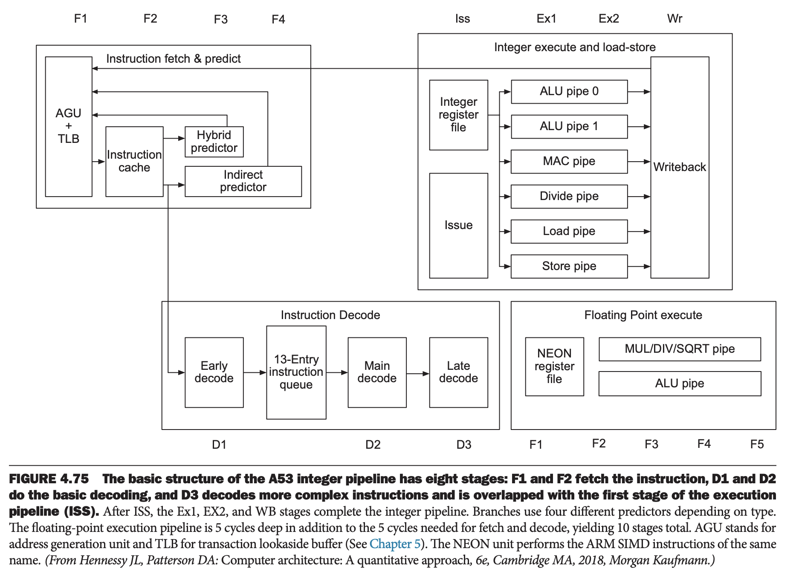
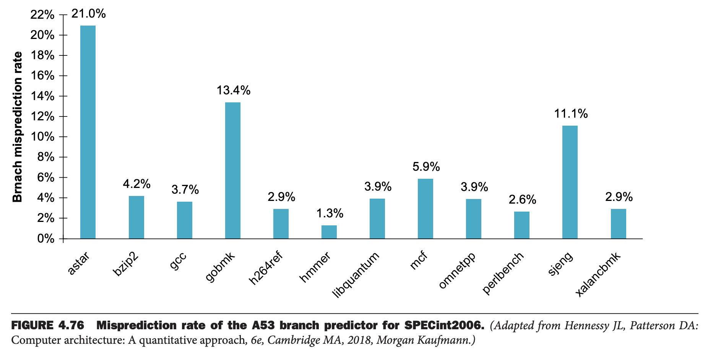
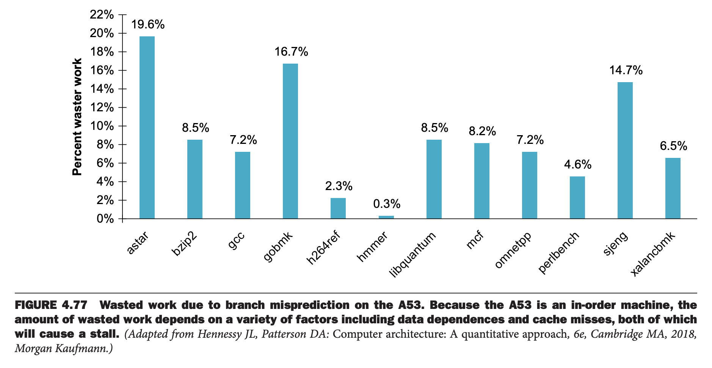
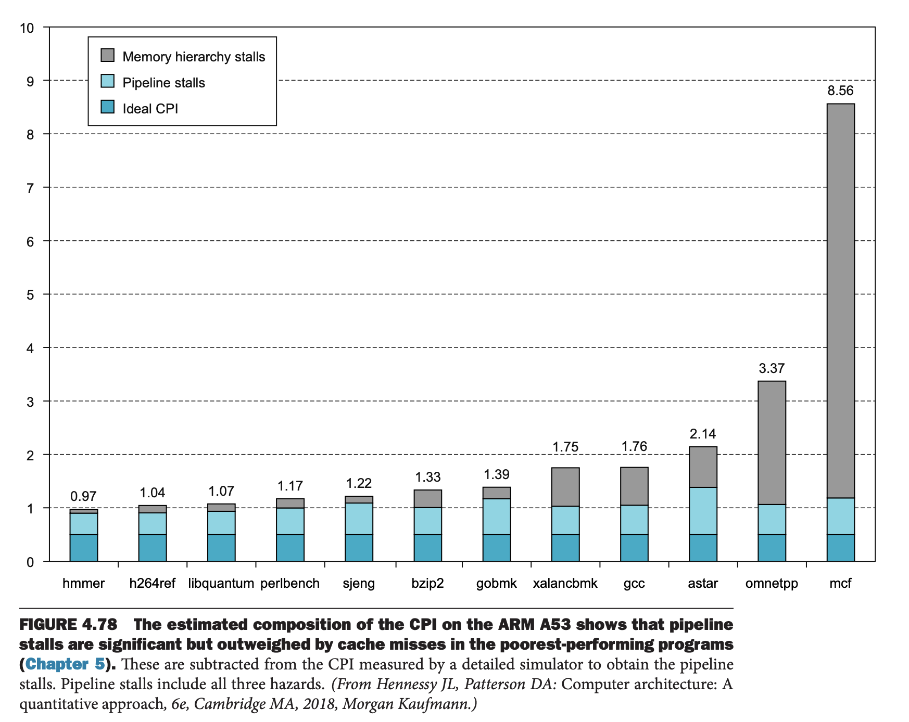
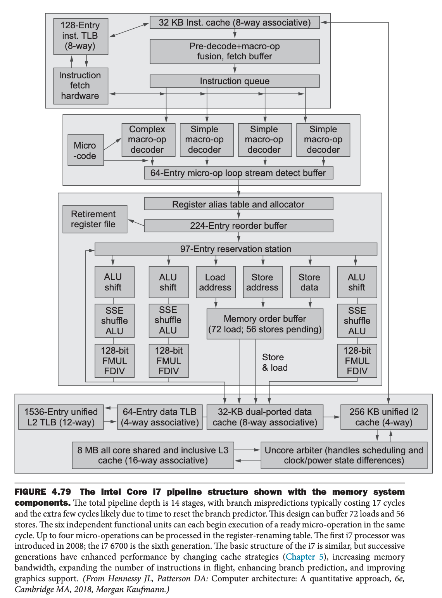
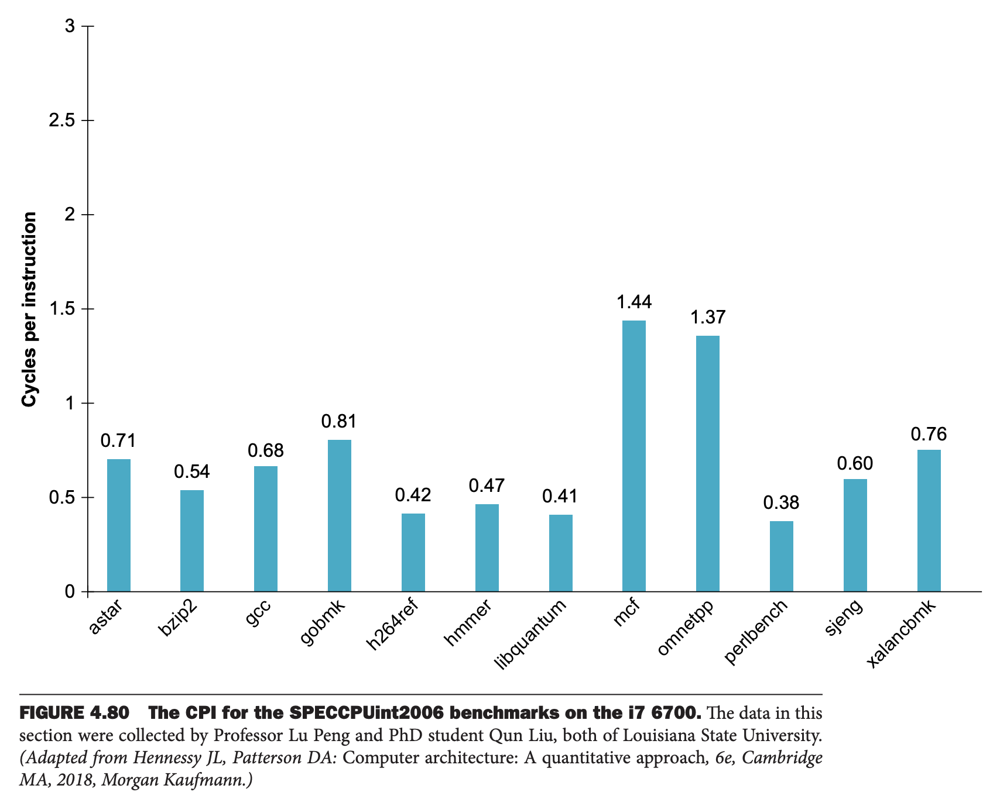

这里讨论两个动态多发射处理器的设计：ARM Cortex-A53 和 Intel Core i7 6700。前者常用于平板和手机；后者是高端、动态调度、超标量处理器，用于桌面和服务器。

### The ARM Cortex-A53
A53 是双发射、静态调度的超标量处理器，具有动态发射检测功能，允许处理器每时钟发射两条指令。下图是流水线结构。对于非分支跳转的整数指令，流水线有八个阶段：F1, F2, D1, D2, D3/ISS, EX1, EX2, WB。

流水线是有序的，因此只有当指令结果可用并且后续指令已启动时，指令才能开始执行。因此，如果接下来的两条指令相互依赖，那么这两条指令都可以进入适当的执行流水线，但当它们到达流水线时将被序列化。当流水线发出逻辑指示第一条指令的结果可用时，第二条指令就可以发出。

取指令的四个时钟周期包含地址生成单元，该单元自增上一个 PC 值或者从四个预测器之一获得的预测值。

分支决策在 ALU pipe 0 中决定，那么分支预测失误导致八个周期的惩罚。下图显示了 SPECint2006 的预测失误率。

浪费的工作量取决于预测失误率和在预测失误的分支之后持续的发出率。如下图所示，浪费的工作量通常与预测失误率一致，但有时可能更大或更小。

### Performance of the A53 Pipeline
由于是双发射处理器，所以理想状况下 CPI 是 0.5。但是由于下面三个原因流水线会停滞。

1. 结构性冒险，功能冒险，当选择的同时发射的两条指令需要使用流水线同一个功能单元。由于 A53 是静态调度，所以需要编译器尝试去消除这些冒险。当这些指令按序出现时，它们将在执行流水线的开头被序列化，此时只有第一条指令会执行。
2. 数据冒险，在流水线的初期被检测，可能会导致两条指令（如果第一条无法发射，那么第二条也无法发射）或第二条无法发射。同样地，编译器应该试图避免此类问题。
3. 当分支预测失败时，有控制冒险。

TLB（第五章）和缓存未命中也会导致流水线停滞。下图显示了 CPI 和各种原因对流水线停滞的估计贡献值。

A53 使用短的流水线和适度激进的分支预测器，使得流水线损失也适中，同时允许处理器以适中的功耗实现高时钟速率。与 i7 相比，A53 的功耗约为四核处理器的 1/200！

### The Intel Core i7 6700
x86 微处理器采用了复杂的流水线方法，并且使用动态多发射、动态流水线调度，并采用乱序执行和推测。然而，这些处理器仍然面临着实现复杂 x86 指令集的挑战。取 x86 指令后将其转换为内部类似 MIPS 的指令，Intel 称之为微操作（`micro-operations`）。微操作由复杂的、动态调度的推测流水线执行，该流水线能够维持每个时钟周期最多六个微操作的执行率。

当我们考虑复杂的动态调度处理器的设计时，功能单元、缓存和寄存器堆、指令发射和整体流水线控制的设计会混在一起，使得数据通路与流水线难以分离。由于这种依赖，许多工程师和研究人员使用术语微架构（`microarchitecture`）来指代处理器的详细内部架构。

Intel Core i7 使用重排缓冲区和寄存器重命名来解决反依赖和错误推测。寄存器重命名显式地将处理器中的架构寄存器（`architectural registers`）（64 位 x86 有 16 个）重命名为更大的物理寄存器集合。Core i7 使用寄存器重命名来消除反依赖。寄存器重命名需要维护架构寄存器和物理寄存器之间的映射关系，表示哪个物理寄存器是最新的一个架构寄存器的拷贝。通过跟踪已有的重命名，寄存器重命名提供了另一种在发生错误推测时恢复的方法：只需撤消自第一个错误推测指令以来发生的映射即可。这使得处理器的状态回到最后一个正确执行的指令，保持架构寄存器和物理寄存器之间的正确映射。

下图展示了 i7 的流水线，不再赘述。

### Performance of the i7
由于激进的推测，很难准确地分析理想和实际之间的差距。6700 上有大量的队列和缓冲区，大大减少了减少了由于缺少保留站、重命名寄存器和重排缓冲区导致的流水线停滞。

因此大部分的性能损失来自预测错误和缓存未命中，错误预测的代价是 17 个时钟周期，L1 缓存未命中的代码是 10 个时钟周期。L2 未命中代价是 L1 的 3 倍，L3 代价是 L1 代价的 13 倍。尽管处理器会尝试在 L2 和 L3 未命中时寻找替代指令执行，但部分缓冲区很可能会在未命中完成之前被填满，从而导致处理器停止发出指令。

下图是 19 个 SPECCPUint2006 基准测试的 CPI，平均值是 0.71。

下图是 Intel i7 6700 分支预测的失败率，比 A53 少 50%，中值 2.3% vs. 3.9%。CPI 要小一半，0.64（0.71？） vs. 1.36。i7 主频 3.4 GHz，A53 是 1.3 GHz。平均时钟周期是 0.18ns vs. 1.05ns，快五倍之多，不能能耗是 200 倍！

Intel Core i7 结合了 14 级流水线和激进的多发射以实现高性能。通过保持连续操作的低延迟，降低了数据依赖性的影响。对于在该处理器上运行的程序来说，最严重的潜在性能瓶颈是以下四点，其中对其他高性能处理器也适用。

1. x86 指令不总能映射到简单的微操作。
2. 分支难以预测，失败的时候会导致流水线停滞并重启。
3. 很长的依赖：通常由长时间运行的指令或内存层次结构引起的停顿
4. 由于内存访问导致的停滞
