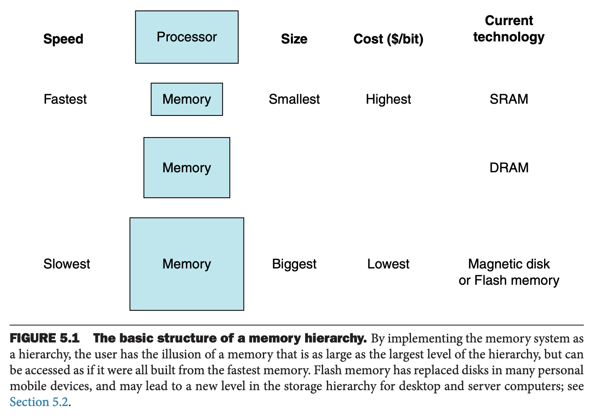
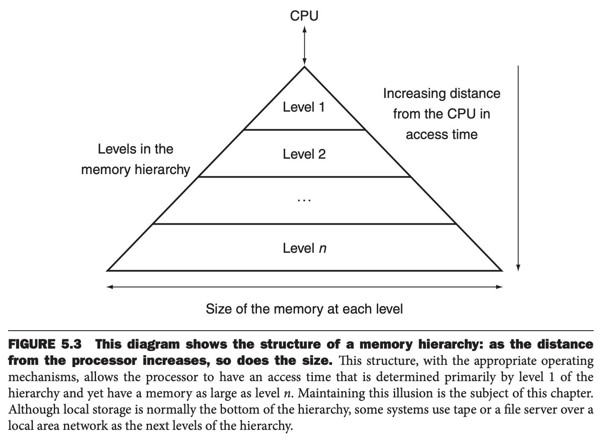

从有计算机开始，程序员就想要有无限大且速度很快的内存。这一章就来实现这一幻想。

局部性原理（`principle of locality`）是实现的基础。局部性原理指出任意时刻程序只访问地址空间中相对很小的一部分。有两种类型的局部性：

* 时间局部性（`Temporal locality`）：如果引用了某个数据，那么很快还需要引用它。
* 空间局部性（`Spatial locality`）：如果引用了某个数据，那么其附近的数据很快会被引用到。

程序的局部性来自简单且自然的程序结构。比如大部分程序包含一个循环，那么指令和数据都会被重复使用，这就是时间局部性。正常情况下按顺序访问指令，这就是空间局部性。数据也具备空间局部性，比如循序访问一个数组是很自然的事情，这就具备高速空间局部性。

我们使用局部性原理实现了存储层次（`memory hierarchy`）。存储层次包含了多个大小和速度不同的层。快的存储比慢的存储更快，因此也更小。

下图展示了快的存储更靠近处理器，下层的存储更便宜也更慢。目标是为用户能够使用最便宜的技术提供的尽可能大的存储，同时访问速度是最快的存储。

数据也具备类似的层次性：距离更近的层次的数据仅仅是更远层次的数据的子集，最低一层包含所有数据。随着远离处理器，访问需要的时间也急剧增加。

存储层次会包含多层，但是数据的拷贝只发生在相邻的两层，因此可以将注意力放到两层即可：上层更快、更贵、更小，下层更慢、更便宜、更大。下图展示了在存储层次存放信息的最小单元，我们称为块（`block`）或者行（`line`）。

如果处理器需要的数据在上层存储中，那么称为命中（`hit`）。反之则称为未命中（`miss`）。此时需要从低层存储取回包含请求数据的块。命中率（`hit rate`）指命中的比例，通常用于衡量存储层次的性能；未命中率（`miss rate`）指未命中的比例。

由于性能是使用存储层次的主要原因，因此处理命中和未命中的时间非常重要。命中时间（`hit time`）是访问上层存储的耗时，也包括确定是否能够命中的时间。未命中惩罚（`miss penalty`）是使用较低层次的快替换较高层次的块的耗时，也包括将这块内容加载到处理器的时间。由于上层存储更小、更快，因此耗时远远小于访问下层存储吃的时间，这也是惩罚耗时的主要部分。

本章中后面会讲到用于构建存储系统的概念会影响计算机的许多其他方面，包括操作系统如何管理存储和 I/O、编译器如何生成代码，甚至包括程序如何使用计算机。由于所有的程序大部分时间都是在访问存储，所以存储系统是决定性能的主要因素。性能依赖于存储层次意味着程序员需要理解存储是一个层次结构而不是一个平铺的、随机访问的设备才能使得程序获得良好的性能。

由于存储系统对性能至关重要，所以计算机设计者花费大量精力提高其性能。

下图是一个储存层次的示意图。如果命中率足够高，那么访问效率接近最高层次的速度，而大小等于最低层次的大小。

在大部分的系统，存储真的是层次划分的，这意味如果数据不在 $i+1$ 层，那么无法进入第 $i$ 层。

