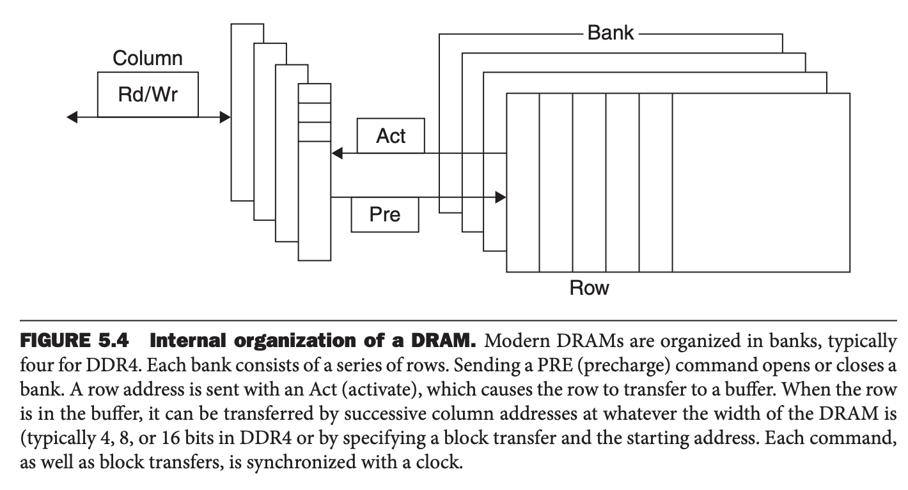
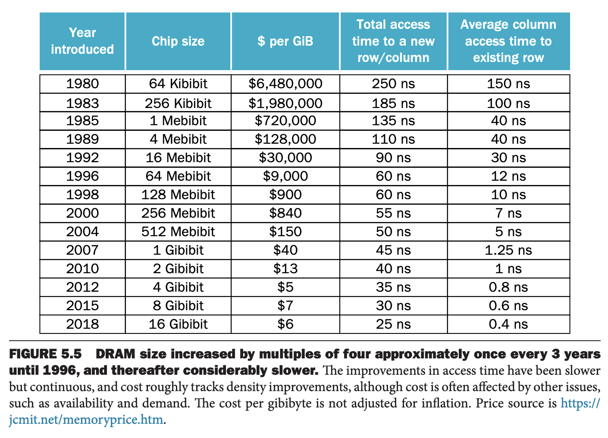
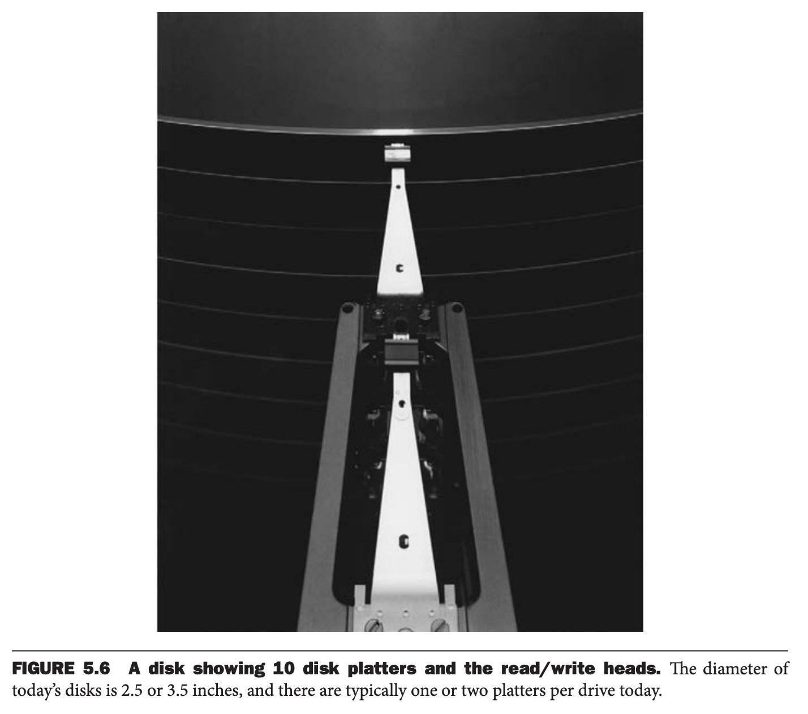

有四种主要技术用于存储层次。主存使用 DRAM（`dynamic random access memory`）实现，更接近处理器的层次（缓存）使用 SRAM（`static random access memory`）实现。DRAM 比 SRAM 便宜，也更慢。价格的主要差异是因为 DRAM 每 bit 占用空间更小，同样尺寸的硅片上容量更大。第三个技术是闪存。这种非易失性存储是个人移动设备的次级存储。第四种技术是磁盘，在服务器上基本是最大也是最慢的存储。每 bit 的访问速度和价格差异很大，见下表（2020 年典型值）。

| Memory technology | Typical access time | $ per GiB in 2020 |
|--|--|--|
| SRAM semiconductor memory | 0.5–2.5ns | $500–$1000 |
| DRAM semiconductor memory | 50–70ns | $3–$6 |
| Flash semiconductor memory | 5,000–50,000ns | $0.06–$0.12 |
| Magnetic disk | 5,000,000–20,000,000ns | $0.01–$0.02 |

### SRAM Technology
SRAM 是一个简单的集成电路，提供一个接口以供读写操作的存储阵列。访问任意数据时间都是固定的，不过读写时间可能不同。

SRAM 不需要刷新，因为访问时间非常接近时钟周期。SRAM 每 bit 使用六到八个晶体管，以防止读信息的时候受到干扰。待机时，SRAM 保持电荷的功耗很低。

过去，大部分 PC 使用分离的 SRAM 芯片作为第一次、次级甚至第三级缓存。现在都集成到处理器芯片中，市场上没有独立的 SRAM 芯片了。

### DRAM Technology
对于 SRAM，只要供电，值能够被无限期保持下去。动态 RAM (`dynamic RAM`, `DRAM`)，保存的值以电荷的形式存储在电容器中。单个晶体管用于访问存储的电荷来读写数据。由于一个 bit 只需要一个晶体管，因此比 SRAM 密度高，也更便宜。由于 DRAM 在电容器中存储电荷，不能持续保持电荷，必须周期性的刷新。相比 SRAM 的静态存储，非永久性是这种存储结构称为动态（`dynamic`）的原因。

为了刷新一个单元，需要读出内容再写回去。电荷能够保持若干毫秒。如果不得不对每个独立单元做读写操作，那么就不得不持续的刷新 DRAM，结果是没有时间访问它了。幸运地是，DRAM 有一个两级解码的结构，使得能够用读周期后紧接着一个写周期的方式刷新整行（`row`）。

下图是 DRAM 的内部组织结构。

下图是不同时间点 DRAM 的价格、访问速度。

以行为单位，能够有助于刷新，还有助于性能。为了提高性能，DRAM 会为了重复访问缓存行。缓冲区的作用类似于 SRAM。通过修改地址，可以在缓冲区访问任意 bits，直到访问下一行。由于在行中命中的访问时间很快，所以能有效提升性能。提升芯片的宽度能提高芯片的带宽。当行在缓冲区的时候，不管 DRAM 的宽度都可以通过连续地址或者是指定块和起始地址来传输数据。

为了进一步提升性能，DRAM 增加了时钟，所以称为同步 DRAM（`synchronous DRAM`, `SDRAM`）。SDRAM 的优势是可以消除存储与处理器同步的时间。SDRAM 的优势是可以以突发的方式传输 bits 而无需指定额外的地址。时钟会传输连续的 bits。这称为双倍数据速率（`Double Data Rate`, `DDR`）SDRAM。在时钟升和降的点都可以传输数据，因此得到了两倍的带宽。本书写的时候最新版本是 DDR4。DDR4-3200 能够每秒做 3,200 百万次传输，时钟周期是 1600MHz。

需要在 DRAM 内部精巧的组织才能维持如此大的带宽。DRAM 内部组织成了可以从多个存储体（`bank`）读写数据，每一个存储体都有一个高速行缓冲区。将一个地址发送给若干个存储体，这些存储体可以同时读或者写。比如，有四个存储体，一次访问，在这四个存储体中轮换就提供了四倍的带宽。这种轮换称为地址交错（`address interleaving`）。

尽管类似 iPad 个人移动设备使用独立的 DRAM，服务器往往使用称为双列直插式内存模块（`dual inline memory modules `, `DIMM`）。DIMM 通常包含 4-16 个 DRAM，往往是 8B 的带宽，因此 DRAM4-3200 带宽是 $8\times 3200=25,600 MB$。因此这样的 DIMM 称为 PC25600。由于 DIMM 可以包含多个 DRAM，以至于只有其中一部分用于特定传输，因此需要一个术语来指代 DIMM 中共享公共地址线的芯片子集。为了避免与 DRAM 内部的行（`row`）和存储体（`bank`）混淆，这里使用存储排行（`rank`）来指代 DIMM 中的此类芯片子集。

### Flash Memory
闪存是一种电可擦除可编程只读存储器（`electrically erasable programmable read-only memory`, `EEPROM`）。

与 DRAM 不同，EEPROM 会磨损闪存的 bits。为了处理这个限制，大多数闪存产品都包含一个控制器，通过将已多次写入的块重新映射到较少被写入的块来分散写入。这种技术称为磨损均衡（`wear leveling`）。由于磨损均衡技术，个人设备不太可能超过闪存写的限制。磨损技术对性能有潜在的影响，除非有上层软件监控块的磨损，否则这种技术是必要的。磨损均衡还可以通过映射制造错误的存储单元来提高产量。

### Disk Memory
下图是磁盘的内部结构。

磁盘由一组薄的圆盘组成，每分钟能够旋转 5400 到 15,000 圈。这些金属圆盘两面都涂满了磁性记录材料，类似于磁带。为了读写硬盘上的信息，每个面正上方都有一个可移动的臂（`arm`），臂上有一个称为读写头（`read-write head`）的小型电磁线圈。整个驱动器被永久密封以控制其内部环境，从而使磁盘头更靠近驱动器表面。

每个圆盘被划分为若干个同心圆，称为磁道（`track`）。每个圆盘上有数万个磁道。每个磁道又被分为数千个包含信息的扇区（`sector`），每个扇区大小从 512 到 4096 字节。磁盘上记录的是扇区号，间隔，扇区的信息（包括纠错码），间隔，下一个扇区号。

每个圆盘的磁头连接在一起一起移动，所以磁头位于所有圆盘的同一个磁道上。柱面（`cylinder`）表示给定磁头下所有圆盘所对应的磁道。

访问数据需要经过三个阶段。第一个阶段称为寻道（`seek`），将磁头移动到对应的磁道上。寻道消耗的时间就是移动磁头到所需磁道时间。

磁盘生产商会在手册写明最大寻道时间、最小寻道时间和平均寻道时间。前两者很容易测量，但是后者依赖于寻道距离。这是一个加权平均数。平均寻道时间是 3 到 13 毫秒，不过依赖于程序的磁盘调度，由于实际访问数据的局部性，实际寻道时间是上述数字的 25% 到 33%，即四分之一到三分之一。局部性是由于对同一个文件的访问并且操作系统将这些操作放到了一起。

一旦寻道结束，需要等待扇区旋转到磁头下面。这个耗时称为旋转延迟（`rotational latency`, or `rotational delay`）。平均延迟是旋转半圈的时间。对于 5400 RPM 的磁盘来说，平均延迟是 $0.5/(5400/60)=5.6ms$。

最后一个阶段是传输块上的信息。耗时称为传输时间（`transfer time`）。传输时间是扇区大小、旋转速度、磁道密度的函数。2020 年的典型值是 150 到 250 MB/s。

这里有一个复杂的事情是大多数磁盘控制器内置了一个缓存，当扇区数据读出的时候会进行缓存。缓存的速度相当快，2020 年高达 1500MB/s。

现在块的位置不再直观。按照上述磁道、扇区、柱面的模型，相同磁道上块距离更近，同一柱面上的块访问时间最少，因为无需寻道。同时，一些磁道距离近，一些比较远。这些改变导致改变了磁盘接口的层级。为了加速顺序访问，这些高层次的接口使得磁盘组织的更像是磁带而不是随机访问设备。逻辑块蛇形铺在圆盘上，尝试捕获所有密度相同的扇区以提升性能。因此连续块在不同的轨道上（同一个柱面上）。

磁盘和半导体存储技术的主要差异是前者更慢（因为机械原因），闪存块 1000 倍，DRAM 快 100,000 倍。但是每 bit 价格偏移 6 到 300 倍。磁盘与闪存类似，都是非易失性存储，不过前面没有写损耗问题。不过，闪存更耐用，对于个人移动设备而言是个更好的选择。
