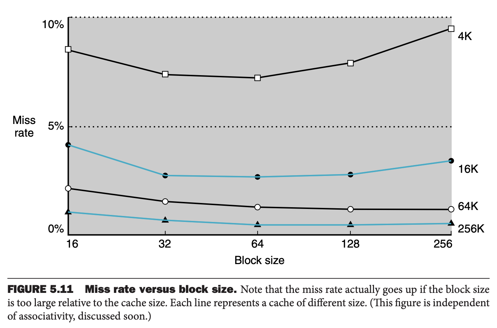

缓存（`cache`）最开始表示内存和处理机之间的存储层次。在第四章的数据通路中，简单的将内存换成缓存即可。不过现在缓存使用范围更广，可以用于任意用到局部性的优势的存储。1960 年代出现在了研究领域，很快（60 年代）就出现在了商业电脑中。现在，从服务器到低功耗的嵌入式处理器，都有缓存。

这一节先从简单的例子出发，研究一次读一个字或包含字的一个块开始。下图展示了请求数据不在缓存情况下请求数据前后的缓存变化。请求开始之前，缓存有 $n-1$ 个数据 $X_1,X_2,\cdots,X_{n-1}$，处理器需要处理 $X_n$，其不在缓存中。请求未命中，字 $X_n$ 从内存读到了缓存中。

上述场景有两个问题需要解决。如果知道数据是否在缓存中，如果在，如何找到这个数据。如果每个字只能被缓存到一个位置，那么直接取查找就可以了。最简单的分配位置的方法是使用内存中字的地址（`address`）计算缓存位置。这种方法称为直接映射（`direct mapped`），因为每一个内存地址直接映射到缓存位置。直接映射寻找一个块的方法很简单
$$(\text{Block address})\operatorname{mod}(\text{number of blocks in cache})$$
如果缓存中记录数是 2 的幂次，那么直接取低 $\lg n$ bits 即可。下图是使用直接映射将内存地址 0 到 31 映射到 8 个记录的缓存中。

因为每一个缓存位置可能包含不同内存地址的内容，如何知道缓存中的数据对应的哪个字呢？也就是说如何知道请求的字在缓存中呢？对缓存每一条记录增加一个标签（`tag`）。这个标签包含了对应的字的地址信息。标签只需要包含高 bits 位即可，因为低 bits 信息已经隐含在缓存索引中了。上图的标签仅需要两个比特。

我们还需要知道缓冲块是否有效。比如，处理器启动的时候，缓存中还没有数据，标签也是无意义的。即使运行了一段时间，缓存中还是有可能有空记录。为此，我们需要知道这些记录是否应该被忽略。最常用的方法是对每一条记录增加一个有效比特（`valid bit`）。

在本节的其余部分将重点介绍缓存如何处理读的。一般地，处理读比处理写要简单一些，因为读不必更新缓存数据。在了解了读的原理和如何处理缓存未命中的基础知识后，将研究计算机的缓存设计并详细说明缓存如何处理写。

缓存技术是预测这个想法最重要的例子。利用局部性原理，期待要处理的数据在更高层级的存储，如果预测失败了，从更低存储读取到更高层次的存储。现代计算机中，缓存命中可以达到 95% 以上。

### Accessing a Cache
下面是对八个记录的空缓存进行九次内存访问的操作。由于缓存是八条记录，所以地址的低三位就是缓存索引。

下图展示了缓存的变化。注意，地址 18 和 26 的低三位都是 010，占用缓存中第二（010）个记录，所以最后地址 18 的内容替换了地址 26 的内容。这里利用了时间局部性，所以使用新访问的数据替换旧访问的数据。

地址的低位用于查找缓存中的唯一可能的位置。下图展示了将访问的地址分成两个部分：

* 标签字段（`tag field`）：用于与缓存的标签部分进行比较。
* 缓存索引（`cache index`）：用于选择缓存的块。

缓冲块的索引和标签唯一的指定了缓存的内存数据的地址。由于索引字段要用于数据的地址，并且 $n$ bits 有 $2^n$ 个不同的值，所以直接映射方法要求缓存的记录数一定是 2 的幂次。由于字是 4B 对齐的，那么地址的低两位表示字内的字节位置。因此如果字是在内存中对齐的话，那么选择块中的字时可以忽略地两位。本章会假设数据都是对齐的，也会分析下如何处理非对齐数据。

缓存的总大小是缓存大小和地址大小的函数，因为除了存储数据之外，还需要存储标签和有效比特。上面的块大小是一个字（4B），通常有几个字大小。对于以下情景

* 32 位地址长度
* 直接映射缓存
* 缓存大小是 $2^n$ 块，所以 $n$ 比特用于索引
* 块的大小是 $2^m$ 字，$2^{m+2}$ B，$m$ 比特用于块内寻找字，最低两位用于字内寻找字节。

那么标签字段的大小是
$$32-(n+m+2)$$
直接映射的缓存大小是
$$2^n\times(\text{block size}+\text{tag size}+\text{valid bit})$$
块大小是 $2^m$ 字，即 $2^{m+5}$ bits，加上 1 比特有效比特，所以缓存大小是
$$2^n\times(2^m\times 32+(32-n-m-2)+1)=2^n\times(2^m\times 32+31-n-m)$$
尽管这是缓存实际大小，不过命名习惯还是只计算存储数据的大小，排除标签和有效位的大小。上图中称为 4KiB 缓存，尽管额外包含 1.375KiB 的标签和有效位。

#### Bits in a Cache
对于一个数据大小 16KiB 的直接映射缓存，块的大小是 4 个字，64 bits 地址，那么缓存的总大小是多少？

16KiB 是 4096（$2^{12}$）个字，块大小是 $2^2$ 字，那么有 $2^{10}$ 个块。每个块 128 bits 数据，$64-10-2-2=50$ bits 标签字段，外加 1 bit 有效位。总大小是
$$2^{10}(4\times 32+50+1)=2^10\times 179=179 Kib$$
大约是 22.4 KiB，总大小是数据大小的 1.4 倍。

#### Mapping an Address to a Multiword Cache Block
一个缓存有 64 块，每块 16B，字节地址 1200 要映射到哪个块中？

给定一个块，可以得到缓存索引
$$(\text{Block address})\operatorname{mod}(\text{number of blocks in cache})$$
其中块地址是
$$\frac{\text{Byte address}}{\text{Bytes per block}}$$
也就是说，一个块包含从
$$\lfloor\frac{\text{Byte address}}{\text{Bytes per block}}\rfloor\times\text{Bytes per block}$$
到
$$\lfloor\frac{\text{Byte address}}{\text{Bytes per block}}\rfloor\times\text{Bytes per block}+(\text{Bytes per block}-1)$$
所有字节。

因此一块 16B，字节地址 1200 是块地址
$$\lfloor\frac{1200}{16}\rfloor=75$$
那么会映射到 $75\operatorname{mod}64=11$ 块。这块包含地址从 1200 到 1215 的 16B。

较大的块能更好地利用空间局部性来降低未命中率。如下图所示。增加块大小通常会降低未命中率。如果块大小占了缓存大小的很大一部分，未命中率最终可能会上升，因为缓存中可以容纳的块数将变少，那么这些块的竞争将非常激烈。因此，块中的许多字在被访问之前就会被挤出缓存。也就是说，块中字的空间局部性会随着块的增大而降低，那么对未命中率的收益影响变小。

增加块的大小会带来一个更严重的问题：未命中时开销增加。未命中的开销主要来自从下层存储获取块加载到缓存中。开销分成两个部分：第一个字的延迟和传输整块的时间。除非改变存储系统，否则传输时间会随着块的大小增加而增加。此外，随着块的大小增加，未命中的改善会降低。结果就是未命中成本的增加超过了块大小增加使得未命中减少带来的收益，整体上看缓存性能下降了。如果我们设计的存储系统，传输大块更高效，我们可以增加块的大小进一步提升缓存性能。下一节会讨论这个议题。

虽然很难对大块的未命中惩罚中较长的延迟采取有效措施，但是可以隐藏部分传输时间，以减少未命中惩罚。最简单的方法称为早启动（`early restart`），即在请求的字返回之后立即开始执行，而不是等待整个块传输完成。很多处理器将这种技术用于指令访问，工作的很好。指令访问大概率是顺序的，如果存储系统可以一个时钟周期提供一个字，那么处理器可以在请求的字返回后开始重启操作，同时存储系统提供新的指令。但是这种技术对数据缓存不太有效，因为块中被请求的字缺少这种可预测性，处理器在块传输完成之前请求其他块中的字的概率比较大。如果因为正在传输而导致处理器无法访问到数据，那么处理器必须暂停执行。

一个更复杂的方法是通过组织内存，使得请求的字先传输到缓存中。然后传输块的剩余部分：从请求字的地址开始，然后绕回到块的开始。这种方法称为请求字优先（`requested word first`）或关键字优先（`critical word first`），比早启动稍微快一点。但是与早启动一样有类似的限制。

### Handling Cache Misses
我们先看一下控制单元如何处理缓存未命中（`cache miss`）的。控制单元必须能检测到未命中并通过从内存（更低的存储层次）拉取数据解决未命中。如果缓存命中了，计算机继续使用这些数据仿佛什么也没有发生。

控制单元处理命中无需多言，很普通的事情；不过对于缓存未命中需要做额外的事情。处理缓存未命中需要处理器控制单元和一个用于访问内存重新填充缓存的控制单元合作完成。缓存未命中会导致流水线暂停。冻结临时寄存器和程序员看见的寄存器，等待内存数据。设计更精巧的乱序执行的处理器能够在等待处理缓存未命中时执行其他指令，这里假设是顺序执行的处理器，会暂停执行。

首先看一下如何解决指令缓存未命中的，同样的方法可以容易的扩展到数据未命中。如果缓存未命中，那么指令寄存器中的内容是无效的。为了得到适当的指令，我们需要告诉更低存储层次读取执行。由于 PC 在执行指令的第一个时钟周期就自增了，所以导致缓存命中中的指令的地址是 PC 减 4。一旦有了地址告诉内存读取数据。等待内存相应，这通常需要若干个时钟周期，然后将数据写入缓存。

1. 发送原始的 PC 值到内存
2. 让内存执行读操作并等待其完成
3. 写缓存，将内存中的数据放入缓存记录的数据部分，将地址的高位（来自 ALU）写入标签字段，并将有效位设置成有效（如果没设置的话）
4. 重启执行第一步中原始的指令，此时能从缓存获取指令

对于数据缓存未命中的控制完全一致：暂停处理器，直到内存返回数据。

### Handling Writes
写操作略微不同。对于一个存储操作，如果只把数据写到缓存，那么内存和缓存的值不一致。最简单的保持一致的方法是同时写缓存和内存，这种策略称为直写（`write-through`）。

写操作的另一个关键点是未命中时会发生什么。首先从内存中获取块中的字，在获取块并将其写入缓存后，可以将导致未命中的字覆盖到缓存中，接着还要用完整地址将字写入主内存。

尽管这种写的方式非常简单，但是性能不好。对于直写，每次写都需要写到内存。这些写操作耗时很长，至少 100 个处理器周期，会拖慢处理器。比如，假定 10% 的指令是存储指令，如果没有缓存未命中的 CPI 是 1.0，写操作会导致 100 个额外时钟周期，那么 CPI 是 1.0+100*10%=11，性能下降十倍。

一个解决方案是使用写缓冲区（`write buffer`）。写缓冲区存放要写入内存的数据。当数据写入缓存和写缓冲区之后，处理器继续执行。当写入内存完成，写缓冲区的记录被释放。如果当处理器使用写缓冲区时，恰好满了，处理器必须暂停等待写缓冲区有空闲位置。当然，如果内存完成写操作的速率小于处理器生成写操作的速率，那么多大的缓冲区都没有用，因为写操作的生成速度快于存储系统可以接受的速度。

即使写操作生成速率低于内存可以接受写入的速率，但仍可能发生暂停。当写操作突发时，就会出现这种情况。为了减少此类暂停的发生，通常写入缓冲区的大小增加到一个记录以上。

直写策略的另一个方案是回写（`write-back`）。对于回写策略，当写操作发生时，新的值只写到缓存中。当修改的块被替换的时候，将其写入更低层次的存储中。回写策略能够提高性能，特别是处理器生成写操作比内存能够处理的速度快的时候。不过，回写实现比直写要更复杂。

相比读缓存，写缓存会引入额外的复杂性。这里讨论写缓存未命中和高效实现回写策略。

对于写缓存未命中，最常见的策略是在缓存中分配一个块，称为写分配（`write allocate`）。从内存中读取一块，然后将块中某个部分覆盖成新值。一个替代策略是直接在内存中更新块中要覆盖的部分，不经过缓存，这成为无写分配（`no write allocate`）。这么做的动机是有时程序会写整个数据块，比如当操作系统将内存页清零时。这种情况下，没有必要读取写未命中的块。一些计算机可以针对每一个页改变写分配策略。

实践中，高效地实现回写策略比直写缓存要复杂很多。直写将数据写入缓存然后读取标签，如果标签不匹配，说明未命中。因为是直写，内存中的值是最新的值，那么直接覆盖缓存块没有问题。对于回写，如果缓存的块被修改了并且是缓存未命中，首先要把块中的数据写会内存。如果和直写一样，在确定是否命中之前就简单的覆盖块中的内容，由于数据没有写回较低的内存层次，数据就被破坏了。

对于回写，由于不能直接覆盖，那么存储指令或者需要两个时钟周期（检查是否命中，执行写操作），或者需要一个写缓冲区来保存数据——通过流水线存储只需要一个指令周期。当使用存储缓存时，在访问缓存的周期内查找缓存并且将写缓冲区的数据写入。假定缓存命中，来自写缓冲区的新数据会在下一个不访问缓存的周期写入。

相比直写，写总是可以在一个周期内完成。读取标签并且写数据到块中指定的部分。如果标签匹配，处理器可以继续执行，因为当前块已经被更新了。如果不匹配，处理器生成一个写未命中来获取相应地址的块的其他部分数据。

许多回写缓存也包含了一个写缓冲区来减少未命中时替换一个修改块的罚时。在这种情况下，修改的块被移动到与缓存关联的回写缓冲区，同时从内存中读取请求的块。回写缓冲区稍后被写回到内存。假设没有立即发生另一次未命中，当必须替换脏块时，这种方式可以将未命中损失减半。

### An Example Cache: The Intrinsity FastMATH Processor
Intrinsity FastMATH 是 MIPS 架构的嵌入式处理器，缓存实现比较简单。本章最后会分析 ARM 和 Intel 处理器中更复杂的缓存设计，这里为了教学目的，从简单的真是的处理器开始。下图是数据缓存的架构。

处理器有十二个阶段的流水线。当处于运行峰值时，每个时钟周期处理器都需要请求一个指令字和数据字。为了使得流水线不暂停，使用了分离的指令和数据缓存。每个缓存 16KiB，即 4096B，每块 16 个字。

从缓存中读数据是相当直观的。由于使用了分离的数据和指令缓存，所以需要分离的控制信号来读写各自缓存。当缓存未名中时也需要更新指令缓存。从任意缓存中读数据有三个步骤。

1. 发送地址到相应的缓存。指令地址来自 PC，数据地址来自 ALU 结果。
2. 如果缓存命中，请求字位于缓存行。由于有 16 个字，需要选择正确的字。块内偏移字段用于控制多路复用器（上图下部）从索引块中选择请求的字。
3. 如果缓存未命中，发送地址到内存。当内存数据返回之后写入缓存，然后从缓存读取。

对于写，Intrinsity FastMATH 提供直写和回写两种策略，操作系统可以选择其中一种。处理器有一个记录的写缓冲区。

下图是指令和数据缓存未命中率。综合未命中率是考虑指令和数据访问的不同频率后，对每次缓存访问而言的有效未命中率。

虽然未命中率是缓存设计的一个重要特性，但最终的衡量标准是存储系统对程序执行时间的影响，后续会分析未命中率和执行时间之间的关系。

总大小等于两个分离缓存总和的组合缓存通常具有更好的命中率。因为组合缓存并不区分指令或数据占用了缓存。不过，现在的处理器仍旧使用分离的缓存设计，因为这会增加缓存带宽以匹配现代流水线。

下面是 Intrinsity FastMATH 处理器中缓存大小和未命中率，以及大小等于两个缓存总和的组合缓存的未命中率。分离的缓存的未命中率稍微搞一点。

* 缓存总大小：32 KiB
* 分离缓存的有效未命中率：3.24%
* 组合缓存未命中率：3.18%

分离缓存支持同时访问指令和数据，缓存带宽加倍的优势很容易克服略微增加的未命中率的缺点。这提醒我们不能将未命中率作为缓存性能的唯一衡量标准。
