这一节分析测量和提高缓存性能。这里会分析两种提升性能的技术。第一个技术是通过降低两个不同块争夺同一缓存位置的概率来降低未命中率。第二个技术是通过增加存储层次降低缓存未命中时的罚时。后者称为多级缓存（`multilevel caching`）。上世纪 90 年代出现在高端商务机上，售价超过 10 万美元！现在，个人移动设备也使用了多级缓存技术。

CPU 时间可以分为用于执行程序的时钟周期和用于等待存储系统的时钟周期。通常，我们假设命中的缓存访问的成本是正常执行周期的一部分。
$$\text{CPU time}=(\text{CPU execution clock cycles}+\text{Memory-stall clock cycles})\times\text{Clock cycle time}$$
存储暂停主要的时间开销是缓存未命中。我们的讨论局限于简化的存储系统模型。对于真实处理器而言，读写导致的暂停非常复杂，准确的性能预测需要对处理器和存储系统进行详实的模拟。

存储暂停时钟周期可以定义为来自写的时钟暂停和来自读的时钟暂停之和。
$$\text{Memory-stall clock cycles} = (\text{Read-stall cycles}+ \text{Write-stall cycles})$$

读暂停周期是一个程序读的次数，乘以读缓存未命中率，再乘以读缓存未命中的罚时。
$$\text{Read-stall cycles}=\frac{\text{Reads}}{\text{Program}} \times \text{Read miss rate} \times\text{Read miss penalty}$$

写操作会更复杂一点。对于直写策略来说，暂停来自两个方面：写未命中，通常需要在继续写之前取回请求的快；写缓冲区，当写发生时写缓冲区满了。因此写暂停周期分成了下面两个部分
$$\text{Write-stall cycles}=(\frac{\text{Writes}}{\text{Program}}\times \text{write miss rate}\times \text{Write miss penalty})+\text{Write buffer stalls}$$
由于写缓冲区暂停依赖于接近的写操作而不是写的频率，不太可能给出一个简单的公式来描述写缓冲区暂停。幸运地是，如果一个系统有合理的写缓冲区大小（四个字或者更多），内存接受写的速率远超过程序平均写的速率，比如超过一倍（速率比是 2），那么写缓冲区暂停概率很低，可以忽略。如果不符合这些评价标准，那么设计的不足够好。设计者应该使用更大的写缓冲区或者回写策略。

回写策略会增加额外的暂停，因为当一个块需要被替换时，可能需要将这一块写回内存。详见 5.8 小节。

对于大部分直写架构，读和写的未命中罚时是一样的，即从内存中取回块的时间。如果假定写缓冲区暂停可以忽略，那么读写暂停时钟周期可以使用同一个公式
$$\text{Memory-stall clock cycles}=\frac{\text{Memory accesses}}{\text{Program}} \times\text{Miss rate}\times\text{Miss penalty}$$
也可以写作
$$\text{Memory-stall clock cycles}=\frac{\text{Memory accesses}}{\text{Program}} \times\frac{\text{Misses}}{\text{Instruction}}\times\text{Miss penalty}$$

#### Calculating Cache Performance
假定指令缓存的未命中率是 2%，数据缓存的未命中率是 4%。没有内存暂停时处理器的 CPI 是 2，未命中罚时是 100 个周期。加载和存储指令占比是 36%，那么如果没有未命中的速度比存在未命中的速度快多少呢？

假定指令数是 $I$，那么指令缓存未命中时暂停的时钟周期数是
$$\text{Instruction miss cycles} = I\times 2\%\times 100=2I$$
加载和存储指令占比 36%，那么数据缓存未命中导致的暂停时钟周期数是
$$\text{Data miss cycles}=I\times 36\%\times 4\%\times 100=1.44I$$
那么内存暂停总时钟周期数是 $3.44I$。平均每条指令会有 3.44 个时钟周期的暂停，那么包含时钟暂停的总 CPI 是 5.44。由于指令数和时钟周期不变，那么要计算的比值是
$$\begin{aligned}
\frac{\text{CPU time with stalls}}{\text{CPU time with perfect cache}}&=\frac{I\times\text{CPI}_{\text{stall}}\times\text{Clock cycle}}{I\times\text{CPI}_{\text{perfect}}\times\text{Clock cycle}}\\
&=\frac{\text{CPI}_{\text{stall}}}{\text{CPI}_{\text{perfect}}}\\
&=\frac{5.22}{2}\\
&=2.72
\end{aligned}$$
所以完美缓存（无暂停）的性能会好 2.72 倍。

如果处理器性能提升而存储系统性能没有提升，那么内存暂停导致的开销占比会继续上升。下面是一个简单的例子，假定处理器的性能通过将 CPI 从 2 降到 1 提升了一倍（可能是流水线带来的提升），那么缓存未命中的系统 CPI 是 4.44，而理想状态下 CPI 是 1，性能是前者的 4.44 倍。

内存暂停花费的时间占比从 $\frac{3.44}{5.44}=63%$ 提高到了 $\frac{3.44}{4.44}=77%$。

类似的，提高时钟频率但是不提升存储系统性能，也会增加缓存未命中导致的性能损失。

前面的例子中假定命中时间不是决定缓存性能的因素。如果缓存命中时间增加了，那么从存储系统读取字的开销肯定变大了，或许会导致处理器时钟周期的提高。增加缓存大小就是这样一个例子，本小节后面还会看到另一个例子。一个更大的缓存往往有更大的访问开销。由于缓存命中时间增加，可能会导致流水线增加一个阶段。分析更长的流水线对性能的影响是非常复杂的。在某些时候更大的缓存提升了命中率但是提高了命中时间，最终导致降低了处理器的性能。

为了获取命中和未命中的访问时间都会影响性能，设计人员有时会用平均内存访问时间（`average memory access time`, `AMAT`）来评估。平均访问时间考虑了命中和未命中的访问时间和两者的频率，公式如下
$$\text{AMAT} = \text{Time for a hit} + \text{Miss rate} \times \text{Miss penalty}$$

#### Calculating Average Memory Access Time
一个处理器时钟频率是 1ns，未命中罚时是 20 个时钟周期，未命中率是 0.05，命中缓存访问时间是一个时钟周期。假定读和写的罚时一样并且忽略其他的写暂停开销。那么平均内存访问时间是
$$\begin{aligned}
\text{AMAT}&=\text{Time for a hit} + \text{Miss rate} \times \text{Miss penalty}\\
&=1+0.05\times 20\\
&=2
\end{aligned}$$
两个时钟周期，即 2ns。

下面分析另一种缓存架构，减少了命中率，但是有时可能会增加命中访问时间。更多的例子参考 5.16。

### Reducing Cache Misses by More Flexible Placement of Blocks
对于将块放到缓存的哪里，存在不同的策略。直接映射，一个块只能放在某一个位置，是其中一个极端策略。

另一个极端策略是一个块可以放在任意位置。这种策略称为全相联（` fully associative`）。为了在全相联缓存中找到一个块，缓存中的所有记录都需要搜索一遍。为了使得搜索切实可行，使用与每个缓存记录关联的比较器进行并行执行。这些比较器大大增加了硬件成本，所以全相联策略仅在块数很少的缓存中可行。

介于直接映射和全相联之间的一种设计称为组相联（`set associative`）。在组相联缓存中，每一个块可以放到一组固定位置上。对于一个块，如果有 $n$ 个位置可以放，那么称为 $n$ 路组相联缓存。一个 $n$ 路组相联缓存包含一些组，每个组包含 $n$ 块，一个块能够放到某个组的任意位置上。因此组相联是直接映射和全相联的组合：一个块直接映射到一个组，匹配时需要搜索组内的所的块。下图是块 12 放到一个由 8 个块组成的缓存中，三个图的策略不同。

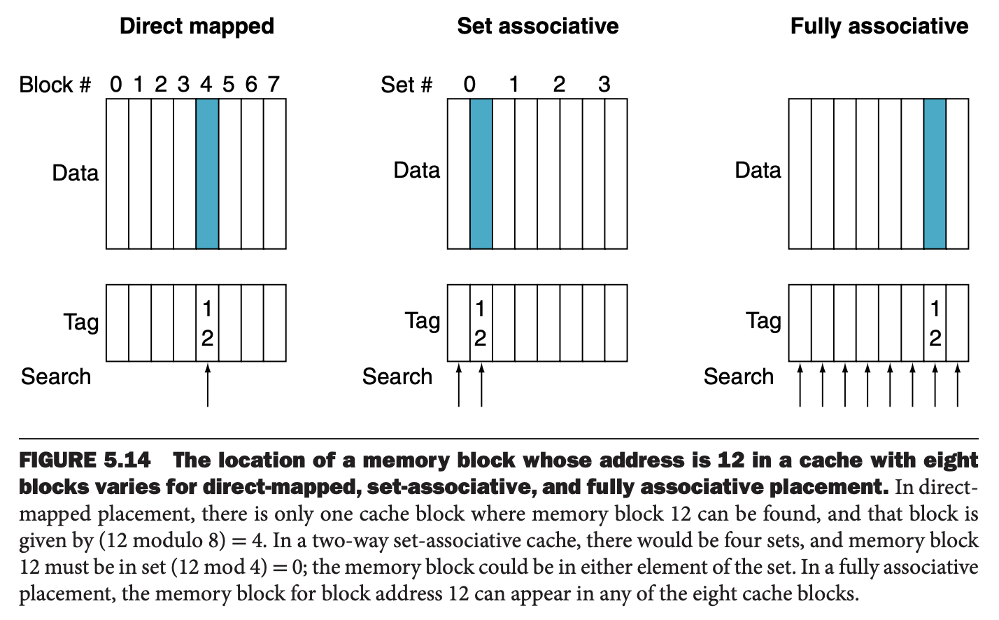

对于组相联，下面的公式确定内存块所述的集合
$$\text{Block number}\operatorname{mod}\text{(Number of sets in the cache)}$$
一个块能放在一个组的任意位置上，所以必须搜索集合的所有位置。对于全相联，块能放到任意位置，所以必须搜索缓存的所有位置。

这些策略是组相联的变形。下图是 8 个块组成、使用不同策略的缓存。直接映射是一路组相联，每一个缓存记录只能保存一个块，每个组也只有一个位置。全相联有 $m$ 个记录，是一个 $m$ 路的组相联缓存，只有一个组，这个组有 $m$ 个位置。

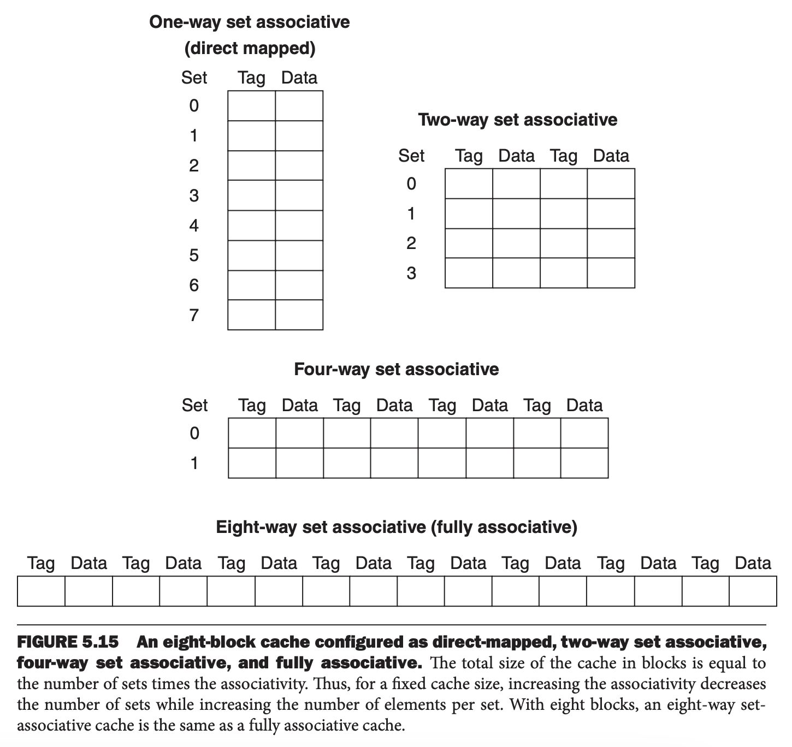

增加相联的程度可以减少未命中率，但是会潜在增加命中的时间。

#### Misses and Associativity in Caches
假定有三个缓存，每个缓存包含四个一个字的块。第一个使用直接映射策略，第二个是两路组相联，第三个是全相联。访问序列对应的块地址分别是 0,8,0,6,8。

首先分析直接映射，下面是块号到缓存块索引的映射关系。

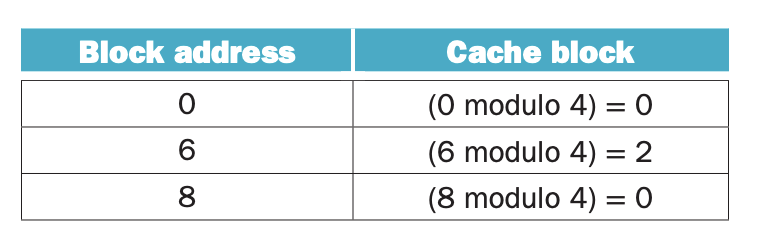

下图展示了缓存使用的时序图。直接映射五次访问，五次未命中。

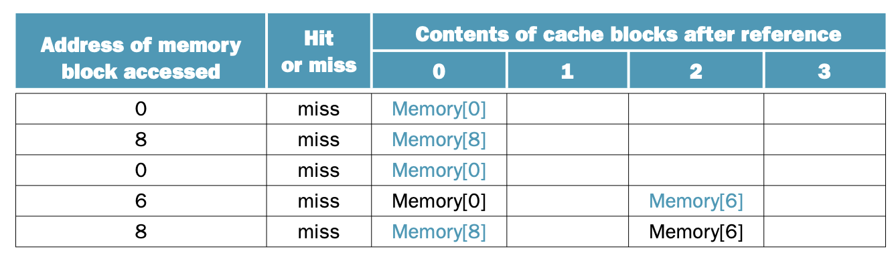

两路组相联，四个缓存块，所以有两个组，每个组两个块。下面是块号到组号的映射关系。

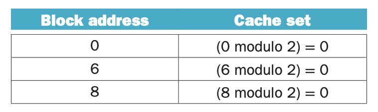

当选择的组所有块都被占用时，需要一个替换规则。最常见的替换规则是最近最少使用（`Least Recently Used`, `LRU`）的规则。后面会讨论其他替换规则。整个缓存命中时序图如下。五次访问，四次未命中，比直接映射少一次未命中。注意当访问块 6 的时候，根据 LRU 规则替换的块 8。

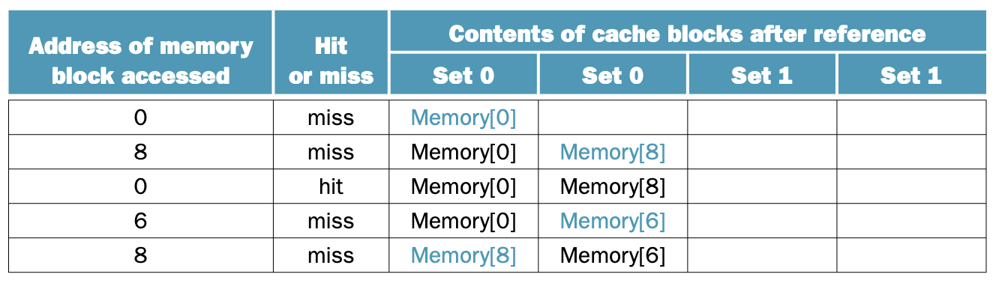

最后是全相联，即一个集合。性能最好，只有三次未命中。

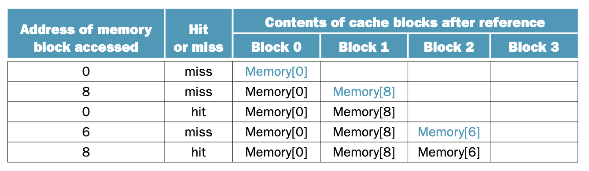

对于这个例子中出现的访问序列，最好成绩就是三次未命中，因为需要访问三个完全不同的块。如果有八个缓存块，那么两路组相联也能达到最好成绩，因为此时块 6 会到 Set2 中，Set0 中只需要缓存块 0 和 8，一个组两块，无需淘汰旧块。类似的，如果有 16 个缓存块，那么直接映射也能达到最好成绩。从这个简单的例子可以看出缓存大小和相联性对缓存性能的影响不是独立的。

相联性对减少缓存未命中有多大的影响呢？下图展示了 16 字大小的块，64KiB 的缓存，不同相联度的未命中率。从一路到两路，未命中率减少了 15%，更多路会有些微降低。

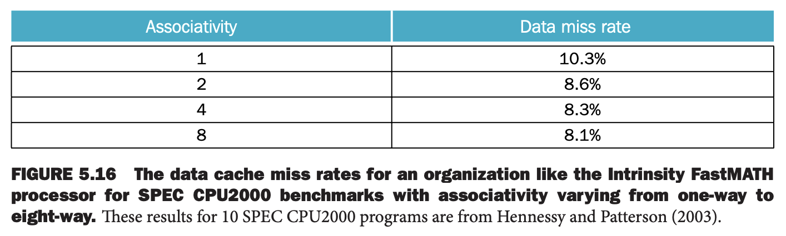

### Locating a Block in the Cache
类似直接映射缓存，组相联的每一个块包含一个标签，其来自块地址的一部分。找到合适的组后，组内每一个缓存块的标签都需要检查一遍，判断其是否与请求块地址一致。下图将地址分解成三个部分。

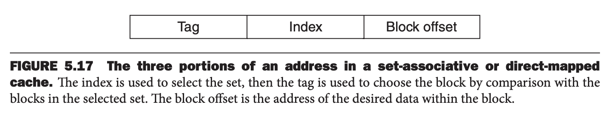

索引值用于寻找包含请求块的组，组内所有缓存块的标签都需要搜索一遍。由于速度至关重要，标签搜索是并行的。对于全相联缓存，顺序查找会导致寻找时间过长。

如果缓存大小不变，增加相联度会增加每个组的块数，即同时需要比较的标签数增加了：相联度增加一倍，组内块数增加一倍，组数减小一倍。相应地，索引部分少 1 比特，标签部分多 1 比特。对于全相联缓存，所有的块都需要并行检查。没有索引不分，整个地址除了块的偏移，都是标签部分。查找无法使用索引。

在直接映射缓存中，只需要一个比较器，因为每个块只可能在一个位置上，搜索靠索引。下图是四路组相联缓存，四个比较器，一个 4 到 1 的多路复用器，确定可能在组内的哪个位置上。

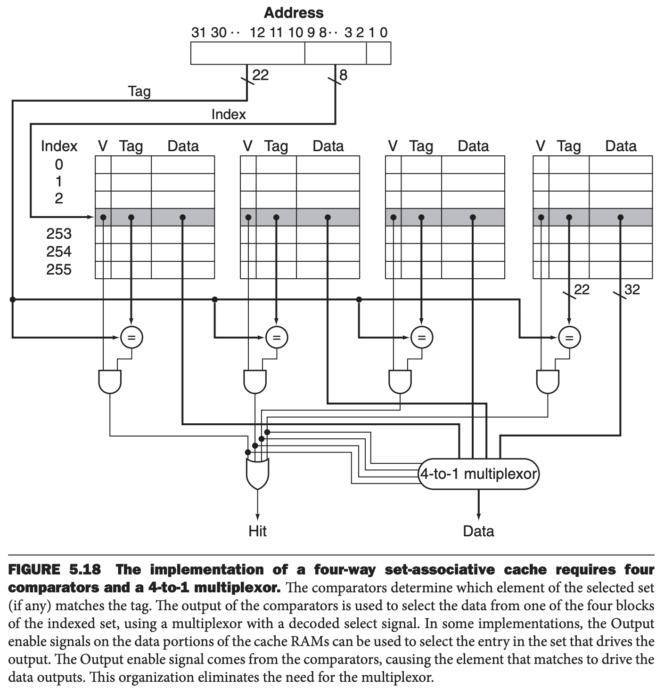

访问缓存由索引到相应的组和在组内搜索所有标签。组相联缓存的开销包括额外的比较器和由于比较和选择组内相应块的延迟开销。

选择直接映射、组相联、全相联缓存，依赖于缓存未命中的开销与实现相联的开销，这里的开销包括时间和额外的硬件。

### Choosing Which Block to Replace
直接缓存未命中，请求的块只能到一个位置上，如果位置被占用就替换。对于相联缓存，需要确定请求块放到哪个位置上，因此要选择一块被置换。对于全相联缓存，所有的块都是候选块。对于组相联缓存，被选择的组内的块是候选快。

最常用的策略是 LRU。通过跟踪每个元素何时被使用了来实现这种策略。对于一个二路组相联缓存，只需要一个比特就可以实现，其记录哪个块被使用了。随着相联度增加，实现 LRU 会变得困难。5.8 会分析其他替换成策略。

#### Size of Tags versus Set Associativity
增加相联度需要更多的比较器和标签比特来存放数据。假定一个缓存有 4096 块，每块四个字，32 位地址。求直接映射、两路组相联、四路组相联、全相联时组的个数和标签的比特数。

每一块有 16 字节，即 $2^4$，那么有 32-4=28 比特用于表示索引和标签。直接映射的组数和缓存块数相同，因此需要 12 比特（$2^{12}=4096$）表示索引，那么标签的比特数是 $(28-12)\times 4096=16\times 4096=66K$。

相联度每增加一倍，索引字段少一比特，标签字段多一个比特。因此，对于两路组相联，有 2048 个组，标签总比特数是 $(28-11)\times 2\times 2048=17\times 4096=70K$。对于四路组相联，有 1024 个组，标签总比特数是 $(28-10)\times 4\times 1024=18\times 4096=74K$。

全相联，一个组，其中包含 4096 块，每块的标签是 28 比特，那么总比特数是 $28\times 1\times 4096=115K$。

### Reducing the Miss Penalty Using Multilevel Caches
为了进一步缩小现代处理器的高时钟频率和访问 DRAM 的时间差，大部分处理器都使用多层缓存。二级缓存和处理器芯片在一起，当一级缓存未命中时，就会访问二级缓存。如何二级缓存有要请求的数据，那么一级缓存未命中的罚时是访问二级缓存的时间，远远小于访问内存的时间。如果一级缓存和二级缓存都未命中，那么不得不访问内存，此时开销就相当大了。

#### Performance of Multilevel Caches
假设一个处理器所有数据都在一级缓存时 CPI 是 1，时钟频率是 4GHz。内存访问时间是 100ns。一级缓存未命中的几率是 2%。如果添加一个二级缓存，访问时间是 5ns，比一级缓存大使得访问内存的几率降到 0.5%。处理器快了多少呢？

访问内存的罚时是
$$\frac{100\text{ns}}{0.25\frac{\text{ns}}{\text{clock cycle}}}=400\text{ clock cycle}$$
只有一级缓存时有效 CPI 是
$$1+400\times 2\%=9$$
添加了二级缓存，那么一级缓存未命中而访问二级缓存的罚时是
$$\frac{5\text{ns}}{0.25\frac{\text{ns}}{\text{clock cycle}}}=20\text{ clock cycle}$$
如果二级缓存命中了，那么罚时就是这么多了。如果二级缓存未命中，除了要付出访问二级缓存的开销外，还需要付出访问内存的开销。那么等效 CPI 是
$$1+20\times 2\%+400\times 0.5\%=3.4$$
因此处理器速度变快了
$$\frac{9}{3.44}=2.6$$
另外一种计算存储系统罚时的方法是最终在二级缓存命中时的额外开销是 $(2\%-0.5\%)\times 20=0.3$，最终需要访问内存时，需要考虑访问内存和二级缓存两者的开销，即 $0.5\%\times(400+20)=2.1$，那么总的等效 CPI 还是 3.4。

对于一级缓存和二级缓存，设计者需要考虑的点是不同的，因为另一个缓存的出现使得与单一缓存相比最佳实践变了。一级缓存的主要设计目标是减少命中时间使得时钟周期更短或者减少流水线阶段。二级缓存的主要设计目标是减少未命中率以减少访问内存的罚时。

通过对比每一级缓存与单一缓存的最佳设计可以看出对二级缓存的影响。相比单一缓存，多级缓存（`multilevel cache`）中的一级缓存通常更小，块大小也更小，未命中罚时也更小。二级缓存比单一缓存更大，因为访问二级缓存不是最关键的问题。块大小也更大，通常相联度也更大，减少未命中的概率。

下图的（a）是基数排序和快排查找每个元素的操作数。当数组比较大的时候，基数排序更有优势。不过从时间开销看，如（b）图，一开始与（a）类似，但是很快基数排序曲线就分叉上升了，即速度更慢。原因是平均每个元素而言基数排序的未命中概率更大，如图（c）所示。

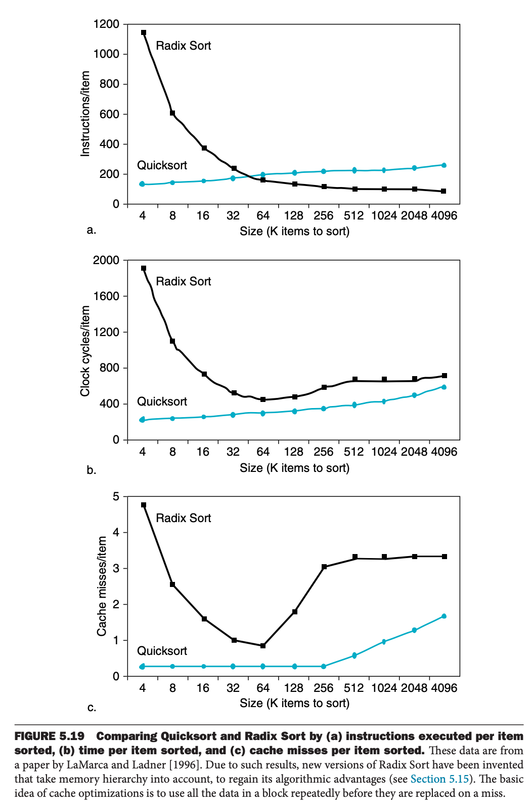

标准的算法分析会忽略存储层次对性能的影响。由于更快的时钟频率和摩尔定律允许设计者从指令流中榨干所有性能，因此充分利用存储层次对于高性能至关重要。因此，理解存储层次的能够更好的帮助理解程序的性能。

### Software Optimization via Blocking
存储层次对程序性能影响很大，那么重组数据的使用，提升局部性，降低缓存未命中，那么程序性能将有大幅提升。

数组连续存放在内存，如果顺序访问，性能很好。如果处理多维数组，一些数组按行访问，一些数组按列访问。那么行优先或者列优先存储都无法解决问题，因为在一次迭代过程中，列和行都需要被用到。

使用块算法来替代原有的整行或者整列的访问，在数据被替换之前最大化访问缓存中的数据，提高时间局部性，减少缓存未命中。

考虑下面这段代码
```c
for (int j = 0; j < n; ++j)
{
    double cij = C[i + j * n]; /* cij = C[i][j] */
    for (int k = 0; k < n; k++)
        cij += A[i + k * n] * B[k + j * n]; /* cij += A[i][k]*B[k][j] */

    C[i + j * n] = cij; /* C[i][j] = cij */
}
```
这段代码需要读取 $N\times N$ 个 `B` 中的元素，读取对应的 `A` 中的一行 $N$ 个元素，写到 `C` 对应行的 $N$ 个元素中。下图是访问访问这三个数组的情况。深色表示正在访问的数据，浅色表示之前访问的数据，白色表示还没有访问的数据。

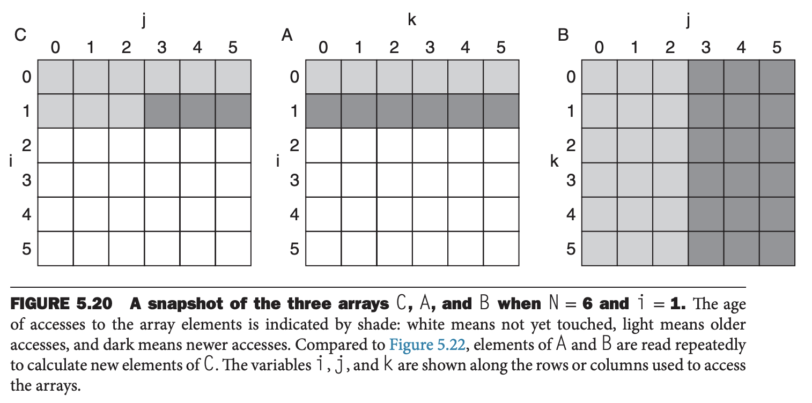

缓存未命中的次数依赖于 $N$ 的大小和缓存大小。如果缓存能够放下 三个数组，即 $3\times N\times N$ 个元素，非常好，没有缓存冲突，未命中次数最低。

如果缓存能放下一个数组 $N\times N$ 和一行 $N$ 个元素，那么数组 `B` 和 `A` 的第 `i` 行会留在缓存中。如果缓存比这还小，那么访问 `B` 和 `C` 就会出现未命中。最差情况，对于 $N^3$ 次操作，最多会有 $2N^3+N^2$ 次内存访问。

为了确保正在被访问的数据能够放到缓存中，我们改写代码，一次计算一块，即一个子矩阵。
```c
#define BLOCKSIZE 32

void do_block(int n, int si, int sj, int sk, double *A, double *B, double *C)
{
    for (int i = si; i < si + BLOCKSIZE; ++i)
        for (int j = sj; j < sj + BLOCKSIZE; ++j)
        {
            double cij = C[i + j * n]; /* cij = C[i][j] */
            for (int k = sk; k < sk + BLOCKSIZE; k++)
                cij += A[i + k * n] * B[k + j * n]; /* cij+=A[i][k]*B[k][j] */

            C[i + j * n] = cij; /* C[i][j] = cij */
        }
}

void dgemm(int n, double *A, double *B, double *C)
{
    for (int sj = 0; sj < n; sj += BLOCKSIZE)
        for (int si = 0; si < n; si += BLOCKSIZE)
            for (int sk = 0; sk < n; sk += BLOCKSIZE)
                do_block(n, si, sj, sk, A, B, C);
}
```
这样，内存访问次数降至 $2N^3/\text{BLOCKSIZE}+N^2$。提升了 `BLOCKSIZE` 倍。块分割提高了时间局部性（访问 `B` 数据）和空间局部性（访问 `A` 数组）。依赖于处理器和矩阵的大小，使用块算法能够提升 2 到 10 倍的性能。下图是使用块算法访问三个数组的情况。

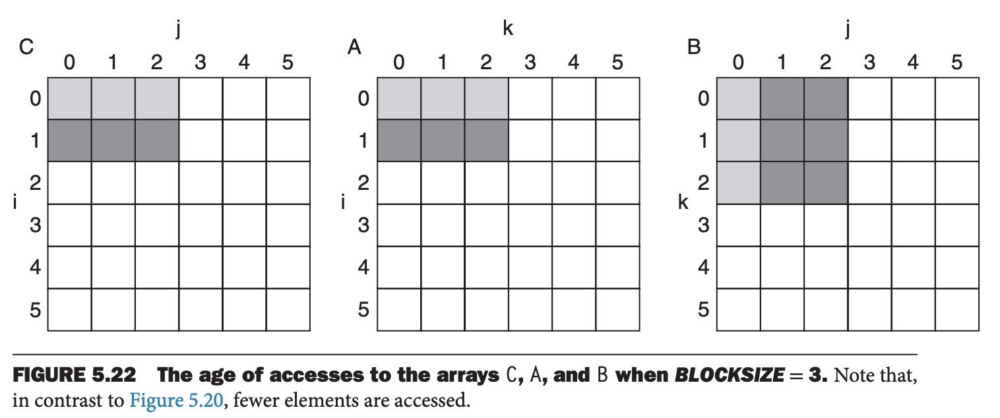

尽管这里的目的是减少缓存未命中，块算法也能用于帮助寄存器分配。如果快足够小，寄存器能够放下整块的数据，那么能最小化存储和加载指令数量，提升程序性能。

### Summary
这一节分析了四个问题：缓存的性能，使用相联性减少缓存未命中，使用多级缓存减少未命中罚时，软件优化以提升缓存利用率。

