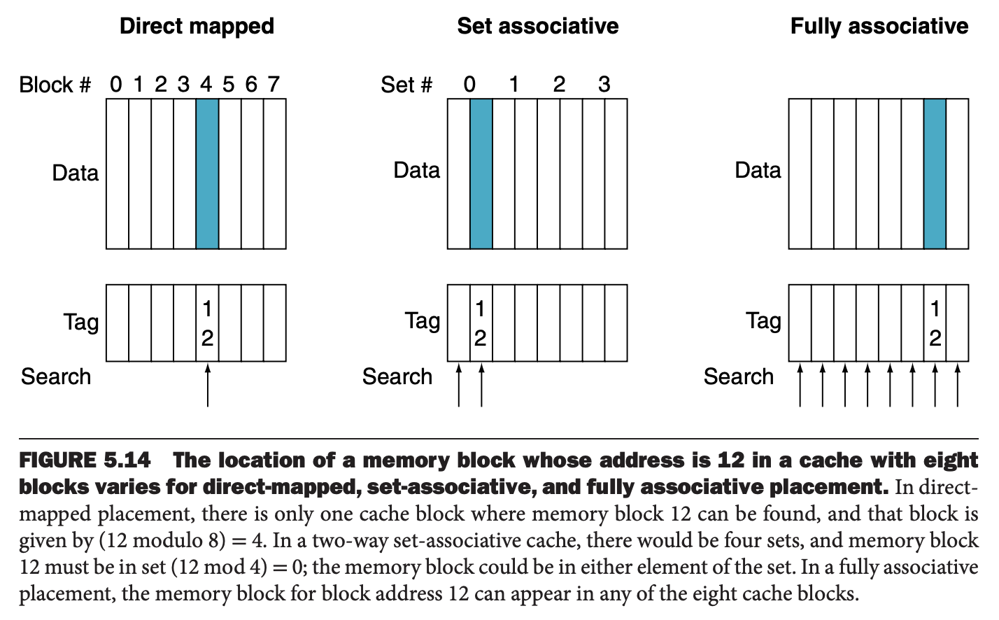
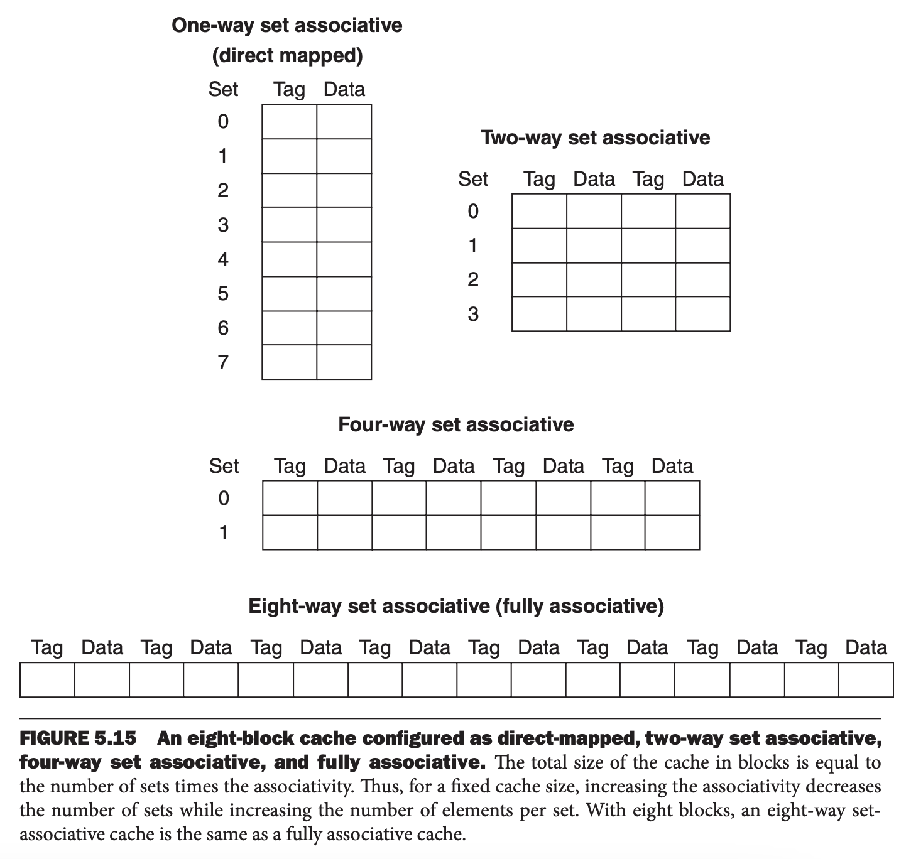
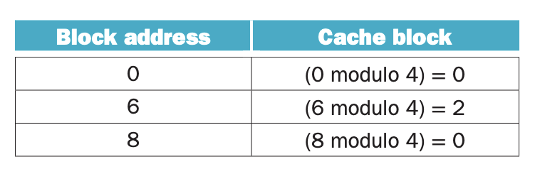
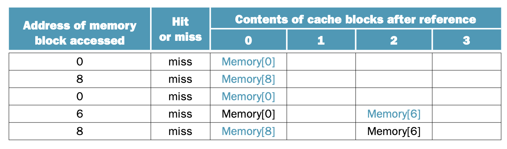
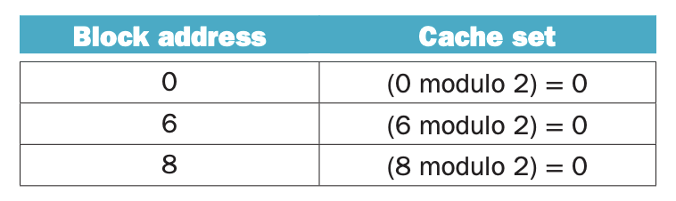
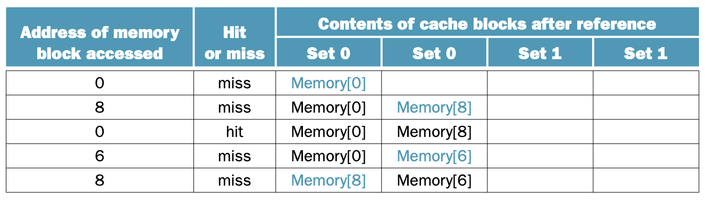
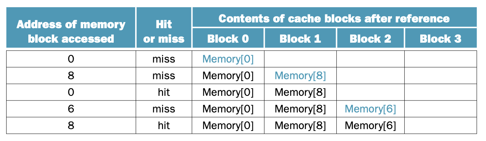
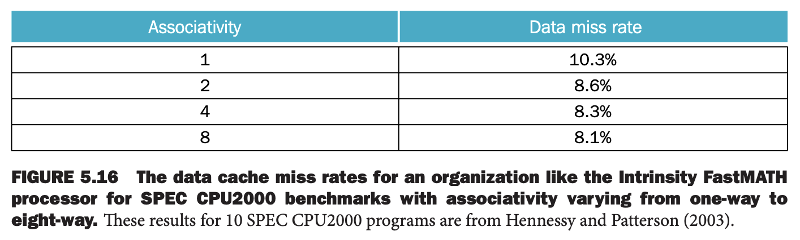

这一节分析测量和提高缓存性能。这里会分析两种提升性能的技术。第一个技术是通过降低两个不同块争夺同一缓存位置的概率来降低未命中率。第二个技术是通过增加存储层次降低缓存未命中时的罚时。后者称为多级缓存（`multilevel caching`）。上世纪 90 年代出现在高端商务机上，售价超过 10 万美元！现在，个人移动设备也使用了多级缓存技术。

CPU 时间可以分为用于执行程序的时钟周期和用于等待存储系统的时钟周期。通常，我们假设命中的缓存访问的成本是正常执行周期的一部分。
$$\text{CPU time}=(\text{CPU execution clock cycles}+\text{Memory-stall clock cycles})\times\text{Clock cycle time}$$
存储暂停主要的时间开销是缓存未命中。我们的讨论局限于简化的存储系统模型。对于真实处理器而言，读写导致的暂停非常复杂，准确的性能预测需要对处理器和存储系统进行详实的模拟。

存储暂停时钟周期可以定义为来自写的时钟暂停和来自读的时钟暂停之和。
$$\text{Memory-stall clock cycles} = (\text{Read-stall cycles}+ \text{Write-stall cycles})$$

读暂停周期是一个程序读的次数，乘以读缓存未命中率，再乘以读缓存未命中的罚时。
$$\text{Read-stall cycles}=\frac{\text{Reads}}{\text{Program}} \times \text{Read miss rate} \times\text{Read miss penalty}$$

写操作会更复杂一点。对于直写策略来说，暂停来自两个方面：写未命中，通常需要在继续写之前取回请求的快；写缓冲区，当写发生时写缓冲区满了。因此写暂停周期分成了下面两个部分
$$\text{Write-stall cycles}=(\frac{\text{Writes}}{\text{Program}}\times \text{write miss rate}\times \text{Write miss penalty})+\text{Write buffer stalls}$$
由于写缓冲区暂停依赖于接近的写操作而不是写的频率，不太可能给出一个简单的公式来描述写缓冲区暂停。幸运地是，如果一个系统有合理的写缓冲区大小（四个字或者更多），内存接受写的速率远超过程序平均写的速率，比如超过一倍（速率比是 2），那么写缓冲区暂停概率很低，可以忽略。如果不符合这些评价标准，那么设计的不足够好。设计者应该使用更大的写缓冲区或者回写策略。

回写策略会增加额外的暂停，因为当一个块需要被替换时，可能需要将这一块写回内存。详见 5.8 小节。

对于大部分直写架构，读和写的未命中罚时是一样的，即从内存中取回块的时间。如果假定写缓冲区暂停可以忽略，那么读写暂停时钟周期可以使用同一个公式
$$\text{Memory-stall clock cycles}=\frac{\text{Memory accesses}}{\text{Program}} \times\text{Miss rate}\times\text{Miss penalty}$$
也可以写作
$$\text{Memory-stall clock cycles}=\frac{\text{Memory accesses}}{\text{Program}} \times\frac{\text{Misses}}{\text{Instruction}}\times\text{Miss penalty}$$

#### Calculating Cache Performance
假定指令缓存的未命中率是 2%，数据缓存的未命中率是 4%。没有内存暂停时处理器的 CPI 是 2，未命中罚时是 100 个周期。加载和存储指令占比是 36%，那么如果没有未命中的速度比存在未命中的速度快多少呢？

假定指令数是 $I$，那么指令缓存未命中时暂停的时钟周期数是
$$\text{Instruction miss cycles} = I\times 2\%\times 100=2I$$
加载和存储指令占比 36%，那么数据缓存未命中导致的暂停时钟周期数是
$$\text{Data miss cycles}=I\times 36\%\times 4\%\times 100=1.44I$$
那么内存暂停总时钟周期数是 $3.44I$。平均每条指令会有 3.44 个时钟周期的暂停，那么包含时钟暂停的总 CPI 是 5.44。由于指令数和时钟周期不变，那么要计算的比值是
$$\begin{aligned}
\frac{\text{CPU time with stalls}}{\text{CPU time with perfect cache}}&=\frac{I\times\text{CPI}_{\text{stall}}\times\text{Clock cycle}}{I\times\text{CPI}_{\text{perfect}}\times\text{Clock cycle}}\\
&=\frac{\text{CPI}_{\text{stall}}}{\text{CPI}_{\text{perfect}}}\\
&=\frac{5.22}{2}\\
&=2.72
\end{aligned}$$
所以完美缓存（无暂停）的性能会好 2.72 倍。

如果处理器性能提升而存储系统性能没有提升，那么内存暂停导致的开销占比会继续上升。下面是一个简单的例子，假定处理器的性能通过将 CPI 从 2 降到 1 提升了一倍（可能是流水线带来的提升），那么缓存未命中的系统 CPI 是 4.44，而理想状态下 CPI 是 1，性能是前者的 4.44 倍。

内存暂停花费的时间占比从 $\frac{3.44}{5.44}=63%$ 提高到了 $\frac{3.44}{4.44}=77%$。

类似的，提高时钟频率但是不提升存储系统性能，也会增加缓存未命中导致的性能损失。

前面的例子中假定命中时间不是决定缓存性能的因素。如果缓存命中时间增加了，那么从存储系统读取字的开销肯定变大了，或许会导致处理器时钟周期的提高。增加缓存大小就是这样一个例子，本小节后面还会看到另一个例子。一个更大的缓存往往有更大的访问开销。由于缓存命中时间增加，可能会导致流水线增加一个阶段。分析更长的流水线对性能的影响是非常复杂的。在某些时候更大的缓存提升了命中率但是提高了命中时间，最终导致降低了处理器的性能。

为了获取命中和未命中的访问时间都会影响性能，设计人员有时会用平均内存访问时间（`average memory access time`, `AMAT`）来评估。平均访问时间考虑了命中和未命中的访问时间和两者的频率，公式如下
$$\text{AMAT} = \text{Time for a hit} + \text{Miss rate} \times \text{Miss penalty}$$

#### Calculating Average Memory Access Time
一个处理器时钟频率是 1ns，未命中罚时是 20 个时钟周期，未命中率是 0.05，命中缓存访问时间是一个时钟周期。假定读和写的罚时一样并且忽略其他的写暂停开销。那么平均内存访问时间是
$$\begin{aligned}
\text{AMAT}&=\text{Time for a hit} + \text{Miss rate} \times \text{Miss penalty}\\
&=1+0.05\times 20\\
&=2
\end{aligned}$$
两个时钟周期，即 2ns。

下面分析另一种缓存架构，减少了命中率，但是有时可能会增加命中访问时间。更多的例子参考 5.16。

### Reducing Cache Misses by More Flexible Placement of Blocks
对于将块放到缓存的哪里，存在不同的策略。直接映射，一个块只能放在某一个位置，是其中一个极端策略。

另一个极端策略是一个块可以放在任意位置。这种策略称为全相联（` fully associative`）。为了在全相联缓存中找到一个块，缓存中的所有记录都需要搜索一遍。为了使得搜索切实可行，使用与每个缓存记录关联的比较器进行并行执行。这些比较器大大增加了硬件成本，所以全相联策略仅在块数很少的缓存中可行。

介于直接映射和全相联之间的一种设计称为组相联（`set associative`）。在组相联缓存中，每一个块可以放到一组固定位置上。对于一个块，如果有 $n$ 个位置可以放，那么称为 $n$ 路组相联缓存。一个 $n$ 路组相联缓存包含一些组，每个组包含 $n$ 块，一个块能够放到某个组的任意位置上。因此组相联是直接映射和全相联的组合：一个块直接映射到一个组，匹配时需要搜索组内的所的块。下图是块 12 放到一个由 8 个块组成的缓存中，三个图的策略不同。

对于组相联，下面的公式确定内存块所述的集合
$$\text{Block number}\operatorname{mod}\text{(Number of sets in the cache)}$$
一个块能放在一个组的任意位置上，所以必须搜索集合的所有位置。对于全相联，块能放到任意位置，所以必须搜索缓存的所有位置。

这些策略是组相联的变形。下图是 8 个块组成、使用不同策略的缓存。直接映射是一路组相联，每一个缓存记录只能保存一个块，每个组也只有一个位置。全相联有 $m$ 个记录，是一个 $m$ 路的组相联缓存，只有一个组，这个组有 $m$ 个位置。

增加关联的程度可以减少未命中率，但是会潜在增加命中的时间。

#### Misses and Associativity in Caches
假定有三个缓存，每个缓存包含四个一个字的块。第一个使用直接映射策略，第二个是两路组相联，第三个是全相联。访问序列对应的块地址分别是 0,8,0,6,8。

首先分析直接映射，下面是块号到缓存块索引的映射关系。

下图展示了缓存使用的时序图。直接映射五次访问，五次未命中。

两路组相联，四个缓存块，所以有两个组，每个组两个块。下面是块号到组号的映射关系。

当选择的组所有块都被占用时，需要一个替换规则。最常见的替换规则是最近最少使用（`Least Recently Used`, `LRU`）的规则。后面会讨论其他替换规则。整个缓存命中时序图如下。五次访问，四次未命中，比直接映射少一次未命中。注意当访问块 6 的时候，根据 LRU 规则替换的块 8。

最后是全相联，即一个集合。性能最好，只有三次未命中。

对于这个例子中出现的访问序列，最好成绩就是三次未命中，因为需要访问三个完全不同的块。如果有八个缓存块，那么两路组相联也能达到最好成绩，因为此时块 6 会到 Set2 中，Set0 中只需要缓存块 0 和 8，一个组两块，无需淘汰旧块。类似的，如果有 16 个缓存块，那么直接映射也能达到最好成绩。从这个简单的例子可以看出缓存大小和关联性对缓存性能的影响不是独立的。

关联性对减少缓存未命中有多大的影响呢？下图展示了 16 字大小的块，64KiB 的缓存，不同关联度的未命中率。从一路到两路，未命中率减少了 15%，更多路会有些微降低。

### Locating a Block in the Cache
