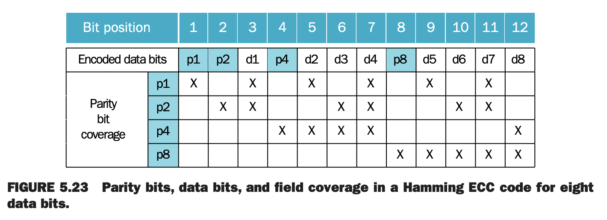

之前的分析隐含了一个假设：存储系统不会出错。速度快但是不可靠的系统是没有吸引力的。提升可靠性（`dependability`）的关键思想是冗余。首先定义如何评估故障，然后分析冗余是如何使得存储系统不出错的。

### Defining Failure
可靠性（`reliability`）是指连续正常服务的指标，也可以用故障时间表示。平均故障时间（`mean time to failure`, `MTTF`）是一种可靠性的指标。另一个术语是年故障率（`annual failure rate`, `AFR`），给定 MTTF 计算出一年中故障的百分比。MTTF 很大时会有些误导，使用 AFR 比较直观。

#### MTTF vs. AFR of Disks
现在的硬盘 MTTF 超过一百万小时。$1000000/365/24=114$，似乎不会被用坏。现代数仓服务，比如搜索，有超过 50,000 台机器，假定每台机器有两块硬盘。下面使用 AFR 估计每年坏多少硬盘。

一年是 $365\times 24=8760$ 小时，MTTF 是 1,000,000 意味着 AFT 是 $8760/1000000=0.876\%$。100,000 块硬盘，意味着每年坏 876 块硬盘，每天坏两块。

平均修复时间（`mean time to repair`, `MTTR`）是服务中断的指标。平均故障间隔时间（`mean time between failures`, `MTBF`）是 MTTF 和 MTTR 之和。尽管 MTTR 使用很广泛，不过 MTTF 是更合适的术语。可用性（`availability`）是衡量服务正常情况的指标，量化值是
$$\text{Availability}=\frac{MTTF}{MTTF+MTTR}$$
可靠性和可用性是两个可以量化的指标。减少 MTTR 和增加 MTTF 一样，都能提高可用性。比如，故障检测、诊断、修复的工具可以有效减少修复故障的时间，以此提高可用性。

可用性越高越好。一般使用一年几个九表示可用性。比如一个好的互联网服务应该达到四个或者五个九。一年 365 天，$365\times 24\times 60=526000$ 分钟。一个九表示有 36.5 天可以维护。两个九只有 3.65 天可以维护。三个九有 526 分钟可以维护。四个九只有 52.6 分钟。五个九只剩 5.26 分钟了。小技巧，五个九五分钟。

为了增加 MTTF，可以提高各个组件的质量或者让系统在组件故障出现时仍旧可以服务。因此，故障需要严格定义，组件故障不意味着系统故障。这里有三种方式提高 MTTF。

1. 故障避免：阻止故障的发生。
2. 容错性：使用冗余使得故障发生时能够保证服务正常。
3. 故障预测：预测故障的产生，在故障发生前替换组件。

### The Hamming Single Error Correcting, Double Error Detecting Code (SEC/DED)
Richard Hamming 发明了一种流行的内存冗余机制，因此获得了图灵奖。汉明距离（`Hamming distance`）是任意两个正确的比特模式间不相同的比特数的最小值。比如 0**1**1**0**11 和 0**0**1**1**11 的距离是 2。如果有一种编码，最小距离是 2，有一个比特错了，那么从一个有效的比特模式变成了一个无效的错误的比特模式。通过这种方式可以检测到一个比特的错误，我们称之为一比特检错码（`error detection code`）。

汉明使用奇偶校验码（`parity code`）进行错误检测。对于奇偶校验码，我们只计算 1 的个数，奇数个 1 是奇校验，否则是偶校验。当一个字写入内存的时候，校验比特也同时写入。$N+1$ 个比特一定是偶校验。当读出一个字的时候，校验比特也同时读出并做检查。如果校验比特不匹配，那么出错了。

计算用一个字节保存十进制 31 时的校验码。假定校验码在最右一位。在内存中最高比特发生了反转，读出的时候，能检测到错误码？如果最高的两位比特发生了反转，能检测到错误码？

31 的二进制是 00011111，五个 1，所以校验比特是 1，写入内存的是 00011111**1**。如果最高比特反转了，看到的是 **1**00111111，七个 1，奇校验，发生了错误。如果最高的两个比特都发生了反转，读出的数据是 **11**0111111，八个 1，偶校验，无法检测出错误。

由于两个比特的错误使得校验成功，所以 1 比特校验机制无法检测出两个比特的错误。事实上，可以校验出奇数个比特发生错误的情况。不过三个比特错误的概率远远小于两个比特错误的概率，所以实践中 1 比特校验码仅用于一比特错误。

汉明还希望校验码能够纠正错误。如果编码最小距离是 3，那么一个比特出错时会距离某个正确的模式更近。使用 `Hamming Error Correction Code` `ECC` 编码可以做到这个事情。下面是编码过程

1. 相比传统的最右一位标记成 0，这里从左起第一位开始标记为 1。
2. 2 的幂次的位是校验位，如 1,2,4,8,16 等。
3. 其他位置用于存放数据。
4. 每一个校验位校验的比特位置如下，每一个数据比特位至少有两个校验位。
    1. 第一个比特 0001 校验比特 1,3,5,7,9 等，最右一位是 1，0001,0011,0101,0111,1001 等。
    2. 第二个比特 0010 校验比特 2,3,6,7,10 等，右起第二位是 1。
    3. 第四个比特 0100 校验比特 4-7,12-15 等，右起第三位是 1。
    4. 第八个比特 1000 校验比特 5-15,24-31 等，右起第四位是 1。
5. 为每一组计算校验位，使其是偶校验。

通过查询校验位，能够知道那个比特发生了反转。如上图 12 个比特，假定四个校验比特 $p_8,p_4,p_2,p_1$ 是 0000。如果校验比特是 1010，十进制是 10，那么 ECC 告诉我们比特 10（$d_6$）出错了。因为是二进制，所以只要反转比特 10 即可修复数据。

一个字节的数 10011010。为了计算校验比特，12 比特写作 __1_001_1010。第一个比特校验比特 1,3,5,7,9,11，高亮一些对应比特 __**1**_**0**0**1**\_**1**0**1**0，四个 1 了，偶检验，所以比特 1 是 0。第二个比特校验比特 2,3,6,7,10,11，0\_**1**_0**01**_10**10**，三个 1，所以第二个校验比特是 1。第四个比特校验比特 4,5,6,7,12，011\_**001**_101**0**，一个 1，所以第三个校验比特是 1。第八个比特校验 8,9,10,11,12，0111001\_**1010**，两个 1，所以第四个校验比特是 0。因此最后加上校验比特的结果是 011100101010。

假定比特 10 反转了，011100101**1**10。第一个比特，**0**1**1**1**0**0**1**0**1**1**1**0，四个 1，偶校验，没错。第二个比特，0**11**10**01**01**11**0，五个 1，奇校验，出错了。第四个比特，011**1001**0111**0**，两个 1，偶校验，没错。第八个比特，0111001**01110**，三个 1，奇校验，出错了。所以第十个比特出错了，需要将其反转，得到正确的数。

汉明继续探索。再额外增加一个比特，汉明距离是 4，那么我们可以纠正一个比特的错误并且能够检测到两个比特的错误。实现方式是对于整个数据增加一个校验比特。下面以 4 比特数据为例。需要额外三位（$p_1,_2,P3$）作为校验位进行一比特恢复，额外再增加一个比特（$p_4$）的奇偶校验位。

|||||||||
|--|--|--|--|--|--|--|--|
| 1 | 2 | 3 | 4 | 5 | 6 | 7 | 8 |
| $p_1$ | $p_2$ | $d_1$ | $p_3$ | $d_2$ | $d_3$ | $d_4$ | $p_4$ |

下面使用 H 表示 $p_1,p_2,p_3$ 三个ECC 组，$p_4$ 是全部数据的奇偶校验。有如下四种情况：

1. H 是偶校验，$p_4$ 偶校验，没有错误。
2. H 是奇校验，$p_4$ 也是奇校验，有一个可以纠正的比特错误。
3. H 是偶校验，$p_4$ 是奇校验，说明 $p_4$ 自己出错了，纠正 $p_4$ 这个比特。
4. H 是奇校验，$p_4$ 是偶校验，有两个比特发生了错误。

单比特错误纠正/双比特错误检测（`Single Error Correcting`, `SEC`; `Double Error Detecting`, `DED`）普遍应用于服务器内存。8B 数据块需要额外一个字节，因此很多 DIMM 是 72 bits 宽。

对 SEC 而言，令 $p$ 表示额外的校验比特数，$d$ 表示数据比特数，那么总数是 $p+d$。如果 $p$ 能够指出错误的是哪一个比特 $p+d$，也能表示没出错，就需要满足如下不等式
$$2^p\leq p+d+1$$
即
$$p\leq\log(p+d+1)$$
比如，8 比特数据需要满足 $2^p\leq p+8+1$，那么 $p=4$。$p=5$ 满足 16 比特数据要求，$p=6$ 是 32 比特，$p=7$ 是 64 比特。

在非常大的系统中，单个宽内存芯片出现多个错误和故障的概率变大。IBM 引入了 chipkill 来解决这个问题，许多大型系统都是用这一技术。Intel 称为 SDDC。类似磁盘的 RAID 技术，chipkill 将数据和 ECC 信息重组，通过支持从其他内存芯片重建丢失的数据来解决单个内​​存芯片彻底故障的问题。假定 10000 个处理器，每个 4GiB 内存，IBM 计算了不可恢复的错误出现的频次

1. 只有校验码时，90000 次，大约每 17 分钟一次不可恢复和检测不到的错误。
2. 仅使用 SEC/DED，3500，大约每 7.5 小时一次不可恢复或检测不到的错误。
3. chipkill，6，每 2 个月出现一次不可恢复或检测不到的错误。

因此，chipkill 对大型系统是必备的。
