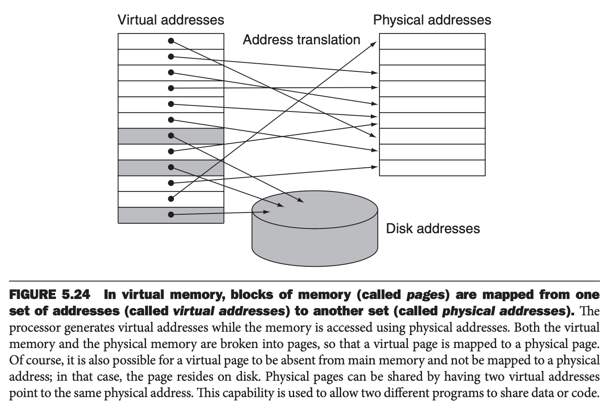
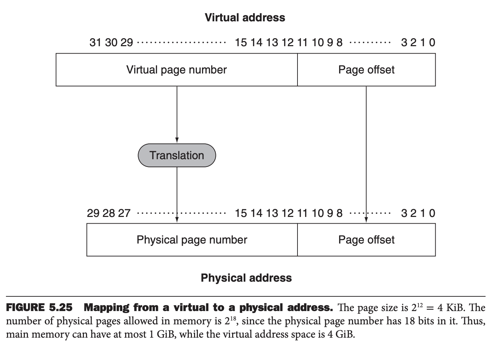
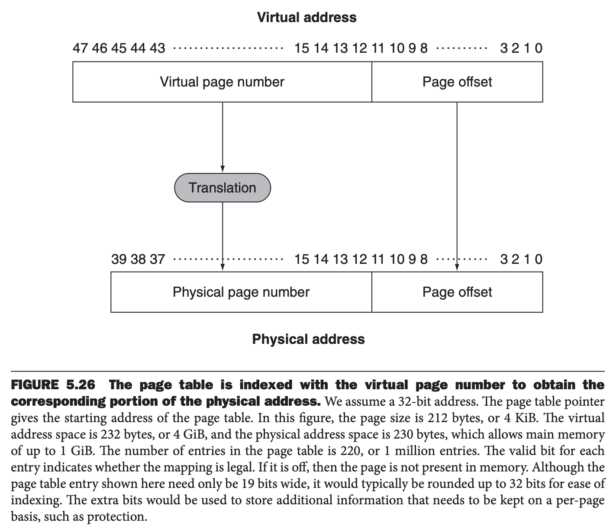
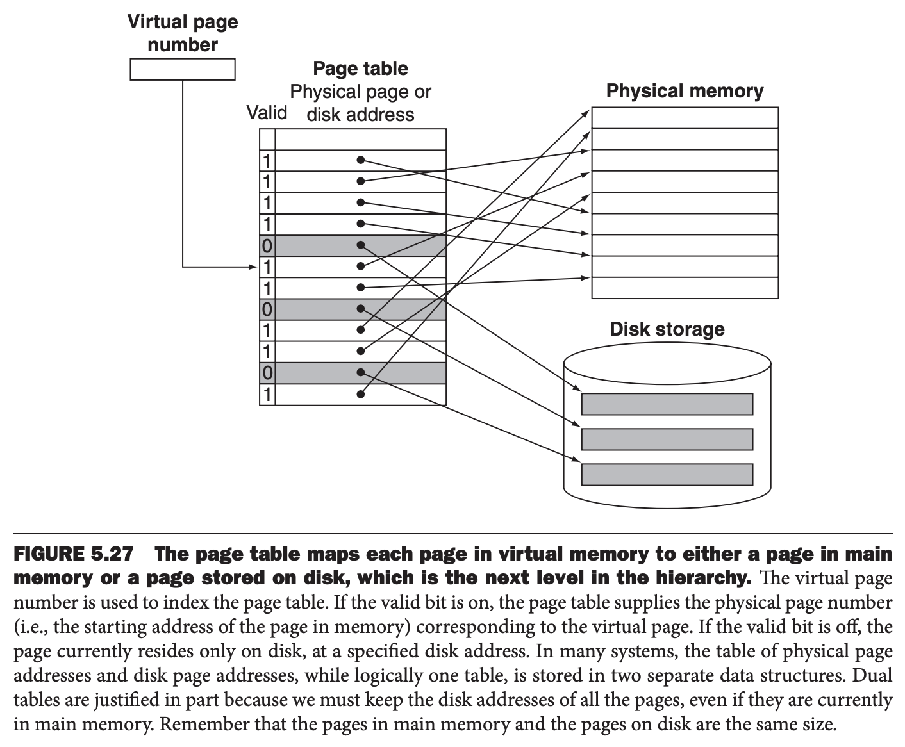
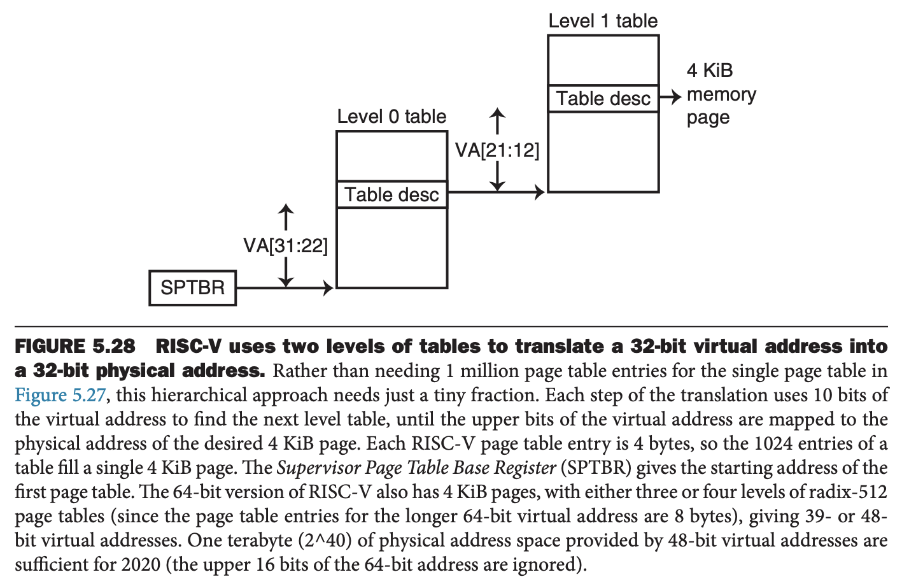
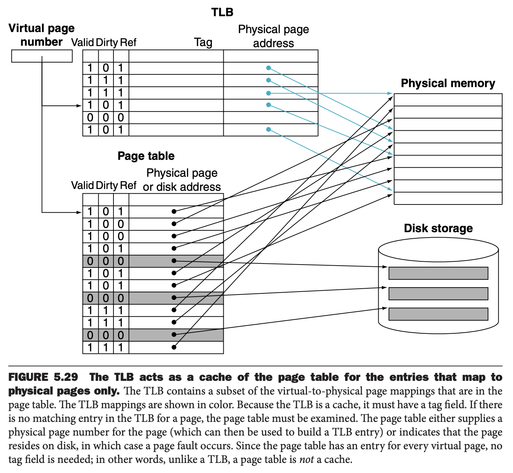
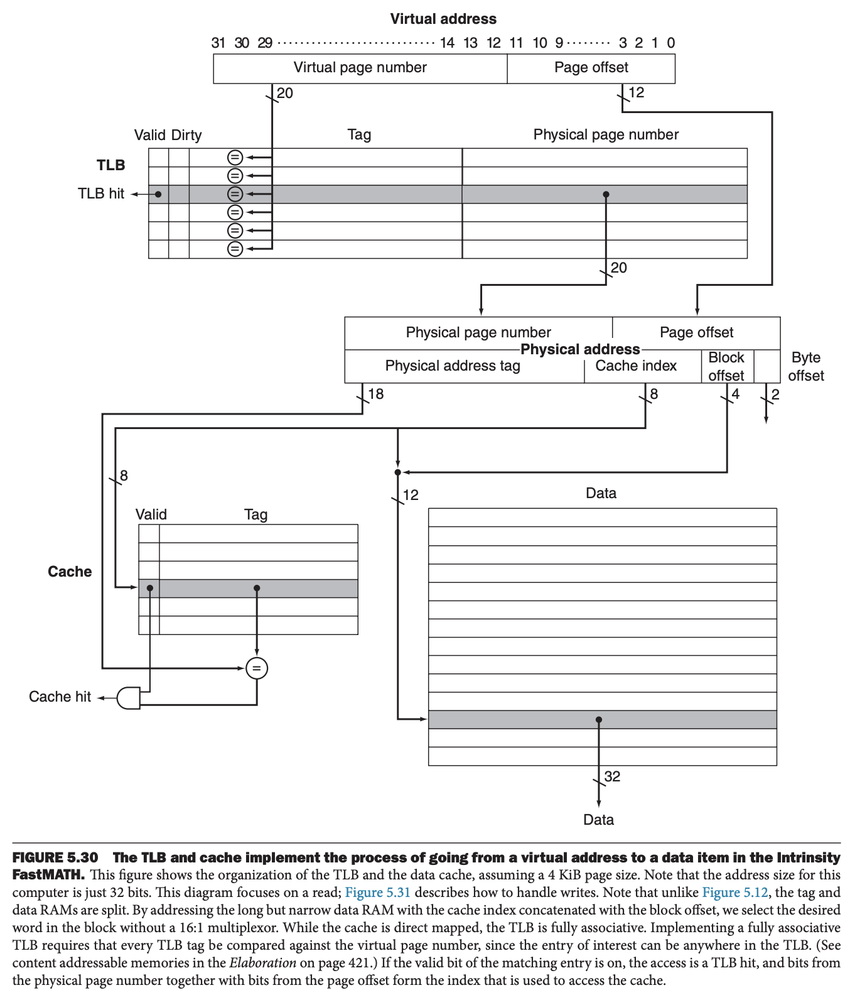
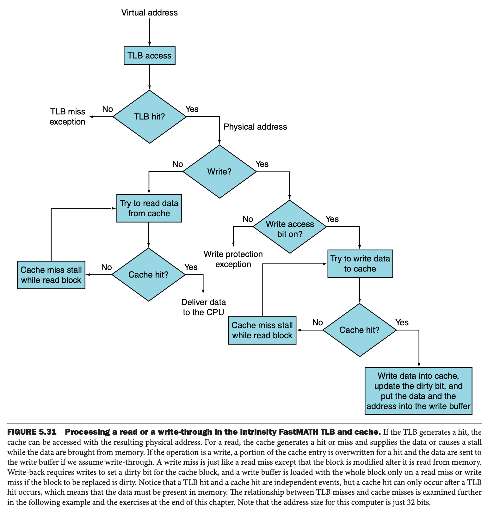
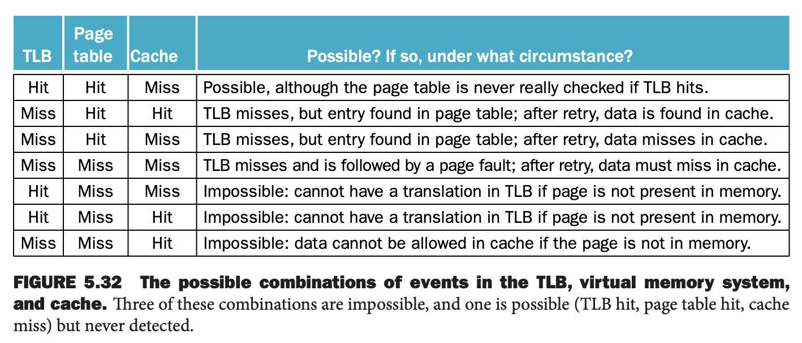

前面讨论了缓存是如何提高访问程序最近访问的数据和指令的性能的。类似的，内存（主存）能够扮演次级存储的缓存，后者往往使用磁盘存储数据。这种技术称为虚拟内存（`virtual memory`）。从历史角度看，有两个动机：一是在若干个程序间高效安全的共享内存，比如多个虚拟机共享的内存；二是突破小内存的限制，减轻程序员负担。几十年过去了，前者是主要原因。

为了允许多个虚拟机共享内存，必须确保多个虚拟机是隔离的，程序只能读写分配给它的内存。内存只需要保留多个虚拟机使用的部分，就和缓存只存储程序中活动的部分。因此，局部性原理对虚拟内存也适用，虚拟内存能够高效共享处理器和内存。

当编译虚拟机的时候，我们不知道虚拟机要与哪些虚拟机共享内存。事实上，当虚拟机运行时，虚拟机共享内存会剧烈变化。因此，我们将每个程序编译到自己的地址空间（`address space`），这些地址只有当前程序可以访问。虚拟内存将程序的地址空间转译到物理地址（`physical addresses`）。这个转译过程会加强对程序地址空间的保护，是其他虚拟机不受影响。

第二个动机使得单个用户程序可以超过内存的大小。很早之前，如果一个程序过大，程序员需要将程序切分为若干个部分，每个部分之间是互斥的，且能够放到内存中。覆盖（`overlay`）指的就是在程序运行时加载或者卸载需要的部分，程序员需要确保程序不会访问没有加载的部分，还需要保证覆盖部分能够放到内存中。这也是传统组织模块的方式，每一个模块包含数据和代码。

可以想象，这对程序员而言是巨大的负担。虚拟内存，发明的目的就是要解决这个问题，自动的管理存储层次中内存和次级存储这两层。

虚拟内存和缓存的概念相同，但是由于历史原因，使用不同的技术术语。虚拟内存的块称为页（`page`），虚拟内存未命中称为缺页（`page fault`）。处理器处理的是虚拟地址（`virtual address`），由软件和硬件转译为物理地址，后者用于访问内存。下图展示了从虚拟地址到内存地址的映射。这个过程称为地址映射（`address mapping`）或地址转换（`address translation`）。现在个人移动设备中，虚拟内存控制的是 DRAM 和闪存这两层；服务器端往往是 DRAM 和磁盘这两层。（成书时间比较早，现在很多服务器也是 DRAM 和 闪存了。）

虚拟内存还通过提供重定位（`relocation`）简化程序的加载和执行。重定位将程序使用的虚拟地址映射到不同的物理地址，然后再使用这些地址访问内存。重定位使得我们可以将程序加载到内存的任意位置。现在，所有的虚拟内存系统将程序看做是固定大小的块（页）来重定位程序，这样无需再寻找连续内存来存储程序，操作系统只需要在内存中找到充分的页即可。

在虚拟内存中，地址被分为虚拟页号（`virtual page number`）和页偏移（`page offset`）。下图是将虚拟页号转译成物理页号（`physical page number`）的过程。

本书使用 32 位地址。这里假设物理内存是 1GB，需要 30 比特地址。64 位版本支持更大的虚拟和物理内存。物理页号是物理地址的高位部分，低位部分是页偏移，这一部分不变。页偏移字段的比特数决定了页的大小。可寻址的虚拟地址页数可以与可寻址的物理地址页数不同。前者往往更大，给人虚拟内存很大的假象。

虚拟内存的设计主要由缺页引起的巨大开销驱动。缺页可能需要数百万时钟周期，这比内存要慢十万倍这个数量级。巨大的未命中罚时，主要受读取页的第一个字的时间影响，使得我们在设计虚拟内存时需要考虑下面几个关键决策：

1. 页应该充分大来分摊高的访问时间。典型值从 4KiB 到 64KiB。新的桌面系统和服务器支持 32KiB 和 64KiB，不过新的嵌入式系统向另一个方向发展，比如 1KiB。
2. 减少未命中率是很有益的。主要技术是使用全相联策略。
3. 缺页可以使用软件来处理，比起访问磁盘的时间，这些额外开销要小得多。同时，软件可以使用更好的算法来选择页面替换，因为很小的未命中率的下降收益都比这些算法的开销要高。
4. 直写在虚拟内存场景不合适，因为写太耗时。虚拟内存采用回写机制。

### Placing a Page and Finding It Again
由于缓存未命中罚时相当大，设计者通过优化页面替换来减少缺页的频率。如果虚拟页能够被映射到任意一个物理页，那么操作系统就能选择任意页进行替换。比如，操作系统可以使用精妙的算法和负载的数据结构来跟踪页的使用，尝试选择一个长期不用的页淘汰掉。使用巧妙灵活的替代策略可以减少缺页率，简化全相联策略的使用。

5.4 节讨论过，全相联的难点在于寻找一个记录，因为可以放到上层存储的任意位置。全扫描是不可行的。在虚拟内存中，使用一个索引内存的表来定位页，这个结构称为页表（`page table`），其常驻内存。页表索引的是虚拟地址的页号，对应的是相应的物理页号。每一个程序有自己的页表。我们将会看到，页面可能包含不在内存中的页的信息。为了标识页表在内存中的位置，硬件中有一个寄存器指向页表的开始，称之为页表寄存器（`page table register`）。当前假定页表固定大小并且在内存中是连续的。

页表，PC 和 寄存器，是虚拟机的状态。如果允许其他虚拟机使用处理器，必须保存这些状态。之后再恢复这些状态，虚拟机能够继续执行。我们将这种状态称为进程（`process`）。当进程占用处理器时，这个进程处于活动（`active`）状态，否则处于非活动（`inactive`）状态。操作系统通过加载处理器状态使一个进程处于活动状态，包含 PC，它是程序保存时要执行的地址。

进程的地址空间和所有能够访问到的数据都由页表定义。操作系统并不需要保存整个页表，只是将页表寄存器指向想要执行的进程的页表的开始位置。由于不同的进程使用相同的虚拟内存，所以每一个进程都有一个页表。操作系统负责分配物理内存、更新页表，使得不同进程的虚拟地址不会冲突。稍后还会看到，分离的页表的使用还可以保护一个进程不受其他进程影响。

下图使用页表寄存器、虚拟地址、被标识的页表，展示了如何组成物理地址。和缓存中有有效比特一样，每一个页表记录也有一个有效比特位。如果是比特位是 0，那么当前页不在内存中，缺页。如果比特位是 1，页在内存中，当前记录包含物理页号。

由于页表包含所有可能的虚拟页，所以无需标签字段。在缓存术语中，用于访问页表的索引包含完整的块地址，在本例中是虚拟页号。

### Page Faults
当有效位是 0，发生了缺页。操作系统接管处理这个事情。这个转移由异常机制完成。一旦操作系统获得了控制权，需要从下层存储（闪存或磁盘）找到对应的页，决定将请求页放到内存中的位置。

虚拟地址本身并不能告诉我们页面在次级存储中的位置。我们必须跟踪虚拟地址空间中每个页在次级存储中的位置。

由于我们无法事情知道什么时候一个页会被替换，因此当操作系统创建进程时，必须在闪存或磁盘上创建一个进程所有页面的空间。这个空间称为交换空间（`swap space`）。同时，操作系统还会创建一个数据结构记录每个虚拟页存储在磁盘的位置。这个数据结构可以是页表的一部分，也可以是一个类似页表的索引附属数据结构。下图展示了一个页表记录要么是物理页号，或者是次级存储地址。

操作系统还会创建一个数据结构跟踪哪个进程的哪个虚拟页在使用物理页。如果缺页发生，并且内存所有页都被使用，操作系统需要选择一个页换出。因为要最小化缺页的次数，要选择一个一段时间内不会被用到的页。常见策略是 LRU。被替换的页写到次级存储的交换区。

由于需要数据结构跟踪每一个内存访问，实现完整精确的 LRU 太昂贵了。大部分操作系统实现近似 LRU，跟踪每个页是否被访问了。为了帮助操作系统实现 LRU，RISC-V 提供了引用比特（`reference bit`），也称为使用比特（`use bit`）或访问比特（`access bit`），当页面被访问时，设置该比特。操作系统周期性的清理这个比特，然后检查是否被设置，这就能知道某页是否被访问过了。如果硬件没有提供这样一个比特，操作系统必须通过其他方式估计一个页是否被访问过了。

### Virtual Memory for Large Virtual Addresses
32 位虚拟地址，4KiB 页，页表项 4B，页表需要 4MiB。因此，对于每一个执行的程序都要分配 4MiB。如果只有一个进程这个开销可以接受。如果有数百个进程呢？如果是 64 位地址呢？

一系列的技术用于减少页表的存储空间。下面五种技术能够减少最大的总存储量以及最小化用于页表的内存：

1. 最简单的方法是保留一个限制寄存器，限制给定进程的页表的最大的大小。如果虚拟页号比这个限制值大了，而记录必须要加到页表。页表变大，进程消耗更多空间。因此，只有当进程使用大量页的时候页表才会变大。这个技术需要地址空间能够向一个方向扩展。
2. 向一个方向扩展是不够的，原因是很多语言需要两个可以扩展的的区域：一个是栈一个是堆。因此可以将页表分成两个部分，一个从最高地址向下扩展，一个从最低地址向上扩展。这样就需要两个分开的页表和两个范围限制。两个页表把地址空间分分成两段。地址的高比特决定使用那一段、使用哪一个页表。由于高比特确定了段，那么每一段最多可以使用地址空间的一半。限制寄存器指定的是当前段的大小，以页为单位增长。这个段对应用程序是不可见的，不过对操作系统可见。这种方法的主要缺点是无法胜任稀疏的使用地址空间而不是连续使用的情况。
3. 另一个减少页表大小的方法是对虚拟地址使用哈希函数，那么页表大小和内存的物理页数一样大就足够了。这种结构称为反置页表（`inverted page table`）。当然，查询过程会稍微复杂一点，不能直接定位页表了。
4. 为了减少页表与内存的绑定，大部分现代操作系统允许页表分页。听起来略微有点复杂，工作原理和虚拟内存类似，允许页表位于虚拟地址中。此外，有一些小问题，比如要避免无止尽的缺页错误。如何解决这个问题是复杂且与处理器高度相关。简而言之，通过将所有页表放到操作系统的地址空间，并将操作系统的页表常驻内存（物理寻址，不会出现在次级存储）来避免这个问题。
5. 多级页表能够减少页表总大小，这也是 RISC-V 解决内存占用的方案。下图是从 32 位虚拟地址到 4KiB 页的物理地址的二级地址转译过程。首先使用高比特位查找 level 0 的表。如果地址在这个表中是有效的，下一组高比特位用于索引标示表记录的页表。level 0 映射虚拟地址到 4MiB（$2^{22}$） 的区域，level 1 映射到 4KiB（$2^{12}$）的内存页。这种方法适用于稀疏场景。在很大的地址中间中，比如 64 位地址，大量非连续的段是非常有用的。软件系统页需要非连续的分配。多级映射的缺点是地址转译过程更复杂。

### What about Writes?
访问缓存和访问内存的差距是十到百个时钟周期，尽管需要一个写缓冲区隐藏写延迟，但直写策略是可用的。在虚拟内存系统，写到次级存储（磁盘、闪存）需要百万个时钟周期，因此带写缓冲区的直写是完全不现实的。因此虚拟内存系统必须使用回写，每个写先写到内存，当内存页被替换的时候再写会次级存储。

在虚拟内存中，回写有另一个优势。相比访问时间，传输时间是很小的，写整个页比每个字都写回磁盘要高效的多。回写操作比写一个字要高效，但是仍旧非常耗时。因此，我们需要知道一个页是否需要被写回。为了跟踪一个页自读入内存到被替换之间是否被写，页表中包含脏位（`dirty bit`）。如果有写操作，设置脏位。如果操作系统选择替换一个页，脏位标识是否需要写回。因此一个修改的页也称为脏页（`dirty page`）。

### Making Address Translation Fast: the TLB
由于页表位于内存，那么程序访问内存时至少需要访问内存两次：第一次获取物理地址，第二次获取数据。提升访问性能的关键是依赖访问页表的局部性。当转译了某个虚拟页号，那么在不久再做一次，因为访问这个页的某个字具备时间和空间局部性。

现代处理器包含一个专门的缓存来跟踪最近处理的转译。这个特殊的地址转译缓存称为转译后备缓冲器（`translation-lookaside buffer`， `TLB`），不过更精确的名字是转译缓存。

下图展示了 TLB 记录包含一个标签，是虚拟页号的一部分，还包含一个物理页号。由于每次回访问 TLB，因此 TLB 还需要包含一些状态位，比如脏位，访问位等。下图上是单个页表，不过 TLB 也能配合多级页表使用。TLB 仅从最后一级页表加载物理地址和标签。

当访问地址时，首先在 TLB 中查找虚拟页。如果找到了，物理页号用于组成地址，相应的访问位置为 1。如果处理器执行了写操作，脏位也会置为 1。如果在 TLB 中没找到，需要判断是缺页还是 TLB 未命中。如果页在内存中，那么 TLB 未命中意味着转译未命中。这种情况下，处理器从最后一级页表加载对应信息到 TLB 中来解决未命中。如果页不在内存中，此时 TLB 未命中意味着真的缺页。这种情况下，处理器使用异常来调用操作系统。由于 TLB 的记录数比内存中的页数更少，因此 TLB 未命中比真的缺页更频繁。

TLB 未命中可以通过硬件或者软件处理。实际上，只要小心处理，由于两种情况下的基本操作都是相同的，所以两种方法之间的性能差异很小。

当 TLB 未命中发生时，未命中的转译信息需要从页表加载进来，因此需要替换 TLB 的某个记录。由于访问和脏位包含在 TLB 记录中，当被替换时需要拷贝这些信息回页表。这些位是 TLB 中唯一能修改的部分。由于 TLB 未命中率是很低的，那么回写，当被替换时而不是在修改时拷贝记录回页表，非常高效。一些系统使用其他技术来近似访问和脏位，那么除非在未命中时加载新的记录，其他时候都无需写 TLB。

下面是 TLB 的一些典型值：

* 大小：16-512 个记录
* 块大小：1-2 个页表记录，每个记录 4-8 字节
* 命中耗时：0.5-1 个周期
* 未命中罚时：10-100 个周期
* 未命中率：0.01%-1%

设计者可以选择各种各样的相联度。一些系统使用小、全相联 TLB，这样未命中更低，由于 TLB 很小，全相联的开销也不高。一些系统使用大、小的相联度的 TLB。对于全相联，由于硬件实现 LRU 很贵，选择一条记录替换就变得很棘手。由于 TLB 未命中率比缺页要高，那么处理成本也要更低，不能使用复杂耗时高的软件算法。最终结果是，许多系统采用随机淘汰一条记录。

### Integrating Virtual Memory, TLBs, and Caches
虚拟内存和缓存系统结合构成了层次系统，所以数据不能不在内存中而在缓存中。操作系统决定移动也到次级存储时，通过将页的内容从缓存中 flush 到次级存储来维护这种层级结构。同时操作系统修改页表和 TLB，访问这些转移走的页会出现缺页。

最好的情况是，TLB 转译虚拟地址后访问缓存命中，取回数据交给处理器。最差情况是，在 TLB、页表和缓存中都未命中。

#### Overall Operation of a Memory Hierarchy
如下图所示的存储层次，包含 TLB 和缓存，内存访问可能会遇到三种不用的未命中：TLB 未命中、缺页和缓存未命中。考虑三种实践发生了一个或多个，分析是否可能出现这种情况，如果可能的话，是什么场景？

下图是各种情况的组合。

上图假定在访问缓存之前要将虚拟地址转移成物理地址。在这个组织架构中，缓存是物理索引、物理标签，即使用物理地址而不是虚拟地址。在这样的系统中，缓存命中的情况下访问内存的时间要包含访问 TLB 和访问缓存的时间，当然，这些访问是流水线化的。

一个可选方案是处理器完全或部分使用虚拟地址建立缓存索引。这称为虚拟地址缓存（`virtually addressed cache`），标签也是虚拟地址，成为虚拟索引（`virtually indexed`）或虚拟标签（`virtually tagged`）。在这样的系统中，由于访问缓存无需将虚拟地址转移成无地址，因此正常访问缓存时不会使用 TLB。这就将 TLB 从关键路径移除了，减少了缓存的延迟。当缓存未命中时，处理器需要转移地址到物理地址，然后从内存读取缓存块。

当缓存的是虚拟地址并且页在多个进程间共享时，可能会出现别名（`aliasing`），同一个对象有两个名字，不同进程使用不同的虚拟地址指向同一页。由于这个页中的字在缓存中出现在两个不同位置上，对应着不同的虚拟地址，那么歧义会导致一个问题。这种歧义会导致一个程序写数据但是另一个程序不知道数据变化了。完全虚拟地址缓存要么对缓存和 TLB 引入一些限制减少别名，要么要求操作系统，甚至用户，确保别名不会发生。

两种设计的一个常见折中是缓存是虚拟索引（有时仅仅使用地址中页偏移部分，这部分是物理地址，没有发生转移），但是使用物理标签。这种设计希望达到虚拟索引缓存的性能优势，同时拥有物理地址缓存（`physically addressed cache`）架构简单的优势。比如，这样不会出现别名问题。为了达到这一点，必须认真协调最小页大小、缓存大小和相联性。RISC-V 要求缓存表现得像物理标签和索引一样，但并不强制要求是这种实现。例如，虚拟索引、物理标签缓存可以使用额外的逻辑来确保软件无法分辨出差异。

### Implementing Protection with Virtual Memory
如今虚拟内存最重要的功能或许是允许多个进程共享内存，同时在这些进程和操作系统之间提供内存保护。保护机制必须确保尽管多个进程共享同一个内存，一个坏进程不能有意或者无意地写数据到其他进程或者操作系统的地址空间。TLB 中写访问位为写页面提供了保护。如果没有这层防护，计算机病毒会更泛滥。

为了让操作系统能够在虚拟内存系统中提供保护功能，硬件必须提供下面三个基本能力，其中前两个是实现虚拟机的必要条件。

1. 至少支持两种模式，识别正在运行的进程是用户进程还是操作系统的进程，有时也称为管理进程（`supervisor process`）或内核进程（`kernel process`）。
2. 用户可以读一部分处理器的状态，但是不能写。状态包括用户、内核模式位，页表寄存器，TLB。写这些状态，必须是操作系统在内核模式下使用特殊的指令来操作。
3. 处理器需要提供机制，可以在用户态和内核态之间切换。从用户态到内核态，由系统调用（`system call`）异常完成，由特殊指令实现。RISC-V 使用 `ecall`。和其他异常一样，在系统调用的时的 PC 值保存在内核异常程序计数器（`supervisor exception program counter`, `SEPC`）中，处理器处于内核模式。从异常中返回到用户态，使用 `sret`（`supervisor exception return`）指令，处理器回到用户模式并且跳到 SEPC 中的地址。

通过使用这些机制并且把页表放到操作系统的地址空间，只有操作系统能够修改页表，而用户进程无法做到这一点，这就确保用户进程只能访问由操作系统提供的存储。

我们还想禁止进程读取其他进程的数据。一旦有了共享内存，必须提供能力保护一个进程的数据不会被其他进程读或者写，否则，共享内存就福祸参半了。

每个进程有自己的页表，如果操作系统组织这些页表，并将独立的虚拟页映射到不相连的物理页，一个进程就无法读到其他进程的数据。这需要进程没有能力修改页表。如果操作系统能够阻止用户进程修改自己的页表，就能确保安全。不过，操作系统要能够修改这些页表。将页表放到操作系统自己的地址空间就能满足这两点。

当进程想要以有限的方式共享信息时，操作系统必须协助它们，因为访问另一个进程的信息需要修改进程的页表。写访问位可以确保共享是只读的，和页表的其他部分一样，这个比特也只能由操作系统修改。为了让 P1 能够读到 P2 所拥有的页，P2 需要告诉操作系在 P1 的页表上加一个记录，P1 的地址空间上新的虚拟页指向 P2 想要共享的物理页。如果 P2 需要，操作系统可以使用写访问位确保 P1 不能写数据。由于只有 TLB 未命中时才会访问页表，因此 TLB 和页表都要包含这些页的访问权限位。

当操作系统决定将运行的进程从 P1 切到 P2（这个过程称为上下文切换（`context switch `）或进程切换（`process switch`））时，必须确保 P2 不能访问到 P1 的页表，否则保护就失效了。如果没有 TLB，修改页表寄存器指向 P2 的页表就足够了；有了 TLB，必须清楚 TLB 中属于 P1 的记录，加载 P2 的记录到 TLB，这样才能起到保护效果。如果进程切换相当频繁，这相当不高效。比如，在切回 P1 之前，P2 可能只加载了一些记录到 TLB。不幸的是，P1 发现之前属于自己的 TLB 记录都不见了，不得不付出 TLB 未命中的成本重新加载。出现这个问题的原因是 P1 和 P2 使用的虚拟地址可能相同，必须清除 TLB 确保不会混淆这些地址。

一个常见的方案是扩展虚拟地址空间，增加进程 ID。Intrinsity FastMATH 有 8 比特的地址空间 ID（`address space ID`, `ASID`）。这个小的字段识别当前正在运行的进程，这个值保存在寄存器中，在操作系统进行上下文切换的时候加载。RISC-V 也提供了 ASID 减少在上下文切换时清除 TLB。进程 ID 与 TLB 的标签字段相连接，因此 TLB 命中意味着页号和进程 ID 都匹配。这种组合避免了清除 TLB 的必要性，不过有时还是需要清除 TLB 的，比如回收 ASID。

缓存也有类似问题，当进程切换时，缓存中包含正在运行的进程的数据。对于物理寻址和虚拟寻址的缓存，这个问题以不同的方式出现，使用各种解决方案，例如进程 ID，确保进程获取自己的数据。

### Handling TLB Misses and Page Faults
如果 TLB 命中，那么虚拟地址转译是非常直截了当的，但是处理 TLB 未命中和缺页复杂一些。当 TLB 没有一条记录能够匹配虚拟地址，此时未命中。TLB 未命中有两种可能性。

1. 页在内存中，创建未命中的 TLB 记录即可。
2. 页不在内存中，需要将控制权给操作系统解决缺页。

处理 TLB 未命中或者缺页需要使用异常机制中断正在进行的进程，转移控制权给操作系统，稍后恢复被打断的进程的执行。缺页有时能够在访问内存的时钟周期内被识别。为了在缺页被处理之后能够重启指令，PC 值需要保存起来，这里使用 SEPC 寄存器保存这个值。

TLB 未命中和缺页异常必须在访问内存的时钟周期结束时抛出，使得下一个时钟周期开始处理异常而不是执行正常的指令。如果没能在当前时钟周期识别，加载指令会覆盖寄存器，当重启指令的时候会导致出问题。比如指令 `lb x10, 0(x10)`，计算机必须能够阻止写流水线，否则可能无法重启指令，原因是 `x10` 已经被破坏了。存储指令也有类似问题。当出缺页时，必须阻止写内存操作完成，这通常是通过取消写控制来实现的。

在操作系统开始执行异常处理到操作系统保存进程的所有状态这段时间内，操作系统易受到攻击。比如，如果当正在处理第一个异常的时候另一个异常产生了，控制单元会覆盖异常连接寄存器，那么无法从缺页异常中恢复指令了。为了避免这个灾难，需要提供开启或禁用异常的能力。当异常发生时，处理器设置这个比特位，禁用所有其他异常，设置这个比特位和设置处理器内核态比特位是同时发生的。操作系统仅保存恢复需要的状态。这些步骤保证处理器不会丢失状态信息而无法从打断的指令处恢复执行。

一旦操作系统知道导致缺页的虚拟地址，分一下三步完成：

1. 查找使用虚拟地址的页表，并查找被访问页在次级存储的位置。
2. 选择一个物理页做替换，如果选择页是脏页，先写回次级存储。
3. 加载新的虚拟页到物理页。

最后一步需要数百万个处理器周期，第二步如果是脏页，也是数百万个周期。此时，处理器会选择其他进程执行直到访问磁盘结束。因为操作系统能够保存进程的状态，可以容易的将控制权从一个进程转移到另一个进程。

当从次级存储读完数据，操作系统恢复缺页的进程接着从异常中断的地方继续执行。这个指令会从内核态切换到用户态，重新加载 PC 的值。用户进程重新执行缺页的那条指令，这次访问是正常的。

由于下面三个特征，数据访问的缺页异常难以正确实现。

1. 发生在指令中间
2. 处理异常前指令无法继续完成
3. 处理异常后，指令必须能够重启，访问什么也没有发生

使得指令可重新开始（`restartable`），那么异常处理之后指令可以继续，这在像 RISC-V 的架构中相对比较容易。因为每个指令只写一个数据，并且写发生在指令周期的最后，因此可以简单的阻止写操作，然后从指令开始执行即可。

对于有更复杂的指令处理器而言，指令可能会访问很多内存地址，写多个 数据，让指令可重新开始就比较困难。一个指令可能会导致多次缺页。比如 x86 处理器有移动块的指令，访问数千个字，指令就无法从头开始了。那么指令能够被打断然后从指令中间开始执行。从指令中间恢复执行需要保存一些特殊的状态，处理异常，然后恢复这些特殊状态。这些工作需要操作系统和硬件处理异常间协调好。

为了不要每次内存访问都有额外一层间接转化，VMM 维护了影子页表（` shadow page table`），直接将虚拟机的虚拟内存映射到硬件的物理地址。通过检测所有虚拟机的页表修改，VMM 要确保用于转译的影子页表也反应了虚拟机的相应变化。因此 VMM 必须捕获所有虚拟机操作系统修改页表或者访问页表指针的操作。这通常通过对虚拟机页表进行写保护并捕获操作系统对页面的所有访问来实现。对于后者，如果页表访问是特殊指令，就很容易实现了。

除了指令虚拟化之外，虚拟内存的虚拟化也是一个挑战，因为每个虚拟机的操作系统都维护着自己的页表。VMM 必须将真实内存和物理内存的概念分开，使用虚拟内存、物理内存和机器内存三个术语来表示这三个层次。虚拟机操作系统通过自己的页表映射虚拟内存到物理内存，VMM 的页表映射虚拟机的物理内存到硬件的物理内存（机器内存）。

尽管虚拟内存的发明使得小内存看起来像有大内存，但是由于内存和次级存储的性能差异，如果一个进程经常性的药访问比物理内存大的虚拟内存，会运行的非常慢。程序需要在内存和次级存储之间持续性的交换页称为抖动（`trashing`）。如果发生了抖动，将是灾难性的，不过很少发生。如果发生了抖动，最简单的解决方法是加内存。更复杂的选择是重新审视算法和数据结构，是否能够改变局部性，进而减少程序同时使用的页的数量。这组常用页被非正式的称为工作集（`working set`）。

更常见的性能问题是 TLB 未命中。由于 TLB 一次只有 32-64 条记录，那么处理器能直接访问的内存小于 1/4MB：$64\times 4\text{KiM}=0.25\text{MiB}$，因此可能会更容易看到较高的 TLB 未命中率。比如，对于基数排序而言，TLB 未命中就是一个挑战。为了缓解这个问题，大部分架构都支持更大的页。比如 RISC-V 硬件最小页面是 4KiB，同时也支持 2MiB 和 1GiB 的大页。一个程序使用更大的页，没有 TLB 未命中的情况下也能访问更大的内存。

实际的挑战是让操作系统允许程序使用更大的页。操作系统的设计者担心当服务器运行数百个进程时，大的页会导致内存碎片。更复杂的解决方案和之前一样，重新审视算法和数据结构，减少工作集的页数。考虑到内存访问和 TLB 未命中对性能的重要性，一些有大工作集的程序已重新设计。

### Summary
虚拟内存在存储层次中负责管理内存和次级存储的缓存。虚拟内存使得程序能够使用比内存大的地址空间。更重要的是，虚拟内存支持多个进程间共享内存，并提供保护。

在内存和硬盘之间管理缓存的挑战是缺页的开销相当高。下面几个技术用于减少未命中率。

1. 页通常比较大，利用好空间局部性，减少未命中率。
2. 通过页表实现虚拟内存到物理内存的映射，使用全相联使得虚拟页能够放到内存的任意位置。
3. 操作系统使用 LRU 和访问比特位等技术，选择一个页淘汰。

写次级存储非常耗时，因此虚拟内存使用回写机制，并且使用脏位跟踪页，避免写一个未修改的页。

虚拟内存机制提供了从程序使用的虚拟地址到访问内存使用的物理地址的转译。地址转译为共享内存提供了防护，同时还有其他收益，比如简化了内存的分配。只有操作系统能够修改页表，使得进程间不会相互影响。进程间共享控制需要操作系统的帮助，页表的访问位表示用户进程可以读或者可以写某个页。

如果处理器每次访问内存的页都需要通过页表转译，代价过大，使得内存作为磁盘的缓存毫无意义。TLB 扮演了页表的缓存。地址转译使用 TLB 中的记录。
