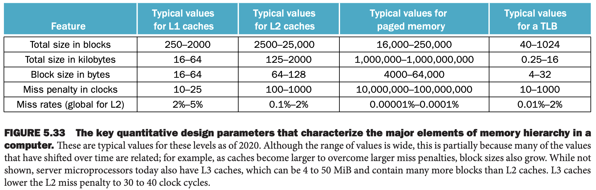

尽管从定量角度分析存储层次的各个方面有很大的不同，但是从定性角度看很多策略和功能是类似的。下图是各个层次定量分析的差异。

本小节后续会讨论相同点，这些点如何决定了其行为。下面通过四个问题分析各种不同策略。为了简单，讨论集中于缓存。

### Question 1: Where Can a Block Be Placed?
存储层次的上层被替换的策略有三种：直接映射、组相联、全相联。之前提到过，这些都可以看作是组相联的变形，只是组数和每组的块数不同罢了。

增加关联度通常会减少未命中率。减少了相同位置的未命中，因此减小了未命中率。下图展示了不同缓存大小下不同相联度的未命中率。最大的收益是从直接映射到两路组相联，减少了 20% 到 30% 的未命中率。随着缓存的增大，相联度对未命中率的提升变小，因为大的缓存总的未命中率很低，那么提升的机会减少，相联度的提升迅速变小。相联度增加的潜在劣势是增加开销和访问时间。

### Question 2: How Is a Block Found?
依赖于替换策略，寻找块的位置的方式不同。因为替换策略决定了块可能在的位置。总结如下：

关联度的选择依赖于未命中的开销和实现的开销，两种开销都包括时间和额外硬件的开销。芯片上的 L2 缓存有更高的相联度，因为命中时间不那么关键并且设计者不必依赖于标准 SRAM 芯片。除了特别小的缓存，禁止使用全相联，此时比较开销不大而绝对未命中率降低的收益最大。

在虚拟内存系统中，使用单独的映射表——页表——来索引内存信息。除了需要存储存放页表之外，索引表也需要额外内存访问。页替换选择全相联，并且使用额外的表的理由如下：

1. 由于未命中成本非常高，全相联收益最大
2. 全相联使得软件能够使用设计精巧的算法来减少未命中率
3. 全相联很容易被索引，无需额外硬件和搜索

因此，虚拟内存系统往往使用全相联。

组相联通常用于缓存和 TLB，访问是索引和组内搜索相结合的方式。少量系统采用直接映射，优势是访问时间（无需比较）和实现简单。这些设计选择依赖于实现细节，比如缓存是否在芯片上，实现芯片的技术，缓存访问时间在确定处理器周期方面所起的重要作用。

### Question 3: Which Block Should Be Replaced on a Cache Miss?
当相联的缓存未命中时，需要决定哪一个块被换出。对于全相联而言，所有块都是候选块。对于组相联，需要在组内确定那一块。当然对于直接映射而言，只有一个候选块。

对于组相联和全相联而言，有两种主要方法来选择替换的块。

* 随机：随机选择一个候选块，可能需要某些硬件帮助。
* LRU：替换最长时间没有使用的块。

实际中，对于很小的相联度（2 或者 4）而言，实现成本很高，因为跟踪使用信息的成本很高。对于四路组相联，LRU 通常也是近似的，1 bit 跟踪被使用的块对，每对再 1 bit 用于跟踪那一块被使用了。

对于大的相联度，或者使用 LRU 近似或者使用随机算法。对于缓存，硬件实现替换算法，因此需要容易实现。随机算法就很容易用硬件实现。对于两路组相联，随机算法比 LRU 的未命中率高 10%。随着缓存变大，两者的未命中率都会下降，并且绝对差值变小。事实上，随机算法比硬件简单实现的 LRU 近似算法更好。

虚拟内存系统，总是使用某种形式的 LRU 近似，因为未命中的成本实在太高了，很小的未命中率的降低都很重要。硬件提供访问比特或者等效的机制使得操作系统更容易跟踪不经常使用的页。由于未命中的成本非常高，而且相对不太常见，因此使用软件的方式近似也是可以接受的。

### Question 4: What Happens on a Write?
关于写，之前分析过两种策略：

* 直写：信息写到缓存的块和低层次的存储中（缓存对应的内存）。5.3 节使用的是这个策略。
* 回写。信息只写到缓存的块中。只有当它被替换的时候，才将修改的块写回低层次存储中。虚拟内容总是使用回写，原因如 5.7 小节的分析。

直写和回写有各自的优势。回写的优势是：

* CPU 写单个字的速度是缓存的速率而不是内存的速度
* 单个块上的多个写只有写到低层次存储一次
* 当块被写回的时候是整块写，可以使用到更高的带宽传输，效率更高

直写的优势是：

* 未命中处理更简单，由于无需此时写更低层次的存储而开销更低
* 直写更容易实现，尽管实现中直写也需要用到写缓冲区

虚拟内存，由于写低层次存储的耗时非常大，必须采用回写策略。处理器生成的写操作速率往往超过了存储系统的能力，即使对带宽更宽、具备突发模式的 DRAM 也是如此，因此低层次缓存采用回写策略。

### The Three Cs: An Intuitive Model for Understanding the Behavior of Memory Hierarchies
在这小节，我们将研究一个模型，深入了解存储层次中未命中的来源，以及未命中如何受到层次变化的影响。这里以缓存为例，思想对其他层次也适用。这个模型中，未命中分成了三类（3 C）：

1. Compulsory misses: 第一次访问某个块，该块从来没有在缓存中过。也称为冷启动未命中（`cold-start misses`）。
2. Capacity misses: 在程序执行的过程中，缓存无法放下所有的块导致的未命中。当一个块被置换之后又被取回，那么就是容量未命中。
3. Conflict misses: 对于组相联和直接映射缓存，当多个块竞争同一个位置。使用相同的缓存大小，使用全相联能够消除的未命中是冲突未命中。也称为碰撞未命中（`collision misses`）。

下图将未命中分成了三类。可以通过改变缓存设计的某些方面来解决这些未命中。

冲突未命中来源是竞争同一个位置，那么增加相联度能够减少冲突未命中。不管，这可能会导致增加访问时间，进而导致更差的性能。

容量未命中可以通过增加缓存大小解决。实际上，L2 缓存越来越大。当然，缓存更大，必须小心处理增加的访问时间，这可能会导致更差的性能。因此 L1 缓存几乎没有变化。

因为强制未命中来自第一次访问一个块，因此主要解决方法是增加块的大小，这样程序需要访问的块更少。增加块大小太多的话会让性能变差，因为增加了未命中的罚时。

将未命中分成三类是非常有用的定量分析模型。现实中，许多设计选择交织在一起，改变一个特征可能会影响其他方面。虽然这个模型有局限性，但是仍旧是了解缓存设计的性能的有效途径。

设计存储系统的挑战在于每一个改变可能会增加未命中率而对整体性能有负面影响，如下图所总结的。这些正向和负向的影响使得存储系统的设计非常有意思。

