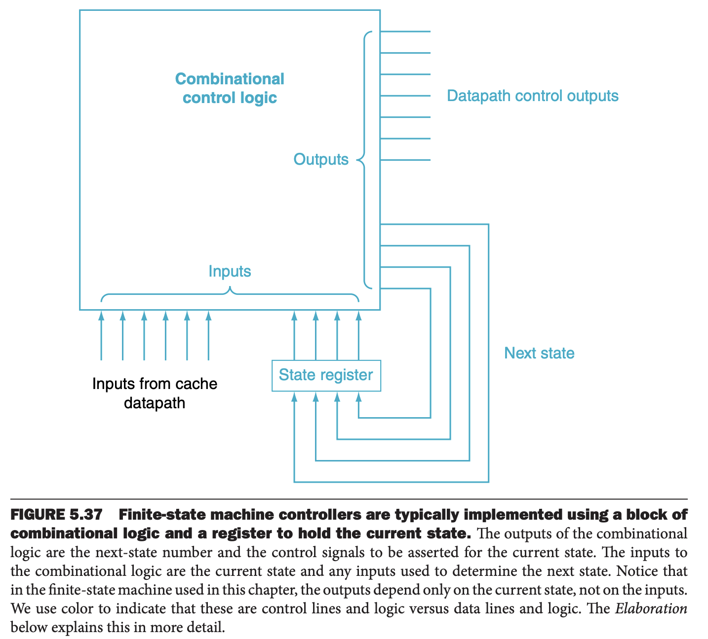
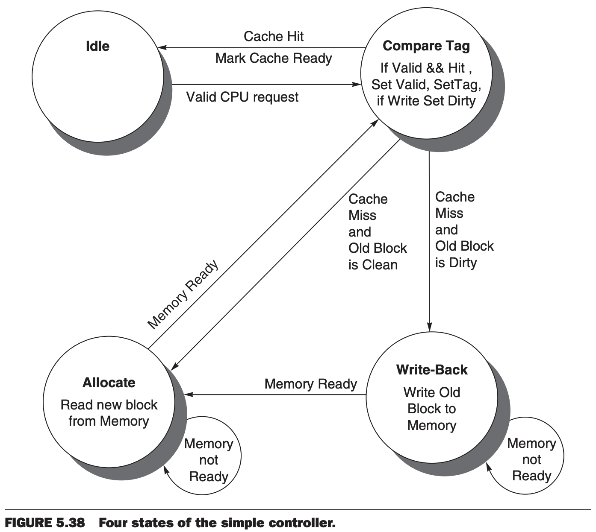

如第四章构建单周期和流水线数据通路的控制器，这一小节构建缓存缓存的控制器。首先定义一个简单的缓存，然后面熟有限状态机，最后使用有限状态机来实现简单缓存的控制器。

### A Simple Cache
这里我们会为一种简单直接的缓存设计控制器。下面是缓存的关键特征

* 直接映射
* 回写
* 四字大小的块，16B，128 比特
* 缓存大小是 16KiB，1024 块
* 32 位地址
* 每块包含 1 比特有效位和 1 比特脏位

那么地址的各个字段大小是

* 缓存索引 10 比特，1024 块
* 块偏移量 4 比特，16B
* 标签大小是 18 比特

处理器到缓存的信号

* 1 比特表示读或者写
* 1 比特有效位，表示是否是一个缓存相关的操作
* 32 位地址
* 处理器到缓存的 32 比特数据
* 缓存到处理器的 32 比特数据
* 1 比特就绪信号，表示缓存操作是否完成

缓存和内存之间的接口与处理器和缓存之间的接口类似，数据字段特殊，是 128 比特。现在，额外的内存宽度设计很常见，不管是 32 位还是 64 位处理器，DRAM 控制器宽度都是 128 比特，宽度与缓冲块一致能够简化设计。

* 1 比特表示读或者写
* 1 比特有效位，表示是否是一个缓存相关的操作
* 32 位地址
* 缓存到内存的 128 比特数据
* 内存到缓存的 128 比特数据
* 1 比特就绪信号，表示缓存操作是否完成

这里缓存到内存的接口并不是固定数量时钟周期。假定当内存读写完成之后，内存控制器会通过就绪信号通知缓存。

### Finite-State Machines
设计单周期通路的控制器时，我们使用真值表，这个表根据指令类别来设置控制信号。对于缓存而言，控制更加复杂，因为操作是一系列步骤。对于每一步，控制器都需要设置信号并设置下一个状态。

最常用的多步控制方法就是有限状态机（`finite-state machine`），通常使用一个图来表示。它由状态集合以及状态改变的方向组成。这些方向由下一个状态函数（`next-state function`）定义，这个函数是当前状态到下一个状态的映射。当使用有限状态机进行控制时，每一个状态还需要说明一组断言。通常实现是如果没有显式断言，那么就是未断言的（无效状态）。类似的，数据通路的正确操作也是要将没有显式断言的视为未断言的（无效），而不是忽略它们。

多路复用器稍有不同，基于控制输入要从多个输入中选择一个。在有限状态机中，我们始终指定我们关心的多路复用器的控制设置。当用逻辑门实现有限状态机时，如果默认是 0，可能无需使用逻辑门器件。

有限状态机可以用一个临时寄存器实现，寄存器保存当前状态，还需要用一个组合逻辑块，该块决定要断言的数据通路信号和下一个状态。如下图所示。

### FSM for a Simple Cache Controller
下图是简单缓存的四个状态。

* Idle: 空闲状态。等待来自处理器读请求或者写请求，可以转移到比较标签状态。
* Compare Tag: 比较标签状态。这个状态检查读写请求是否命中。地址的索引部分会选择哪一个标签需要进行比较。如果地址索引部分指向的缓冲块的数据有效，并且地址的标签部分与标签一致，那么缓存命中。如果是加载那么读取选择的字，如果是存储指令，写数据到选择的字。接着设置缓存就绪信号。如果是写请求，脏位也被置成 1。这里写命中也要设置有效位和标签字段，看似是不必要的，但是由于标签是单个存储，改变脏位的同时也会修改有效位和标签字段。未命中的话，先更新缓存标签，如果这块脏位是 1，转移到回写状态，如果脏位是 0，转移到分配状态。
* Write-Back: 回写状态。写 128 比特的块到内存上的某个地方，改地址由标签和缓存索引组合得到。然后等待来自内存的就绪信号。一旦写内存完成，转移到分配状态。
* Allocate: 分配状态。从内存中读取一个块。然后等待来自内存的就绪信号。当读内存完成后，转移到比较标签状态。尽管我们可以进入一个新状态而不是复用比较标签状态，不过还是有些重复的事情，比如写请求时需要更新块内相应的字。

这个简单的模型可以简单的扩展以提升性能。比如可以将比较标签状态在一个时钟周期内做比较和读写缓存数据，可以将比较和缓存访问分成两个状态提升时钟周期。另一个优化是可以增加一个写缓存来存放脏块，然后就可以读取新块了，这样在未命中、淘汰脏块的场景，处理器不必等待两次内存访问。当处理器处理请求的数据时，缓存将写缓冲区的脏块写到内存。
