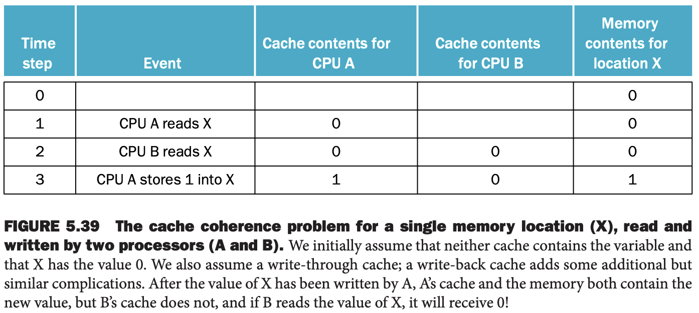

如果一个芯片上有多核处理器，这些处理器往往共享同一个物理地址空间。缓存的共享引入了一个新问题。两个处理器通过各自的缓存看到同一个内存的视图，如果没有任何防护的话，可能会看到不同的值。下图是一个示例。这个问题就是缓存一致性（`cache coherence problem`）问题。

非正式的，如果读到的数据是最新写入的数据，那么就可以说是一致的。这个定义很直观，但是过于模糊和简单，现实会更复杂。这个简单定义包含了存储系统行为的两个不同视角，对于正确的写共享内存都是至关重要的。第一个是 coherence，定义了读到什么值。一个是 consistency，决定一个写的值什么时候能被读到。

先看 coherence。满足下面三点则存储系统是 coherence 的。

1. 处理器 P 写 X 地址，接着 P 读 X 地址，在写和读之间没有其他处理器写 X 地址，那么读到的数据永远都是 P 之前写入的数据。上图中步骤 3 之后 CPU A 读取的永远都是 1。
2. 一个处理器写 X 地址，另一个处理器读 X 地址，两个操作时间间隔足够大，并且没有其他处理器写 X 地址，那么第二个处理器读到的数据是第一个处理器写的数据。在上图中，在 A 写入 1 之后，需要一个机制，让 B 缓存中的值是 1 而不是 0。
3. 同一个地址的写是串行化的。所有处理器看到的任意两个处理器对同一地址的两次写操作顺序总是相同的。比如 B 在步骤 3 之后向 X 地址写入 2。处理器不可能在读到 2 之后还能读到 1。

第一个属性保持了程序的顺序，在单处理器中希望其为真。第二个属性定义了内存视角的 coherence 是什么：如果一个处理器只能读到旧值，那么是不一致的。

对于写串行化的需求不明显，但是很重要。假定没有串行化写，处理器 P1 写了 X 地址，然后处理器 P2 也写了 X 地址。串行化保证所有的处理器在某个时间点之后看到的都是 P2 写的值。如果没有串行化，那么一些处理器可能先看到 P2 写的值，然后又读到 P1 写的值。如果保证写同一个地址的所有写操作在所有处理器看来都是一样的，那么就是写串行化了。

### Basic Schemes for Enforcing Coherence
在一个一致缓存的多处理器中，为共享数据提供了迁移（`migration`）和副本（`replication`）两种机制。

* 迁移：数据能够以透明的形式移到局部缓存中使用。减少访问共享数据的延迟和对共享缓存带宽的需求。
* 副本：当同时读共享数据时，缓存在本地缓存创建一个副本。减少了访问的延迟并减轻了读共享数据的竞争。

对于访问共享数据而言，支持迁移和副本对于性能至关重要，因此许多多处理器都引入了硬件协议来维护缓存的一致性，这称为缓存一致性协议。实现缓存一致性协议的关键是跟踪数据块共享的状态。

最流行的协议是窥探（`snooping`）。每个缓存有物理内存块的数据拷贝，同时有块状态的拷贝，但没有中心化保存状态。缓存可以通过广播介质（总线或者网络）访问到，所有的缓存控制器监视或窥探介质，以确定他们是否有总线或者交换机所请求的块。

下面分析使用共享总线实现的窥探一致性协议，但是任何广播缓存未命中的通信介质都可以用于实现。广播到所有缓存使得窥探协议很容易实现，但是限制了扩展性。

### Snooping Protocols
强制一致性的方法之一是一个处理器在写数据之前，能够排他的访问数据。这种协议称为写无效协议（`write invalidate protocol`），因为这个协议会使得写的块在其他缓存的拷贝失效。排他性保证了在写的时候没有其他处理器会读或者写这个块：其他缓存的拷贝都失效。

下图是一个例子，缓存是回写策略，基于窥探总线实现。考虑一个写之后有一个读的场景：排他写，读数据的处理器的缓存中的拷贝失效了。当读的时候，缓存未命中，此时会拉取一个新的拷贝。对于写，写处理器已经是排他访问了，阻止其他处理器同时写。如果两个处理器同时写同一个块，其中一个赢得竞争，其他处理器的拷贝无效。对于其他处理器而言，为了完成写，需要获得新的拷贝，其包含最新的值。这就保证了写的串行化。

块的大小在缓存一致性起到了重要作用。比如窥探的块大小是八个字，如果两个处理器写同一块中的不同字，大部协议都会交换整块，对带宽的需求就提高了。

大块还会导致假共享（`false sharing`），两个无关的共享变量位于同一块，两个处理器访问不同的变量，导致整个块需要被置换。程序员和编译期对数据布局应该很谨慎，避免假共享。
