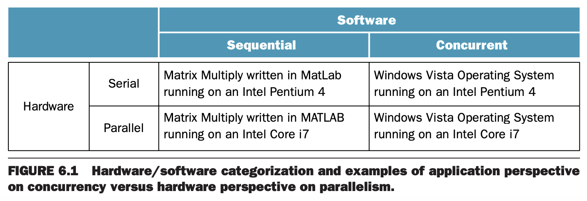

设计师希望能够连接很多小的计算机得到一个性能强大的计算机。这就是多处理器（`multiprocessor`）的来源。理想情况下，客户买尽可能多的处理器然后得到对应的性能。因此要设计实现在多处理器上跑的软件。第一章提到过，耗能是很重要的一个指标。使用小的高效的处理器替代大的低效的处理器，能够在同等耗能下性能更高。因此，对于多处理器而言，提高效能与扩展性息息相关。

多处理器软件必须能够扩展，因此在硬件损坏时也能正常工作。如果 $n$ 个处理器坏了 1 个，软件可以用剩余的 $n-1$ 继续提供服务。因此多处理器能够提供更好的可用性。

对于独立的任务，高性能意味着高吞吐，这就是任务级并行（`task-level parallelism`）。这些任务可能是单线程应用，这也是多处理器很重要的场景。这与多处理器上运行一个任务相反。并行处理程序（`parallel processing program`）表示在多处理器上同时运行的单个程序。

科学计算需要更快的计算器。这些任务验证了多处理器的合理性。现在处理这些问题很简单，可以使用大量独立的服务器组成的集群（`cluster`）来处理。集群也可以用于其他用途，比如 Web 服务、邮件服务、数据库等。

由于能耗问题，因为可以从增加时钟频率或 CPI 之外提升性能，多处理器备受关注。一般我们称为多核处理器（`multicore microprocessor`）而不是多处理器（`multiprocessor microprocessor`），可能是为了避免重名。多核芯片上的处理器称为核（`core`）。随着硬件技术的提升，核数会变多。这些核是共享内存处理器（`Shared Memory Processors`, `SMP`），通常是一个物理地址空间。

这些新技术使得关心性能的程序员必须关注并行编程。

业界的一个重要问题是要方便的编写并行任务，并且在核数增加的情况下，性能和功耗都能有效提升。

这个突然的转变使得很多术语让人感到困惑。下图总结了串行（`serial`）、并行（`parallel`）、顺序（`sequential`）、并发（`concurrent`）四个术语。

列表示软件可以是顺序的也可以是并发的。行表示硬件可以串行也可以并行。不管是顺序软件还是并发软件，都是可以运行在串行和并行的硬件之上的。

挑战之一是让顺序软件在并行硬件上有更好的性能，让并发软件在并行硬件随着核数变多运行的更快也是一个重要挑战。本章会使用并行处理程序（`parallel processing program`）或并行软件（`parallel software`）表示在并行硬件上运行的顺序或者并发的软件。
