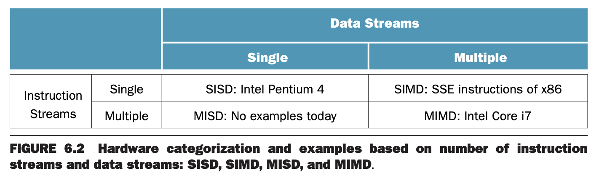
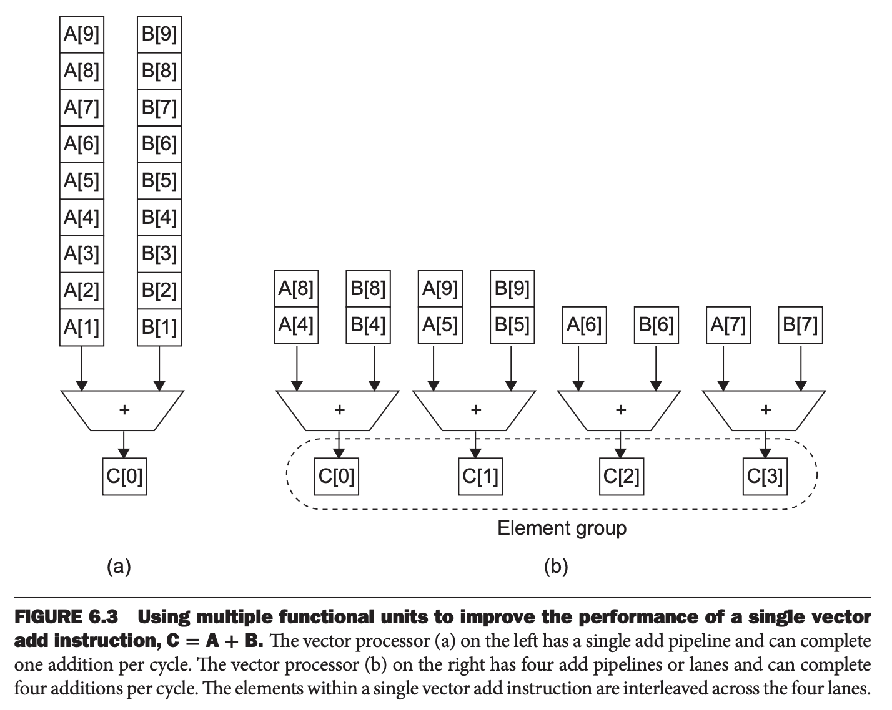
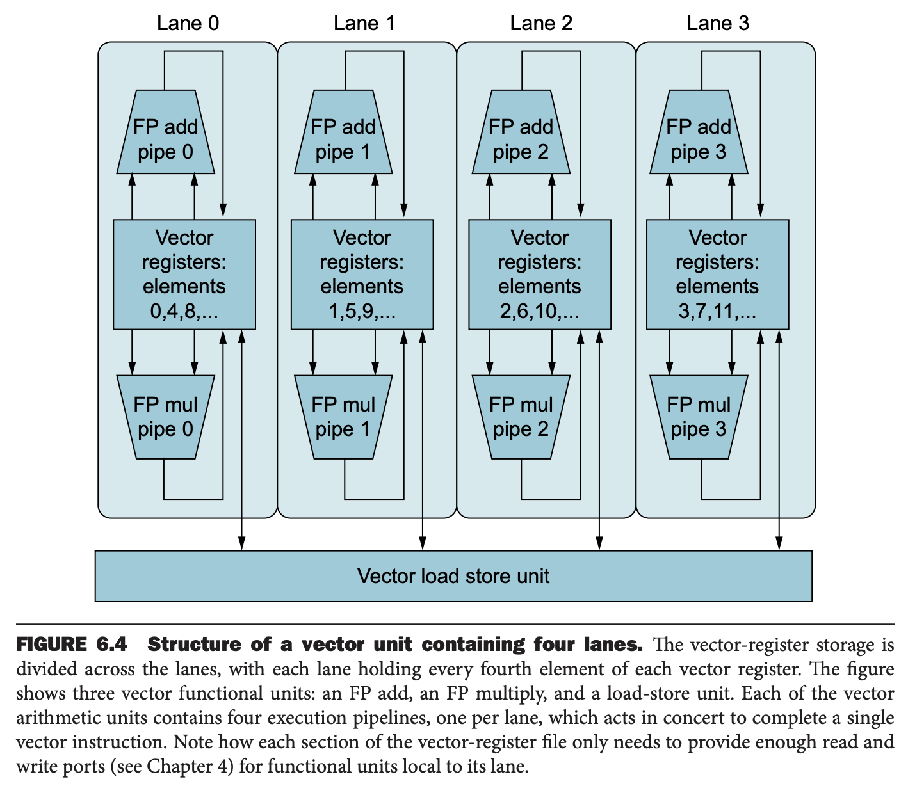

1960 年代的一个分类标准是基于指令流的数量和数据流的数量。下图展示了这个分类。传统单核处理器有一个指令流和一个数据流，传统多核处理器有多个指令流和多个数据流。这两个类别简写为 SISD（`Single Instruction stream, Single Data stream`）和 MIMD（`Multiple Instruction streams, Multiple Data streams`）。



尽管可以写一些分开的程序运行在 MIMD 的不同的处理器上，但是更应该写一个程序，运行在 MIMD 的所有处理器上。这称为 SPMD（`Single Program Multiple Data`），这是正确的方式。

MISD（`Multiple Instruction streams and Single Data stream`），可以看作是一个流处理器，对于单一数据流进行不同的操作，比如从网络解析数据、解密、解压等等。与 MISD 相反，SIMD（`Single Instruction stream, Multiple Data streams`）更流行。SIMD 处理的是数据向量。比如一个 SIMD 指令通过在一个时钟周期内一次送 64 个数据流的 64 个整数到 64 个 ALU 中进行 64 次加法。3.6 和 3.7 讨论的子字并行也是 SIMD 的例子。

SIMD 指令并行执行是同步的，执行的是来自同一个 PC 的同一条指令。从程序员的视角，这更接近于 SISD。尽管每一个执行单元执行同一条指令，但是每个单元有自己的地址寄存器，所以是不同的数据地址。因此，一个顺序应用可以编译为 SISD 串行执行也可以编译为 SIMD 并行执行。

SIMD 最开始的动机是平摊数十个执行单元的控制单元的开销。另一个优势是减少指令的带宽和空间，只有一个指令拷贝，于此相应的 MIMD 中每个处理器需要一个拷贝，共享缓存 MIMD 需要多个指令缓存。

SIMD 在处理数组 `for` 时效果最好。因此要使用 SIMD 并行，要有大量一样的数据结构，这称为数据并行（`data-level parallelism`）。SIMD 在 `switch` `case` 场景最弱，因为每个执行单元根据包含的数据执行不同的指令。有错误数据的单元会被禁用使得合适的数据得到执行，如果有 `n` 种 `case`，那么 SIMD 处理器仅有峰值 `1/n` 的运算速度。

### SIMD in x86: Multimedia Extensions
如第三章描述，子字并行是 1996 年 x86 引入 `Multimedia Extension` (`MMX`) 的灵感来源。随着摩尔定律的发展，又发展除了 SSE（`Streaming SIMD Extensions`）和 AVX（`Advanced Vector Extensions`）。AVX 支持同时操作八个 64 位浮点数。操作的宽度和寄存器编码在指令的操作码（`opcode`）之中。随着寄存器和操作数宽度的增加，操作码爆炸增长，现在已经有了数百个 SSE 和 AVX 指令。

### Vector
一个 SMID 老旧（七十年代）但是更优雅的解释称为向量架构（`vector architecture`）。它与很多数据并行问题相匹配。不是让 64 个 ALU 同时执行 64 次操作，向量架构利用流水线获得更好的性能和更低的开销。向量架构的思想是收集内从中的数据，顺序放到大量寄存器中，利用流水线依次执行操作，然后写回内存。因此向量架构的关键是有一组向量寄存器。一个向量架构可能有 32 个向量寄存器，每个寄存器能放 64 个 64 位数据。

#### Comparing Vector to Conventional Code
RISC-V 提供 V 扩展，包含向量指令和向量寄存器。向量操作使用相同的指令名，不过前缀了 `v`。比如 `vfadd.vv` 添加了两个浮点向量。额外的指令来制定向量元素的长度。如果首先执行指令 `vsetvli x0, x0, e64`，那么下面向量执行的元素长度是 64 位，那么 `vfadd.vv` 对两个双精度浮点数向量执行加操作。后缀 `vv` 表示是向量-向量操作，`v` 表示向量-标量操作，因此 `vfmul.vf` 是向量-标量浮点数乘法操作。`vle.v` 和 `vse.v` 表示向量加载和向量存储。如果 `vsetvli` 设置的是 64 位长度，那么加载或存储的是 64 位长度的数据的向量。两个操作数，第一个是要加载或者存储的向量寄存器，第二个是 RISC-V 的通用寄存器，表示向量在内存中的起始地址。

下面分析下面语句对应的向量化和标量化代码
$$Y=a\times X+Y$$
其中 $X,Y$ 是 64 个双精度浮点数的向量，$a$ 是标量双精度浮点数。假定 $X,Y$ 开始的地址是 `x19` `x20`。

下面是传统的 RISC-V 的代码。
```
        fld     f0, a(x3)       // load scalar a
        addi    x5, x19, 512    // end of array X
loop:   fld     f1, 0(x19)      // load x[i]
        fmul.d  f1, f1, f0      // a * x[i]
        fld     f2, 0(x20)      // load y[i]
        fadd.d  f2, f2, f1      // a * x[i] + y[i]
        fsd     f2, 0(x20)      // store y[i]
        addi    x19, x19, 8     // increment index to x
        addi    x20, x20, 8     // increment index to y
        bltu    x19, x5, loop   // repeat if not done
```
下面是向量代码。
```
fld         f0, a(x3)       // load scalar a
vsetvli     x0, x0, e64     // 64-bit-wide elements
vle.v       v0, 0(x19)      // load vector x
vfmul.vf    v0, v0, f0      // vector-scalar multiply
vle.v       v1, 0(x20)      // load vector y
vfadd.vv    v1, v1, v0      // vector-vector add
vse.v       v1, 0(x20)      // store vector y
```
向量化处理很大程度上减少了指令带宽的需求，向量化只有七条指令，而传统 RISC-V 有 500 多条指令。减少的原因有二：（1）向量化一次能够处理 64 个数据；（2）传统 RISC-V 循环中一半的指令在向量化中都不存在。获取和执行指令的减少可以减少耗能。

第二个大的区别是流水线冒险的频率。在传统 RISC-V 的代码中，`fadd.d` 必须等待 `fmul.d` 结束，`fsd` 必须等待 `fadd.d` 的结束，每一次 `fadd.d` `fmul.d` 需要等待 `fld`。向量化的代码中，流水线只会在为向量的第一个元素处暂停，后续就顺利执行下去了。因此每个向量化操作只需要流水线暂停一次，而不是向量中的每一个元素暂停一次。这个例子中，传统的 RISC-V 流水线暂停频率是向量化版本的 64 倍。第四章提到的循环展开可以消除流水线暂停，但是无法减少指令的数量。

### Vector versus Scalar
向量指令相比传统指令有以下优势：

* 单个指令指定了相当多的工作——相当于整个循环。因此所需的指令获取和解码带宽大大降低。
* 在同一个向量中，数据之间没有影响，因此无需检查数据冒险。
* 相比在 MIMD 多核机器上使用数据并行来编写高效的程序，编译器和向量架构使其变得更容易。
* 硬件仅仅需要检查两次向量操作之间的数据冒险，因此节省时间和能量。
* 向量指令访问数据有很好的模式。假定数据连续，那么是一次内存访问延迟，而不是多次。
* 由于循环被整个向量指令替代，行为是预先知道的，通常不存在控制冒险。
* 指令带宽、冒险检查和内存访问模式使得向量体系的能耗更低。

因此，对于相同数据集上标量化顺序操作，向量化性能更高。

### Vector versus Multimedia Extensions
和 x86 AVX 指令类似，向量指令指定了多个操作。不过多媒体扩展表示一些操作，而向量指令指定数十个操作。与多媒体扩展不同，向量指令操作的元素数不再 `opcode` 中指定而是一个单独的寄存器。这使得可以仅仅修改寄存器中的内存，让不同的向量体系处理不同数量的数据，依次保证兼容性。而多媒体扩展处理的数据量不同，不得不添加新的 `opcode`：`MMX` `SSE` `SSE2` `AVX` `AVX2`。

与多媒体扩展不同的是，向量体系不要求数据连续。向量体系支持加载不连续的地址的 `n` 个数据到向量寄存器中。这称为 `gather-scatter`，将不连续的数据 `gather` 到连续的寄存器中，向量的元素 `scatter` 在内存中。

和多媒体扩展类似，向量指令可以灵活的适配不同的数据宽度，比如一次性处理 32 个 64 位数据、或 64 个 32 位数据、128 个 16 位数据、256 个 8 位数据。向量指令的语义允许使用流水线单元、或者是一组并行单元、亦或者是两者的结合。下图展示了如何使用多个计算单元提升计算速度。



向量算数指令往往只允许一个向量的 `n` 个元素与另一个向量的 `n` 个元素参与运算。这大大简化了构建平行的向量单元，即多个向量通路（`vector lane`）组成一个向量单元。和高速公路一样，我们可以添加更多的向量通路来提升向量单元的峰值吞吐。如下图所示，四道并行，那么处理时间会缩短四倍。为了让这种多通路结构有效，应用和架构都必须支持更长的向量，



通常向量体系是更好的处理数据的方法。相比多媒体扩展，编译器更友好，也容易随着时间推移而发展。
