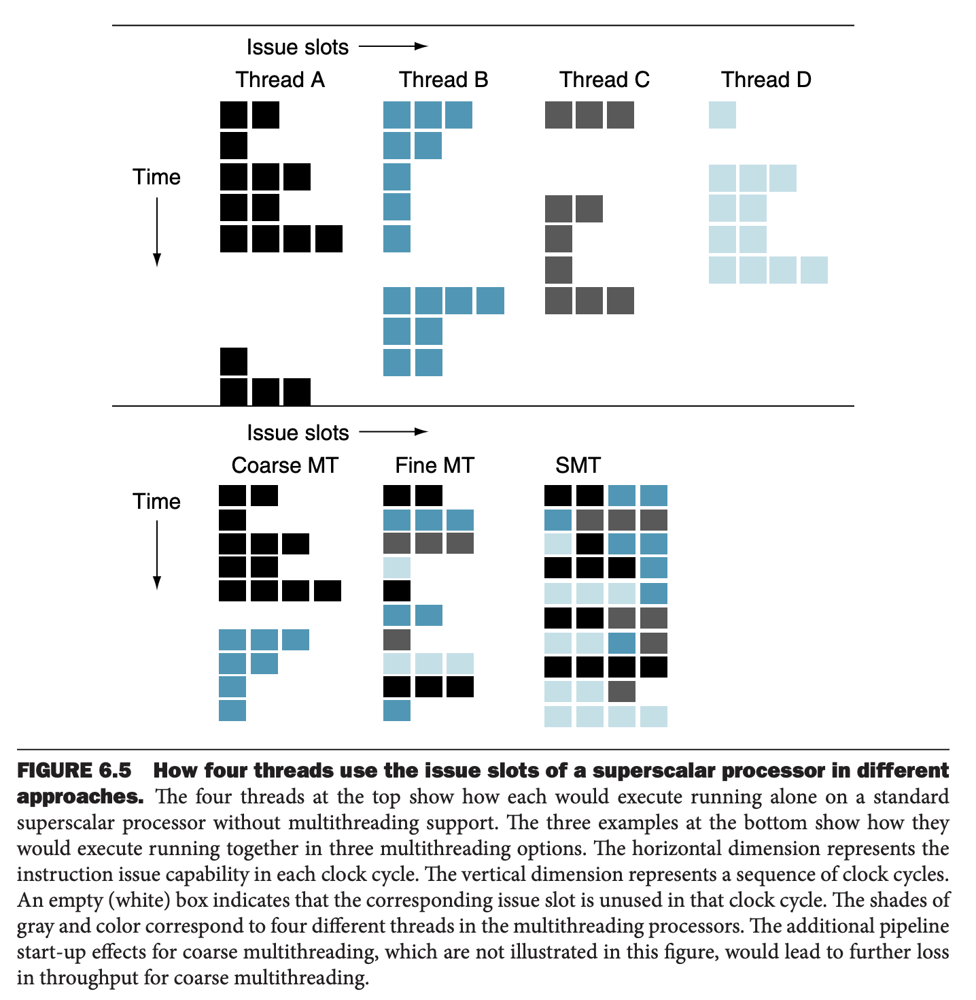
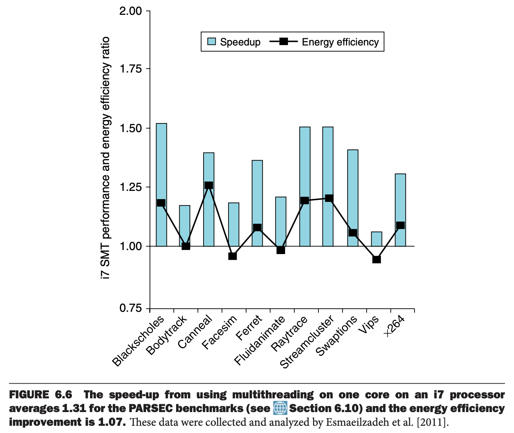

从程序员的角度看来，一个与 MIMD 相关的概念是硬件多线程（`hardware multithreading`）。MIMD 是利用多个进程或者线程让多个处理器都处于繁忙的状态，硬件多线程允许多个线程以重叠的方式共享处理器单元的功能单元，更有效的利用硬件。为了允许这种共享，处理器必须有每个线程的状态。比如要有线程拥有的寄存器和 PC 的副本。内从通过虚拟内存机制共享。此外，硬件要有能力快速切换线程的能力。线程的切换数量比进程切换的数量多得多，后者往往需要数百个处理器时钟周期，而线程切换是瞬时的。

硬件多线程主要有两种实现方式。一种是细粒度多线程（`fine-grained multithreading`），每个指令执行完就切换线程，多个线程是交织执行的。这种交织往往是循环执行，会跳过暂停的线程。为了可用，处理器必须有能够在每个时钟周期都切换线程的能力。优势是可以隐藏较短和长期的暂停带来的吞吐损失，因为暂停的线程不会执行，其他线程会在暂停的周期执行。缺点是会延长单个线程的执行时间，因为在没有暂停的情况下也会被其他线程的指令延迟。

另一种是粗粒度多线程（`coarse-grained multithreading`）。粗粒度多线程仅会在耗时的暂停的时候切换线程，比如访问高速缓存的最后一级。这种方式缓解了对切换线程必须很快的需求，同时不大可能延迟单个线程的执行速度，因为仅在长时间暂停时才会执行其他线程。缺点是无法缓解短时间暂停带来的吞吐损失。这种限制来自多线程流水线启动时的成本。粗粒度多线程的处理器仅会从一个线程发射指令，如果遇到暂停，需要清空或暂停流水线。暂停之后开始执行的线程必须填充流水线，由于这种开销，粗粒度多线程对于长期暂停非常有效，因为此时这种开销不大（相比长期的暂停而言）。

同时多线程（`simultaneous multithreading`, `SMT`）是硬件多线程的变体，利用多发射、动态规划管道达到线程级并行，同时能够利用指令级并行的能力。SMT 的动机是多发射处理器能够更大程度利用功能单元的并行性。进一步地，通过寄存器重命名和动态调度，可以发射来自不同线程的多个指令，而无需考虑它们之间的依赖性。依赖问题通过动态调度来解决。

SMT 依赖于现有的动态机制，因为无需在周期间切换资源。SMT 总是执行来自多个线程的指令，关联指令槽和重命名寄存器交由硬件决定。

下图从概念上解释了不同方法使用超标量能力的差异。上面是独立执行四个线程使用超标量能力，没有硬件多线程支持。下面是四个线程交织在一起更好地利用超标量能力，不同点是多线程支持的方式。

在没有硬件多线程支持的超标量中，由于缺少指令并行，发射槽的使用受到了限制。此外，长的暂停，比如指令缓存未命中，会使得整个处理器空闲。

粗粒度多线程的超标量中，长的暂停切换其他线程使用资源，这可以减少空闲周期，但是由于填充流水线，还是会有闲置周期，同时有指令级并行（`ILP`）的限制，所有的发射槽都是空闲的。细粒度在多个线程之间切换，不会有空闲的周期，但是由于给定周期只有一个线程的指令会被发射，指令级并行的限制使得某些周期的某些发射槽闲置。

在 SMT 情况下，线程级和指令级的并行都能得到充分利用，多个线程使用给定周期的多个发射槽。理想情况下，发射槽的使用仅会被多线程的资源需求和资源的不平衡限制。但是实际会受到其他因素影响。上图大大简化了处理器的操作，但是说明了多线程的性能潜力，特别是 SMT。

下图展示了 Intel Core i7 960 单处理器多线程在性能和功耗上的收益，这个处理器支持两个硬件线程，更新的 i7 6700 也是如此。960 和 6700 的差异很小，不会对图中结果有显著影响。平均加速比是 1.31，相比增加的硬件，这个收益还不错。功耗仅提升了 1.07，相当不错。

