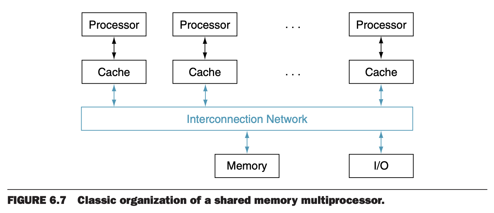
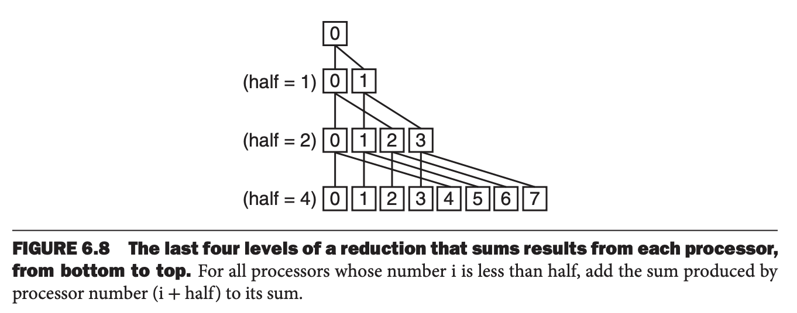

虽然硬件多线程以可以接受的成本提高了处理器的效率，不过过去十年的一个挑战是如何通过高效编程来满足每个芯片上不断增长的处理器数量，使得满足摩尔定律的性能增长。

由于重写旧程序使其在并行硬件上是比较困难的，那么有一个问题：计算机的设计者能简化这个问题吗？一个方案是给所有处理器提供一个共享的物理地址空间，这样就无需考虑数据位于哪里，只要保证程序能并行执行就好。这种情况，所有变量在任意时刻都能被所有处理器访问。另一个方案是每个程序一个单独的地址空间，要共享需要显式声明，6.8 小节讨论这种情况。当物理地址共享时，硬件要提供一致的缓存，使得共享内存一致。

共享内存多处理器（`shared memory multiprocessor`, `SMP`）给程序员提供了一个物理地址空间，多核芯片基本是这样处理的，更精确的术语可能是共享地址多处理器（`shared-address multiprocessor`）。处理器之间通过共享的变量通信，所有处理器都能加载和存储任意内存地址。下图是 SMP 经典架构。这里需要注意的是共享的物理内存，各个进程还是运行在其自己的虚拟地址空间。



一个地址空间的多处理器有两种风格。第一种访问延迟不依赖是哪一个处理器访问的。这种称为均匀访问模型（`uniform memory access`, `UMA`）。第二种是某些内存访问更快，依赖于哪个处理器访问哪个地址，因为内存分别连接到不同处理器或者处理器所在芯片的内存控制器上。这种称为非均匀访问模型（`nonuniform memory access`, `NUMA`）。很显然，为 NUMA 的编程难度更大，不过 NUMA 的扩展性更好，支持更大空间，同时近处的内存访问更快。

由于所有处理器并行访问共享内存，当操作共享数据时需要协同。这种协同称为同步（`synchronization`）。通过一个地址空间共享就要求有同步机制。一种方式是锁机制。一次只有一个处理器能够获取锁，其他处理器要等待获取锁的处理器释放锁。2.11 描述了 RISC-V 的相关指令。

#### A Simple Parallel Processing Program for a Shared Address Space
假定想要在均匀访问模型共享内存多处理器上计算 64,000 个数的和，有 64 个处理器。

第一步要均分工作负载，每个子集大小一样。由于只有一个地址空间，无需分配子集到不同的内存空间，这里只需要让每个处理器开始的地址不同即可。`Pn` 是处理器编号，从 0 到 64。首先，每个处理器计算自己分段的和。
```c
sum[Pn] = 0;
for (i = 1000 * Pn; i < 1000 * (Pn + 1); i += 1)
{
	sum[Pn] += A[i]; /*sum the assigned areas*/
}
```
下一步是求 64 个部分和的和。这个过程称为 `reduction`。这里采用分治法。32 个处理器计算，然后减半 16 个处理器再次计算，直到得到最后的和。



在这个例子中，需要同步保证消费者处理器在生产者处理器计算完之后再访问数据；否则消费者可能会读到旧数据。每个处理器有自己的循环变量 `i`，因此它是私有变量。下面求和代码，`half` 也是私有变量。
```c
half = 64; /*64 processors in multiprocessor*/
do

{
	synch(); /*wait for partial sum completion*/

	if (half % 2 != 0 && Pn == 0)
	{
		sum[0] += sum[half - 1];
	}

	/*Conditional sum needed when half is
	odd; Processor0 gets missing element */
	half = half / 2; /*dividing line on who sums */
	if (Pn < half)
	{
		sum[Pn] += sum[Pn + half];
	}
} while (half > 1); /*exit with final sum in Sum[0] */
```

由于人们对并行编程的兴趣，有过数百次尝试来构建并行系统。一个有限制但是很流行的例子是 OpenMP。它是一组 API、编译器指令、环境变量、运行时库来扩展标准编程语言。为共享内存多处理器提供了一个可移植、可拓展且简单的编程模型。主要目的是并行循环和执行 `reduction`。

大部分的 C 编译器已经支持 OpenMP 了。如下即可使用。
```
cc –fopenmp foo.c
```

OpenMP 使用 `pragma` 扩展 C，`pragma` 是预处理指令。下面的例子表示想使用 64 个处理器
```c
#define P 64 /* define a constant that we’ll use a few times */
#pragma omp parallel num_threads(P)
```
这样，运行时库会使用 64 个并行线程。

为了将顺序 `for` 编程并行的 `for`，只需要等分任务，然后使用之前配置的线程数。
```c
#pragma omp parallel for
for (Pn = 0; Pn < P; Pn += 1)
{
	for (i = 0; 1000 * Pn; i < 1000 * (Pn + 1); i += 1)
	{
		sum[Pn] += A[i]; /*sum the assigned areas*/
	}
}
```
为了执行 `reduction`，需要告诉 OpenMP 使用哪一个 `reduction` 算子和哪一个变量存放结果。
```c
#pragma omp parallel for reduction(+ : FinalSum)
for (i = 0; i < P; i += 1)
{
	FinalSum += sum[i]; /* Reduce to a single number */
}
```
此时，OpenMP 会找高效的实现使用 64 个处理器对 64 个部分和求和。

使用 OpenMP 可以轻松写出并行的代码，但是它对调试帮助不大，因此很多程序员使用比 OpenMP 更复杂的并行编程系统，这与很多程序员使用比 C 语言更高产的编程语言。
