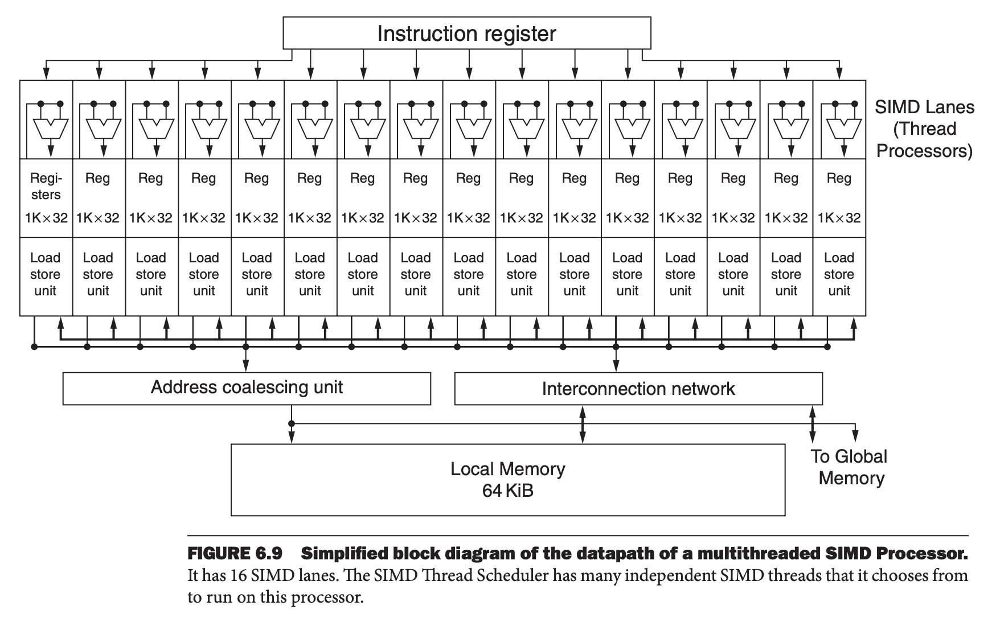
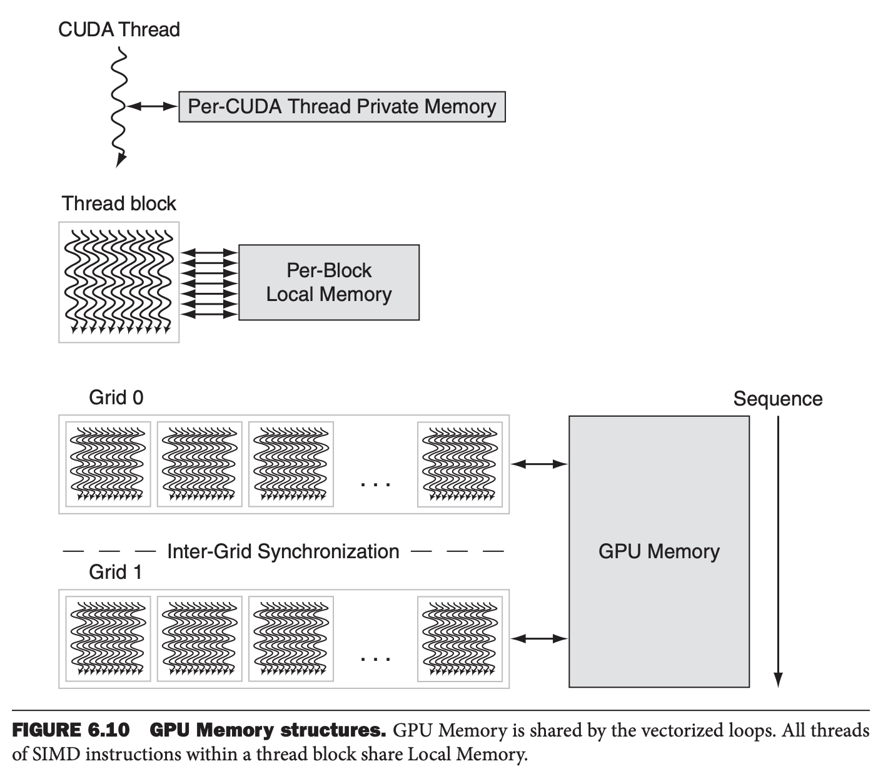
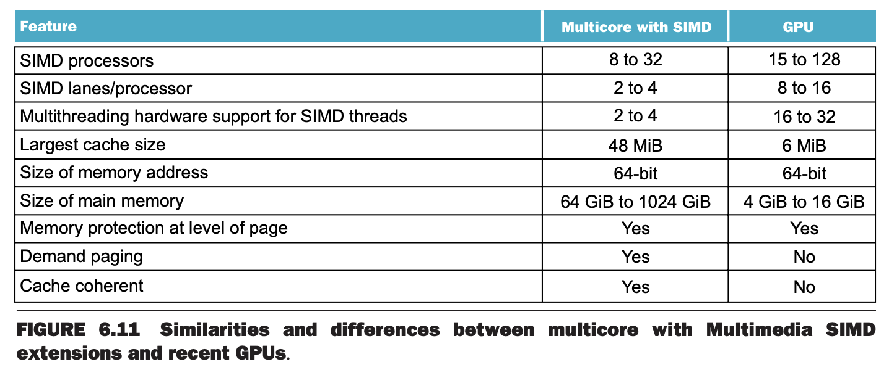
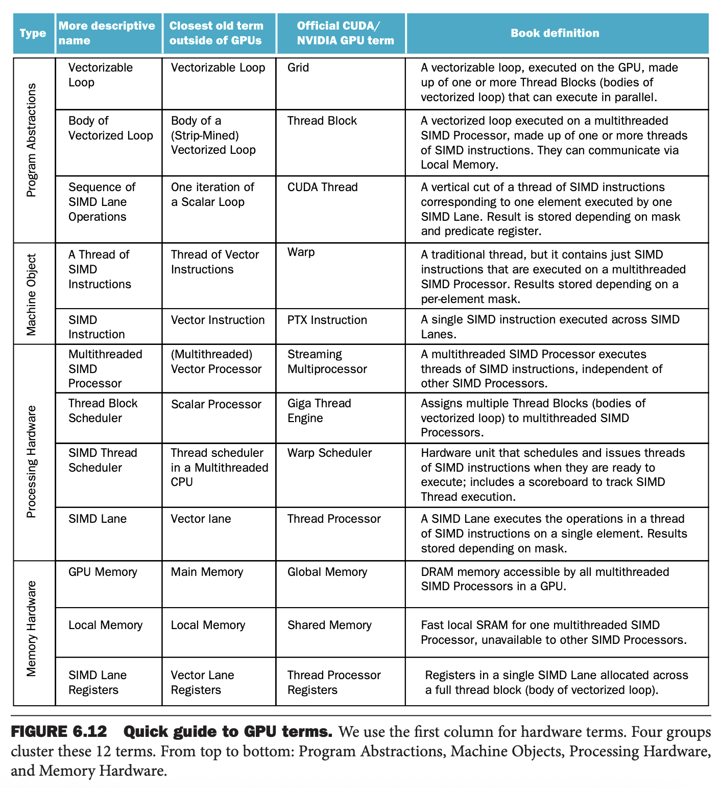

最初引入 SIMD 的理由是处理器连接到了 PC 和工作站的图形显示导致图形相关耗时越来越多。随着处理器晶体管的增加，提升图形处理变得更重要。

改进图形处理的动力主要来自游戏行业，包括 PC 游戏和专有平台，比如 Sony PlayStation。快速增长的游戏行业就刺激许多公司在图形处理方面增加投资，这种正反馈使得图形处理比主流微处理的通用处理提速更快。

由于图形处理和游戏社区与微处理开发社区不同，因此发展出了自己的处理方式和术语。随着图形处理器功耗的资源增加，有了专有名字 GPU（`Graphics Processing Units`），与 CPU 区别开来。

下面是 CPU 与 GPU 不同的关键性特征：

* GPU 是一个 CPU 的补充，是一个加速度，但是无法执行 CPU 所有的任务。GPU 能将所有的资源都用于图形。GPU 可能执行某种任务很慢或者没有能力支持，但是在有 CPU 和 GPU 的系统中，这些事情可以由 CPU 来做。
* GPU 处理的问题大小基本是数百兆到 GB 量级，不会到数百 GB 甚至 TB 量级。

这些差异导致了不同的架构。

* 或许最大的差别在于 GPU 不像 CPU 一样有多层缓存来解决访问内存延迟问题。GPU 利用硬件多线程来隐藏长延迟问题。在请求访问内存和数据到之前，会执行数百甚至上千个与该访问请求无关的线程。
* GPU 更注重内存的带宽。有专门给 GPU 设计的 DRAM 芯片，宽度和带宽都比给 CPU 使用的 DRAM 芯片都大。GPU 内存的大小比传统的微处理器的内存要小。2020 年，GPU 内存通常只有 4GB 到 16 GB，而 CPU 有 64GB 甚至 512GB 内存。对于通用计算，需要考虑 CPU 内存到 GPU 内存之间拷贝数据的时间，因为此时 GPU 是 CPU 的协处理器。
* 由于依赖多线程来达到更好的内存带宽，GPU 可以有很多并行处理器（MIMD）和多线程，这些往往比 CPU 都大很多。

尽管 GPU 的应用比较狭窄，一些程序员好奇如何能够通过定义某种应用形式来充分发挥 GPU 的潜力。在厌倦了图形 API 之后，定义了一种由 C 语言启发的编程语言，直接为 GPU 写程序。英伟达提供的 CUDA（`Compute Unified Device Architecture`）就是个例子，使得可以在 GPU 上执行 C 语言程序。OpenCL 是一个多个公司发起的、可移植的编程语言，也提供 CUDA 的很多优势。

英伟达将这些形式统一为 CUDA 线程。使用这种最低层次并行作为编程原语，编译器和硬件可以将数千个 CUDA 线程组合起来充分利用各种并行手段：多线程、MIMD、SIMD 和指令级并行。这些线程以 32 个线程为一组作为执行单元被分成块。GPU 内部多线程处理器执行这些线程块，一个 GPU 通常包含 8 到 128 个这样的多线程处理器。

### An Introduction to the NVIDIA GPU Architecture
这里以英伟达系统为例，因为它是 GPU 架构的代表。这里会遵循 CUDA 的并行编程语言的术语，以费米（`Fermi`）架构为例。

类似向量架构，GPU 仅适用于数据级并行问题。两种架构都有聚集-分散（`gather-scatter`）数据传输，GPU 架构的寄存器比向量结构还多得多。与向量架构不同的是 GPU 还依赖于单个多线程 SIMD 处理器的硬件多线程来隐藏内存延迟。

多线程 SIMD 处理器类似于向量处理器，不过前者有多个并行的功能单元而不是几个深流水线单元。

如上所述，GPU 包含一组多线程 SIMD 处理器，也就是说 GPU 是一个多个多线程 SIMD 处理器组成的 MIMD。比如英伟达的特斯拉（`Tesla`）架构，有四种不同价位的实现，分别包含 15, 24, 56, 80 个多线程 SIMD 处理器。为了在不同数量的多线程 SIMD 处理器的 GPU 型号提供透明的扩展性，线程块调度器（`Thread Block Scheduler`）将线程块分配给多线程 SIMD 处理器。下图是一个简化的多线程 SIMD 处理器。

再细化一些，硬件创建、管理、调度、执行的机器对象（`machine object`）是一个 SIMD 指令线程，也称为 SIMD 线程。这是一个传统的线程，但是仅包含 SIMD 指令。这些 SIMD 线程有自己的 PC，运行在多线程 SIMD 处理器上。SIMD 线程调度器有一个控制器，告诉我们哪一个 SIMD 线程已经准备就绪，然后发送到调配单元，然后在多线程 SIMD 处理器上执行。调度器与传统的硬件多线程调度器一样，只不过调度的是 SIMD 线程。因此 GPU 有两层硬件调度器。

1. 线程块调度器分配线程块到多线程 SIMD 处理器。
2. SIMD 处理器内部有一个 SIMD 线程调度器。

这些线程的 SIMD 指令宽度是 32，因此 SIMD 指令线程可以处理 32 个元素。由于线程由 SIMD 指令组成，那么 SIMD 处理器必须包含并行功能单元来执行操作。我们可以称之为 SIMD 通道，与 6.3 小节的向量通道类似。

### NVIDIA GPU Memory Structures
下图展示的是英伟达 GPU 的内存结构。每个多线程 SIMD 处理器访问的本地芯片上的内存称为本地内存（`Local Memory`）。多线程 SIMD 处理器内部的 SIMD 通道共享这个内存，但是不在多线程 SIMD 处理器之间共享。整个 GPU 上和所有线程块共享的内存称为 GPU 内存。

GPU 并不依赖能够放下整个工作数据的缓存（工作数据集大小通常数百 MB，无法全部放入最后一级缓存），而是使用较小流式缓存，利用多个 SIMD 指令线程来隐藏内存的延迟。由于利用硬件多线程来隐藏 DRAM 延迟，处理器中用于缓存的芯片区域可以用于计算资源和大量寄存器，以保存很多 SIMD 指令线程的状态。

### Putting GPUs into Perspective
从高层次看来，具备 SIMD 指令扩展的 CPU 和 GPU 有很多相似之处。如下表所示。两者都是 MIMD，都有多个 SIMD 通道，不过 GPU 包含的数量更多。两者都使用硬件多线程来提高使用效率，不过 GPU 支持的线程数更多。两者都使用缓存，不过 GPU 使用较小的流式缓存而 CPU 尝试使用能放下整个工作数据集的多级缓存。GPU 中物理内存要小很多。虽然 GPU 支持页面级别的内存保护，但是不支持按需分页。

SIMD 处理器和向量处理器也有相似之处。GPU 包含多个 SIMD 处理器相当于 MIMD 核，这就像很多向量计算机包含多个向量处理器一样。比如 Volta V100 包含 80 个核，支持硬件多线程，每个核有 16 个通道。两者最大的区别是多线程，这是 GPU 的基础而大部分向量机不支持。

在计算机架构中，GPU 和 CPU 并不同源，也没有任何缺失环节（`Missing Link`）来解释两者。由于这种原因，GPU 并不使用常见与计算机体系社区的术语，这可能导致人们对什么是 GPU 及其如何工作的感到困惑，下面是相关术语表来阐述这种差异。

