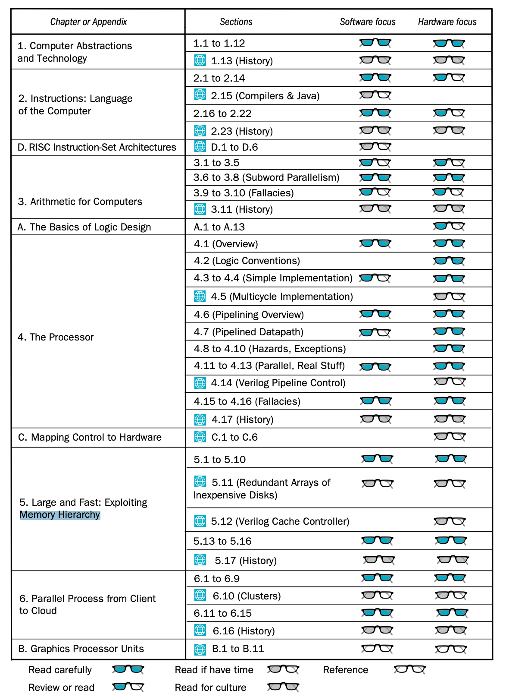

# Computer Organization and Design (RISC-V)

TODO

按照作者给出的建议，聚焦于软件部分，只读蓝色眼镜的部分，会跳过一些小节，另外对有的小节而言，（自认为）有价值的信息很少，亦不会总结在这里，所以这里的小节号并不连贯。

github 上有 RISC-V 的工具链：https://github.com/riscv-collab/riscv-gnu-toolchain ，可以配合这本书使用，帮助理解。
