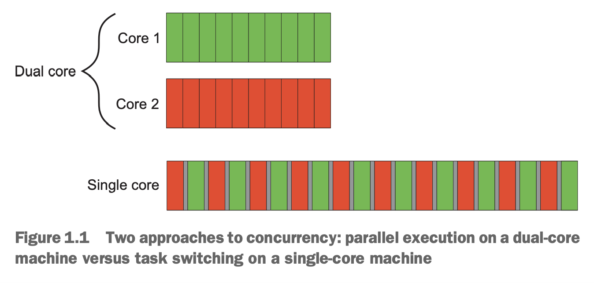
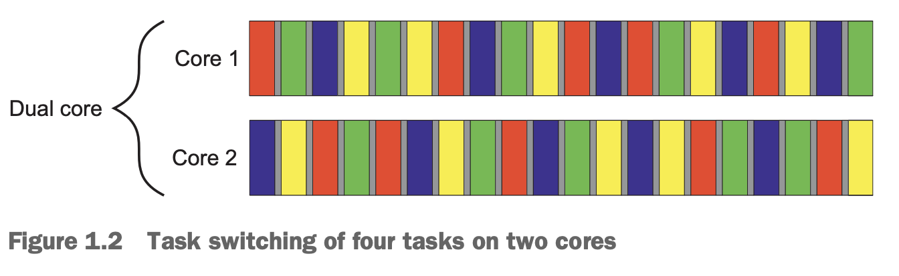
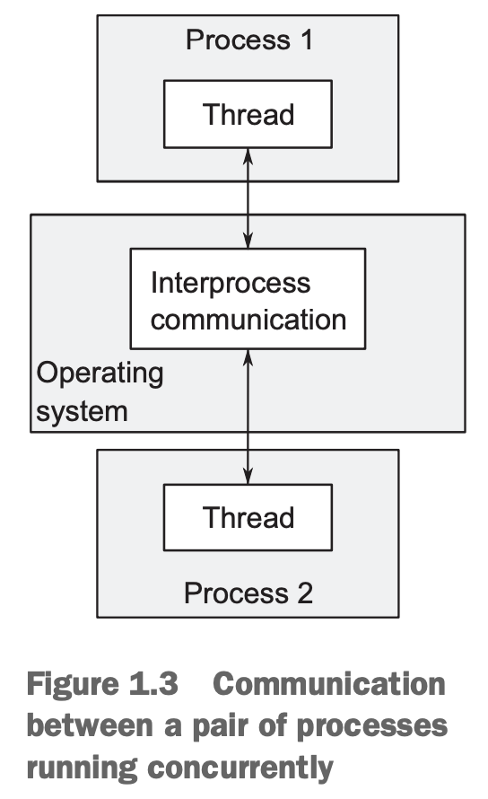
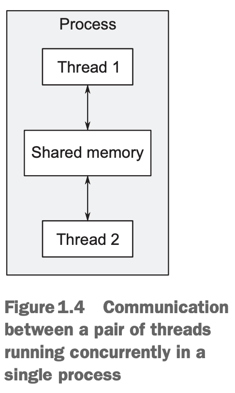

### Concurrency in computer systems
同时运行多个任务，称为并发（`Concurrency`）。

如果只有一个处理器，可以在多个任务间快速切换，一种同时运行的假象，这称为任务切换（`task switching`）。因为只是假象，那么和真正的并行可能有行为不一致的地方。

多个处理器或者一个处理器多核就可以真正同时运行多个任务，称为硬件并发（`hardware concurrency`）。

下图是理想情况下多核和单核的执行情况。

单核的间隙是上下文切换（`context switch`）。切换的时候可能要重新把新任务的指令和数据加载到缓存中，这会导致进一步的延迟。

一些处理器一个核可以处理多个线程，称为硬件线程（`hardware threads`）。硬件线程的数量决定了真的有多少任务能够并行。现代计算机上任务数往往比这多得多，所以还是不得不进行任务切换。如下图是双核计算机上执行了四个任务的情况。

本书中的技术、代码不关心单核或者多核、任务切换或者真的并行。不过硬件的真实并发能力决定了如何设计，第八章会详细讨论。

###  Approaches to concurrency
作者给出了一个比喻：你雇了两个程序员，一人一个办公室，可以专心工作，有自己独享的资源，但是你需要管理两个办公室，同时它们沟通不方便；另外一个方式是管理一个办公室，两个程序员共享，沟通便利，但是可能不能专心工作，还要共享资源。

这就是实现并发的两种方法：第一种是有多个单线程的进程；第二种是一个多线程的进程。也可以结合两者，若干个多线程进程和若干个单线程进程。

#### CONCURRENCY WITH MULTIPLE PROCESSES
多进程，每个进程单线程。进程间通过一些进程间通信的机制传递信息。如下图所示：

缺点一是进程间通信复杂或/和比较慢，因为操作系统有隔离保护机制；缺点二是需要一点时间启动进程，同时操作系统需要专门的资源管理这些进程。

好处一是由于有保护机制和高层的通信机制，容易写出更安全的并发代码。

好处二是可以部署到不同机器，通过网络通信。设计很好的系统这些额外开销小于并行带来的性能提升。

#### CONCURRENCY WITH MULTIPLE THREADS
一个进程，多线程。所有线程共享地址空间，大多数数据都可以直接访问。尽管进程间也可以共享内存，但是建立比较复杂，同时由于不同进程对于共享内存的地址是不同的，所以必须共享没有指针/引用的数据结构，管理复杂。下图是多线程共享数据：

多线程共享地址空间和没有操作系统保护，那么数据共享更快。但是共享内存的灵活性带来另外一个问题：必须小心的处理数据使得多个线程看到的内容是一致的。3、4、5、8 章会详细讨论这个问题。

主流语言都提供多线程并发的类库，C++也一样（进程通信就需要操作系统提供的 API 了）。本书使用多线程实现并发。

### Concurrency vs. parallelism
两者之间大部分语义是重叠的，但是略有不同。谈论并发更多在意的是关注内容分离、响应能力，并行更多的在意利用硬件加速性能。

还有一种说法，并发可能并不是真的并行起来了，可以是前面提到的任务切换。
