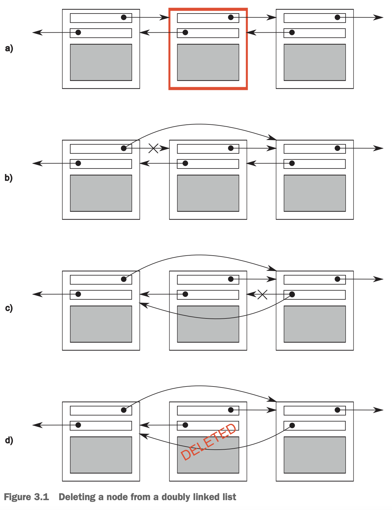

所有多线程之间共享数据的问题都归结于修改数据。如果是只读数据，那么没有问题，因为一个线程读不会影响另外的线程读。如果一个线程开始修改数据，那么问题就来了。你必须要小心的处理。

编程中有个重要概念，不变量（`invariants`）。如果数据结构复杂，那么更新数据的过程中可能会导致不变量被破坏，但是更新完毕之后，不变量应该依旧成立。

考虑双向链表。A的`next`是B，那么B的`previous`应该是A。这是一个不变量。下图是删除一个节点的步骤。

如果一个线程了完成了步骤b，但是没有开始执行步骤c，那么上述双链表的不变量就破坏了。另外一个线程访问这个链表，如果从左往右遍历，那么会跳过被删除的节点，如果它在删除最后边的节点，那么双链表结构被破坏了，最终导致程序崩掉。不管结果如何，这是并发代码最常见的问题：条件竞争。

### Race conditions
考虑电影院有多个买票窗口。如果其他人和你买同一场的票，那么能买到什么座位取决于谁先买。如果剩余座位很少了，就会出现竞争。你最终坐哪个位置（或者能否买到票）依赖于购票的顺序——条件竞争的例子。

条件竞争是指结果依赖于多个线程执行的顺序。多数时候，不同结果都是可以接受的。条件竞争导致不变量被破坏才是一个问题。我们通过说条件竞争指的就是有问题的，没问题的我们也无需关注。C++标准使用数据竞争（`data race`）指并发修改同一个对象这种特殊的条件竞争。其结果往往是未定义行为。

条件竞争常常出现在操作涉及多个数据的时候。涉及分开的两个数据，那么是不同的指令，那么其他线程就会访问到部分完成的修改。由于时间窗口很小，所以很难 debug 和复现。如果修改是连续的指令，那么即使其他线程在访问，一次运行出现的可能性也很低。系统负载大了之后，操作变多，那么就会经常出现了。由于条件竞争的发生对时间很敏感，和操作顺序有关，那么 debug 过程往往不会出现，因为 debugger 会影响时序。

多线程程序大量代码都是在避免发生条件竞争。

### Avoiding problematic race conditions
有几种方式避免竞争。最简单的方式是包装数据结构，中间状态（破坏了不变量）只能有执行修改的线程可见。其他线程看来就是没有修改或者已经修改完了。C++ STL 提供了几种方式，这章会讲解。

另外一种方式是巧妙设计数据结构，修改是一系列无可再分的操作，每一步都保持不变量。这称为无锁编程（`lock-free`），很难写，并且需要知道内存模型和每个线程看到什么样的数据。第五章讲解内存模型，第七章讲无锁编程。

还一种方式类似于数据库的事务。先写修改数据的日志，然后一次提交。这称为软件事务内存（`software transactional memory (STM)`）。这个还在研究中，有 TS 提案。C++没有直接支持 STM，本书也不会展开。
