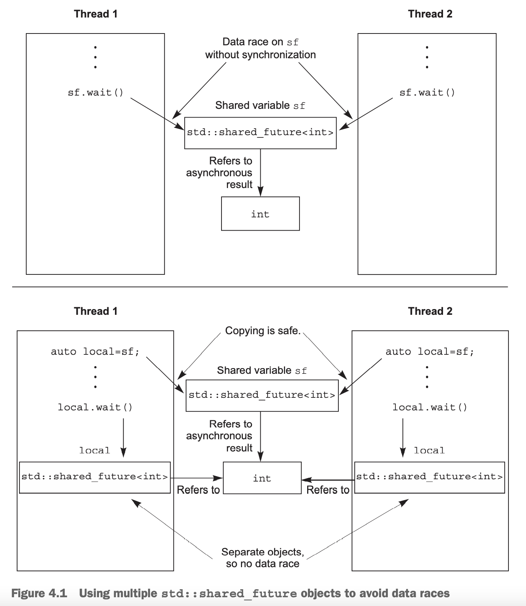

C++标准库中把一次性的事件称为`future`。简单来说，它代表了一个事件。线程可以周期性的检查（期间可以做其他事情）或者一直做其他事情直到`future`已经准备好了（`ready`）。一旦事件已经发生，变成了`ready`状态，就不能重置了。

C++标准库提供了两种`future`：`unique futures` (`std::future<>`)和`shared futures`(`std::shared_future<>`)。和相应的智能指针类似，前者只能有一个实例与事件关联，或者就不限制了。对于后者而言，一旦事件`ready`，那么所有线程都能访问与之关联的数据。模板参数表示数据类型，`std:future<void>`和`std::shared_future<void>`表示没有与之关联的数据。尽管`future`是为了多线程通信，但是如果线程访问同一个`future`对象，需要保护。

还有两个实验性质的类：`std::experimental::future<>`和`std::experimental::shared_future<>`，与标准库一致，此外还提供了其他设施。不过代码质量不保证，而且等到了`std`标准库的时候，语法和语义可能会有变化。

第二章中讲解`std::thread`时没有提供方法从一个任务中返回数据。下面会介绍。

### Returning values from background tasks
如果需要一个耗时较长的计算，但是不需要立即得到结果，这是使用`std::async`的好机会。

使用`std::async`启动了一个异步任务，相较于启动线程得到`std::thread`对象等待结束，`std::async`返回`std::future`对象，其最终会保存函数的返回结果。当需要结果的时候，调用`get()`取结果，这个时候可能会阻塞住，等到`future`状态是`ready`。下面是一个简单的例子。
```cpp
#include <future>
#include <iostream>
int find_the_answer_to_ltuae();
void do_other_stuff();
int main()
{
    std::future<int> the_answer = std::async(find_the_answer_to_ltuae);
    do_other_stuff();
    std::cout << "The answer is " << the_answer.get() << std::endl;
}
```
`std::async`允许传递多个参数，这个`std::thread`是一致的，对于第一个参数是类成员函数的情况也一样。参数如果是右值，通过移动操作创建了一个副本，这使得可以使用只允许移动的类型。看下面的例子，说明了传参的各种情况。
```cpp
#include <string>
#include <future>
struct X
{
    void foo(int, std::string const &);
    std::string bar(std::string const &);
};

X x;
auto f1 = std::async(&X::foo, &x, 42, "hello");
auto f2 = std::async(&X::bar, x, "goodbye");

struct Y
{
    double operator()(double);
};

Y y;
auto f3 = std::async(Y(), 3.141);
auto f4 = std::async(std::ref(y), 2.718);

X baz(X &);
std::async(baz, std::ref(x));

class move_only
{
public:
    move_only();
    move_only(move_only &&)
        move_only(move_only const &) = delete;
    move_only &operator=(move_only &&);
    move_only &operator=(move_only const &) = delete;
    void operator()();
};
auto f5 = std::async(move_only());
```
默认情况下，`std::async`启动一个线程执行，或者等到调用`wait()`或者`get()`的时候同步计算，这取决于实现。我们可以传入`std::launch`来确定其行为，`std::launch::deferred`的行为是调用`wait()`或者`get()`的时候才调用函数，`std::launch::async`的行为是要求一定启动线程来执行函数，`std::launch::deferred
| std::launch::async`意味着实现决定行为。如果函数是延迟调用的话，可能从来不会执行。
```cpp
auto f6 = std::async(std::launch::async, Y(), 1.2);
auto f7 = std::async(std::launch::deferred, baz, std::ref(x));
auto f8 = std::async(
    std::launch::deferred | std::launch::async,
    baz, std::ref(x));
auto f9 = std::async(baz, std::ref(x));
f7.wait();
```

### Associating a task with a future
`std::packaged_task<>`将`future`和可调用对象绑定在一起。当`std::packaged_task<>`被调用时，函数或者可调用对象使`future`状态`ready`，返回值存储在与`future`关联的数据上。这可以用于构建一个线程池或者任务管理系统。一个很大的操作，分割成若干小任务，封装到`std::packaged_task<>`实例中，交给线程池或者调度系统执行。从抽象角度看，调度器处理的是`std::packaged_task<>`实例而不是一个一个的函数。

`std::packaged_task<>`模板参数是一个函数签名，`void()`表示没有参数也没有返回值，`int(std::string&,double*)`表示参数是非`const`的`string`引用和一个`double`指针，返回类型是`int`。当构造`std::packaged_task`实例的时候，传入的函数或可调用对象不一定要和签名完全一致，类型能隐式转换即可。比如构造`std::packaged_task<double(double)>`时可以用一个接受`int`类型参数返回`float`类型的函数。

通过其成员函数`get_future()`得到具体的`std::future<>`，此`future`的模板类型就是指定的函数签名的返回值，类似的，指定的函数签名的参数列表是其`operator()`的参数列表。比如`std::packaged
_task <std::string(std::vector<char>*,int)>`的定义大致如下。
```cpp
template <>
class packaged_task<std::string(std::vector<char> *, int)>
{
public:
    template <typename Callable>
    explicit packaged_task(Callable &&f);
    std::future<std::string> get_future();
    void operator()(std::vector<char> *, int);
};
```
`std::packaged_task`是可调用对象，可以封装成函数，或者传递给`std::thread`或者任何需要可调用对象的函数。当然，也可以直接执行。我们可以用`std::packaged_task`封装成一个任务，在其他地方获取`future`，当我们需要结果的时候，等待其`ready`。看下面的示例。

#### PASSING TASKS BETWEEN THREADS
许多 GUI 框架要求从特定线程（一般就是 UI 线程或者主线程）对 GUI 进行更新，因此如果另一个线程需要更新 GUI，它必须向正其发送消息才能达到目的。`std:packaged_task`提供了一种方法来执行此操作，不用为每个与 GUI 相关的活动提供自定义消息。如下所示。
```cpp
#include <deque>
#include <mutex>
#include <future>
#include <thread>
#include <utility>
std::mutex m;
std::deque<std::packaged_task<void()>> tasks;
bool gui_shutdown_message_received();
void get_and_process_gui_message();
void gui_thread()
{
    while (!gui_shutdown_message_received())
    {
        get_and_process_gui_message();
        std::packaged_task<void()> task;
        {
            std::lock_guard<std::mutex> lk(m);
            if (tasks.empty())
                continue;
            task = std::move(tasks.front());
            tasks.pop_front();
        }

        task();
    }
}

std::thread gui_bg_thread(gui_thread);

template <typename Func>
std::future<void> post_task_for_gui_thread(Func f)
{
    std::packaged_task<void()> task(f);
    std::future<void> res = task.get_future();
    std::lock_guard<std::mutex> lk(m);
    tasks.push_back(std::move(task));
    return res;
}
```
GUI 线程轮询是否收到了关闭的信号，如果没有，就尝试从任务队列中获得一个任务。任务执行完的时候，与之关联的`future`是`ready`状态。

添加任务也是类似的。利用给定函数创建`std::packaged_task`对象，获取`future`，在将其返回给调用者之前把任务放入队列。调用`post_task_for_gui_thread`想更新 GUI 的线程可以等待返回的`future`以确定任何执行完了，或者如果不关心的话可以直接丢弃。

这里使用`std::packaged_task<void()>`表示无参也无返回值，但是模板可以接受任意函数签名，所以很容易把这个例子扩展成需要传参并且返回结果的例子。

###  Making (std::)promises
当一个服务需要处理很多连接时，一个做法是一个线程处理一个连接，好处是简单易懂。当连接很少的时候没有问题，但是连接很多的时候会产生大量的线程消耗资源，同时需要调度和上下文切换，甚至在达到网络上限之前就消耗光了 OS 的资源。所以需要很少的线程（可能只有一个）来处理连接，即一个线程需要处理很多连接。本质上就是要接受网络包或者发送网络包。

`std::promise<T>`提供了一种设置值的方式，可以通过与之关联的`std::future<T>`读结果。`std::promise/std::future`提供了一种机制：等待线程阻塞在`future`，另一个线程通过设置值使`future`状态`ready`。

通过调用`std::promise<T>`的`get_future()`成员函数可以得到与之关联的`std::future<T>`对象。如果没有设置值就销毁`std::promise`对象，会存储一个异常。下个小节会讨论。

下面是一个简单的处理上述连接的例子。`std::promise<bool>/std::future<bool>`表示要发送的数据是否发送完，对于进来的数据，`future`保存的是数据包的负载（`payload`）。
```cpp
#include <future>
void process_connections(connection_set &connections)
{
    while (!done(connections))
    {
        for (connection_iterator
                 connection = connections.begin(),
                 end = connections.end();
             connection != end;
             ++connection)
        {
            if (connection->has_incoming_data())
            {
                data_packet data = connection->incoming();
                std::promise<payload_type> &p =
                    connection->get_promise(data.id);
                p.set_value(data.payload);
            }

            if (connection->has_outgoing_data())
            {
                outgoing_packet data =
                    connection->top_of_outgoing_queue();
                connection->send(data.payload);
                data.promise.set_value(true);
            }
        }
    }
}
```
`process_connections()`循环到`done()`返回`true`。每次循环，检查对于每一个连接而言，是否有数据进来，然后接着发送数据。这个例子假定数据包中有一个 ID，查找与之关联的`promise`，然后设置值。发送也是类似的。

### Saving an exception for the future
下面是求平方函数。如果传入 -1，会抛出异常。
```cpp
double square_root(double x)
{
    if (x < 0)
    {
        throw std::out_of_range("x < 0");
    }
    return sqrt(x);
}
```
我们可以在当前线程同步调用
```cpp
double y = square_root(-1);
```
也可以异步使用
```cpp
std::future<double> f = std::async(square_root, -1);
double y = f.get();
```
两者调用结果应该是一样的，要么获得一个值，要么有一个异常。

这确实是实际行为。如果传入`std::async`的函数抛出异常，那么这个异常会被存起来，并且`future`状态为`ready`，当调用`get()`时，会重抛该异常。`std::packaged_task`也是类似的行为。

`std::promise`除了上述行为外，使用`set_exception()`可以主动设置异常。一个常用的方法是在某个算法出错时使用。
```cpp
extern std::promise<double> some_promise;
try
{
    // do something...
    some_promise.set_value(calculate_value());
}
catch (...)
{
    some_promise.set_exception(std::current_exception());
}
```
这里使用`std::current_exception()`来恢复抛出的异常。我们也可以使用`std::make_exception_ptr()`来创建一个新的异常而不抛出
```cpp
some_promise.set_exception(std::make_exception_ptr(std::logic_error("foo ")));
```
另一种`future`会存一个异常的情况是没有调用与之关联的函数就销毁了`std::promise`或`std::packaged_task`对象。如果`future`的状态不是`ready`，它们的析构函数会创建一个错误码为`std::future_errc::broken_promise`的`std::future_error`异常。如果编译器不做这个事情，等待的线程可能会永远的等待下去。

### Waiting from multiple threads
`std::future`被用于在两个线程之间同步数据，但是调用其成员函数不是同步的。如果多个线程访问同一个`std::future`实例，也会有竞争问题。如果多个线程调用`get()`，只有一个会得到值。

如果多个线程需要访问同一个`future`，可以使用`std::shared_future`。相比`std::future`仅能移动，`std::shared_future`是可以拷贝的。

`std::shared_future`的成员函数是没有同步机制来保证没有竞争问题的，所以我们需要额外加锁。推荐做法是复制`shared_future`到每个单独的线程内部，也就是说，各自有用本地拷贝以防止竞争。如下图所示。



`std::shared_future`的一个使用场景是复杂的电子表格。每一个单元格中最终会有一个值，但是可能被其他单元格的公式所引用。每个单元格使用独立`std::shared_future`对象，一旦对应的函数完成，那么依赖的单元格就可以并发的进行计算，依赖于这些单元格的`std::shared_future`对象就是`ready`状态了。这使得系统可以最大化并发能力。

一些引用异步状态的`std::shared_future`实例是用另一个引用异步状态的`std::shared_future`实例构造的。由于`std::shared_future`不能分享所持的状态的所有权，所以必须通过`std::move`转移`std::shared_future`所有权，那么原来的`std::shared_future`实例只有一个空的状态。
```cpp
std::promise<int> p;
std::future<int> f(p.get_future());
assert(f.valid());
std::shared_future<int> sf(std::move(f));
assert(!f.valid());
assert(sf.valid());
```
一开始`f`是有效的，因为它引用了`p`的异步状态，转移到`sf`之后就不再有效，反之，`sf`是有效的。

对于右值引用，转移所有权是隐式的。所以能够直接用`get_future()`的返回值构造`std::shared_future`实例。
```cpp
std::promise<std::string> p;
std::shared_future<std::string> sf(p.get_future());
```
`std::future`的`share()`函数返回一个`std::shared_future`实例并且自动转移所有权，很方便。配合类型推导就更简单了。
```cpp
std::promise<std::map<SomeIndexType, SomeDataType, SomeComparator,
                      SomeAllocator>::iterator>
    p;
auto sf = p.get_future().share();
```
此时，`sf`的类型是`std::shared_future<std::map<SomeIndexType, SomeDataType, SomeComparator, SomeAllocator>::iterator`。如果比较器或者分配器修改了，那么只需要修改`p`的类型，`sf`的类型会自动修改。
