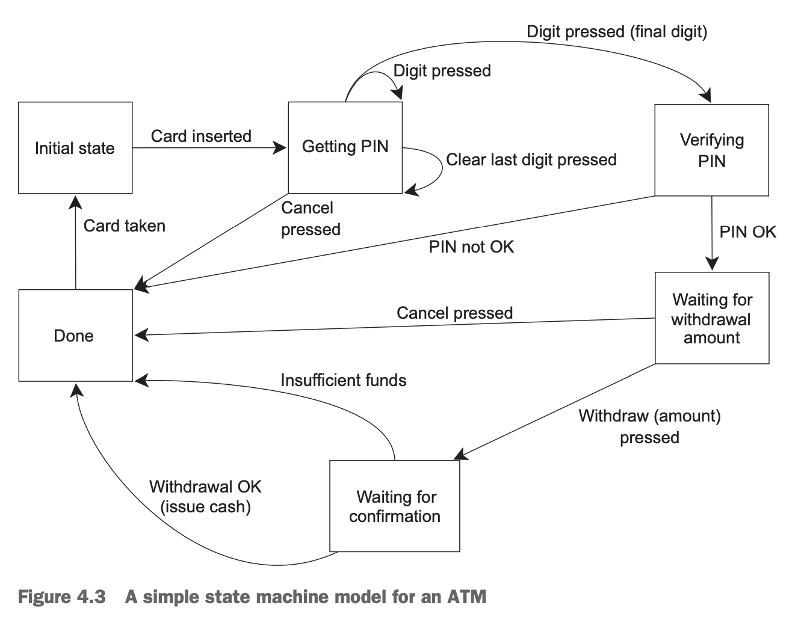

本章前面介绍了很多同步并行的方式，主要目的是可以简化代码，使得我们把焦点放到功能上。相比使用共享数据，我们更倾向于在不同任务之间传递数据，提供给任务必要的数据，从任务中获取需要的数据。

### Functional programming with futures
术语函数编程（`functional programming`, `FP`）是一种编程模式，函数的结果只依赖于输入的参数。这个概念借鉴了数学中函数的概念，只要输入一样，那么输出就一定一样。一个纯的函数不修改外部状态，其副作用仅限于其返回值。

这使得很多事情都更容易思考，尤其是在并发的情况下，因为第三章介绍的麻烦都是共享数据导致的。不修改数据，也就没有竞争，那么也不需要互斥保护数据。类似`Haskell`的语言纯函数式的，越来越流行。大部分函数都是纯函数，部分非纯函数需要修改状态，那么我们就能更加仔细推敲它们在整个应用中是否协调。

FP 并非仅限于函数式编程语言。C++是多范式，也可以支持函数式编程，C++11有了 lambda、类型推导、bind 等等，写函数式代码也更加容易。`future`是最后一个组件，为写并发的函数式代码提供了便利。`future`用于多线程之间传递数据，而不是修改共享数据。

#### FP-STYLE QUICKSORT
快排的原理就不在这里赘述了。下面是 FP 风格的实现，并不像`std::sort()`一样就地排序，而是通过复制链表实现的。
```cpp
template <typename T>
std::list<T> sequential_quick_sort(std::list<T> input)
{
    if (input.empty())
    {
        return input;
    }
    std::list<T> result;

    // 取第一个元素作为 pivot
    result.splice(result.begin(), input, input.begin());
    T const &pivot = *result.begin();

    // 使用 lambda 表达式声明分区函数，只用一次。引用捕捉避免复制
    auto divide_point = std::partition(input.begin(), input.end(),
                                       [&](T const &t)
                                       { return t < pivot; });

    // 链表中剩余元素从头到 divide_point 移动到 lower_part
    // input 里面剩余的就是比 pivot 大的元素了
    std::list<T> lower_part;
    lower_part.splice(lower_part.end(), input, input.begin(),
                      divide_point);

    // 递归排序两边，move 避免复制，结果会隐式的 move 出来
    auto new_lower(
        sequential_quick_sort(std::move(lower_part)));
    auto new_higher(
        sequential_quick_sort(std::move(input)));

    // 拼接结果，大的元素在后面拼接，小的元素从头拼接，pivot 本身就处于链表中间了
    result.splice(result.end(), new_higher);
    result.splice(result.begin(), new_lower);
    return result;
}
```

#### FP-STYLE PARALLEL QUICKSORT
已经有了函数式的快排实现，很容易利用`future`改写成并行版本。
```cpp
template <typename T>
std::list<T> parallel_quick_sort(std::list<T> input)
{
    if (input.empty())
    {
        return input;
    }

    std::list<T> result;
    result.splice(result.begin(), input, input.begin());
    T const &pivot = *result.begin();
    auto divide_point = std::partition(input.begin(), input.end(),
                                       [&](T const &t)
                                       { return t < pivot; });

    std::list<T> lower_part;
    lower_part.splice(lower_part.end(), input, input.begin(),
                      divide_point);

    // 最大的变化是这里：new_lower 不再在当前线程排序而不使用 std::async 在新线程进行排序
    std::future<std::list<T>> new_lower(
        std::async(&parallel_quick_sort<T>, std::move(lower_part)));

    // new_higher 仍旧是在当前线程排序，递归调用
    auto new_higher(
        parallel_quick_sort(std::move(input)));

    // new_higher 是在当前线程，可以直接使用
    result.splice(result.end(), new_higher);

    // 但是 new_lower 现在不是列表而是 future，所以需要获取结果
    // get() 返回的是右值引用，可以自动 move 出来
    result.splice(result.begin(), new_lower.get());

    return result;
}
```
上述代码会产生大量的线程，如果递归 10 次（1000+元素）就会产生 1024 个线程，希望硬件能处理的过来。如果类库意识到已经产生了太多的线程，后续的任务可能会同步的进行。如果依赖于类库自动扩展，那么用之前最好看一下文档确定其行为。

我们可以通过封装`std::packaged_task`和`std::thread`得到自行实现的`spawn_task()`版本。这个函数本身没有太多优势，不过如果我们希望把任务放到队列中同时利用线程池的话，那这个函数就为实现这些做好了准备。只有在知道自己在做什么并且希望控制线程池行为和任务执行的时候，这样做才有意义，否则不如使用`std::async`。
```cpp
template <typename F, typename A>
std::future<std::result_of<F(A &&)>::type>
spawn_task(F &&f, A &&a)
{
    typedef std::result_of<F(A &&)>::type result_type;
    std::packaged_task<result_type(A&&)> task(std::move(f)));
    std::future<result_type> res(task.get_future());
    std::thread t(std::move(task), std::move(a));
    t.detach();

    return res;
}
```
`std::async()`可以最大化利用硬件，这个函数仍旧有改进空间，比如`std::partition`也可以并行化起来。想要知道并发的最大能力，可以参考学术文章，或者看C++17并发库（第十章）。

FP 不是唯一绕过共享数据的编程范式，CSP（`Communicating Sequential Processes`）利用通信信道在线程之间传递数据，而线程在概念上是完全独立的。Erlang 就是如此，MPI 库也是如此。

###  Synchronizing operations with message passing
CSP 的想法很简答：没有共享数据，每个线程是独立的，只需要根据输入的信息做响应即可。每个线程就像一个独立的状态机，有一个初始状态，接受消息，修改自己的状态，或者给其他线程发消息。

CSP 没有共享数据，不过C++程序多线程情况下是共享地址空间的，不需要强行假设这一点。只需要在实现的时候保证线程之间没有共享数据即可。消息队列是共享的，但相关细节可由类库封装起来。

考虑 ATM 取钱的场景。我们可以有三个独立的线程分别处理 1）物理机器；2）ATM 逻辑；3）与银行通信 相关的事情即可。线程间发送消息而不是共享数据。下面是状态图。



根据状态变化，可以设计独立的类，每个类成员函数处理一种状态，等待接受消息，一旦接受到了按照既定逻辑处理，也有能转移到别的状态。下面代码是简单的实现，起始状态，等待用处插卡。

整个代码中需要同步的地方就是消息的传递，这被封装到了消息类库。附录 C 有全部代码，包括消息类库。
```cpp
struct card_inserted
{
    std::string account;
};

class atm
{
    messaging::receiver incoming;
    messaging::sender bank;
    messaging::sender interface_hardware;
    void (atm::*state)();
    std::string account;
    std::string pin;

    // 状态函数就是简单的成员函数
    void waiting_for_card()
    {
        // 向硬件接口线程发送消息
        interface_hardware.send(display_enter_card());

        // 等待消息
        // 唯一能处理的消息类型是 card_inserted
        // 这里使用 lambda 表达式作为处理逻辑
        // 可以传递任何函数作为 handle 的参数，这里使用 lambda 只是因为简单
        // 这里是链式调用，如果消息类型不是 card_inserted 那么消息会被废弃，继续等待下一个消息
        incoming.wait()
            .handle<card_inserted>(
                [&](card_inserted const &msg)
                {
                    // 缓存账户信息并情况 PIN 码
                    account = msg.account;
                    pin = "";

                    // 向硬件接口线程发送消息提示用户输入密码
                    interface_hardware.send(display_enter_pin());

                    // 状态发生了改变
                    state = &atm::getting_pin;
                });

        // 函数返回后 run 继续循环
    }

    void getting_pin();

public:
    // 线程从这里开始
    void run()
    {
        // 初始状态
        state = &atm::waiting_for_card;
        try
        {
            // 一直运行代表当前状态的函数
            for (;;)
            {
                (this->*state)();
            }
        }
        catch (messaging::close_queue const &)
        {
        }
    }
};
```
这里逻辑相对于真实场景已经经过了大量的简化，不过这里本身的目的是感受使用消息传递的编程风格。不需要考虑同步和并发，只需要关注消息到了处理和需要发送什么消息就足够了。ATM 逻辑是单独的一个线程，其他两个部分也是单独的线程。这个编程模式称为演员模型（Actor model），系统中有一些独立的演员，负责发送消息和接受消息，没有共享状态。

`getting_pin`稍微复杂一点，能够处理三种不同类型的消息。代码如下所示。
```cpp
void atm::getting_pin()
{
    incoming.wait()
        .handle<digit_pressed>(
            [&](digit_pressed const &msg)
            {
                unsigned const pin_length = 4;
                pin += msg.digit;
                if (pin.length() == pin_length)
                {
                    bank.send(verify_pin(account, pin, incoming));
                    state = &atm::verifying_pin;
                }
            })
        .handle<clear_last_pressed>(
            [&](clear_last_pressed const &msg)
            {
                if (!pin.empty())
                {
                    pin.resize(pin.length() - 1);
                }
            })
        .handle<cancel_pressed>(
            [&](cancel_pressed const &msg)
            {
                state = &atm::done_processing;
            });
}
```
这次需要传递三种消息，所以有三个`handle`，模板参数就对应的消息类型，`handle`参数是接受对应消息类型的 lambda 表达式，是处理消息的主体。仍旧是链式调用，`wait()`的实现知道是什么类型的函数，如果不是这三种类型，也会被丢弃。

这次我们不需要修改状态。`digit_pressed`仅仅是拼接一个数字直到满足条件。主循环会下次调用`getting_pin`来获取下一个数字或者处理取消等事件。

上面的状态流程图中每个方块表示有一个成员函数处理对应的消息，并且如果需要的话会更新状态。

你会发现这种编程风格处理并发非常简单，因为每一个线程都是独立的。这是一个展示如何用多线程来分离关注点的例子，这也需要仔细考虑如何划分不同的任务到对应的线程。

### Continuation-style concurrency with the Concurrency TS
Concurrency TS 在`std::experimental`命名空间提供了全新的`std::promise`和`std::packaged_task`，返回类型是`std::experimental::future`，其提供了新的关键功能——continuation。

假设你运行一个任务会返回一个结果，`future`用于存放结果。你必须使用`wait()`等待结果（或者用`wait_for()`或`wait_until()`等待有限的时间），然后处理结果。这很不方便，你可能需要一个语义：任务完成了，你继续后续的事情吧。这就是 continuation 提供的能力。调用`future`成员函数`then()`传递 continuation——`fut.then(continuation)`。

`std::experimental::future`也存储了一个值，不过一旦`continuation`消费之后，其他地方就不能再次消费了，这时旧的`future`状态不是合法的了，同时`then()`返回一个新的`future`，状态是合法的，保存了新的函数调用的结果。
```cpp
std::experimental::future<int> find_the_answer;
auto fut = find_the_answer();
auto fut2 = fut.then(find_the_question);
assert(!fut.valid());
assert(fut2.valid());
```
`find_the_question`会在原始`future` `ready`之后，在不确定的线程上运动。这使得线程池或者类库的实现更自由。这样的灵活性和之前提到的`future`是一样的。

你不能给`continuation`提供参数，因为这都由类库设定好了，就是一个已经`ready`的`future`。如果前面的例子中，`find_the_answer`返回`int`类型，那么`find_the_answer`的参数就是`std::experimental::future<int>`。

`continuation`最后获取存了一个值，或者是一个异常。如果`future`被隐式解引用以将值直接传递给`continuation`，那么将不得不决定如何处理异常，而通过将`future`传递给`continuation`，`continuation`就可以处理异常。一个简单的情况就是调用`fut.get()`获取一个值，或者`re-throw`异常到`continuation`函数外面。这和把函数传递给`std::async`是一致的。

Concurrency TS 并没有要求实现对应的`std::async`，不过实现本身可能会提供一个。即使没有，自己实现一个也非常直接。使用`std::experimental::promise`获取`future`，开一个线程运行函数，返回之后设置结果或者异常。
```cpp
template <typename Func>
std::experimental::future<decltype(std::declval<Func>()())>
spawn_async(Func &&func)
{
    std::experimental::promise<
        decltype(std::declval<Func>()())>
        p;
    auto res = p.get_future();
    std::thread t(
        [p = std::move(p), f = std::decay_t<Func>(func)]() mutable
        {
            try
            {
                p.set_value_at_thread_exit(f());
            }
            catch (...)
            {
                p.set_exception_at_thread_exit(std::current_exception());
            }
        });
    t.detach();
    return res;
}
```
使用`set_value_at_thread_exit`和`set_exception_at_thread_exit`是为了`future`变成`ready`之间`thread_local`变量已经清理了。

### Chaining continuations
如果你有一系列的耗时的事情需要做，那么可以按序异步完成这些事情以释放当前线程或者其他线程。比如用户登录的时候，我们会先验证账户和密码，成功之后获取用户信息，取回数据之后开始更新 UI。下面是对应的代码。
```cpp
void process_login(std::string const &username, std::string const &password)
{
    try
    {
        user_id const id = backend.authenticate_user(username, password);
        user_data const info_to_display = backend.request_current_info(id);
        update_display(info_to_display);
    }
    catch (std::exception &e)
    {
        display_error(e);
    }
}
```
这个代码完全是顺序执行的，如果想不阻塞 UI 线程，应该怎么办呢？都放到`std::async`里面，不过这仍旧会阻塞线程，并且消耗资源来等待结果，同时，如果有很多这样任务，除了等待，做不了其他事情。
```cpp
std::future<void> process_login(
    std::string const &username, std::string const &password)
{
    return std::async(std::launch::async, [=]()
                      {
                        try {
                                user_id const id = backend.authenticate_user(username, password);
                                user_data const info_to_display = backend.request_current_info(id);
                                update_display(info_to_display);
                            } catch (std::exception& e) {
                                display_error(e);
                            }
                      });
}
```
为了不阻塞这些线程，我们需要`continuation`来链式调用这些任务。下面的代码对上述任务这了拆分。
```cpp
std::experimental::future<void> process_login(
    std::string const &username, std::string const &password)
{
    return spawn_async([=]()
                       { return backend.authenticate_user(username, password); })
        .then([](std::experimental::future<user_id> id)
              { return backend.request_current_info(id.get()); })
        .then([](std::experimental::future<user_data> info_to_display)
              {
                try {
                    update_display(info_to_display.get());
                } catch(std::exception& e) {
                    display_error(e);
                } });
}
```
现在每一个`continuation`都有一个`std::experimental::future`作为唯一参数，通过`get()`获取结果。这样异常可以沿着链式传递，最后通过`info_to_display.get()`获取结果或者有异常，紧接着处理所有的异常，这样，代码就和最开始的顺序执行版本一样了。

当函数调用服务端接口的时候，还是需要等待服务器端返回，那么当前线程还是会被阻塞。所以，我们需要调用异步版本的接口来解决这个问题。比如`backend.async_authenticate_user(username,password)`，不过这个函数返回的是`std::experimental::future<user_id>`而不是`user_id`。

这并不会使得代码变得更复杂。`continuation`有一个叫做`future-unwrapping`的功能，如果`.then()`接受的参数返回类型已经是`future<some_type>`，那么其也会直接返回`future<some_type>`类型，而不是`future<future<some_value>>`。
```cpp
std::experimental::future<void> process_login(
    std::string const &username, std::string const &password)
{
    return backend.async_authenticate_user(username, password)
        .then([](std::experimental::future<user_id> id)
              { return backend.async_request_current_info(id.get()); })
        .then([](std::experimental::future<user_data> info_to_display)
              {
                try {
                    update_display(info_to_display.get());
                } catch(std::exception& e) {
                    display_error(e);
                } });
}
```
这段代码除了用了 lambda 拆分了任务，看起来和最初的版本差距不大，不过这个版本完全是异步执行的。如果编译器支持泛型 lambda，那么使用 auto 能使代码简化不少。
```cpp
return backend.async_authenticate_user(username, password)
    .then([](auto id)
          { return backend.async_request_current_info(id.get()); });
```
这里使用了 lambda，原因是控制流和逻辑本身很简单，如果复杂的话，建议使用单独的函数。

`std::experimental::shared_future`也支持`continuation`，类似`future`，`std::experimental::shared_future`支持多个`continuation`，它解决了多个线程都需要同一个`future`导致的数据竞争问题。它可以传递给多个`continuation`做参数。不过你没办法一下子把它传递给两个不同`continuation`，需要像下面这么做。
```cpp
auto fut = spawn_async(some_function).share();
auto fut2 = fut.then([](std::experimental::shared_future<some_data> data)
                     { do_stuff(data); });
auto fut3 = fut.then([](std::experimental::shared_future<some_data> data)
                     { return do_other_stuff(data); });
```
使用`share()`使得`fut`是`std::experimental::shared_future`类型，同样，`continuation`也接受`std::experimental::shared_future`类型的参数。`continuation`返回的是`std::experimental::future`，所以`fut2` `fut3`都是`std::experimental::future`类型，除非显式的`share()`它。

### Waiting for more than one future
有的时候有需要数据需要处理，为了充分利用硬件，会开多个线程进行计算，然后有一个线程负责收集各个结果做汇总。一种方式是这个线程忙等或者定期轮询其他`future`是否`ready`。
```cpp
std::future<FinalResult> process_data(std::vector<MyData> &vec)
{
    size_t const chunk_size = whatever;
    std::vector<std::future<ChunkResult>> results;
    for (auto begin = vec.begin(), end = vec.end(); beg != end;)
    {
        size_t const remaining_size = end - begin;
        size_t const this_chunk_size = std::min(remaining_size, chunk_size);
        results.push_back(
            std::async(process_chunk, begin, begin + this_chunk_size));
        begin += this_chunk_size;
    }

    return std::async([all_results = std::move(results)]()
                      {
                        std::vector<ChunkResult> v;
                        v.reserve(all_results.size());
                        for(auto& f: all_results)
                        {
                            // 由于需要等待每一个任务，这里会被唤醒多次
                            // 添加结果，如果下一个没有`ready`会继续休眠
                            // 同时导致多次上下文切换，增加了附加开销
                            v.push_back(f.get());
                        }

                        return gather_results(v); });
}
```
使用`std::experimental::when_all`可以避免这些问题。当所有的`future`都`ready`了，这个函数返回的`future`状态会变成`ready`。这个`future`可以传给`continuation`，所有任务都结束之后开始新的任务。
```cpp
std::experimental::future<FinalResult> process_data(
    std::vector<MyData> &vec)
{
    size_t const chunk_size = whatever;
    std::vector<std::experimental::future<ChunkResult>> results;
    for (auto begin = vec.begin(), end = vec.end(); beg != end;)
    {
        size_t const remaining_size = end - begin;
        size_t const this_chunk_size = std::min(remaining_size, chunk_size);
        results.push_back(
            spawn_async(
                process_chunk, begin, begin + this_chunk_size));
        begin += this_chunk_size;
    }

    return std::experimental::when_all(
               results.begin(), results.end())
        // 当 results 里面所有的 future 都 ready 之后
        // 会开始执行 then 里面的代码
        .then(
            [](std::future<std::vector<
                   std::experimental::future<ChunkResult>>>
                   ready_results)
            // 这里通过函数参数传递结果而不是使用 async 时捕捉变量
            {
                std::vector<std::experimental::future<ChunkResult>>
                    all_results = ready_results.get();
                std::vector<ChunkResult> v;
                v.reserve(all_results.size());
                for (auto &f : all_results)
                {
                    // 当执行到这里的时候，所有 future 都是 ready 的
                    // 那么不会有任何阻塞，减少了潜在的系统负载
                    v.push_back(f.get());
                }

                return gather_results(v);
            });
}
```

### Waiting for the first future in a set with when_any
当搜索一个很大的数据集，想要的结果会出现多条，不过任意一个都是可以接受的结果。那么我们会启动多个线程搜索不相交的子集，如果一个线程找到了结果，那么就可以返回了，无需等待其他线程结束。

`std::experimental::when_any`就是为了这个场景设计的，接受一些`future`，返回一个新的`future`，如果入参中的一个是`ready`了，那么新的`future`也就`ready`了。`when_all`是把传入的`future`包裹成一个集合，而`when_any`是添加了一个新的层次，把`future`集合和一个索引放到一次，索引的目的是告诉我们是哪一个`future`状态是`ready`。这就是模板类`std::experimental::when_any_result`的职责。
```cpp
std::experimental::future<FinalResult>
find_and_process_value(std::vector<MyData> &data)
{
    unsigned const concurrency = std::thread::hardware_concurrency();
    unsigned const num_tasks = (concurrency > 0) ? concurrency : 2;
    std::vector<std::experimental::future<MyData *>> results;
    auto const chunk_size = (data.size() + num_tasks - 1) / num_tasks;
    auto chunk_begin = data.begin();
    std::shared_ptr<std::atomic<bool>> done_flag =
        std::make_shared<std::atomic<bool>>(false);

    // 创建 num_tasks 个任务
    for (unsigned i = 0; i < num_tasks; ++i)
    {
        auto chunk_end =
            (i < (num_tasks - 1)) ? chunk_begin + chunk_size : data.end();

        // = 意味着 lambda 表达式复制的方式捕获变量
        // 每个任务有自己独立的 chunk_begin chunk_end
        // 智能指针 done_flag 也是复制的，以防有生命周期的问题
        results.push_back(spawn_async([=]
                                      {
                                        for (auto entry = chunk_begin;
                                        !*done_flag && (entry != chunk_end);
                                        ++entry) {
                                            if (matches_find_criteria(*entry)) {
                                                *done_flag = true;
                                                return &*entry;
                                            }
                                        }
                                        
                                        return (MyData *)nullptr; }));

        chunk_begin = chunk_end;
    }

    std::shared_ptr<std::experimental::promise<FinalResult>> final_result =
        std::make_shared<std::experimental::promise<FinalResult>>();

    // 我们实现成类的原因是需要递归调用
    struct DoneCheck
    {
        std::shared_ptr<std::experimental::promise<FinalResult>>
            final_result;

        DoneCheck(
            std::shared_ptr<std::experimental::promise<FinalResult>>
                final_result_)
            : final_result(std::move(final_result_)) {}

        // 一旦有一个任务完成了，这个操作符会被调用
        void operator()(
            std::experimental::future<std::experimental::when_any_result<
                std::vector<std::experimental::future<MyData *>>>>
                results_param)
        {
            // 从 ready 的 future 里面取出结果
            auto results = results_param.get();
            MyData *const ready_result =
                results.futures[results.index].get();

            // 如果有结果开始处理
            if (ready_result)
                final_result->set_value(
                    process_found_value(*ready_result));
            else
            {
                // 否则，丢弃这个 future
                results.futures.erase(
                    results.futures.begin() + results.index);
                if (!results.futures.empty())
                {
                    // 如果还有 future 需要检查，调用 when_any
                    // 一旦新新的 future ready，这个函数还会被调用
                    // 这里递归地用到这个类
                    std::experimental::when_any(
                        results.futures.begin(), results.futures.end())
                        .then(std::move(*this));
                }
                else
                {
                    // 如果没有 future 需要检查了，说明没有得到结果，那么设置异常
                    final_result->set_exception(
                        std::make_exception_ptr(
                            std::runtime_error("Not found")));
                }
            }
        };

        // when_any 等待任意一个任务返回
        std::experimental::when_any(results.begin(), results.end())
            .then(DoneCheck(final_result));
        return final_result->get_future();
    }
}
```
例子中的`when_all`和`when_any`都接受一对迭代器。不过它们也接受变参形式，可以直接传递一些参数进去。这种情况下，结果`future`持有的类型是`tuple`而不是`vector`。
```cpp
std::experimental::future<int> f1 = spawn_async(func1);
std::experimental::future<std::string> f2 = spawn_async(func2);
std::experimental::future<double> f3 = spawn_async(func3);
std::experimental::future<
    std::tuple<
        std::experimental::future<int>,
        std::experimental::future<std::string>,
        std::experimental::future<double>>>
    result =
        std::experimental::when_all(std::move(f1), std::move(f2), std::move(f3));
```
这个例子也说明这两个函数会移动容器内的`std::experimental::future`对象，如果传递参数的话，需要显式的的`move()`或者传递临时变量。

### Latches and barriers in the Concurrency TS
先介绍`latch`和`barrier`这个概念。

`latch`是一个同步对象，它的计数器变成零的时候状态变为`ready`。状态一旦`ready`之后，就总是`ready`的，直到被销毁。`latch`是等待一系列事件发生的轻量级设施。

`barrier`是一个可重用的同步组件，用于一组线程内部同步使用。`latch`不关心谁把计数器减一了，一个线程可以减一多次，也可以多个线程都减一。对于`barrier`，在每个循环中，每个线程只能达到一次。当一个线程到了`barrier`，需要等待，直到所有的线程都达到。`barrier`能够重用，下一个循环，所有线程还是需要等待到这个点。

###  A basic latch type: std::experimental::latch
当创建一个`std::experimental::latch`实例的时候唯一能够指定的参数就是计数器初始值。当等待的事件发生的时候，调用`count_down`，当计数器值为零的时候`latch`的状态变为`ready`。调用`wait`等待`latch` `ready`；`is_ready`检查状态。如果事件发生时需要等待，那么可以调用`count_down_and_wait`。下面是一个使用的例子。
```cpp
void foo()
{
    unsigned const thread_count = ...;
    // 构造 latch，参数是需要等待多少事件
    latch done(thread_count);
    my_data data[thread_count];
    std::vector<std::future<void>> threads;
    for (unsigned i = 0; i < thread_count; ++i)
        // 构造任务，这里 data 和 done 是引用捕获，因为需要共享
        // i 是值捕获，因为这是在 for 循环中，如果引用捕获会出现数据竞争
        // 行为是不可预期的
        threads.push_back(std::async(std::launch::async, [&, i]
                                     {
                                        data[i]=make_data(i);

                                        // 生成好数据就可以减一了
                                        done.count_down();

                                        // 继续处理其他事情
                                        do_more_stuff(); }));

    // 主线程等待所有事件发生
    done.wait();

    // 开始处理数据，此时每一个线程都已经生成好了数据
    process_data(data, thread_count);
} // 函数返回时，不能确保每个任务线程都已经结束了它们的工作，此时 future 会被销毁
```
这个场景很适合用`latch`，因为我们只需要等待部分工作而不是每个线程完成它们的事情，反之，我们不得不等到所有的`future`是`ready`状态。

`process_data`的时候，尽管数据是在其他线程生成的，在这里主线程也能够看到了。这是由`latch`机制保证的。第五章会讲解更底层的内存顺序和同步约束。

### std::experimental::barrier: a basic barrier
有两个类型的`barrier`，`std::experimental::barrier`和`std::experimental::flex_barrier`。前者更简单，潜在的开销也比较小，后者更灵活，潜在的开销也比较大。

假设有一组线程操作一些数据。每一个线程能够独立的一部分数据，不需要同步，但是这些线程不得不等待所有处理结束，才能开始下一个阶段的工作。`barrier`就是为了这个场景设计的。我们可以通过指定同一组的线程数来构造`barrier`。调用成员函数`arrive_and_wait`表达当前线程已经完成工作，达到并且等待其他线程。当所有线程都达到之后，`barrier`被重置，所以线程被释放，可以继续其他工作。

相比`latch`一旦`ready`之后就一直`ready`了，`barrier`不是这样的，释放线程之后就重置了，可以重用。`barrier`只是为了同步同一组的线程。线程可以通过`arrive_and_drop`等待并且退出，这一次它会达到并等待，但是下一次就不会了。所以下一次需要等待的线程数会少一个。
```cpp
result_chunk process(data_chunk);
std::vector<data_chunk>
divide_into_chunks(data_block data, unsigned num_threads);
void process_data(data_source &source, data_sink &sink)
{
    unsigned const concurrency = std::thread::hardware_concurrency();
    unsigned const num_threads = (concurrency > 0) ? concurrency : 2;
    std::experimental::barrier sync(num_threads);
    std::vector<joining_thread> threads(num_threads);
    std::vector<data_chunk> chunks;
    result_block result;
    for (unsigned i = 0; i < num_threads; ++i)
    {
        threads[i] = joining_thread([&, i]
                                    {
            // 循环直至所有输入都处理完成
            while (!source.done())
            {
                // thread 0 来切分任务
                if (!i)
                {
                    data_block current_block =
                        source.get_next_data_block();
                    chunks = divide_into_chunks(current_block, num_threads);
                }

                // 所有线程等待任务切分完成
                sync.arrive_and_wait();

                // 每个线程开始处理自己的部分
                result.set_chunk(i, num_threads, process(chunks[i]));

                // 等待所有线程都处理完数据
                sync.arrive_and_wait();
                
                // thread 0 写结果
                if (!i)
                {
                    sink.write_data(std::move(result));
                }
            } });
    }
}  // 退出时，joining_thread 的析构函数会自动 join
```
`arrive_and_wait`要求所有的线程都达到才会大家继续下去。第一次同步，除了 thread 0 之外都没事，直接进入等待；第二次同步，thread 0 可能需要等待其他线程达到以进行后续的操作。

### std::experimental::flex_barrier - std::experimental::barrier's flexible friend
`std::experimental::flex_barrier`的构造函数还可以额外传递一个函数。当所有线程都达到`barrier`，有且只有一个线程会执行函数。不仅仅能够达到同步的目的，还能修改下一轮必须达到的线程数，新的数字可以更高也可以更低。

`std::experimental::flex_barrier`
```cpp
void process_data(data_source &source, data_sink &sink)
{
    unsigned const concurrency = std::thread::hardware_concurrency();
    unsigned const num_threads = (concurrency > 0) ? concurrency : 2;

    std::vector<data_chunk> chunks;

    // 单独命名的 lambda，是为了重用
    auto split_source = [&]
    {
        if (!source.done())
        {
            data_block current_block = source.get_next_data_block();
            chunks = divide_into_chunks(current_block, num_threads);
        }
    };

    // 开始之前需要先分割一次任务，不像之前由 thread 0 完成
    split_source();

    result_block result;

    // 传入一个额外的函数，每次所有线程都达到的时候调用
    std::experimental::flex_barrier sync(num_threads, [&]
                                         { 
                                            sink.write_data(std::move(result));
                                            
                                            // 相当于之前的 thread 0 的工作
                                            // 这里就是重用 lambda split_source 的地方
                                            split_source();

                                            // 返回 -1 表示线程数保持不变
                                            // 0 或者正数表示下一轮的线程数
                                            return -1; });

    std::vector<joining_thread> threads(num_threads);
    for (unsigned i = 0; i < num_threads; ++i)
    {
        threads[i] = joining_thread([&, i]
                                    {
                                        // 主循环变得更简单了，只有和并行相关的代码
                                        // 因此，一个同步点就够了
                                        while (!source.done())
                                        { 
                                            result.set_chunk(i, num_threads, process(chunks[i]));
                                            sync.arrive_and_wait();
                                        } });
    }
}
```
运行中改变线程数是很有用的。比如，流水线作业，初始阶段和结束阶段需要的线程少，而主要处理流程部分可能需要的线程多。
