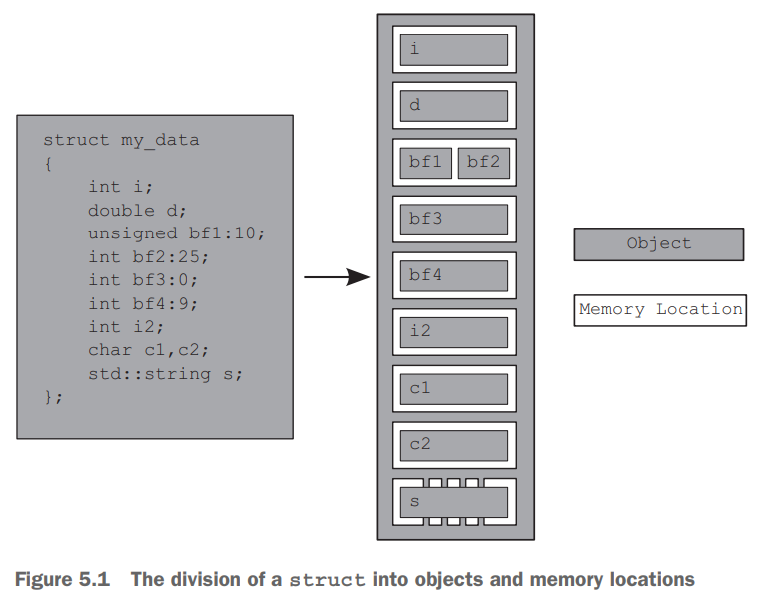

内存模型可以从两个方面审视：结构（`structural`），对象在内存中如何布局的，和并发（`concurrency`）。

### Objects and memory locations
C++所有数据都是对象（`object`），这里的对象并不是面向对象编程中的对象的意思。C++标准中指的是一个存储区域，有类型和生命周期。

不管类型是什么，都占用一个或多个内存地址（`memory location`）。每一个内存地址或者是标量类型的对象（或子对象），比如`unsigned int`，或者是一系列位域。相邻的位域是不同的对象，但是内存地址是一样的。下图是一个示例。

这个结构体有若干子对象，每一个都是一个成员变量。`bf1` `bf2`两个共享一个内存位置，`s`内部持有若干子对象，有自己拥有的内存位置，其他成员变量都有自己的内存位置。`bf3`是零长度，和`bf4`是分离的，不过自身并没有内存位置。

下述四点比较重要：
- 每一个变量都是一个对象，包括其他对象的成员变量
- 每个对象至少占据一个内存位置
- 原始类型，比如`int` `char`等变量有且仅有一个内存位置，不管它们的大小是多少，甚至它们是相邻的或者是数组的一部分
- 相邻位域是同一个内存位置的一部分

### Objects, memory locations, and concurrency
C++多线程程序和这些都相关！如果两个线程访问不同的内存地址，不会有任何问题；反之如果访问同一个内存地址，就要小心了。如果没有线程更新数据，也不会有问题；如果有更新操作，那么就会有潜在的条件竞争。

为了避免竞争，我们需要调整两个线程访问的顺序。可以是固定的一前一后也可以是运行时确定的，重要的是有某种顺序。一种解决方案是第三章提到的互斥，还有一种方案是这一章讲解的原子操作（`atomic operation`）。如果多个线程访问同一个内存地址，那么每一对都要确定顺序。

条件竞争会导致未定义行为。这是C++程序最令人恶心的事情。根据语言标准，如果一个程序包含未定义行为，那么世事难料，可能发生任何事情。我们可以通过原子操作来规避条件竞争，不过原子操作并没有避免竞争，也没有规定谁先操作谁后操作，但是它将程序变得有序，那么行为确定。

### Modification orders
C++程序中所有线程对所有对象的写操作组成了修改顺序（`modification order`）。大部分程序每次运行这个顺序是不同的，但是对于一次运行，所有线程都应该对某种顺序达成一致。如果一个变量不是5.2节讨论的原子类型，那么程序员需要通过同步手段确保所有线程对于修改顺序达成一致。如果不同线程看到的顺序不同，那么就会出现条件竞争和未定义行为。如果使用原子操作，那么编译器会负责这个事情。

这个需求意味着某种不确定的执行是不允许的，因为一个线程一旦看到了某个写操作，当前线程的后续读必须是修改后的值，后续的写操作必须在这个操作之后。同样，一个写操作之后的读操作，要么返回这个写操作的值，要么返回后续某个写操作的值。另外值得强调的是，所有线程不必对于不同变量的修改顺序达成一致。
